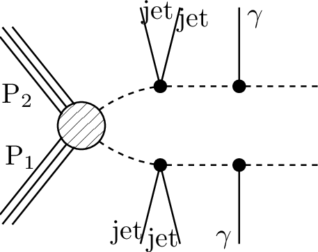
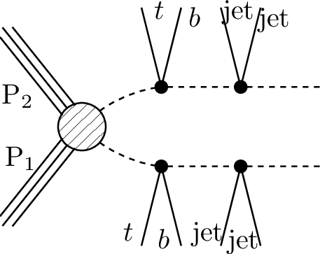
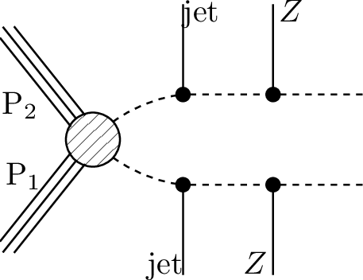
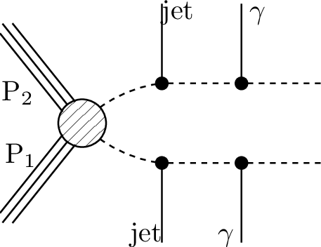
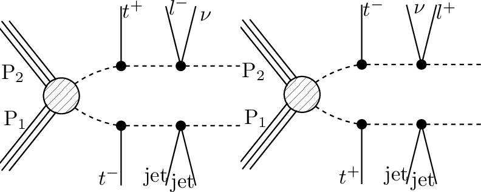
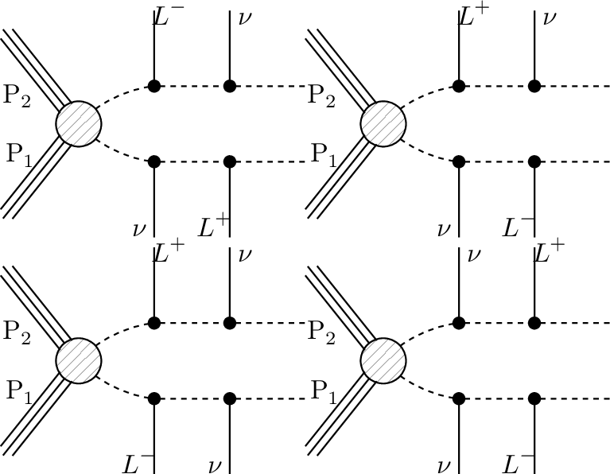

# SMS dictionary
This page intends to collect information about how we map the SModelS description of
events onto the Tx nomenclature. The list has been created from the database version 1.2.2, considering also superseded results.

There is also a [ListOfAnalyses](https://smodels.github.io/docs/ListOfAnalyses), a [ListOfAnalysesWithSuperseded](https://smodels.github.io/docs/ListOfAnalysesWithSuperseded), and [Validation](Validation).

| **#** | **Tx** | **Topology** | **Graph** | **Appears in** |
| ----- | ------ | ------------ | --------- | -------------- |
| 1 | <a name="T1"><b>T1</b></a> | `[[[jet,jet]],[[jet,jet]]]` `(MET,MET)` |  | [many (17)](ListOfAnalyses)|
| 2 | <a name="T1bbbb"><b>T1bbbb</b></a> | `[[[b,b]],[[b,b]]]` `(MET,MET)` |  | [many (24)](ListOfAnalyses)|
| 3 | <a name="T1bbbt"><b>T1bbbt</b></a> | `[[[b,b]],[[b,t]]]` `(MET,MET)` |  | [ATLAS-CONF-2013-024](ListOfAnalyses#ATLAS-CONF-2013-024) [ATLAS-CONF-2013-037](ListOfAnalyses#ATLAS-CONF-2013-037) [ATLAS-CONF-2013-047](ListOfAnalyses#ATLAS-CONF-2013-047) [ATLAS-CONF-2013-053](ListOfAnalyses#ATLAS-CONF-2013-053) [ATLAS-CONF-2013-054](ListOfAnalyses#ATLAS-CONF-2013-054) [ATLAS-CONF-2013-061](ListOfAnalyses#ATLAS-CONF-2013-061) [ATLAS-CONF-2013-062](ListOfAnalyses#ATLAS-CONF-2013-062) [ATLAS-CONF-2013-093](ListOfAnalyses#ATLAS-CONF-2013-093)|
| 4 | <a name="T1bbqq"><b>T1bbqq</b></a> | `[[[b,b]],[[jet,jet]]]` `(MET,MET)` |  | [ATLAS-CONF-2013-024](ListOfAnalyses#ATLAS-CONF-2013-024) [ATLAS-CONF-2013-047](ListOfAnalyses#ATLAS-CONF-2013-047) [ATLAS-CONF-2013-053](ListOfAnalyses#ATLAS-CONF-2013-053) [ATLAS-CONF-2013-054](ListOfAnalyses#ATLAS-CONF-2013-054) [ATLAS-CONF-2013-061](ListOfAnalyses#ATLAS-CONF-2013-061) [ATLAS-CONF-2013-062](ListOfAnalyses#ATLAS-CONF-2013-062)|
| 5 | <a name="T1bbtt"><b>T1bbtt</b></a> | `[[[b,b]],[[t+,t-]]]` `(MET,MET)` |  | [ATLAS-CONF-2013-024](ListOfAnalyses#ATLAS-CONF-2013-024) [ATLAS-CONF-2013-037](ListOfAnalyses#ATLAS-CONF-2013-037) [ATLAS-CONF-2013-047](ListOfAnalyses#ATLAS-CONF-2013-047) [ATLAS-CONF-2013-048](ListOfAnalyses#ATLAS-CONF-2013-048) [ATLAS-CONF-2013-053](ListOfAnalyses#ATLAS-CONF-2013-053) [ATLAS-CONF-2013-054](ListOfAnalyses#ATLAS-CONF-2013-054) [ATLAS-CONF-2013-061](ListOfAnalyses#ATLAS-CONF-2013-061) [ATLAS-CONF-2013-062](ListOfAnalyses#ATLAS-CONF-2013-062)|
| 6 | <a name="T1btbt"><b>T1btbt</b></a> | `[[[t+,b]],[[t+,b]]]+` `[[[t-,b]],[[t-,b]]]` `(MET,MET);[[[b,t]],[[b,t]]]` `(MET,MET);[[[t,b]],[[t,b]]]` `(MET,MET)` |  | [many (11)](ListOfAnalyses)|
| 7 | <a name="T1btqq"><b>T1btqq</b></a> | `[[[b,t]],[[jet,jet]]]` `(MET,MET)` |  | [ATLAS-CONF-2013-024](ListOfAnalyses#ATLAS-CONF-2013-024) [ATLAS-CONF-2013-037](ListOfAnalyses#ATLAS-CONF-2013-037) [ATLAS-CONF-2013-047](ListOfAnalyses#ATLAS-CONF-2013-047) [ATLAS-CONF-2013-053](ListOfAnalyses#ATLAS-CONF-2013-053) [ATLAS-CONF-2013-054](ListOfAnalyses#ATLAS-CONF-2013-054) [ATLAS-CONF-2013-061](ListOfAnalyses#ATLAS-CONF-2013-061) [ATLAS-CONF-2013-062](ListOfAnalyses#ATLAS-CONF-2013-062)|
| 8 | <a name="T1bttt"><b>T1bttt</b></a> | `[[[b,t]],[[t+,t-]]]` `(MET,MET)` |  | [ATLAS-CONF-2013-024](ListOfAnalyses#ATLAS-CONF-2013-024) [ATLAS-CONF-2013-037](ListOfAnalyses#ATLAS-CONF-2013-037) [ATLAS-CONF-2013-047](ListOfAnalyses#ATLAS-CONF-2013-047) [ATLAS-CONF-2013-048](ListOfAnalyses#ATLAS-CONF-2013-048) [ATLAS-CONF-2013-054](ListOfAnalyses#ATLAS-CONF-2013-054) [ATLAS-CONF-2013-061](ListOfAnalyses#ATLAS-CONF-2013-061) [ATLAS-CONF-2013-062](ListOfAnalyses#ATLAS-CONF-2013-062)|
| 9 | <a name="T1qqtt"><b>T1qqtt</b></a> | `[[[jet,jet]],[[t+,t-]]]` `(MET,MET)` |  | [ATLAS-CONF-2013-024](ListOfAnalyses#ATLAS-CONF-2013-024) [ATLAS-CONF-2013-037](ListOfAnalyses#ATLAS-CONF-2013-037) [ATLAS-CONF-2013-047](ListOfAnalyses#ATLAS-CONF-2013-047) [ATLAS-CONF-2013-048](ListOfAnalyses#ATLAS-CONF-2013-048) [ATLAS-CONF-2013-054](ListOfAnalyses#ATLAS-CONF-2013-054) [ATLAS-CONF-2013-061](ListOfAnalyses#ATLAS-CONF-2013-061) [ATLAS-CONF-2013-062](ListOfAnalyses#ATLAS-CONF-2013-062)|
| 10 | <a name="T1ttofftt"><b>T1ttofftt</b></a> | `[[[t,b,W]],[[t,b,W]]]` `(MET,MET)` |  | [ATLAS-SUSY-2016-14](ListOfAnalyses#ATLAS-SUSY-2016-14)|
| 11 | <a name="T1tttt"><b>T1tttt</b></a> | `[[[t+,t-]],[[t+,t-]]]` `(MET,MET);[[[t,t]],[[t,t]]]` `(MET,MET);[[[t+,t-]],[[t-,t+]]]` `(MET,MET)` |  | [many (48)](ListOfAnalyses)|
| 12 | <a name="T1ttttoff"><b>T1ttttoff</b></a> | `[[[b,W,b,W]],[[b,W,b,W]]]` `(MET,MET);[[[b,b,W,W]],[[b,b,W,W]]]` `(MET,MET)` |  | [many (29)](ListOfAnalyses)|
| 13 | <a name="T2"><b>T2</b></a> | `[[[jet]],[[jet]]]` `(MET,MET)` |  | [many (13)](ListOfAnalyses)|
| 14 | <a name="T2bb"><b>T2bb</b></a> | `[[[b]],[[b]]]` `(MET,MET)` |  | [many (20)](ListOfAnalyses)|
| 15 | <a name="T2bbWW"><b>T2bbWW</b></a> | `[[[b,W+]],[[b,W-]]]` `(MET,MET);[[[b,W]],[[b,W]]]` `(MET,MET)` |  | [ATLAS-CONF-2013-048](ListOfAnalysesWithSuperseded#ATLAS-CONF-2013-048) [ATLAS-SUSY-2013-19](ListOfAnalyses#ATLAS-SUSY-2013-19) [ATLAS-SUSY-2013-21](ListOfAnalyses#ATLAS-SUSY-2013-21) [CMS-SUS-14-021](ListOfAnalyses#CMS-SUS-14-021)|
| 16 | <a name="T2bbWWoff"><b>T2bbWWoff</b></a> | `[[[b,L,nu]],[[b,L,nu]]]+` `[[[b,jet,jet]],[[b,jet,jet]]]+` `[[[b,jet,jet]],[[b,L,nu]]]` `(MET,MET);[[[b,l,nu]],[[b,jet,jet]]]` `(MET,MET);[[[b,l,nu]],[[b,l,nu]]]` `(MET,MET)` |  | [ATLAS-SUSY-2016-17](ListOfAnalyses#ATLAS-SUSY-2016-17) [CMS-PAS-SUS-16-052](ListOfAnalyses#CMS-PAS-SUS-16-052) [CMS-PAS-SUS-16-052-agg](ListOfAnalyses#CMS-PAS-SUS-16-052-agg) [ATLAS-SUSY-2013-21](ListOfAnalyses#ATLAS-SUSY-2013-21) [CMS-SUS-14-021](ListOfAnalyses#CMS-SUS-14-021)|
| 17 | <a name="T2bt"><b>T2bt</b></a> | `[[[b]],[[t]]]` `(MET,MET)` |  | [ATLAS-CONF-2013-024](ListOfAnalyses#ATLAS-CONF-2013-024) [ATLAS-CONF-2013-037](ListOfAnalyses#ATLAS-CONF-2013-037) [ATLAS-CONF-2013-047](ListOfAnalyses#ATLAS-CONF-2013-047) [ATLAS-CONF-2013-053](ListOfAnalyses#ATLAS-CONF-2013-053) [ATLAS-CONF-2013-054](ListOfAnalyses#ATLAS-CONF-2013-054) [ATLAS-CONF-2013-061](ListOfAnalyses#ATLAS-CONF-2013-061) [ATLAS-CONF-2013-062](ListOfAnalyses#ATLAS-CONF-2013-062) [ATLAS-CONF-2013-093](ListOfAnalyses#ATLAS-CONF-2013-093) [CMS-SUS-13-012](ListOfAnalyses#CMS-SUS-13-012)|
| 18 | <a name="T2cc"><b>T2cc</b></a> | `[[[jet]],[[jet]]]` `(MET,MET);[[[c]],[[c]]]` `(MET,MET)` |  | [ATLAS-SUSY-2016-26](ListOfAnalyses#ATLAS-SUSY-2016-26) [CMS-SUS-16-032](ListOfAnalyses#CMS-SUS-16-032) [CMS-SUS-16-036](ListOfAnalyses#CMS-SUS-16-036) [CMS-SUS-16-049](ListOfAnalyses#CMS-SUS-16-049) [ATLAS-SUSY-2013-21](ListOfAnalyses#ATLAS-SUSY-2013-21)|
| 19 | <a name="T2tt"><b>T2tt</b></a> | `[[[t+]],[[t-]]]` `(MET,MET);[[[t]],[[t]]]` `(MET,MET)` |  | [many (39)](ListOfAnalyses)|
| 20 | <a name="T2ttC"><b>T2ttC</b></a> | `[[[b,jet,jet]],[[b,jet,jet]]]` `(MET,MET)` |  | [CMS-SUS-16-049](ListOfAnalyses#CMS-SUS-16-049)|
| 21 | <a name="T2ttoff"><b>T2ttoff</b></a> | `[[[W,b]],[[W,b]]]` `(MET,MET);[[[b,W]],[[b,W]]]` `(MET,MET)` |  | [many (19)](ListOfAnalyses)|
| 22 | <a name="T3GQ"><b>T3GQ</b></a> | `[[[jet]],[[jet],[jet]]]` `(MET,MET)` |  | [ATLAS-SUSY-2013-02](ListOfAnalyses#ATLAS-SUSY-2013-02) [CMS-SUS-13-012](ListOfAnalyses#CMS-SUS-13-012)|
| 23 | <a name="T4bnutaubnutau"><b>T4bnutaubnutau</b></a> | `[[[b,nu],[ta]],[[b,nu],[ta]]]` `(MET,MET)` |  | [ATLAS-SUSY-2016-19](ListOfAnalyses#ATLAS-SUSY-2016-19)|
| 24 | <a name="T5"><b>T5</b></a> | `[[[jet],[jet]],[[jet],[jet]]]` `(MET,MET)` |  | [ATLAS-SUSY-2013-02](ListOfAnalyses#ATLAS-SUSY-2013-02) [ATLAS-SUSY-2013-04](ListOfAnalyses#ATLAS-SUSY-2013-04) [CMS-SUS-13-012](ListOfAnalyses#CMS-SUS-13-012)|
| 25 | <a name="T5WW"><b>T5WW</b></a> | `[[[jet,jet],[W]],[[jet,jet],[W]]]` `(MET,MET);[[[jet,jet],[W+]],[[jet,jet],[W+]]]+` `[[[jet,jet],[W-]],[[jet,jet],[W-]]]` `(MET,MET)` |  | [CMS-SUS-16-035](ListOfAnalyses#CMS-SUS-16-035) [CMS-SUS-16-042](ListOfAnalyses#CMS-SUS-16-042) [ATLAS-CONF-2013-047](ListOfAnalysesWithSuperseded#ATLAS-CONF-2013-047) [ATLAS-SUSY-2013-02](ListOfAnalyses#ATLAS-SUSY-2013-02) [ATLAS-SUSY-2013-04](ListOfAnalyses#ATLAS-SUSY-2013-04) [CMS-SUS-13-012](ListOfAnalyses#CMS-SUS-13-012)|
| 26 | <a name="T5WWoff"><b>T5WWoff</b></a> | `[[[jet,jet],[jet,jet]],[[jet,jet],[jet,jet]]]` `(MET,MET);[[[jet,jet],[l+,nu]],[[jet,jet],[l+,nu]]]+` `[[[jet,jet],[l-,nu]],[[jet,jet],[l-,nu]]]` `(MET,MET);[[[jet,jet],[jet,jet]],[[jet,jet],[jet,jet]]]` `(MET,MET);[[[jet,jet],[l,nu]],[[jet,jet],[jet,jet]]]` `(MET,MET)` |  | [CMS-SUS-16-035](ListOfAnalyses#CMS-SUS-16-035) [CMS-SUS-16-042](ListOfAnalyses#CMS-SUS-16-042) [ATLAS-CONF-2013-047](ListOfAnalysesWithSuperseded#ATLAS-CONF-2013-047) [ATLAS-SUSY-2013-02](ListOfAnalyses#ATLAS-SUSY-2013-02) [ATLAS-SUSY-2013-04](ListOfAnalyses#ATLAS-SUSY-2013-04) [CMS-SUS-13-012](ListOfAnalyses#CMS-SUS-13-012)|
| 27 | <a name="T5ZZ"><b>T5ZZ</b></a> | `[[[jet,jet],[Z]],[[jet,jet],[Z]]]` `(MET,MET)` |  | [ATLAS-SUSY-2016-33](ListOfAnalyses#ATLAS-SUSY-2016-33) [CMS-SUS-16-034](ListOfAnalyses#CMS-SUS-16-034) [ATLAS-SUSY-2013-04](ListOfAnalyses#ATLAS-SUSY-2013-04) [CMS-SUS-13-012](ListOfAnalyses#CMS-SUS-13-012)|
| 28 | <a name="T5bbbb"><b>T5bbbb</b></a> | `[[[b],[b]],[[b],[b]]]` `(MET,MET)` |  | [ATLAS-CONF-2013-024](ListOfAnalyses#ATLAS-CONF-2013-024) [ATLAS-CONF-2013-037](ListOfAnalyses#ATLAS-CONF-2013-037) [ATLAS-CONF-2013-047](ListOfAnalyses#ATLAS-CONF-2013-047) [ATLAS-CONF-2013-053](ListOfAnalyses#ATLAS-CONF-2013-053) [ATLAS-CONF-2013-054](ListOfAnalyses#ATLAS-CONF-2013-054) [ATLAS-CONF-2013-061](ListOfAnalyses#ATLAS-CONF-2013-061) [ATLAS-CONF-2013-062](ListOfAnalyses#ATLAS-CONF-2013-062) [CMS-SUS-13-012](ListOfAnalyses#CMS-SUS-13-012)|
| 29 | <a name="T5bbbt"><b>T5bbbt</b></a> | `[[[b],[b]],[[b],[t]]]` `(MET,MET)` |  | [ATLAS-CONF-2013-024](ListOfAnalyses#ATLAS-CONF-2013-024) [ATLAS-CONF-2013-037](ListOfAnalyses#ATLAS-CONF-2013-037) [ATLAS-CONF-2013-047](ListOfAnalyses#ATLAS-CONF-2013-047) [ATLAS-CONF-2013-053](ListOfAnalyses#ATLAS-CONF-2013-053) [ATLAS-CONF-2013-054](ListOfAnalyses#ATLAS-CONF-2013-054) [ATLAS-CONF-2013-061](ListOfAnalyses#ATLAS-CONF-2013-061) [ATLAS-CONF-2013-062](ListOfAnalyses#ATLAS-CONF-2013-062) [ATLAS-CONF-2013-093](ListOfAnalyses#ATLAS-CONF-2013-093)|
| 30 | <a name="T5btbt"><b>T5btbt</b></a> | `[[[b],[t]],[[b],[t]]]` `(MET,MET)` |  | [ATLAS-CONF-2013-024](ListOfAnalyses#ATLAS-CONF-2013-024) [ATLAS-CONF-2013-037](ListOfAnalyses#ATLAS-CONF-2013-037) [ATLAS-CONF-2013-047](ListOfAnalyses#ATLAS-CONF-2013-047) [ATLAS-CONF-2013-048](ListOfAnalyses#ATLAS-CONF-2013-048) [ATLAS-CONF-2013-053](ListOfAnalyses#ATLAS-CONF-2013-053) [ATLAS-CONF-2013-054](ListOfAnalyses#ATLAS-CONF-2013-054) [ATLAS-CONF-2013-061](ListOfAnalyses#ATLAS-CONF-2013-061) [ATLAS-CONF-2013-062](ListOfAnalyses#ATLAS-CONF-2013-062) [ATLAS-CONF-2013-093](ListOfAnalyses#ATLAS-CONF-2013-093)|
| 31 | <a name="T5gg"><b>T5gg</b></a> | `[[[jet,jet],[photon]],[[jet,jet],[photon]]]` `(MET,MET)` |  | [CMS-SUS-16-046](ListOfAnalyses#CMS-SUS-16-046) [CMS-SUS-16-047](ListOfAnalyses#CMS-SUS-16-047)|
| 32 | <a name="T5tbtb"><b>T5tbtb</b></a> | `[[[t],[b]],[[t],[b]]]` `(MET,MET)` |  | [ATLAS-CONF-2013-024](ListOfAnalyses#ATLAS-CONF-2013-024) [ATLAS-CONF-2013-037](ListOfAnalyses#ATLAS-CONF-2013-037) [ATLAS-CONF-2013-047](ListOfAnalyses#ATLAS-CONF-2013-047) [ATLAS-CONF-2013-048](ListOfAnalyses#ATLAS-CONF-2013-048) [ATLAS-CONF-2013-053](ListOfAnalyses#ATLAS-CONF-2013-053) [ATLAS-CONF-2013-054](ListOfAnalyses#ATLAS-CONF-2013-054) [ATLAS-CONF-2013-061](ListOfAnalyses#ATLAS-CONF-2013-061) [ATLAS-CONF-2013-062](ListOfAnalyses#ATLAS-CONF-2013-062) [ATLAS-CONF-2013-093](ListOfAnalyses#ATLAS-CONF-2013-093)|
| 33 | <a name="T5tbtt"><b>T5tbtt</b></a> | `[[[t],[b]],[[t+],[t-]]]+` `[[[t],[b]],[[t-],[t+]]]` `(MET,MET)` |  | [ATLAS-CONF-2013-024](ListOfAnalyses#ATLAS-CONF-2013-024) [ATLAS-CONF-2013-037](ListOfAnalyses#ATLAS-CONF-2013-037) [ATLAS-CONF-2013-047](ListOfAnalyses#ATLAS-CONF-2013-047) [ATLAS-CONF-2013-048](ListOfAnalyses#ATLAS-CONF-2013-048) [ATLAS-CONF-2013-053](ListOfAnalyses#ATLAS-CONF-2013-053) [ATLAS-CONF-2013-054](ListOfAnalyses#ATLAS-CONF-2013-054) [ATLAS-CONF-2013-061](ListOfAnalyses#ATLAS-CONF-2013-061) [ATLAS-CONF-2013-062](ListOfAnalyses#ATLAS-CONF-2013-062)|
| 34 | <a name="T5tctc"><b>T5tctc</b></a> | `[[[t],[jet]],[[t],[jet]]]` `(MET,MET)` |  | [CMS-SUS-16-035](ListOfAnalyses#CMS-SUS-16-035) [CMS-SUS-16-050](ListOfAnalyses#CMS-SUS-16-050) [ATLAS-CONF-2013-047](ListOfAnalysesWithSuperseded#ATLAS-CONF-2013-047) [ATLAS-SUSY-2013-02](ListOfAnalyses#ATLAS-SUSY-2013-02)|
| 35 | <a name="T5ttbbWWoff"><b>T5ttbbWWoff</b></a> | `[[[t,b],[jet,jet]],[[t,b],[jet,jet]]]` `(MET,MET)` |  | [CMS-SUS-16-035](ListOfAnalyses#CMS-SUS-16-035)|
| 36 | <a name="T5ttofftt"><b>T5ttofftt</b></a> | `[[[b,W],[t]],[[b,W],[t]]]` `(MET,MET)` |  | [CMS-SUS-16-037](ListOfAnalyses#CMS-SUS-16-037)|
| 37 | <a name="T5tttt"><b>T5tttt</b></a> | `[[[t+],[t-]],[[t-],[t+]]]+` `[[[t-],[t+]],[[t-],[t+]]]+` `[[[t+],[t-]],[[t+],[t-]]]` `(MET,MET);[[[t+],[t-]],[[t+],[t-]]]+` `[[[t-],[t+]],[[t-],[t+]]]` `(MET,MET);[[[t],[t]],[[t],[t]]]` `(MET,MET)` |  | [many (14)](ListOfAnalyses)|
| 38 | <a name="T6HHtt"><b>T6HHtt</b></a> | `[[[higgs],[t]],[[higgs],[t]]]` `(MET,MET)` |  | [CMS-SUS-16-041](ListOfAnalyses#CMS-SUS-16-041)|
| 39 | <a name="T6WW"><b>T6WW</b></a> | `[[[jet],[W]],[[jet],[W]]]` `(MET,MET)` |  | [ATLAS-CONF-2013-089](ListOfAnalyses#ATLAS-CONF-2013-089) [ATLAS-SUSY-2013-02](ListOfAnalyses#ATLAS-SUSY-2013-02) [CMS-SUS-13-012](ListOfAnalyses#CMS-SUS-13-012)|
| 40 | <a name="T6ZZ"><b>T6ZZ</b></a> | `[[[jet],[Z]],[[jet],[Z]]]` `(MET,MET)` |  | [ATLAS-SUSY-2016-33](ListOfAnalyses#ATLAS-SUSY-2016-33)|
| 41 | <a name="T6ZZofftt"><b>T6ZZofftt</b></a> | `[[[l+,l-],[t]],[[l+,l-],[t]]]` `(MET,MET)` |  | [CMS-SUS-16-041](ListOfAnalyses#CMS-SUS-16-041)|
| 42 | <a name="T6ZZtt"><b>T6ZZtt</b></a> | `[[[Z],[t]],[[Z],[t]]]` `(MET,MET)` |  | [CMS-SUS-16-041](ListOfAnalyses#CMS-SUS-16-041) [ATLAS-CONF-2013-025](ListOfAnalysesWithSuperseded#ATLAS-CONF-2013-025) [ATLAS-SUSY-2013-08](ListOfAnalyses#ATLAS-SUSY-2013-08)|
| 43 | <a name="T6bbHH"><b>T6bbHH</b></a> | `[[[b],[higgs]],[[b],[higgs]]]` `(MET,MET)` |  | [CMS-SUS-16-045](ListOfAnalyses#CMS-SUS-16-045)|
| 44 | <a name="T6bbWW"><b>T6bbWW</b></a> | `[[[b],[W+]],[[b],[W-]]]` `(MET,MET);[[[b],[W]],[[b],[W]]]` `(MET,MET)` |  | [many (11)](ListOfAnalyses)|
| 45 | <a name="T6bbWWoff"><b>T6bbWWoff</b></a> | `[[[b],[l,nu]],[[b],[jet,jet]]]` `(MET,MET);[[[b],[L,nu]],[[b],[jet,jet]]]` `(MET,MET);[[[b],[jet,jet]],[[b],[jet,jet]]]` `(MET,MET);[[[b],[L,nu]],[[b],[L,nu]]]+` `[[[b],[L,nu]],[[b],[jet,jet]]]+` `[[[b],[jet,jet]],[[b],[jet,jet]]]` `(MET,MET);[[[b],[mu,nu]],[[b],[jet,jet]]]+` `[[[b],[e,nu]],[[b],[jet,jet]]]` `(MET,MET);[[[b],[L-,nu]],[[b],[L+,nu]]]` `(MET,MET)` |  | [CMS-PAS-SUS-16-052](ListOfAnalyses#CMS-PAS-SUS-16-052) [CMS-PAS-SUS-16-052-agg](ListOfAnalyses#CMS-PAS-SUS-16-052-agg) [CMS-SUS-16-049](ListOfAnalyses#CMS-SUS-16-049) [ATLAS-CONF-2013-001](ListOfAnalysesWithSuperseded#ATLAS-CONF-2013-001) [ATLAS-CONF-2013-048](ListOfAnalysesWithSuperseded#ATLAS-CONF-2013-048) [ATLAS-SUSY-2013-05](ListOfAnalyses#ATLAS-SUSY-2013-05) [CMS-PAS-SUS-13-023](ListOfAnalyses#CMS-PAS-SUS-13-023) [CMS-SUS-13-011](ListOfAnalyses#CMS-SUS-13-011) [CMS-SUS-13-012](ListOfAnalyses#CMS-SUS-13-012)|
| 46 | <a name="T6gg"><b>T6gg</b></a> | `[[[jet],[photon]],[[jet],[photon]]]` `(MET,MET)` |  | [CMS-SUS-16-046](ListOfAnalyses#CMS-SUS-16-046) [CMS-SUS-16-047](ListOfAnalyses#CMS-SUS-16-047)|
| 47 | <a name="T6ttWW"><b>T6ttWW</b></a> | `[[[t],[W]],[[t],[W]]]` `(MET,MET);[[[t+],[W-]],[[t-],[W+]]]` `(MET,MET)` |  | [ATLAS-SUSY-2016-14](ListOfAnalyses#ATLAS-SUSY-2016-14) [CMS-SUS-16-035](ListOfAnalyses#CMS-SUS-16-035) [CMS-SUS-16-041](ListOfAnalyses#CMS-SUS-16-041) [ATLAS-CONF-2013-007](ListOfAnalyses#ATLAS-CONF-2013-007) [CMS-SUS-13-013](ListOfAnalyses#CMS-SUS-13-013)|
| 48 | <a name="T6ttWWoff"><b>T6ttWWoff</b></a> | `[[[t],[jet,jet]],[[t],[jet,jet]]]` `(MET,MET);[[[t],[L,nu]],[[t],[jet,jet]]]` `(MET,MET);[[[t],[l,nu]],[[t],[l,nu]]]` `(MET,MET);[[[t+],[l-,nu]],[[t-],[jet,jet]]]+` `[[[t-],[l+,nu]],[[t+],[jet,jet]]]` `(MET,MET)` |  | [CMS-SUS-16-035](ListOfAnalyses#CMS-SUS-16-035) [CMS-SUS-16-041](ListOfAnalyses#CMS-SUS-16-041) [ATLAS-CONF-2013-007](ListOfAnalyses#ATLAS-CONF-2013-007) [CMS-SUS-13-013](ListOfAnalyses#CMS-SUS-13-013)|
| 49 | <a name="T6ttoffWW"><b>T6ttoffWW</b></a> | `[[[b,W],[W]],[[b,W],[W]]]` `(MET,MET)` |  | [CMS-SUS-16-035](ListOfAnalyses#CMS-SUS-16-035) [CMS-SUS-16-041](ListOfAnalyses#CMS-SUS-16-041)|
| 50 | <a name="TChiChipmSlepL"><b>TChiChipmSlepL</b></a> | `[[[e+],[e-]],[[L],[nu]]]+` `[[[e+],[e-]],[[nu],[L]]]+` `[[[e-],[e+]],[[L],[nu]]]+` `[[[e-],[e+]],[[nu],[L]]]+` `[[[mu+],[mu-]],[[L],[nu]]]+` `[[[mu+],[mu-]],[[nu],[L]]]+` `[[[mu-],[mu+]],[[L],[nu]]]+` `[[[mu-],[mu+]],[[nu],[L]]]+` `[[[ta+],[ta-]],[[L],[nu]]]+` `[[[ta+],[ta-]],[[nu],[L]]]+` `[[[ta-],[ta+]],[[L],[nu]]]+` `[[[ta-],[ta+]],[[nu],[L]]]` `(MET,MET);[[[L],[L]],[[L],[nu]]]+` `[[[L],[L]],[[nu],[L]]]` `(MET,MET);[[[L+],[L-]],[[L],[nu]]]+` `[[[L+],[L-]],[[nu],[L]]]+` `[[[L-],[L+]],[[L],[nu]]]+` `[[[L-],[L+]],[[nu],[L]]]` `(MET,MET)` |  | [CMS-SUS-16-039](ListOfAnalyses#CMS-SUS-16-039) [ATLAS-CONF-2013-035](ListOfAnalysesWithSuperseded#ATLAS-CONF-2013-035) [ATLAS-SUSY-2013-12](ListOfAnalyses#ATLAS-SUSY-2013-12) [CMS-PAS-SUS-12-022](ListOfAnalysesWithSuperseded#CMS-PAS-SUS-12-022) [CMS-SUS-13-006](ListOfAnalyses#CMS-SUS-13-006)|
| 51 | <a name="TChiChipmSlepStau"><b>TChiChipmSlepStau</b></a> | `[[[L],[L]],[[nu],[ta]]]` `(MET,MET)` |  | [CMS-SUS-16-039](ListOfAnalyses#CMS-SUS-16-039) [CMS-PAS-SUS-12-022](ListOfAnalysesWithSuperseded#CMS-PAS-SUS-12-022) [CMS-SUS-13-006](ListOfAnalyses#CMS-SUS-13-006)|
| 52 | <a name="TChiChipmStauL"><b>TChiChipmStauL</b></a> | `[[[nu],[ta]],[[ta+],[ta-]]]+` `[[[ta],[nu]],[[ta+],[ta-]]]+` `[[[nu],[ta]],[[ta-],[ta+]]]+` `[[[ta],[nu]],[[ta-],[ta+]]]` `(MET,MET)` |  | [ATLAS-SUSY-2013-12](ListOfAnalyses#ATLAS-SUSY-2013-12)|
| 53 | <a name="TChiChipmStauStau"><b>TChiChipmStauStau</b></a> | `[[[ta+],[ta-]],[[nu],[ta]]]+` `[[[ta-],[ta+]],[[nu],[ta]]]` `(MET,MET);[[[ta],[ta]],[[nu],[ta]]]` `(MET,MET)` |  | [CMS-SUS-16-039](ListOfAnalyses#CMS-SUS-16-039) [CMS-PAS-SUS-12-022](ListOfAnalysesWithSuperseded#CMS-PAS-SUS-12-022)|
| 54 | <a name="TChiWH"><b>TChiWH</b></a> | `[[[W]],[[higgs]]]` `(MET,MET);[[[higgs]],[[W]]]` `(MET,MET)` |  | [CMS-PAS-SUS-17-004](ListOfAnalyses#CMS-PAS-SUS-17-004) [CMS-SUS-16-039](ListOfAnalyses#CMS-SUS-16-039) [CMS-SUS-16-043](ListOfAnalyses#CMS-SUS-16-043) [CMS-SUS-16-045](ListOfAnalyses#CMS-SUS-16-045) [ATLAS-CONF-2013-093](ListOfAnalysesWithSuperseded#ATLAS-CONF-2013-093) [ATLAS-SUSY-2013-12](ListOfAnalyses#ATLAS-SUSY-2013-12) [ATLAS-SUSY-2013-23](ListOfAnalyses#ATLAS-SUSY-2013-23) [CMS-SUS-13-006](ListOfAnalyses#CMS-SUS-13-006)|
| 55 | <a name="TChiWW"><b>TChiWW</b></a> | `[[[W]],[[W]]]` `(MET,MET);[[[W+]],[[W-]]]` `(MET,MET)` |  | [ATLAS-SUSY-2013-11](ListOfAnalyses#ATLAS-SUSY-2013-11) [CMS-SUS-13-012](ListOfAnalyses#CMS-SUS-13-012)|
| 56 | <a name="TChiWWoff"><b>TChiWWoff</b></a> | `[[[l+,nu]],[[l-,nu]]]` `(MET,MET)` |  | [ATLAS-SUSY-2013-11](ListOfAnalyses#ATLAS-SUSY-2013-11)|
| 57 | <a name="TChiWZ"><b>TChiWZ</b></a> | `[[[W]],[[Z]]]` `(MET,MET)` |  | [many (10)](ListOfAnalyses)|
| 58 | <a name="TChiWZoff"><b>TChiWZoff</b></a> | `[[[L,nu]],[[e+,e-]]]+` `[[[L,nu]],[[mu+,mu-]]]+` `[[[L,nu]],[[ta+,ta-]]]` `(MET,MET);[[[mu+,mu-]],[[l,nu]]]+` `[[[e+,e-]],[[l,nu]]]` `(MET,MET)` |  | [CMS-PAS-SUS-17-004](ListOfAnalyses#CMS-PAS-SUS-17-004) [CMS-SUS-16-039](ListOfAnalyses#CMS-SUS-16-039) [ATLAS-CONF-2013-035](ListOfAnalysesWithSuperseded#ATLAS-CONF-2013-035) [ATLAS-SUSY-2013-12](ListOfAnalyses#ATLAS-SUSY-2013-12) [CMS-SUS-13-006](ListOfAnalyses#CMS-SUS-13-006)|
| 59 | <a name="TChiZZ"><b>TChiZZ</b></a> | `[[[Z]],[[Z]]]` `(MET,MET)` |  | [CMS-SUS-13-012](ListOfAnalyses#CMS-SUS-13-012)|
| 60 | <a name="TChipChimSlepSnu"><b>TChipChimSlepSnu</b></a> | `[[[L-],[nu]],[[nu],[L+]]]+` `[[[L+],[nu]],[[nu],[L-]]]+` `[[[L+],[nu]],[[L-],[nu]]]+` `[[[nu],[L+]],[[nu],[L-]]]` `(MET,MET)` |  | [ATLAS-SUSY-2013-11](ListOfAnalyses#ATLAS-SUSY-2013-11) [CMS-PAS-SUS-12-022](ListOfAnalysesWithSuperseded#CMS-PAS-SUS-12-022)|
| 61 | <a name="TGQ"><b>TGQ</b></a> | `[[[jet]],[[jet,jet]]]` `(MET,MET)` |  | [ATLAS-CONF-2013-047](ListOfAnalyses#ATLAS-CONF-2013-047) [ATLAS-CONF-2013-054](ListOfAnalyses#ATLAS-CONF-2013-054)|
| 62 | <a name="TGQbbq"><b>TGQbbq</b></a> | `[[[b,b]],[[jet]]]` `(MET,MET)` |  | [ATLAS-CONF-2013-024](ListOfAnalyses#ATLAS-CONF-2013-024) [ATLAS-CONF-2013-047](ListOfAnalyses#ATLAS-CONF-2013-047) [ATLAS-CONF-2013-053](ListOfAnalyses#ATLAS-CONF-2013-053) [ATLAS-CONF-2013-054](ListOfAnalyses#ATLAS-CONF-2013-054) [ATLAS-CONF-2013-061](ListOfAnalyses#ATLAS-CONF-2013-061) [ATLAS-CONF-2013-062](ListOfAnalyses#ATLAS-CONF-2013-062)|
| 63 | <a name="TGQbtq"><b>TGQbtq</b></a> | `[[[b,t]],[[jet]]]` `(MET,MET)` |  | [ATLAS-CONF-2013-024](ListOfAnalyses#ATLAS-CONF-2013-024) [ATLAS-CONF-2013-037](ListOfAnalyses#ATLAS-CONF-2013-037) [ATLAS-CONF-2013-047](ListOfAnalyses#ATLAS-CONF-2013-047) [ATLAS-CONF-2013-053](ListOfAnalyses#ATLAS-CONF-2013-053) [ATLAS-CONF-2013-054](ListOfAnalyses#ATLAS-CONF-2013-054) [ATLAS-CONF-2013-061](ListOfAnalyses#ATLAS-CONF-2013-061) [ATLAS-CONF-2013-062](ListOfAnalyses#ATLAS-CONF-2013-062)|
| 64 | <a name="TGQqtt"><b>TGQqtt</b></a> | `[[[jet]],[[t+,t-]]]` `(MET,MET)` |  | [ATLAS-CONF-2013-024](ListOfAnalyses#ATLAS-CONF-2013-024) [ATLAS-CONF-2013-037](ListOfAnalyses#ATLAS-CONF-2013-037) [ATLAS-CONF-2013-047](ListOfAnalyses#ATLAS-CONF-2013-047) [ATLAS-CONF-2013-048](ListOfAnalyses#ATLAS-CONF-2013-048) [ATLAS-CONF-2013-053](ListOfAnalyses#ATLAS-CONF-2013-053) [ATLAS-CONF-2013-054](ListOfAnalyses#ATLAS-CONF-2013-054) [ATLAS-CONF-2013-061](ListOfAnalyses#ATLAS-CONF-2013-061) [ATLAS-CONF-2013-062](ListOfAnalyses#ATLAS-CONF-2013-062)|
| 65 | <a name="THSCPM1b"><b>THSCPM1b</b></a> | `[[],[]]` `(HSCP,HSCP)` |  | [CMS-PAS-EXO-16-036](ListOfAnalyses#CMS-PAS-EXO-16-036) [CMS-EXO-12-026](ListOfAnalyses#CMS-EXO-12-026) [CMS-EXO-13-006](ListOfAnalyses#CMS-EXO-13-006)|
| 66 | <a name="THSCPM2b"><b>THSCPM2b</b></a> | `[[*],[]]` `(MET,HSCP)` |  | [CMS-PAS-EXO-16-036](ListOfAnalyses#CMS-PAS-EXO-16-036) [CMS-EXO-13-006](ListOfAnalyses#CMS-EXO-13-006)|
| 67 | <a name="THSCPM3"><b>THSCPM3</b></a> | `[[[*]],[[*]]]` `(HSCP,HSCP)` |  | [CMS-PAS-EXO-16-036](ListOfAnalyses#CMS-PAS-EXO-16-036) [CMS-EXO-13-006](ListOfAnalyses#CMS-EXO-13-006)|
| 68 | <a name="THSCPM4"><b>THSCPM4</b></a> | `[[*],[[*]]]` `(MET,HSCP)` |  | [CMS-PAS-EXO-16-036](ListOfAnalyses#CMS-PAS-EXO-16-036) [CMS-EXO-13-006](ListOfAnalyses#CMS-EXO-13-006)|
| 69 | <a name="THSCPM5"><b>THSCPM5</b></a> | `[[[*],[*]],[[*],[*]]]` `(HSCP,HSCP)` |  | [CMS-PAS-EXO-16-036](ListOfAnalyses#CMS-PAS-EXO-16-036) [CMS-EXO-13-006](ListOfAnalyses#CMS-EXO-13-006)|
| 70 | <a name="THSCPM6"><b>THSCPM6</b></a> | `[[*],[[*],[*]]]` `(MET,HSCP)` |  | [CMS-PAS-EXO-16-036](ListOfAnalyses#CMS-PAS-EXO-16-036) [CMS-EXO-13-006](ListOfAnalyses#CMS-EXO-13-006)|
| 71 | <a name="THSCPM7"><b>THSCPM7</b></a> | `[[[*]],[[*],[*]]]` `(HSCP,HSCP)` |  | [CMS-PAS-EXO-16-036](ListOfAnalyses#CMS-PAS-EXO-16-036) [CMS-EXO-13-006](ListOfAnalyses#CMS-EXO-13-006)|
| 72 | <a name="THSCPM8"><b>THSCPM8</b></a> | `[[[*,*]],[[*,*]]]` `(HSCP,HSCP)` |  | [CMS-PAS-EXO-16-036](ListOfAnalyses#CMS-PAS-EXO-16-036) [CMS-EXO-13-006](ListOfAnalyses#CMS-EXO-13-006)|
| 73 | <a name="TRHadGM1"><b>TRHadGM1</b></a> | `[[],[]]` `(RHadronG,RHadronG)` |  | [CMS-PAS-EXO-16-036](ListOfAnalyses#CMS-PAS-EXO-16-036) [CMS-EXO-12-026](ListOfAnalyses#CMS-EXO-12-026)|
| 74 | <a name="TRHadQM1"><b>TRHadQM1</b></a> | `[[],[]]` `(RHadronQ,RHadronQ)` |  | [CMS-PAS-EXO-16-036](ListOfAnalyses#CMS-PAS-EXO-16-036) [CMS-EXO-12-026](ListOfAnalyses#CMS-EXO-12-026)|
| 75 | <a name="TScharm"><b>TScharm</b></a> | `[[[c]],[[c]]]` `(MET,MET)` |  | [ATLAS-SUSY-2014-03](ListOfAnalyses#ATLAS-SUSY-2014-03)|
| 76 | <a name="TSlepSlep"><b>TSlepSlep</b></a> | `[[[e+]],[[e-]]]+` `[[[mu+]],[[mu-]]]` `(MET,MET)` |  | [ATLAS-CONF-2013-049](ListOfAnalysesWithSuperseded#ATLAS-CONF-2013-049) [ATLAS-SUSY-2013-11](ListOfAnalyses#ATLAS-SUSY-2013-11) [CMS-PAS-SUS-12-022](ListOfAnalysesWithSuperseded#CMS-PAS-SUS-12-022) [CMS-SUS-13-006](ListOfAnalyses#CMS-SUS-13-006)|
