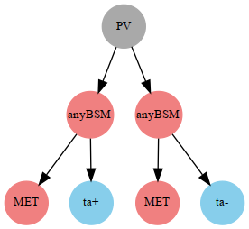

# SMS dictionary
This page intends to collect information about how we map the SModelS description of
events onto the Tx nomenclature. The list has been created from the database version 1.2.3, considering also superseded results.

There is also a [ListOfAnalyses123](https://smodels.github.io/docs/ListOfAnalyses123), a [ListOfAnalyses123WithSuperseded](https://smodels.github.io/docs/ListOfAnalyses123WithSuperseded), and [Validation123](Validation123).

| **#** | **Tx** | **Process** | **SMS Graph** | **Appears in** |
| ----- | ------ | ----------- | ------------- | -------------- |
| 1 | **T1**  | `(PV > anyBSM(1),anyBSM(2)),`  &rarr;`(anyBSM(1) > MET,jet,jet),`  &rarr;`(anyBSM(2) > MET,jet,jet)` |   | [many (21)](ListOfAnalyses123WithSuperseded) |
| 2 | **T1bbbb**  | `(PV > anyBSM(1),anyBSM(2)),`  &rarr;`(anyBSM(1) > MET,b,b),`  &rarr;`(anyBSM(2) > MET,b,b)` |   | [many (26)](ListOfAnalyses123WithSuperseded) |
| 3 | **T1bbbt**  | `(PV > anyBSM(1),anyBSM(2)),`  &rarr;`(anyBSM(1) > MET,b,b),`  &rarr;`(anyBSM(2) > MET,b,t)` |   | [ATLAS-CONF-2013-024](https://atlas.web.cern.ch/Atlas/GROUPS/PHYSICS/CONFNOTES/ATLAS-CONF-2013-024/) [ATLAS-CONF-2013-037](https://atlas.web.cern.ch/Atlas/GROUPS/PHYSICS/CONFNOTES/ATLAS-CONF-2013-037/) [ATLAS-CONF-2013-047](https://atlas.web.cern.ch/Atlas/GROUPS/PHYSICS/CONFNOTES/ATLAS-CONF-2013-047/) [ATLAS-CONF-2013-053](https://atlas.web.cern.ch/Atlas/GROUPS/PHYSICS/CONFNOTES/ATLAS-CONF-2013-053/) [ATLAS-CONF-2013-054](https://atlas.web.cern.ch/Atlas/GROUPS/PHYSICS/CONFNOTES/ATLAS-CONF-2013-054/) [ATLAS-CONF-2013-061](https://atlas.web.cern.ch/Atlas/GROUPS/PHYSICS/CONFNOTES/ATLAS-CONF-2013-061/) [ATLAS-CONF-2013-062](https://atlas.web.cern.ch/Atlas/GROUPS/PHYSICS/CONFNOTES/ATLAS-CONF-2013-062/) [ATLAS-CONF-2013-093](https://atlas.web.cern.ch/Atlas/GROUPS/PHYSICS/CONFNOTES/ATLAS-CONF-2013-093/) |
| 4 | **T1bbqq**  | `(PV > anyBSM(1),anyBSM(2)),`  &rarr;`(anyBSM(1) > MET,b,b),`  &rarr;`(anyBSM(2) > MET,jet,jet)` |   | [ATLAS-CONF-2013-024](https://atlas.web.cern.ch/Atlas/GROUPS/PHYSICS/CONFNOTES/ATLAS-CONF-2013-024/) [ATLAS-CONF-2013-047](https://atlas.web.cern.ch/Atlas/GROUPS/PHYSICS/CONFNOTES/ATLAS-CONF-2013-047/) [ATLAS-CONF-2013-053](https://atlas.web.cern.ch/Atlas/GROUPS/PHYSICS/CONFNOTES/ATLAS-CONF-2013-053/) [ATLAS-CONF-2013-054](https://atlas.web.cern.ch/Atlas/GROUPS/PHYSICS/CONFNOTES/ATLAS-CONF-2013-054/) [ATLAS-CONF-2013-061](https://atlas.web.cern.ch/Atlas/GROUPS/PHYSICS/CONFNOTES/ATLAS-CONF-2013-061/) [ATLAS-CONF-2013-062](https://atlas.web.cern.ch/Atlas/GROUPS/PHYSICS/CONFNOTES/ATLAS-CONF-2013-062/) |
| 5 | **T1bbtt**  | `(PV > anyBSM(1),anyBSM(2)),`  &rarr;`(anyBSM(1) > MET,b,b),`  &rarr;`(anyBSM(2) > MET,t+,t-)` |   | [ATLAS-CONF-2013-024](https://atlas.web.cern.ch/Atlas/GROUPS/PHYSICS/CONFNOTES/ATLAS-CONF-2013-024/) [ATLAS-CONF-2013-037](https://atlas.web.cern.ch/Atlas/GROUPS/PHYSICS/CONFNOTES/ATLAS-CONF-2013-037/) [ATLAS-CONF-2013-047](https://atlas.web.cern.ch/Atlas/GROUPS/PHYSICS/CONFNOTES/ATLAS-CONF-2013-047/) [ATLAS-CONF-2013-048](https://atlas.web.cern.ch/Atlas/GROUPS/PHYSICS/CONFNOTES/ATLAS-CONF-2013-048/) [ATLAS-CONF-2013-053](https://atlas.web.cern.ch/Atlas/GROUPS/PHYSICS/CONFNOTES/ATLAS-CONF-2013-053/) [ATLAS-CONF-2013-054](https://atlas.web.cern.ch/Atlas/GROUPS/PHYSICS/CONFNOTES/ATLAS-CONF-2013-054/) [ATLAS-CONF-2013-061](https://atlas.web.cern.ch/Atlas/GROUPS/PHYSICS/CONFNOTES/ATLAS-CONF-2013-061/) [ATLAS-CONF-2013-062](https://atlas.web.cern.ch/Atlas/GROUPS/PHYSICS/CONFNOTES/ATLAS-CONF-2013-062/) |
| 6 | **T1btbt**  | `(PV > anyBSM(1),anyBSM(2)),`  &rarr;`(anyBSM(1) > MET,b,t),`  &rarr;`(anyBSM(2) > MET,b,t)` |   | [many (11)](ListOfAnalyses123WithSuperseded) |
| 7 | **T1btqq**  | `(PV > anyBSM(1),anyBSM(2)),`  &rarr;`(anyBSM(1) > MET,b,t),`  &rarr;`(anyBSM(2) > MET,jet,jet)` |   | [ATLAS-CONF-2013-024](https://atlas.web.cern.ch/Atlas/GROUPS/PHYSICS/CONFNOTES/ATLAS-CONF-2013-024/) [ATLAS-CONF-2013-037](https://atlas.web.cern.ch/Atlas/GROUPS/PHYSICS/CONFNOTES/ATLAS-CONF-2013-037/) [ATLAS-CONF-2013-047](https://atlas.web.cern.ch/Atlas/GROUPS/PHYSICS/CONFNOTES/ATLAS-CONF-2013-047/) [ATLAS-CONF-2013-053](https://atlas.web.cern.ch/Atlas/GROUPS/PHYSICS/CONFNOTES/ATLAS-CONF-2013-053/) [ATLAS-CONF-2013-054](https://atlas.web.cern.ch/Atlas/GROUPS/PHYSICS/CONFNOTES/ATLAS-CONF-2013-054/) [ATLAS-CONF-2013-061](https://atlas.web.cern.ch/Atlas/GROUPS/PHYSICS/CONFNOTES/ATLAS-CONF-2013-061/) [ATLAS-CONF-2013-062](https://atlas.web.cern.ch/Atlas/GROUPS/PHYSICS/CONFNOTES/ATLAS-CONF-2013-062/) |
| 8 | **T1bttt**  | `(PV > anyBSM(1),anyBSM(2)),`  &rarr;`(anyBSM(1) > MET,b,t),`  &rarr;`(anyBSM(2) > MET,t+,t-)` |   | [ATLAS-CONF-2013-024](https://atlas.web.cern.ch/Atlas/GROUPS/PHYSICS/CONFNOTES/ATLAS-CONF-2013-024/) [ATLAS-CONF-2013-037](https://atlas.web.cern.ch/Atlas/GROUPS/PHYSICS/CONFNOTES/ATLAS-CONF-2013-037/) [ATLAS-CONF-2013-047](https://atlas.web.cern.ch/Atlas/GROUPS/PHYSICS/CONFNOTES/ATLAS-CONF-2013-047/) [ATLAS-CONF-2013-048](https://atlas.web.cern.ch/Atlas/GROUPS/PHYSICS/CONFNOTES/ATLAS-CONF-2013-048/) [ATLAS-CONF-2013-054](https://atlas.web.cern.ch/Atlas/GROUPS/PHYSICS/CONFNOTES/ATLAS-CONF-2013-054/) [ATLAS-CONF-2013-061](https://atlas.web.cern.ch/Atlas/GROUPS/PHYSICS/CONFNOTES/ATLAS-CONF-2013-061/) [ATLAS-CONF-2013-062](https://atlas.web.cern.ch/Atlas/GROUPS/PHYSICS/CONFNOTES/ATLAS-CONF-2013-062/) |
| 9 | **T1qqtt**  | `(PV > anyBSM(1),anyBSM(2)),`  &rarr;`(anyBSM(1) > MET,jet,jet),`  &rarr;`(anyBSM(2) > MET,t+,t-)` |   | [ATLAS-CONF-2013-024](https://atlas.web.cern.ch/Atlas/GROUPS/PHYSICS/CONFNOTES/ATLAS-CONF-2013-024/) [ATLAS-CONF-2013-037](https://atlas.web.cern.ch/Atlas/GROUPS/PHYSICS/CONFNOTES/ATLAS-CONF-2013-037/) [ATLAS-CONF-2013-047](https://atlas.web.cern.ch/Atlas/GROUPS/PHYSICS/CONFNOTES/ATLAS-CONF-2013-047/) [ATLAS-CONF-2013-048](https://atlas.web.cern.ch/Atlas/GROUPS/PHYSICS/CONFNOTES/ATLAS-CONF-2013-048/) [ATLAS-CONF-2013-054](https://atlas.web.cern.ch/Atlas/GROUPS/PHYSICS/CONFNOTES/ATLAS-CONF-2013-054/) [ATLAS-CONF-2013-061](https://atlas.web.cern.ch/Atlas/GROUPS/PHYSICS/CONFNOTES/ATLAS-CONF-2013-061/) [ATLAS-CONF-2013-062](https://atlas.web.cern.ch/Atlas/GROUPS/PHYSICS/CONFNOTES/ATLAS-CONF-2013-062/) |
| 10 | **T1ttofftt**  | `(PV > anyBSM(1),anyBSM(2)),`  &rarr;`(anyBSM(1) > MET,W,b,t),`  &rarr;`(anyBSM(2) > MET,W,b,t)` |   | [ATLAS-SUSY-2016-14](http://atlas.web.cern.ch/Atlas/GROUPS/PHYSICS/PAPERS/SUSY-2016-14/) |
| 11 | **T1tttt**  | `(PV > anyBSM(1),anyBSM(2)),`  &rarr;`(anyBSM(1) > MET,t,t),`  &rarr;`(anyBSM(2) > MET,t,t)` |   | [many (51)](ListOfAnalyses123WithSuperseded) |
| 12 | **T1ttttoff**  | `(PV > anyBSM(1),anyBSM(2)),`  &rarr;`(anyBSM(1) > MET,W,W,b,b),`  &rarr;`(anyBSM(2) > MET,W,W,b,b)` |   | [many (32)](ListOfAnalyses123WithSuperseded) |
| 13 | **T2bb**  | `(PV > anyBSM(1),anyBSM(2)),`  &rarr;`(anyBSM(1) > MET,b),`  &rarr;`(anyBSM(2) > MET,b)` |   | [many (23)](ListOfAnalyses123WithSuperseded) |
| 14 | **T2bbWW**  **T2ttoff**  | `(PV > anyBSM(1),anyBSM(2)),`  &rarr;`(anyBSM(1) > MET,W,b),`  &rarr;`(anyBSM(2) > MET,W,b)` |   | [many (30)](ListOfAnalyses123WithSuperseded) |
| 15 | **T2bbffff**  **T2bbWWoff**  | `(PV > anyBSM(1),anyBSM(2)),`  &rarr;`(anyBSM(1) > MET,b,l,nu),`  &rarr;`(anyBSM(2) > MET,b,jet,jet)` |   | [ATLAS-SUSY-2016-15](https://atlas.web.cern.ch/Atlas/GROUPS/PHYSICS/PAPERS/SUSY-2016-15/) [ATLAS-SUSY-2016-16](https://atlas.web.cern.ch/Atlas/GROUPS/PHYSICS/PAPERS/SUSY-2016-16/) [ATLAS-SUSY-2016-17](http://atlas.web.cern.ch/Atlas/GROUPS/PHYSICS/PAPERS/SUSY-2016-17/) [CMS-PAS-SUS-16-052](http://cms-results.web.cern.ch/cms-results/public-results/preliminary-results/SUS-16-052/index.html) [CMS-SUS-17-005](https://cms-results.web.cern.ch/cms-results/public-results/publications/SUS-17-005/) [ATLAS-SUSY-2013-21](https://atlas.web.cern.ch/Atlas/GROUPS/PHYSICS/PAPERS/SUSY-2013-21/) [CMS-SUS-14-021](https://twiki.cern.ch/twiki/bin/view/CMSPublic/PhysicsResultsSUS14021) |
| 16 | **T2bt**  | `(PV > anyBSM(1),anyBSM(2)),`  &rarr;`(anyBSM(1) > MET,b),`  &rarr;`(anyBSM(2) > MET,t)` |   | [ATLAS-CONF-2013-024](https://atlas.web.cern.ch/Atlas/GROUPS/PHYSICS/CONFNOTES/ATLAS-CONF-2013-024/) [ATLAS-CONF-2013-037](https://atlas.web.cern.ch/Atlas/GROUPS/PHYSICS/CONFNOTES/ATLAS-CONF-2013-037/) [ATLAS-CONF-2013-047](https://atlas.web.cern.ch/Atlas/GROUPS/PHYSICS/CONFNOTES/ATLAS-CONF-2013-047/) [ATLAS-CONF-2013-053](https://atlas.web.cern.ch/Atlas/GROUPS/PHYSICS/CONFNOTES/ATLAS-CONF-2013-053/) [ATLAS-CONF-2013-054](https://atlas.web.cern.ch/Atlas/GROUPS/PHYSICS/CONFNOTES/ATLAS-CONF-2013-054/) [ATLAS-CONF-2013-061](https://atlas.web.cern.ch/Atlas/GROUPS/PHYSICS/CONFNOTES/ATLAS-CONF-2013-061/) [ATLAS-CONF-2013-062](https://atlas.web.cern.ch/Atlas/GROUPS/PHYSICS/CONFNOTES/ATLAS-CONF-2013-062/) [ATLAS-CONF-2013-093](https://atlas.web.cern.ch/Atlas/GROUPS/PHYSICS/CONFNOTES/ATLAS-CONF-2013-093/) [CMS-SUS-13-012](https://twiki.cern.ch/twiki/bin/view/CMSPublic/PhysicsResultsSUS13012) |
| 17 | **T2cc**  **T2**  | `(PV > anyBSM(1),anyBSM(2)),`  &rarr;`(anyBSM(1) > MET,jet),`  &rarr;`(anyBSM(2) > MET,jet)` |   | [many (21)](ListOfAnalyses123WithSuperseded) |
| 18 | **T2tt**  | `(PV > anyBSM(1),anyBSM(2)),`  &rarr;`(anyBSM(1) > MET,t),`  &rarr;`(anyBSM(2) > MET,t)` |   | [many (46)](ListOfAnalyses123WithSuperseded) |
| 19 | **T2ttC**  | `(PV > anyBSM(1),anyBSM(2)),`  &rarr;`(anyBSM(1) > MET,b,jet,jet),`  &rarr;`(anyBSM(2) > MET,b,jet,jet)` |   | [CMS-SUS-16-049](http://cms-results.web.cern.ch/cms-results/public-results/publications/SUS-16-049/index.html) |
| 20 | **T3GQ**  | `(PV > anyBSM(1),anyBSM(2)),`  &rarr;`(anyBSM(1) > MET,jet),`  &rarr;`(anyBSM(2) > anyBSM(5),jet),`  &rarr;`(anyBSM(5) > MET,jet)` |   | [ATLAS-SUSY-2016-07](https://atlas.web.cern.ch/Atlas/GROUPS/PHYSICS/PAPERS/SUSY-2016-07/) [CMS-SUS-16-033](http://cms-results.web.cern.ch/cms-results/public-results/publications/SUS-16-033/index.html) [ATLAS-SUSY-2013-02](https://atlas.web.cern.ch/Atlas/GROUPS/PHYSICS/PAPERS/SUSY-2013-02/) [CMS-SUS-13-012](https://twiki.cern.ch/twiki/bin/view/CMSPublic/PhysicsResultsSUS13012) |
| 21 | **T4bnutau- bnutau**  | `(PV > anyBSM(1),anyBSM(2)),`  &rarr;`(anyBSM(1) > anyBSM(3),b,nu),`  &rarr;`(anyBSM(2) > anyBSM(8),b,nu),`  &rarr;`(anyBSM(3) > MET,ta),`  &rarr;`(anyBSM(8) > MET,ta)` |   | [ATLAS-SUSY-2016-19](https://atlas.web.cern.ch/Atlas/GROUPS/PHYSICS/PAPERS/SUSY-2016-19/) |
| 22 | **T5**  | `(PV > anyBSM(1),anyBSM(2)),`  &rarr;`(anyBSM(1) > anyBSM(3),jet),`  &rarr;`(anyBSM(2) > anyBSM(7),jet),`  &rarr;`(anyBSM(3) > MET,jet),`  &rarr;`(anyBSM(7) > MET,jet)` |   | [ATLAS-SUSY-2013-02](https://atlas.web.cern.ch/Atlas/GROUPS/PHYSICS/PAPERS/SUSY-2013-02/) [ATLAS-SUSY-2013-04](https://atlas.web.cern.ch/Atlas/GROUPS/PHYSICS/PAPERS/SUSY-2013-04/) [CMS-SUS-13-012](https://twiki.cern.ch/twiki/bin/view/CMSPublic/PhysicsResultsSUS13012) |
| 23 | **T5GQ**  | `(PV > anyBSM(1),anyBSM(2)),`  &rarr;`(anyBSM(1) > anyBSM(3),jet),`  &rarr;`(anyBSM(2) > MET,jet,jet),`  &rarr;`(anyBSM(3) > MET,jet,jet)` |   | [ATLAS-SUSY-2016-07](https://atlas.web.cern.ch/Atlas/GROUPS/PHYSICS/PAPERS/SUSY-2016-07/) [CMS-SUS-16-033](http://cms-results.web.cern.ch/cms-results/public-results/publications/SUS-16-033/index.html) |
| 24 | **T5HH**  | `(PV > anyBSM(1),anyBSM(2)),`  &rarr;`(anyBSM(1) > anyBSM(3),jet,jet),`  &rarr;`(anyBSM(2) > anyBSM(8),jet,jet),`  &rarr;`(anyBSM(3) > MET,higgs),`  &rarr;`(anyBSM(8) > MET,higgs)` |   | [CMS-SUS-17-006](https://cms-results.web.cern.ch/cms-results/public-results/publications/SUS-17-006/) |
| 25 | **T5HZ**  | `(PV > anyBSM(1),anyBSM(2)),`  &rarr;`(anyBSM(1) > anyBSM(3),jet,jet),`  &rarr;`(anyBSM(2) > anyBSM(8),jet,jet),`  &rarr;`(anyBSM(3) > MET,higgs),`  &rarr;`(anyBSM(8) > MET,Z)`  `(PV > anyBSM(1),anyBSM(2)),`  &rarr;`(anyBSM(1) > anyBSM(3),jet,jet),`  &rarr;`(anyBSM(2) > anyBSM(8),jet,jet),`  &rarr;`(anyBSM(3) > MET,higgs),`  &rarr;`(anyBSM(8) > MET,higgs)`  `(PV > anyBSM(1),anyBSM(2)),`  &rarr;`(anyBSM(1) > anyBSM(3),jet,jet),`  &rarr;`(anyBSM(2) > anyBSM(8),jet,jet),`  &rarr;`(anyBSM(3) > MET,Z),`  &rarr;`(anyBSM(8) > MET,Z)` |     | [CMS-SUS-17-006](https://cms-results.web.cern.ch/cms-results/public-results/publications/SUS-17-006/) |
| 26 | **T5Hg**  | `(PV > anyBSM(1),anyBSM(2)),`  &rarr;`(anyBSM(1) > anyBSM(3),jet,jet),`  &rarr;`(anyBSM(2) > anyBSM(8),jet,jet),`  &rarr;`(anyBSM(3) > MET,higgs),`  &rarr;`(anyBSM(8) > MET,photon)`  `(PV > anyBSM(1),anyBSM(2)),`  &rarr;`(anyBSM(1) > anyBSM(3),jet,jet),`  &rarr;`(anyBSM(2) > anyBSM(8),jet,jet),`  &rarr;`(anyBSM(3) > MET,photon),`  &rarr;`(anyBSM(8) > MET,photon)`  `(PV > anyBSM(1),anyBSM(2)),`  &rarr;`(anyBSM(1) > anyBSM(3),jet,jet),`  &rarr;`(anyBSM(2) > anyBSM(8),jet,jet),`  &rarr;`(anyBSM(3) > MET,higgs),`  &rarr;`(anyBSM(8) > MET,higgs)` |     | [CMS-SUS-18-002](https://cms-results.web.cern.ch/cms-results/public-results/publications/SUS-18-002/) |
| 27 | **T5WW**  | `(PV > anyBSM(1),anyBSM(2)),`  &rarr;`(anyBSM(1) > anyBSM(3),jet,jet),`  &rarr;`(anyBSM(2) > anyBSM(8),jet,jet),`  &rarr;`(anyBSM(3) > MET,W),`  &rarr;`(anyBSM(8) > MET,W)` |   | [ATLAS-SUSY-2016-07](https://atlas.web.cern.ch/Atlas/GROUPS/PHYSICS/PAPERS/SUSY-2016-07/) [CMS-SUS-16-035](http://cms-results.web.cern.ch/cms-results/public-results/publications/SUS-16-035/index.html) [CMS-SUS-16-042](http://cms-results.web.cern.ch/cms-results/public-results/publications/SUS-16-042/index.html) [ATLAS-CONF-2013-047](https://atlas.web.cern.ch/Atlas/GROUPS/PHYSICS/CONFNOTES/ATLAS-CONF-2013-047/; http://cds.cern.ch/record/1547563) [ATLAS-SUSY-2013-02](https://atlas.web.cern.ch/Atlas/GROUPS/PHYSICS/PAPERS/SUSY-2013-02/) [ATLAS-SUSY-2013-04](https://atlas.web.cern.ch/Atlas/GROUPS/PHYSICS/PAPERS/SUSY-2013-04/) [CMS-SUS-13-012](https://twiki.cern.ch/twiki/bin/view/CMSPublic/PhysicsResultsSUS13012) |
| 28 | **T5WWoff**  | `(PV > anyBSM(1),anyBSM(2)),`  &rarr;`(anyBSM(1) > anyBSM(3),jet,jet),`  &rarr;`(anyBSM(2) > anyBSM(9),jet,jet),`  &rarr;`(anyBSM(3) > MET,l,nu),`  &rarr;`(anyBSM(9) > MET,jet,jet)` |   | [ATLAS-SUSY-2016-07](https://atlas.web.cern.ch/Atlas/GROUPS/PHYSICS/PAPERS/SUSY-2016-07/) [CMS-SUS-16-035](http://cms-results.web.cern.ch/cms-results/public-results/publications/SUS-16-035/index.html) [CMS-SUS-16-042](http://cms-results.web.cern.ch/cms-results/public-results/publications/SUS-16-042/index.html) [ATLAS-CONF-2013-047](https://atlas.web.cern.ch/Atlas/GROUPS/PHYSICS/CONFNOTES/ATLAS-CONF-2013-047/; http://cds.cern.ch/record/1547563) [ATLAS-SUSY-2013-02](https://atlas.web.cern.ch/Atlas/GROUPS/PHYSICS/PAPERS/SUSY-2013-02/) [ATLAS-SUSY-2013-04](https://atlas.web.cern.ch/Atlas/GROUPS/PHYSICS/PAPERS/SUSY-2013-04/) [CMS-SUS-13-012](https://twiki.cern.ch/twiki/bin/view/CMSPublic/PhysicsResultsSUS13012) |
| 29 | **T5WZh**  | `(PV > anyBSM(1),anyBSM(2)),`  &rarr;`(anyBSM(1) > anyBSM(3),jet,jet),`  &rarr;`(anyBSM(2) > anyBSM(8),jet,jet),`  &rarr;`(anyBSM(3) > MET,Z),`  &rarr;`(anyBSM(8) > MET,W)`  `(PV > anyBSM(1),anyBSM(2)),`  &rarr;`(anyBSM(1) > anyBSM(3),jet,jet),`  &rarr;`(anyBSM(2) > anyBSM(8),jet,jet),`  &rarr;`(anyBSM(3) > MET,higgs),`  &rarr;`(anyBSM(8) > MET,W)`  `(PV > anyBSM(1),anyBSM(2)),`  &rarr;`(anyBSM(1) > anyBSM(3),jet,jet),`  &rarr;`(anyBSM(2) > anyBSM(8),jet,jet),`  &rarr;`(anyBSM(3) > MET,W),`  &rarr;`(anyBSM(8) > MET,W)`  `(PV > anyBSM(1),anyBSM(2)),`  &rarr;`(anyBSM(1) > anyBSM(3),jet,jet),`  &rarr;`(anyBSM(2) > anyBSM(8),jet,jet),`  &rarr;`(anyBSM(3) > MET,Z),`  &rarr;`(anyBSM(8) > MET,Z)`  `(PV > anyBSM(1),anyBSM(2)),`  &rarr;`(anyBSM(1) > anyBSM(3),jet,jet),`  &rarr;`(anyBSM(2) > anyBSM(8),jet,jet),`  &rarr;`(anyBSM(3) > MET,higgs),`  &rarr;`(anyBSM(8) > MET,higgs)`  `(PV > anyBSM(1),anyBSM(2)),`  &rarr;`(anyBSM(1) > anyBSM(3),jet,jet),`  &rarr;`(anyBSM(2) > anyBSM(8),jet,jet),`  &rarr;`(anyBSM(3) > MET,higgs),`  &rarr;`(anyBSM(8) > MET,Z)` |        | [ATLAS-SUSY-2016-07](https://atlas.web.cern.ch/Atlas/GROUPS/PHYSICS/PAPERS/SUSY-2016-07/) |
| 30 | **T5ZZ**  | `(PV > anyBSM(1),anyBSM(2)),`  &rarr;`(anyBSM(1) > anyBSM(3),jet,jet),`  &rarr;`(anyBSM(2) > anyBSM(8),jet,jet),`  &rarr;`(anyBSM(3) > MET,Z),`  &rarr;`(anyBSM(8) > MET,Z)` |   | [ATLAS-SUSY-2016-07](https://atlas.web.cern.ch/Atlas/GROUPS/PHYSICS/PAPERS/SUSY-2016-07/) [ATLAS-SUSY-2016-33](https://atlas.web.cern.ch/Atlas/GROUPS/PHYSICS/PAPERS/SUSY-2016-33/) [CMS-SUS-16-034](http://cms-results.web.cern.ch/cms-results/public-results/publications/SUS-16-034/index.html) [ATLAS-SUSY-2013-04](https://atlas.web.cern.ch/Atlas/GROUPS/PHYSICS/PAPERS/SUSY-2013-04/) [CMS-SUS-13-012](https://twiki.cern.ch/twiki/bin/view/CMSPublic/PhysicsResultsSUS13012) |
| 31 | **T5Zg**  | `(PV > anyBSM(1),anyBSM(2)),`  &rarr;`(anyBSM(1) > anyBSM(3),jet,jet),`  &rarr;`(anyBSM(2) > anyBSM(8),jet,jet),`  &rarr;`(anyBSM(3) > MET,Z),`  &rarr;`(anyBSM(8) > MET,photon)`  `(PV > anyBSM(1),anyBSM(2)),`  &rarr;`(anyBSM(1) > anyBSM(3),jet,jet),`  &rarr;`(anyBSM(2) > anyBSM(8),jet,jet),`  &rarr;`(anyBSM(3) > MET,photon),`  &rarr;`(anyBSM(8) > MET,photon)`  `(PV > anyBSM(1),anyBSM(2)),`  &rarr;`(anyBSM(1) > anyBSM(3),jet,jet),`  &rarr;`(anyBSM(2) > anyBSM(8),jet,jet),`  &rarr;`(anyBSM(3) > MET,Z),`  &rarr;`(anyBSM(8) > MET,Z)` |     | [ATLAS-SUSY-2016-27](https://atlas.web.cern.ch/Atlas/GROUPS/PHYSICS/PAPERS/SUSY-2016-27/) |
| 32 | **T5bbbb**  | `(PV > anyBSM(1),anyBSM(2)),`  &rarr;`(anyBSM(1) > anyBSM(3),b),`  &rarr;`(anyBSM(2) > anyBSM(7),b),`  &rarr;`(anyBSM(3) > MET,b),`  &rarr;`(anyBSM(7) > MET,b)` |   | [ATLAS-CONF-2013-024](https://atlas.web.cern.ch/Atlas/GROUPS/PHYSICS/CONFNOTES/ATLAS-CONF-2013-024/) [ATLAS-CONF-2013-037](https://atlas.web.cern.ch/Atlas/GROUPS/PHYSICS/CONFNOTES/ATLAS-CONF-2013-037/) [ATLAS-CONF-2013-047](https://atlas.web.cern.ch/Atlas/GROUPS/PHYSICS/CONFNOTES/ATLAS-CONF-2013-047/) [ATLAS-CONF-2013-053](https://atlas.web.cern.ch/Atlas/GROUPS/PHYSICS/CONFNOTES/ATLAS-CONF-2013-053/) [ATLAS-CONF-2013-054](https://atlas.web.cern.ch/Atlas/GROUPS/PHYSICS/CONFNOTES/ATLAS-CONF-2013-054/) [ATLAS-CONF-2013-061](https://atlas.web.cern.ch/Atlas/GROUPS/PHYSICS/CONFNOTES/ATLAS-CONF-2013-061/) [ATLAS-CONF-2013-062](https://atlas.web.cern.ch/Atlas/GROUPS/PHYSICS/CONFNOTES/ATLAS-CONF-2013-062/) [CMS-SUS-13-012](https://twiki.cern.ch/twiki/bin/view/CMSPublic/PhysicsResultsSUS13012) |
| 33 | **T5bbbbZg**  | `(PV > anyBSM(1),anyBSM(2)),`  &rarr;`(anyBSM(1) > anyBSM(3),b,b),`  &rarr;`(anyBSM(2) > anyBSM(8),b,b),`  &rarr;`(anyBSM(3) > MET,Z),`  &rarr;`(anyBSM(8) > MET,photon)`  `(PV > anyBSM(1),anyBSM(2)),`  &rarr;`(anyBSM(1) > anyBSM(3),b,b),`  &rarr;`(anyBSM(2) > anyBSM(8),b,b),`  &rarr;`(anyBSM(3) > MET,photon),`  &rarr;`(anyBSM(8) > MET,photon)`  `(PV > anyBSM(1),anyBSM(2)),`  &rarr;`(anyBSM(1) > anyBSM(3),b,b),`  &rarr;`(anyBSM(2) > anyBSM(8),b,b),`  &rarr;`(anyBSM(3) > MET,Z),`  &rarr;`(anyBSM(8) > MET,Z)` |     | [CMS-SUS-18-002](https://cms-results.web.cern.ch/cms-results/public-results/publications/SUS-18-002/) |
| 34 | **T5bbbt**  | `(PV > anyBSM(1),anyBSM(2)),`  &rarr;`(anyBSM(1) > anyBSM(3),b),`  &rarr;`(anyBSM(2) > anyBSM(7),b),`  &rarr;`(anyBSM(3) > MET,b),`  &rarr;`(anyBSM(7) > MET,t)` |   | [ATLAS-CONF-2013-024](https://atlas.web.cern.ch/Atlas/GROUPS/PHYSICS/CONFNOTES/ATLAS-CONF-2013-024/) [ATLAS-CONF-2013-037](https://atlas.web.cern.ch/Atlas/GROUPS/PHYSICS/CONFNOTES/ATLAS-CONF-2013-037/) [ATLAS-CONF-2013-047](https://atlas.web.cern.ch/Atlas/GROUPS/PHYSICS/CONFNOTES/ATLAS-CONF-2013-047/) [ATLAS-CONF-2013-053](https://atlas.web.cern.ch/Atlas/GROUPS/PHYSICS/CONFNOTES/ATLAS-CONF-2013-053/) [ATLAS-CONF-2013-054](https://atlas.web.cern.ch/Atlas/GROUPS/PHYSICS/CONFNOTES/ATLAS-CONF-2013-054/) [ATLAS-CONF-2013-061](https://atlas.web.cern.ch/Atlas/GROUPS/PHYSICS/CONFNOTES/ATLAS-CONF-2013-061/) [ATLAS-CONF-2013-062](https://atlas.web.cern.ch/Atlas/GROUPS/PHYSICS/CONFNOTES/ATLAS-CONF-2013-062/) [ATLAS-CONF-2013-093](https://atlas.web.cern.ch/Atlas/GROUPS/PHYSICS/CONFNOTES/ATLAS-CONF-2013-093/) |
| 35 | **T5btbt**  | `(PV > anyBSM(1),anyBSM(2)),`  &rarr;`(anyBSM(1) > anyBSM(3),b),`  &rarr;`(anyBSM(2) > anyBSM(7),b),`  &rarr;`(anyBSM(3) > MET,t),`  &rarr;`(anyBSM(7) > MET,t)` |   | [ATLAS-CONF-2013-024](https://atlas.web.cern.ch/Atlas/GROUPS/PHYSICS/CONFNOTES/ATLAS-CONF-2013-024/) [ATLAS-CONF-2013-037](https://atlas.web.cern.ch/Atlas/GROUPS/PHYSICS/CONFNOTES/ATLAS-CONF-2013-037/) [ATLAS-CONF-2013-047](https://atlas.web.cern.ch/Atlas/GROUPS/PHYSICS/CONFNOTES/ATLAS-CONF-2013-047/) [ATLAS-CONF-2013-048](https://atlas.web.cern.ch/Atlas/GROUPS/PHYSICS/CONFNOTES/ATLAS-CONF-2013-048/) [ATLAS-CONF-2013-053](https://atlas.web.cern.ch/Atlas/GROUPS/PHYSICS/CONFNOTES/ATLAS-CONF-2013-053/) [ATLAS-CONF-2013-054](https://atlas.web.cern.ch/Atlas/GROUPS/PHYSICS/CONFNOTES/ATLAS-CONF-2013-054/) [ATLAS-CONF-2013-061](https://atlas.web.cern.ch/Atlas/GROUPS/PHYSICS/CONFNOTES/ATLAS-CONF-2013-061/) [ATLAS-CONF-2013-062](https://atlas.web.cern.ch/Atlas/GROUPS/PHYSICS/CONFNOTES/ATLAS-CONF-2013-062/) [ATLAS-CONF-2013-093](https://atlas.web.cern.ch/Atlas/GROUPS/PHYSICS/CONFNOTES/ATLAS-CONF-2013-093/) |
| 36 | **T5gg**  | `(PV > anyBSM(1),anyBSM(2)),`  &rarr;`(anyBSM(1) > anyBSM(3),jet,jet),`  &rarr;`(anyBSM(2) > anyBSM(8),jet,jet),`  &rarr;`(anyBSM(3) > MET,photon),`  &rarr;`(anyBSM(8) > MET,photon)` |   | [ATLAS-SUSY-2016-27](https://atlas.web.cern.ch/Atlas/GROUPS/PHYSICS/PAPERS/SUSY-2016-27/) [CMS-SUS-16-046](http://cms-results.web.cern.ch/cms-results/public-results/publications/SUS-16-046/index.html) [CMS-SUS-16-047](http://cms-results.web.cern.ch/cms-results/public-results/publications/SUS-16-047/index.html) |
| 37 | **T5tbtb**  | `(PV > anyBSM(1),anyBSM(2)),`  &rarr;`(anyBSM(1) > anyBSM(3),t),`  &rarr;`(anyBSM(2) > anyBSM(7),t),`  &rarr;`(anyBSM(3) > MET,b),`  &rarr;`(anyBSM(7) > MET,b)` |   | [ATLAS-CONF-2013-024](https://atlas.web.cern.ch/Atlas/GROUPS/PHYSICS/CONFNOTES/ATLAS-CONF-2013-024/) [ATLAS-CONF-2013-037](https://atlas.web.cern.ch/Atlas/GROUPS/PHYSICS/CONFNOTES/ATLAS-CONF-2013-037/) [ATLAS-CONF-2013-047](https://atlas.web.cern.ch/Atlas/GROUPS/PHYSICS/CONFNOTES/ATLAS-CONF-2013-047/) [ATLAS-CONF-2013-048](https://atlas.web.cern.ch/Atlas/GROUPS/PHYSICS/CONFNOTES/ATLAS-CONF-2013-048/) [ATLAS-CONF-2013-053](https://atlas.web.cern.ch/Atlas/GROUPS/PHYSICS/CONFNOTES/ATLAS-CONF-2013-053/) [ATLAS-CONF-2013-054](https://atlas.web.cern.ch/Atlas/GROUPS/PHYSICS/CONFNOTES/ATLAS-CONF-2013-054/) [ATLAS-CONF-2013-061](https://atlas.web.cern.ch/Atlas/GROUPS/PHYSICS/CONFNOTES/ATLAS-CONF-2013-061/) [ATLAS-CONF-2013-062](https://atlas.web.cern.ch/Atlas/GROUPS/PHYSICS/CONFNOTES/ATLAS-CONF-2013-062/) [ATLAS-CONF-2013-093](https://atlas.web.cern.ch/Atlas/GROUPS/PHYSICS/CONFNOTES/ATLAS-CONF-2013-093/) |
| 38 | **T5tbtt**  | `(PV > anyBSM(1),anyBSM(2)),`  &rarr;`(anyBSM(1) > anyBSM(3),t),`  &rarr;`(anyBSM(2) > anyBSM(7),t+),`  &rarr;`(anyBSM(3) > MET,b),`  &rarr;`(anyBSM(7) > MET,t-)`  `(PV > anyBSM(1),anyBSM(2)),`  &rarr;`(anyBSM(1) > anyBSM(3),t),`  &rarr;`(anyBSM(2) > anyBSM(7),t-),`  &rarr;`(anyBSM(3) > MET,b),`  &rarr;`(anyBSM(7) > MET,t+)` |    | [ATLAS-CONF-2013-024](https://atlas.web.cern.ch/Atlas/GROUPS/PHYSICS/CONFNOTES/ATLAS-CONF-2013-024/) [ATLAS-CONF-2013-037](https://atlas.web.cern.ch/Atlas/GROUPS/PHYSICS/CONFNOTES/ATLAS-CONF-2013-037/) [ATLAS-CONF-2013-047](https://atlas.web.cern.ch/Atlas/GROUPS/PHYSICS/CONFNOTES/ATLAS-CONF-2013-047/) [ATLAS-CONF-2013-048](https://atlas.web.cern.ch/Atlas/GROUPS/PHYSICS/CONFNOTES/ATLAS-CONF-2013-048/) [ATLAS-CONF-2013-053](https://atlas.web.cern.ch/Atlas/GROUPS/PHYSICS/CONFNOTES/ATLAS-CONF-2013-053/) [ATLAS-CONF-2013-054](https://atlas.web.cern.ch/Atlas/GROUPS/PHYSICS/CONFNOTES/ATLAS-CONF-2013-054/) [ATLAS-CONF-2013-061](https://atlas.web.cern.ch/Atlas/GROUPS/PHYSICS/CONFNOTES/ATLAS-CONF-2013-061/) [ATLAS-CONF-2013-062](https://atlas.web.cern.ch/Atlas/GROUPS/PHYSICS/CONFNOTES/ATLAS-CONF-2013-062/) |
| 39 | **T5tctc**  | `(PV > anyBSM(1),anyBSM(2)),`  &rarr;`(anyBSM(1) > anyBSM(3),t),`  &rarr;`(anyBSM(2) > anyBSM(7),t),`  &rarr;`(anyBSM(3) > MET,jet),`  &rarr;`(anyBSM(7) > MET,jet)` |   | [CMS-SUS-16-009](https://cms-results.web.cern.ch/cms-results/public-results/publications/SUS-16-009/) [CMS-SUS-16-035](http://cms-results.web.cern.ch/cms-results/public-results/publications/SUS-16-035/index.html) [CMS-SUS-16-050](http://cms-results.web.cern.ch/cms-results/public-results/publications/SUS-16-050/index.html) [ATLAS-CONF-2013-047](https://atlas.web.cern.ch/Atlas/GROUPS/PHYSICS/CONFNOTES/ATLAS-CONF-2013-047/; http://cds.cern.ch/record/1547563) [ATLAS-SUSY-2013-02](https://atlas.web.cern.ch/Atlas/GROUPS/PHYSICS/PAPERS/SUSY-2013-02/) |
| 40 | **T5ttbbWW- off**  | `(PV > anyBSM(1),anyBSM(2)),`  &rarr;`(anyBSM(1) > anyBSM(3),b,t),`  &rarr;`(anyBSM(2) > anyBSM(9),b,t),`  &rarr;`(anyBSM(3) > MET,jet,jet),`  &rarr;`(anyBSM(9) > MET,jet,jet)` |   | [CMS-SUS-16-035](http://cms-results.web.cern.ch/cms-results/public-results/publications/SUS-16-035/index.html) |
| 41 | **T5ttofftt**  | `(PV > anyBSM(1),anyBSM(2)),`  &rarr;`(anyBSM(1) > anyBSM(3),W,b),`  &rarr;`(anyBSM(2) > anyBSM(8),W,b),`  &rarr;`(anyBSM(3) > MET,t),`  &rarr;`(anyBSM(8) > MET,t)` |   | [CMS-SUS-16-037](http://cms-results.web.cern.ch/cms-results/public-results/publications/SUS-16-037/index.html) |
| 42 | **T5tttt**  | `(PV > anyBSM(1),anyBSM(2)),`  &rarr;`(anyBSM(1) > anyBSM(3),t),`  &rarr;`(anyBSM(2) > anyBSM(7),t),`  &rarr;`(anyBSM(3) > MET,t),`  &rarr;`(anyBSM(7) > MET,t)` |   | [many (14)](ListOfAnalyses123WithSuperseded) |
| 43 | **T5ttttZg**  | `(PV > anyBSM(1),anyBSM(2)),`  &rarr;`(anyBSM(1) > anyBSM(3),t,t),`  &rarr;`(anyBSM(2) > anyBSM(8),t,t),`  &rarr;`(anyBSM(3) > MET,Z),`  &rarr;`(anyBSM(8) > MET,photon)`  `(PV > anyBSM(1),anyBSM(2)),`  &rarr;`(anyBSM(1) > anyBSM(3),t,t),`  &rarr;`(anyBSM(2) > anyBSM(8),t,t),`  &rarr;`(anyBSM(3) > MET,photon),`  &rarr;`(anyBSM(8) > MET,photon)`  `(PV > anyBSM(1),anyBSM(2)),`  &rarr;`(anyBSM(1) > anyBSM(3),t,t),`  &rarr;`(anyBSM(2) > anyBSM(8),t,t),`  &rarr;`(anyBSM(3) > MET,Z),`  &rarr;`(anyBSM(8) > MET,Z)` |     | [CMS-SUS-18-002](https://cms-results.web.cern.ch/cms-results/public-results/publications/SUS-18-002/) |
| 44 | **T6HHtt**  | `(PV > anyBSM(1),anyBSM(2)),`  &rarr;`(anyBSM(1) > anyBSM(3),higgs),`  &rarr;`(anyBSM(2) > anyBSM(7),higgs),`  &rarr;`(anyBSM(3) > MET,t),`  &rarr;`(anyBSM(7) > MET,t)` |   | [CMS-SUS-16-041](http://cms-results.web.cern.ch/cms-results/public-results/publications/SUS-16-041/index.html) |
| 45 | **T6WW**  | `(PV > anyBSM(1),anyBSM(2)),`  &rarr;`(anyBSM(1) > anyBSM(3),jet),`  &rarr;`(anyBSM(2) > anyBSM(7),jet),`  &rarr;`(anyBSM(3) > MET,W),`  &rarr;`(anyBSM(7) > MET,W)` |   | [ATLAS-SUSY-2016-07](https://atlas.web.cern.ch/Atlas/GROUPS/PHYSICS/PAPERS/SUSY-2016-07/) [ATLAS-CONF-2013-089](https://atlas.web.cern.ch/Atlas/GROUPS/PHYSICS/CONFNOTES/ATLAS-CONF-2013-089/; https://cds.cern.ch/record/1595272) [ATLAS-SUSY-2013-02](https://atlas.web.cern.ch/Atlas/GROUPS/PHYSICS/PAPERS/SUSY-2013-02/) [CMS-SUS-13-012](https://twiki.cern.ch/twiki/bin/view/CMSPublic/PhysicsResultsSUS13012) |
| 46 | **T6WWoff**  | `(PV > anyBSM(1),anyBSM(2)),`  &rarr;`(anyBSM(1) > anyBSM(3),jet),`  &rarr;`(anyBSM(2) > anyBSM(8),jet),`  &rarr;`(anyBSM(3) > MET,jet,jet),`  &rarr;`(anyBSM(8) > MET,jet,jet)` |   | [ATLAS-SUSY-2016-07](https://atlas.web.cern.ch/Atlas/GROUPS/PHYSICS/PAPERS/SUSY-2016-07/) |
| 47 | **T6WZh**  | `(PV > anyBSM(1),anyBSM(2)),`  &rarr;`(anyBSM(1) > anyBSM(3),jet),`  &rarr;`(anyBSM(2) > anyBSM(7),jet),`  &rarr;`(anyBSM(3) > MET,Z),`  &rarr;`(anyBSM(7) > MET,W)`  `(PV > anyBSM(1),anyBSM(2)),`  &rarr;`(anyBSM(1) > anyBSM(3),jet),`  &rarr;`(anyBSM(2) > anyBSM(7),jet),`  &rarr;`(anyBSM(3) > MET,higgs),`  &rarr;`(anyBSM(7) > MET,W)`  `(PV > anyBSM(1),anyBSM(2)),`  &rarr;`(anyBSM(1) > anyBSM(3),jet),`  &rarr;`(anyBSM(2) > anyBSM(7),jet),`  &rarr;`(anyBSM(3) > MET,W),`  &rarr;`(anyBSM(7) > MET,W)`  `(PV > anyBSM(1),anyBSM(2)),`  &rarr;`(anyBSM(1) > anyBSM(3),jet),`  &rarr;`(anyBSM(2) > anyBSM(7),jet),`  &rarr;`(anyBSM(3) > MET,Z),`  &rarr;`(anyBSM(7) > MET,Z)`  `(PV > anyBSM(1),anyBSM(2)),`  &rarr;`(anyBSM(1) > anyBSM(3),jet),`  &rarr;`(anyBSM(2) > anyBSM(7),jet),`  &rarr;`(anyBSM(3) > MET,higgs),`  &rarr;`(anyBSM(7) > MET,higgs)`  `(PV > anyBSM(1),anyBSM(2)),`  &rarr;`(anyBSM(1) > anyBSM(3),jet),`  &rarr;`(anyBSM(2) > anyBSM(7),jet),`  &rarr;`(anyBSM(3) > MET,Z),`  &rarr;`(anyBSM(7) > MET,higgs)` |        | [ATLAS-SUSY-2016-07](https://atlas.web.cern.ch/Atlas/GROUPS/PHYSICS/PAPERS/SUSY-2016-07/) |
| 48 | **T6ZZ**  | `(PV > anyBSM(1),anyBSM(2)),`  &rarr;`(anyBSM(1) > anyBSM(3),jet),`  &rarr;`(anyBSM(2) > anyBSM(7),jet),`  &rarr;`(anyBSM(3) > MET,Z),`  &rarr;`(anyBSM(7) > MET,Z)` |   | [ATLAS-SUSY-2016-33](https://atlas.web.cern.ch/Atlas/GROUPS/PHYSICS/PAPERS/SUSY-2016-33/) |
| 49 | **T6ZZofftt**  | `(PV > anyBSM(1),anyBSM(2)),`  &rarr;`(anyBSM(1) > anyBSM(3),l+,l-),`  &rarr;`(anyBSM(2) > anyBSM(8),l+,l-),`  &rarr;`(anyBSM(3) > MET,t),`  &rarr;`(anyBSM(8) > MET,t)` |   | [CMS-SUS-16-041](http://cms-results.web.cern.ch/cms-results/public-results/publications/SUS-16-041/index.html) |
| 50 | **T6ZZtt**  | `(PV > anyBSM(1),anyBSM(2)),`  &rarr;`(anyBSM(1) > anyBSM(3),Z),`  &rarr;`(anyBSM(2) > anyBSM(7),Z),`  &rarr;`(anyBSM(3) > MET,t),`  &rarr;`(anyBSM(7) > MET,t)` |   | [CMS-SUS-16-041](http://cms-results.web.cern.ch/cms-results/public-results/publications/SUS-16-041/index.html) [ATLAS-CONF-2013-025](https://atlas.web.cern.ch/Atlas/GROUPS/PHYSICS/CONFNOTES/ATLAS-CONF-2013-025/) [ATLAS-SUSY-2013-08](https://atlas.web.cern.ch/Atlas/GROUPS/PHYSICS/PAPERS/SUSY-2013-08/) |
| 51 | **T6bbHH**  | `(PV > anyBSM(1),anyBSM(2)),`  &rarr;`(anyBSM(1) > anyBSM(3),b),`  &rarr;`(anyBSM(2) > anyBSM(7),b),`  &rarr;`(anyBSM(3) > MET,higgs),`  &rarr;`(anyBSM(7) > MET,higgs)` |   | [ATLAS-SUSY-2018-31](https://atlas.web.cern.ch/Atlas/GROUPS/PHYSICS/PAPERS/SUSY-2018-31/) [CMS-SUS-16-045](http://cms-results.web.cern.ch/cms-results/public-results/publications/SUS-16-045/index.html) |
| 52 | **T6bbWW**  | `(PV > anyBSM(1),anyBSM(2)),`  &rarr;`(anyBSM(1) > anyBSM(3),b),`  &rarr;`(anyBSM(2) > anyBSM(7),b),`  &rarr;`(anyBSM(3) > MET,W),`  &rarr;`(anyBSM(7) > MET,W)` |   | [many (13)](ListOfAnalyses123WithSuperseded) |
| 53 | **T6bbWWoff**  | `(PV > anyBSM(1),anyBSM(2)),`  &rarr;`(anyBSM(1) > anyBSM(3),b),`  &rarr;`(anyBSM(2) > anyBSM(8),b),`  &rarr;`(anyBSM(3) > MET,l,nu),`  &rarr;`(anyBSM(8) > MET,jet,jet)` |   | [many (10)](ListOfAnalyses123WithSuperseded) |
| 54 | **T6gg**  | `(PV > anyBSM(1),anyBSM(2)),`  &rarr;`(anyBSM(1) > anyBSM(3),jet),`  &rarr;`(anyBSM(2) > anyBSM(7),jet),`  &rarr;`(anyBSM(3) > MET,photon),`  &rarr;`(anyBSM(7) > MET,photon)` |   | [ATLAS-SUSY-2016-27](https://atlas.web.cern.ch/Atlas/GROUPS/PHYSICS/PAPERS/SUSY-2016-27/) [CMS-SUS-16-046](http://cms-results.web.cern.ch/cms-results/public-results/publications/SUS-16-046/index.html) [CMS-SUS-16-047](http://cms-results.web.cern.ch/cms-results/public-results/publications/SUS-16-047/index.html) |
| 55 | **T6ttWW**  | `(PV > anyBSM(1),anyBSM(2)),`  &rarr;`(anyBSM(1) > anyBSM(3),t),`  &rarr;`(anyBSM(2) > anyBSM(7),t),`  &rarr;`(anyBSM(3) > MET,W),`  &rarr;`(anyBSM(7) > MET,W)` |   | [ATLAS-SUSY-2016-14](http://atlas.web.cern.ch/Atlas/GROUPS/PHYSICS/PAPERS/SUSY-2016-14/) [CMS-SUS-16-035](http://cms-results.web.cern.ch/cms-results/public-results/publications/SUS-16-035/index.html) [CMS-SUS-16-041](http://cms-results.web.cern.ch/cms-results/public-results/publications/SUS-16-041/index.html) [ATLAS-CONF-2013-007](https://atlas.web.cern.ch/Atlas/GROUPS/PHYSICS/CONFNOTES/ATLAS-CONF-2013-007/) [CMS-SUS-13-013](https://twiki.cern.ch/twiki/bin/view/CMSPublic/PhysicsResultsSUS13013) |
| 56 | **T6ttWWoff**  | `(PV > anyBSM(1),anyBSM(2)),`  &rarr;`(anyBSM(1) > anyBSM(3),t),`  &rarr;`(anyBSM(2) > anyBSM(8),t),`  &rarr;`(anyBSM(3) > MET,l,nu),`  &rarr;`(anyBSM(8) > MET,l,nu)` |   | [CMS-SUS-16-035](http://cms-results.web.cern.ch/cms-results/public-results/publications/SUS-16-035/index.html) [CMS-SUS-16-041](http://cms-results.web.cern.ch/cms-results/public-results/publications/SUS-16-041/index.html) [ATLAS-CONF-2013-007](https://atlas.web.cern.ch/Atlas/GROUPS/PHYSICS/CONFNOTES/ATLAS-CONF-2013-007/) [CMS-SUS-13-013](https://twiki.cern.ch/twiki/bin/view/CMSPublic/PhysicsResultsSUS13013) |
| 57 | **T6ttZg**  | `(PV > anyBSM(1),anyBSM(2)),`  &rarr;`(anyBSM(1) > anyBSM(3),t),`  &rarr;`(anyBSM(2) > anyBSM(7),t),`  &rarr;`(anyBSM(3) > MET,Z),`  &rarr;`(anyBSM(7) > MET,photon)`  `(PV > anyBSM(1),anyBSM(2)),`  &rarr;`(anyBSM(1) > anyBSM(3),t),`  &rarr;`(anyBSM(2) > anyBSM(7),t),`  &rarr;`(anyBSM(3) > MET,photon),`  &rarr;`(anyBSM(7) > MET,photon)`  `(PV > anyBSM(1),anyBSM(2)),`  &rarr;`(anyBSM(1) > anyBSM(3),t),`  &rarr;`(anyBSM(2) > anyBSM(7),t),`  &rarr;`(anyBSM(3) > MET,Z),`  &rarr;`(anyBSM(7) > MET,Z)` |     | [CMS-SUS-18-002](https://cms-results.web.cern.ch/cms-results/public-results/publications/SUS-18-002/) |
| 58 | **T6ttoffWW**  | `(PV > anyBSM(1),anyBSM(2)),`  &rarr;`(anyBSM(1) > anyBSM(3),W,b),`  &rarr;`(anyBSM(2) > anyBSM(8),W,b),`  &rarr;`(anyBSM(3) > MET,W),`  &rarr;`(anyBSM(8) > MET,W)` |   | [CMS-SUS-16-035](http://cms-results.web.cern.ch/cms-results/public-results/publications/SUS-16-035/index.html) [CMS-SUS-16-041](http://cms-results.web.cern.ch/cms-results/public-results/publications/SUS-16-041/index.html) |
| 59 | **TChiChipm- SlepL**  | `(PV > anyBSM(1),anyBSM(2)),`  &rarr;`(anyBSM(1) > anyBSM(3),e+),`  &rarr;`(anyBSM(2) > anyBSM(7),L),`  &rarr;`(anyBSM(3) > MET,e-),`  &rarr;`(anyBSM(7) > MET,nu)`  `(PV > anyBSM(1),anyBSM(2)),`  &rarr;`(anyBSM(1) > anyBSM(3),e+),`  &rarr;`(anyBSM(2) > anyBSM(7),nu),`  &rarr;`(anyBSM(3) > MET,e-),`  &rarr;`(anyBSM(7) > MET,L)`  `(PV > anyBSM(1),anyBSM(2)),`  &rarr;`(anyBSM(1) > anyBSM(3),e-),`  &rarr;`(anyBSM(2) > anyBSM(7),L),`  &rarr;`(anyBSM(3) > MET,e+),`  &rarr;`(anyBSM(7) > MET,nu)`  `(PV > anyBSM(1),anyBSM(2)),`  &rarr;`(anyBSM(1) > anyBSM(3),e-),`  &rarr;`(anyBSM(2) > anyBSM(7),nu),`  &rarr;`(anyBSM(3) > MET,e+),`  &rarr;`(anyBSM(7) > MET,L)`  `(PV > anyBSM(1),anyBSM(2)),`  &rarr;`(anyBSM(1) > anyBSM(3),mu+),`  &rarr;`(anyBSM(2) > anyBSM(7),L),`  &rarr;`(anyBSM(3) > MET,mu-),`  &rarr;`(anyBSM(7) > MET,nu)`  `(PV > anyBSM(1),anyBSM(2)),`  &rarr;`(anyBSM(1) > anyBSM(3),mu+),`  &rarr;`(anyBSM(2) > anyBSM(7),nu),`  &rarr;`(anyBSM(3) > MET,mu-),`  &rarr;`(anyBSM(7) > MET,L)`  `(PV > anyBSM(1),anyBSM(2)),`  &rarr;`(anyBSM(1) > anyBSM(3),mu-),`  &rarr;`(anyBSM(2) > anyBSM(7),L),`  &rarr;`(anyBSM(3) > MET,mu+),`  &rarr;`(anyBSM(7) > MET,nu)`  `(PV > anyBSM(1),anyBSM(2)),`  &rarr;`(anyBSM(1) > anyBSM(3),mu-),`  &rarr;`(anyBSM(2) > anyBSM(7),nu),`  &rarr;`(anyBSM(3) > MET,mu+),`  &rarr;`(anyBSM(7) > MET,L)`  `(PV > anyBSM(1),anyBSM(2)),`  &rarr;`(anyBSM(1) > anyBSM(3),ta+),`  &rarr;`(anyBSM(2) > anyBSM(7),L),`  &rarr;`(anyBSM(3) > MET,ta-),`  &rarr;`(anyBSM(7) > MET,nu)`  `(PV > anyBSM(1),anyBSM(2)),`  &rarr;`(anyBSM(1) > anyBSM(3),ta+),`  &rarr;`(anyBSM(2) > anyBSM(7),nu),`  &rarr;`(anyBSM(3) > MET,ta-),`  &rarr;`(anyBSM(7) > MET,L)`  `(PV > anyBSM(1),anyBSM(2)),`  &rarr;`(anyBSM(1) > anyBSM(3),ta-),`  &rarr;`(anyBSM(2) > anyBSM(7),L),`  &rarr;`(anyBSM(3) > MET,ta+),`  &rarr;`(anyBSM(7) > MET,nu)`  `(PV > anyBSM(1),anyBSM(2)),`  &rarr;`(anyBSM(1) > anyBSM(3),ta-),`  &rarr;`(anyBSM(2) > anyBSM(7),nu),`  &rarr;`(anyBSM(3) > MET,ta+),`  &rarr;`(anyBSM(7) > MET,L)` |              | [CMS-SUS-16-039](http://cms-results.web.cern.ch/cms-results/public-results/publications/SUS-16-039/index.html) [ATLAS-CONF-2013-035](https://atlas.web.cern.ch/Atlas/GROUPS/PHYSICS/CONFNOTES/ATLAS-CONF-2013-035/) [ATLAS-SUSY-2013-12](https://atlas.web.cern.ch/Atlas/GROUPS/PHYSICS/PAPERS/SUSY-2013-12/) [CMS-PAS-SUS-12-022](https://twiki.cern.ch/twiki/bin/view/CMSPublic/PhysicsResultsSUS12022) [CMS-SUS-13-006](https://twiki.cern.ch/twiki/bin/view/CMSPublic/PhysicsResultsSUS13006) |
| 60 | **TChiChipm- SlepSlep**  | `(PV > anyBSM(1),anyBSM(2)),`  &rarr;`(anyBSM(1) > anyBSM(3),e+),`  &rarr;`(anyBSM(2) > anyBSM(7),l),`  &rarr;`(anyBSM(3) > MET,e-),`  &rarr;`(anyBSM(7) > MET,nu)`  `(PV > anyBSM(1),anyBSM(2)),`  &rarr;`(anyBSM(1) > anyBSM(3),e-),`  &rarr;`(anyBSM(2) > anyBSM(7),l),`  &rarr;`(anyBSM(3) > MET,e+),`  &rarr;`(anyBSM(7) > MET,nu)`  `(PV > anyBSM(1),anyBSM(2)),`  &rarr;`(anyBSM(1) > anyBSM(3),e+),`  &rarr;`(anyBSM(2) > anyBSM(7),nu),`  &rarr;`(anyBSM(3) > MET,e-),`  &rarr;`(anyBSM(7) > MET,l)`  `(PV > anyBSM(1),anyBSM(2)),`  &rarr;`(anyBSM(1) > anyBSM(3),e-),`  &rarr;`(anyBSM(2) > anyBSM(7),nu),`  &rarr;`(anyBSM(3) > MET,e+),`  &rarr;`(anyBSM(7) > MET,l)`  `(PV > anyBSM(1),anyBSM(2)),`  &rarr;`(anyBSM(1) > anyBSM(3),mu+),`  &rarr;`(anyBSM(2) > anyBSM(7),l),`  &rarr;`(anyBSM(3) > MET,mu-),`  &rarr;`(anyBSM(7) > MET,nu)`  `(PV > anyBSM(1),anyBSM(2)),`  &rarr;`(anyBSM(1) > anyBSM(3),mu-),`  &rarr;`(anyBSM(2) > anyBSM(7),l),`  &rarr;`(anyBSM(3) > MET,mu+),`  &rarr;`(anyBSM(7) > MET,nu)`  `(PV > anyBSM(1),anyBSM(2)),`  &rarr;`(anyBSM(1) > anyBSM(3),mu+),`  &rarr;`(anyBSM(2) > anyBSM(7),nu),`  &rarr;`(anyBSM(3) > MET,mu-),`  &rarr;`(anyBSM(7) > MET,l)`  `(PV > anyBSM(1),anyBSM(2)),`  &rarr;`(anyBSM(1) > anyBSM(3),mu-),`  &rarr;`(anyBSM(2) > anyBSM(7),nu),`  &rarr;`(anyBSM(3) > MET,mu+),`  &rarr;`(anyBSM(7) > MET,l)` |          | [ATLAS-SUSY-2016-24](https://atlas.web.cern.ch/Atlas/GROUPS/PHYSICS/PAPERS/SUSY-2016-24/) |
| 61 | **TChiChipm- SlepStau**  | `(PV > anyBSM(1),anyBSM(2)),`  &rarr;`(anyBSM(1) > anyBSM(3),L),`  &rarr;`(anyBSM(2) > anyBSM(7),nu),`  &rarr;`(anyBSM(3) > MET,L),`  &rarr;`(anyBSM(7) > MET,ta)` |   | [CMS-SUS-16-039](http://cms-results.web.cern.ch/cms-results/public-results/publications/SUS-16-039/index.html) [CMS-PAS-SUS-12-022](https://twiki.cern.ch/twiki/bin/view/CMSPublic/PhysicsResultsSUS12022) [CMS-SUS-13-006](https://twiki.cern.ch/twiki/bin/view/CMSPublic/PhysicsResultsSUS13006) |
| 62 | **TChiChipm- StauL**  | `(PV > anyBSM(1),anyBSM(2)),`  &rarr;`(anyBSM(1) > anyBSM(3),nu),`  &rarr;`(anyBSM(2) > anyBSM(7),ta+),`  &rarr;`(anyBSM(3) > MET,ta),`  &rarr;`(anyBSM(7) > MET,ta-)`  `(PV > anyBSM(1),anyBSM(2)),`  &rarr;`(anyBSM(1) > anyBSM(3),ta),`  &rarr;`(anyBSM(2) > anyBSM(7),ta+),`  &rarr;`(anyBSM(3) > MET,nu),`  &rarr;`(anyBSM(7) > MET,ta-)`  `(PV > anyBSM(1),anyBSM(2)),`  &rarr;`(anyBSM(1) > anyBSM(3),nu),`  &rarr;`(anyBSM(2) > anyBSM(7),ta-),`  &rarr;`(anyBSM(3) > MET,ta),`  &rarr;`(anyBSM(7) > MET,ta+)`  `(PV > anyBSM(1),anyBSM(2)),`  &rarr;`(anyBSM(1) > anyBSM(3),ta),`  &rarr;`(anyBSM(2) > anyBSM(7),ta-),`  &rarr;`(anyBSM(3) > MET,nu),`  &rarr;`(anyBSM(7) > MET,ta+)` |      | [ATLAS-SUSY-2013-12](https://atlas.web.cern.ch/Atlas/GROUPS/PHYSICS/PAPERS/SUSY-2013-12/) |
| 63 | **TChiChipm- StauStau**  | `(PV > anyBSM(1),anyBSM(2)),`  &rarr;`(anyBSM(1) > anyBSM(3),ta+),`  &rarr;`(anyBSM(2) > anyBSM(7),nu),`  &rarr;`(anyBSM(3) > MET,ta-),`  &rarr;`(anyBSM(7) > MET,ta)`  `(PV > anyBSM(1),anyBSM(2)),`  &rarr;`(anyBSM(1) > anyBSM(3),ta-),`  &rarr;`(anyBSM(2) > anyBSM(7),nu),`  &rarr;`(anyBSM(3) > MET,ta+),`  &rarr;`(anyBSM(7) > MET,ta)` |    | [CMS-SUS-16-039](http://cms-results.web.cern.ch/cms-results/public-results/publications/SUS-16-039/index.html) [CMS-SUS-17-003](https://cms-results.web.cern.ch/cms-results/public-results/publications/SUS-17-003/) [CMS-PAS-SUS-12-022](https://twiki.cern.ch/twiki/bin/view/CMSPublic/PhysicsResultsSUS12022) |
| 64 | **TChiH**  | `(PV > anyBSM(1),anyBSM(2)),`  &rarr;`(anyBSM(1) > MET,Z),`  &rarr;`(anyBSM(2) > MET,Z)`  `(PV > anyBSM(1),anyBSM(2)),`  &rarr;`(anyBSM(1) > MET,higgs),`  &rarr;`(anyBSM(2) > MET,higgs)`  `(PV > anyBSM(1),anyBSM(2)),`  &rarr;`(anyBSM(1) > MET,higgs),`  &rarr;`(anyBSM(2) > MET,Z)` |     | [ATLAS-SUSY-2017-02](https://atlas.web.cern.ch/Atlas/GROUPS/PHYSICS/PAPERS/SUSY-2017-02/) |
| 65 | **TChiWH**  | `(PV > anyBSM(1),anyBSM(2)),`  &rarr;`(anyBSM(1) > MET,W),`  &rarr;`(anyBSM(2) > MET,higgs)` |   | [many (11)](ListOfAnalyses123WithSuperseded) |
| 66 | **TChiWW**  | `(PV > anyBSM(1),anyBSM(2)),`  &rarr;`(anyBSM(1) > MET,W),`  &rarr;`(anyBSM(2) > MET,W)` |   | [ATLAS-SUSY-2018-32](https://atlas.web.cern.ch/Atlas/GROUPS/PHYSICS/PAPERS/SUSY-2018-32/) [ATLAS-SUSY-2013-11](https://atlas.web.cern.ch/Atlas/GROUPS/PHYSICS/PAPERS/SUSY-2013-11/) [CMS-SUS-13-012](https://twiki.cern.ch/twiki/bin/view/CMSPublic/PhysicsResultsSUS13012) |
| 67 | **TChiWWoff**  | `(PV > anyBSM(1),anyBSM(2)),`  &rarr;`(anyBSM(1) > MET,l+,nu),`  &rarr;`(anyBSM(2) > MET,l-,nu)` |   | [ATLAS-SUSY-2013-11](https://atlas.web.cern.ch/Atlas/GROUPS/PHYSICS/PAPERS/SUSY-2013-11/) |
| 68 | **TChiWZ**  | `(PV > anyBSM(1),anyBSM(2)),`  &rarr;`(anyBSM(1) > MET,W),`  &rarr;`(anyBSM(2) > MET,Z)` |   | [many (14)](ListOfAnalyses123WithSuperseded) |
| 69 | **TChiWZoff**  | `(PV > anyBSM(1),anyBSM(2)),`  &rarr;`(anyBSM(1) > MET,mu+,mu-),`  &rarr;`(anyBSM(2) > MET,l,nu)`  `(PV > anyBSM(1),anyBSM(2)),`  &rarr;`(anyBSM(1) > MET,e+,e-),`  &rarr;`(anyBSM(2) > MET,l,nu)` |    | [ATLAS-SUSY-2018-06](https://atlas.web.cern.ch/Atlas/GROUPS/PHYSICS/PAPERS/SUSY-2018-06/) [CMS-PAS-SUS-17-004](http://cms-results.web.cern.ch/cms-results/public-results/preliminary-results/SUS-17-004/index.html) [CMS-SUS-16-039](http://cms-results.web.cern.ch/cms-results/public-results/publications/SUS-16-039/index.html) [CMS-SUS-17-004](http://cms-results.web.cern.ch/cms-results/public-results/publications/SUS-17-004/index.html) [ATLAS-CONF-2013-035](https://atlas.web.cern.ch/Atlas/GROUPS/PHYSICS/CONFNOTES/ATLAS-CONF-2013-035/) [ATLAS-SUSY-2013-12](https://atlas.web.cern.ch/Atlas/GROUPS/PHYSICS/PAPERS/SUSY-2013-12/) [CMS-SUS-13-006](https://twiki.cern.ch/twiki/bin/view/CMSPublic/PhysicsResultsSUS13006) |
| 70 | **TChiZZ**  | `(PV > anyBSM(1),anyBSM(2)),`  &rarr;`(anyBSM(1) > MET,Z),`  &rarr;`(anyBSM(2) > MET,Z)` |   | [CMS-SUS-13-012](https://twiki.cern.ch/twiki/bin/view/CMSPublic/PhysicsResultsSUS13012) |
| 71 | **TChipChim- SlepSlep**  | `(PV > anyBSM(1),anyBSM(2)),`  &rarr;`(anyBSM(1) > anyBSM(3),mu+),`  &rarr;`(anyBSM(2) > anyBSM(7),mu-),`  &rarr;`(anyBSM(3) > MET,nu),`  &rarr;`(anyBSM(7) > MET,nu)`  `(PV > anyBSM(1),anyBSM(2)),`  &rarr;`(anyBSM(1) > anyBSM(3),nu),`  &rarr;`(anyBSM(2) > anyBSM(7),nu),`  &rarr;`(anyBSM(3) > MET,mu+),`  &rarr;`(anyBSM(7) > MET,mu-)`  `(PV > anyBSM(1),anyBSM(2)),`  &rarr;`(anyBSM(1) > anyBSM(3),mu+),`  &rarr;`(anyBSM(2) > anyBSM(7),nu),`  &rarr;`(anyBSM(3) > MET,nu),`  &rarr;`(anyBSM(7) > MET,mu-)`  `(PV > anyBSM(1),anyBSM(2)),`  &rarr;`(anyBSM(1) > anyBSM(3),e+),`  &rarr;`(anyBSM(2) > anyBSM(7),e-),`  &rarr;`(anyBSM(3) > MET,nu),`  &rarr;`(anyBSM(7) > MET,nu)`  `(PV > anyBSM(1),anyBSM(2)),`  &rarr;`(anyBSM(1) > anyBSM(3),nu),`  &rarr;`(anyBSM(2) > anyBSM(7),nu),`  &rarr;`(anyBSM(3) > MET,e+),`  &rarr;`(anyBSM(7) > MET,e-)`  `(PV > anyBSM(1),anyBSM(2)),`  &rarr;`(anyBSM(1) > anyBSM(3),e+),`  &rarr;`(anyBSM(2) > anyBSM(7),nu),`  &rarr;`(anyBSM(3) > MET,nu),`  &rarr;`(anyBSM(7) > MET,e-)`  `(PV > anyBSM(1),anyBSM(2)),`  &rarr;`(anyBSM(1) > anyBSM(3),nu),`  &rarr;`(anyBSM(2) > anyBSM(7),nu),`  &rarr;`(anyBSM(3) > MET,mu+),`  &rarr;`(anyBSM(7) > MET,e-)`  `(PV > anyBSM(1),anyBSM(2)),`  &rarr;`(anyBSM(1) > anyBSM(3),nu),`  &rarr;`(anyBSM(2) > anyBSM(7),e-),`  &rarr;`(anyBSM(3) > MET,mu+),`  &rarr;`(anyBSM(7) > MET,nu)`  `(PV > anyBSM(1),anyBSM(2)),`  &rarr;`(anyBSM(1) > anyBSM(3),mu+),`  &rarr;`(anyBSM(2) > anyBSM(7),e-),`  &rarr;`(anyBSM(3) > MET,nu),`  &rarr;`(anyBSM(7) > MET,nu)`  `(PV > anyBSM(1),anyBSM(2)),`  &rarr;`(anyBSM(1) > anyBSM(3),mu+),`  &rarr;`(anyBSM(2) > anyBSM(7),nu),`  &rarr;`(anyBSM(3) > MET,nu),`  &rarr;`(anyBSM(7) > MET,e-)`  `(PV > anyBSM(1),anyBSM(2)),`  &rarr;`(anyBSM(1) > anyBSM(3),nu),`  &rarr;`(anyBSM(2) > anyBSM(7),nu),`  &rarr;`(anyBSM(3) > MET,mu-),`  &rarr;`(anyBSM(7) > MET,e+)`  `(PV > anyBSM(1),anyBSM(2)),`  &rarr;`(anyBSM(1) > anyBSM(3),nu),`  &rarr;`(anyBSM(2) > anyBSM(7),e+),`  &rarr;`(anyBSM(3) > MET,mu-),`  &rarr;`(anyBSM(7) > MET,nu)`  `(PV > anyBSM(1),anyBSM(2)),`  &rarr;`(anyBSM(1) > anyBSM(3),mu-),`  &rarr;`(anyBSM(2) > anyBSM(7),e+),`  &rarr;`(anyBSM(3) > MET,nu),`  &rarr;`(anyBSM(7) > MET,nu)`  `(PV > anyBSM(1),anyBSM(2)),`  &rarr;`(anyBSM(1) > anyBSM(3),mu-),`  &rarr;`(anyBSM(2) > anyBSM(7),nu),`  &rarr;`(anyBSM(3) > MET,nu),`  &rarr;`(anyBSM(7) > MET,e+)` |                | [ATLAS-SUSY-2016-24](https://atlas.web.cern.ch/Atlas/GROUPS/PHYSICS/PAPERS/SUSY-2016-24/) [ATLAS-SUSY-2018-32](https://atlas.web.cern.ch/Atlas/GROUPS/PHYSICS/PAPERS/SUSY-2018-32/) |
| 72 | **TChipChim- SlepSnu**  | `(PV > anyBSM(1),anyBSM(2)),`  &rarr;`(anyBSM(1) > anyBSM(3),L-),`  &rarr;`(anyBSM(2) > anyBSM(7),nu),`  &rarr;`(anyBSM(3) > MET,nu),`  &rarr;`(anyBSM(7) > MET,L+)`  `(PV > anyBSM(1),anyBSM(2)),`  &rarr;`(anyBSM(1) > anyBSM(3),L+),`  &rarr;`(anyBSM(2) > anyBSM(7),nu),`  &rarr;`(anyBSM(3) > MET,nu),`  &rarr;`(anyBSM(7) > MET,L-)`  `(PV > anyBSM(1),anyBSM(2)),`  &rarr;`(anyBSM(1) > anyBSM(3),L+),`  &rarr;`(anyBSM(2) > anyBSM(7),L-),`  &rarr;`(anyBSM(3) > MET,nu),`  &rarr;`(anyBSM(7) > MET,nu)`  `(PV > anyBSM(1),anyBSM(2)),`  &rarr;`(anyBSM(1) > anyBSM(3),nu),`  &rarr;`(anyBSM(2) > anyBSM(7),nu),`  &rarr;`(anyBSM(3) > MET,L+),`  &rarr;`(anyBSM(7) > MET,L-)` |      | [CMS-SUS-17-010](http://cms-results.web.cern.ch/cms-results/public-results/publications/SUS-17-010) [ATLAS-SUSY-2013-11](https://atlas.web.cern.ch/Atlas/GROUPS/PHYSICS/PAPERS/SUSY-2013-11/) [CMS-PAS-SUS-12-022](https://twiki.cern.ch/twiki/bin/view/CMSPublic/PhysicsResultsSUS12022) |
| 73 | **TChipChim- StauSnu**  | `(PV > anyBSM(1),anyBSM(2)),`  &rarr;`(anyBSM(1) > anyBSM(3),nu),`  &rarr;`(anyBSM(2) > anyBSM(7),ta-),`  &rarr;`(anyBSM(3) > MET,ta+),`  &rarr;`(anyBSM(7) > MET,nu)`  `(PV > anyBSM(1),anyBSM(2)),`  &rarr;`(anyBSM(1) > anyBSM(3),nu),`  &rarr;`(anyBSM(2) > anyBSM(7),ta+),`  &rarr;`(anyBSM(3) > MET,ta-),`  &rarr;`(anyBSM(7) > MET,nu)`  `(PV > anyBSM(1),anyBSM(2)),`  &rarr;`(anyBSM(1) > anyBSM(3),nu),`  &rarr;`(anyBSM(2) > anyBSM(7),nu),`  &rarr;`(anyBSM(3) > MET,ta+),`  &rarr;`(anyBSM(7) > MET,ta-)`  `(PV > anyBSM(1),anyBSM(2)),`  &rarr;`(anyBSM(1) > anyBSM(3),ta+),`  &rarr;`(anyBSM(2) > anyBSM(7),ta-),`  &rarr;`(anyBSM(3) > MET,nu),`  &rarr;`(anyBSM(7) > MET,nu)` |      | [CMS-SUS-17-003](https://cms-results.web.cern.ch/cms-results/public-results/publications/SUS-17-003/) |
| 74 | **TChipChi- mgg**  | `(PV > anyBSM(1),anyBSM(2)),`  &rarr;`(anyBSM(1) > anyBSM(3),W),`  &rarr;`(anyBSM(2) > anyBSM(7),Z),`  &rarr;`(anyBSM(3) > MET,photon),`  &rarr;`(anyBSM(7) > MET,photon)`  `(PV > anyBSM(1),anyBSM(2)),`  &rarr;`(anyBSM(1) > anyBSM(3),W),`  &rarr;`(anyBSM(2) > anyBSM(7),W),`  &rarr;`(anyBSM(3) > MET,photon),`  &rarr;`(anyBSM(7) > MET,photon)`  `(PV > anyBSM(1),anyBSM(2)),`  &rarr;`(anyBSM(1) > anyBSM(3),W),`  &rarr;`(anyBSM(2) > anyBSM(7),higgs),`  &rarr;`(anyBSM(3) > MET,photon),`  &rarr;`(anyBSM(7) > MET,photon)` |     | [ATLAS-SUSY-2016-27](https://atlas.web.cern.ch/Atlas/GROUPS/PHYSICS/PAPERS/SUSY-2016-27/) |
| 75 | **TGQ**  | `(PV > anyBSM(1),anyBSM(2)),`  &rarr;`(anyBSM(1) > MET,jet),`  &rarr;`(anyBSM(2) > MET,jet,jet)` |   | [ATLAS-SUSY-2016-07](https://atlas.web.cern.ch/Atlas/GROUPS/PHYSICS/PAPERS/SUSY-2016-07/) [CMS-SUS-16-033](http://cms-results.web.cern.ch/cms-results/public-results/publications/SUS-16-033/index.html) [ATLAS-CONF-2013-047](https://atlas.web.cern.ch/Atlas/GROUPS/PHYSICS/CONFNOTES/ATLAS-CONF-2013-047/) [ATLAS-CONF-2013-054](https://atlas.web.cern.ch/Atlas/GROUPS/PHYSICS/CONFNOTES/ATLAS-CONF-2013-054/) |
| 76 | **TGQbbq**  | `(PV > anyBSM(1),anyBSM(2)),`  &rarr;`(anyBSM(1) > MET,b,b),`  &rarr;`(anyBSM(2) > MET,jet)` |   | [ATLAS-CONF-2013-024](https://atlas.web.cern.ch/Atlas/GROUPS/PHYSICS/CONFNOTES/ATLAS-CONF-2013-024/) [ATLAS-CONF-2013-047](https://atlas.web.cern.ch/Atlas/GROUPS/PHYSICS/CONFNOTES/ATLAS-CONF-2013-047/) [ATLAS-CONF-2013-053](https://atlas.web.cern.ch/Atlas/GROUPS/PHYSICS/CONFNOTES/ATLAS-CONF-2013-053/) [ATLAS-CONF-2013-054](https://atlas.web.cern.ch/Atlas/GROUPS/PHYSICS/CONFNOTES/ATLAS-CONF-2013-054/) [ATLAS-CONF-2013-061](https://atlas.web.cern.ch/Atlas/GROUPS/PHYSICS/CONFNOTES/ATLAS-CONF-2013-061/) [ATLAS-CONF-2013-062](https://atlas.web.cern.ch/Atlas/GROUPS/PHYSICS/CONFNOTES/ATLAS-CONF-2013-062/) |
| 77 | **TGQbtq**  | `(PV > anyBSM(1),anyBSM(2)),`  &rarr;`(anyBSM(1) > MET,b,t),`  &rarr;`(anyBSM(2) > MET,jet)` |   | [ATLAS-CONF-2013-024](https://atlas.web.cern.ch/Atlas/GROUPS/PHYSICS/CONFNOTES/ATLAS-CONF-2013-024/) [ATLAS-CONF-2013-037](https://atlas.web.cern.ch/Atlas/GROUPS/PHYSICS/CONFNOTES/ATLAS-CONF-2013-037/) [ATLAS-CONF-2013-047](https://atlas.web.cern.ch/Atlas/GROUPS/PHYSICS/CONFNOTES/ATLAS-CONF-2013-047/) [ATLAS-CONF-2013-053](https://atlas.web.cern.ch/Atlas/GROUPS/PHYSICS/CONFNOTES/ATLAS-CONF-2013-053/) [ATLAS-CONF-2013-054](https://atlas.web.cern.ch/Atlas/GROUPS/PHYSICS/CONFNOTES/ATLAS-CONF-2013-054/) [ATLAS-CONF-2013-061](https://atlas.web.cern.ch/Atlas/GROUPS/PHYSICS/CONFNOTES/ATLAS-CONF-2013-061/) [ATLAS-CONF-2013-062](https://atlas.web.cern.ch/Atlas/GROUPS/PHYSICS/CONFNOTES/ATLAS-CONF-2013-062/) |
| 78 | **TGQqtt**  | `(PV > anyBSM(1),anyBSM(2)),`  &rarr;`(anyBSM(1) > MET,jet),`  &rarr;`(anyBSM(2) > MET,t+,t-)` |   | [ATLAS-CONF-2013-024](https://atlas.web.cern.ch/Atlas/GROUPS/PHYSICS/CONFNOTES/ATLAS-CONF-2013-024/) [ATLAS-CONF-2013-037](https://atlas.web.cern.ch/Atlas/GROUPS/PHYSICS/CONFNOTES/ATLAS-CONF-2013-037/) [ATLAS-CONF-2013-047](https://atlas.web.cern.ch/Atlas/GROUPS/PHYSICS/CONFNOTES/ATLAS-CONF-2013-047/) [ATLAS-CONF-2013-048](https://atlas.web.cern.ch/Atlas/GROUPS/PHYSICS/CONFNOTES/ATLAS-CONF-2013-048/) [ATLAS-CONF-2013-053](https://atlas.web.cern.ch/Atlas/GROUPS/PHYSICS/CONFNOTES/ATLAS-CONF-2013-053/) [ATLAS-CONF-2013-054](https://atlas.web.cern.ch/Atlas/GROUPS/PHYSICS/CONFNOTES/ATLAS-CONF-2013-054/) [ATLAS-CONF-2013-061](https://atlas.web.cern.ch/Atlas/GROUPS/PHYSICS/CONFNOTES/ATLAS-CONF-2013-061/) [ATLAS-CONF-2013-062](https://atlas.web.cern.ch/Atlas/GROUPS/PHYSICS/CONFNOTES/ATLAS-CONF-2013-062/) |
| 79 | **THSCPM1b**  | `(PV > HSCP,HSCP)` |   | [CMS-PAS-EXO-16-036](http://cms-results.web.cern.ch/cms-results/public-results/preliminary-results/EXO-16-036/index.html) [CMS-EXO-12-026](http://cms-results.web.cern.ch/cms-results/public-results/publications/EXO-12-026/index.html) [CMS-EXO-13-006](http://cms-results.web.cern.ch/cms-results/public-results/publications/EXO-13-006/index.html) |
| 80 | **THSCPM2b**  | `(PV > Inclusive(1),HSCP),`  &rarr;`(Inclusive(1) > MET,*anySM)` |   | [CMS-PAS-EXO-16-036](http://cms-results.web.cern.ch/cms-results/public-results/preliminary-results/EXO-16-036/index.html) [CMS-EXO-13-006](http://cms-results.web.cern.ch/cms-results/public-results/publications/EXO-13-006/index.html) |
| 81 | **THSCPM3**  | `(PV > anyBSM(1),anyBSM(2)),`  &rarr;`(anyBSM(1) > HSCP,anySM),`  &rarr;`(anyBSM(2) > HSCP,anySM)` |   | [CMS-PAS-EXO-16-036](http://cms-results.web.cern.ch/cms-results/public-results/preliminary-results/EXO-16-036/index.html) [CMS-EXO-13-006](http://cms-results.web.cern.ch/cms-results/public-results/publications/EXO-13-006/index.html) |
| 82 | **THSCPM4**  | `(PV > Inclusive(1),anyBSM(2)),`  &rarr;`(Inclusive(1) > MET,*anySM),`  &rarr;`(anyBSM(2) > HSCP,anySM)` |   | [CMS-PAS-EXO-16-036](http://cms-results.web.cern.ch/cms-results/public-results/preliminary-results/EXO-16-036/index.html) [CMS-EXO-13-006](http://cms-results.web.cern.ch/cms-results/public-results/publications/EXO-13-006/index.html) |
| 83 | **THSCPM5**  | `(PV > anyBSM(1),anyBSM(2)),`  &rarr;`(anyBSM(1) > anyBSM(3),anySM),`  &rarr;`(anyBSM(2) > anyBSM(7),anySM),`  &rarr;`(anyBSM(3) > HSCP,anySM),`  &rarr;`(anyBSM(7) > HSCP,anySM)` |   | [CMS-PAS-EXO-16-036](http://cms-results.web.cern.ch/cms-results/public-results/preliminary-results/EXO-16-036/index.html) [CMS-EXO-13-006](http://cms-results.web.cern.ch/cms-results/public-results/publications/EXO-13-006/index.html) |
| 84 | **THSCPM6**  | `(PV > Inclusive(1),anyBSM(2)),`  &rarr;`(Inclusive(1) > MET,*anySM),`  &rarr;`(anyBSM(2) > anyBSM(5),anySM),`  &rarr;`(anyBSM(5) > HSCP,anySM)` |   | [CMS-PAS-EXO-16-036](http://cms-results.web.cern.ch/cms-results/public-results/preliminary-results/EXO-16-036/index.html) [CMS-EXO-13-006](http://cms-results.web.cern.ch/cms-results/public-results/publications/EXO-13-006/index.html) |
| 85 | **THSCPM7**  | `(PV > anyBSM(1),anyBSM(2)),`  &rarr;`(anyBSM(1) > HSCP,anySM),`  &rarr;`(anyBSM(2) > anyBSM(5),anySM),`  &rarr;`(anyBSM(5) > HSCP,anySM)` |   | [CMS-PAS-EXO-16-036](http://cms-results.web.cern.ch/cms-results/public-results/preliminary-results/EXO-16-036/index.html) [CMS-EXO-13-006](http://cms-results.web.cern.ch/cms-results/public-results/publications/EXO-13-006/index.html) |
| 86 | **THSCPM8**  | `(PV > anyBSM(1),anyBSM(2)),`  &rarr;`(anyBSM(1) > HSCP,anySM,anySM),`  &rarr;`(anyBSM(2) > HSCP,anySM,anySM)` |   | [CMS-PAS-EXO-16-036](http://cms-results.web.cern.ch/cms-results/public-results/preliminary-results/EXO-16-036/index.html) [CMS-EXO-13-006](http://cms-results.web.cern.ch/cms-results/public-results/publications/EXO-13-006/index.html) |
| 87 | **TRHadGM1**  | `(PV > RHadronG,RHadronG)` |   | [CMS-PAS-EXO-16-036](http://cms-results.web.cern.ch/cms-results/public-results/preliminary-results/EXO-16-036/index.html) [CMS-EXO-12-026](http://cms-results.web.cern.ch/cms-results/public-results/publications/EXO-12-026/index.html) |
| 88 | **TRHadQM1**  | `(PV > RHadronQ,RHadronQ)` |   | [CMS-PAS-EXO-16-036](http://cms-results.web.cern.ch/cms-results/public-results/preliminary-results/EXO-16-036/index.html) [CMS-EXO-12-026](http://cms-results.web.cern.ch/cms-results/public-results/publications/EXO-12-026/index.html) |
| 89 | **TScharm**  | `(PV > anyBSM(1),anyBSM(2)),`  &rarr;`(anyBSM(1) > MET,c),`  &rarr;`(anyBSM(2) > MET,c)` |   | [ATLAS-SUSY-2014-03](https://atlas.web.cern.ch/Atlas/GROUPS/PHYSICS/PAPERS/SUSY-2014-03/) |
| 90 | **TSelSel**  | `(PV > anyBSM(1),anyBSM(2)),`  &rarr;`(anyBSM(1) > MET,e+),`  &rarr;`(anyBSM(2) > MET,e-)` |   | [ATLAS-SUSY-2016-24](https://atlas.web.cern.ch/Atlas/GROUPS/PHYSICS/PAPERS/SUSY-2016-24/) [CMS-SUS-17-009](https://cms-results.web.cern.ch/cms-results/public-results/publications/SUS-17-009/) |
| 91 | **TSlepSlep**  | `(PV > anyBSM(1),anyBSM(2)),`  &rarr;`(anyBSM(1) > MET,e+),`  &rarr;`(anyBSM(2) > MET,e-)`  `(PV > anyBSM(1),anyBSM(2)),`  &rarr;`(anyBSM(1) > MET,mu+),`  &rarr;`(anyBSM(2) > MET,mu-)` |    | [ATLAS-SUSY-2016-24](https://atlas.web.cern.ch/Atlas/GROUPS/PHYSICS/PAPERS/SUSY-2016-24/) [ATLAS-SUSY-2018-32](https://atlas.web.cern.ch/Atlas/GROUPS/PHYSICS/PAPERS/SUSY-2018-32/) [CMS-SUS-17-009](https://cms-results.web.cern.ch/cms-results/public-results/publications/SUS-17-009/) [ATLAS-CONF-2013-049](https://atlas.web.cern.ch/Atlas/GROUPS/PHYSICS/CONFNOTES/ATLAS-CONF-2013-049/ https://cds.cern.ch/record/1547565) [ATLAS-SUSY-2013-11](https://atlas.web.cern.ch/Atlas/GROUPS/PHYSICS/PAPERS/SUSY-2013-11/) [CMS-PAS-SUS-12-022](https://twiki.cern.ch/twiki/bin/view/CMSPublic/PhysicsResultsSUS12022) [CMS-SUS-13-006](https://twiki.cern.ch/twiki/bin/view/CMSPublic/PhysicsResultsSUS13006) |
| 92 | **TSmuSmu**  | `(PV > anyBSM(1),anyBSM(2)),`  &rarr;`(anyBSM(1) > MET,mu+),`  &rarr;`(anyBSM(2) > MET,mu-)` |   | [ATLAS-SUSY-2016-24](https://atlas.web.cern.ch/Atlas/GROUPS/PHYSICS/PAPERS/SUSY-2016-24/) [CMS-SUS-17-009](https://cms-results.web.cern.ch/cms-results/public-results/publications/SUS-17-009/) |
| 93 | **TStauStau**  | `(PV > anyBSM(1),anyBSM(2)),`  &rarr;`(anyBSM(1) > MET,ta+),`  &rarr;`(anyBSM(2) > MET,ta-)` |   | [ATLAS-SUSY-2018-04](https://atlas.web.cern.ch/Atlas/GROUPS/PHYSICS/PAPERS/SUSY-2018-04/) |

This page was created Mon Aug  4 16:44:13 2025
