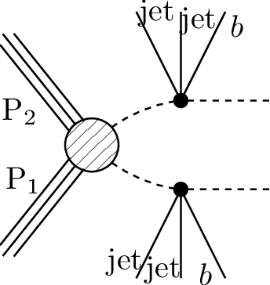
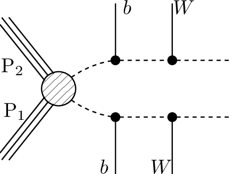

# SMS dictionary
This page intends to collect information about how we map the SModelS description of
events onto the Tx nomenclature. The list has been created from the database version 1.2.3charan, considering also superseded results.

There is also a [ListOfAnalyses123charan](https://smodels.github.io/docs/ListOfAnalyses123charan), a [ListOfAnalyses123charanWithSuperseded](https://smodels.github.io/docs/ListOfAnalyses123charanWithSuperseded), and [Validation123charan](Validation123charan).

| **#** | **Tx** | **Topology** | **Graph** | **Appears in** |
| ----- | ------ | ------------ | --------- | -------------- |
| 1 | **T1**  | `[[[q,q]],[[q,q]]]` `(MET,MET)` |  | [CMS-SUS-16-033](ListOfAnalyses123charan#CMS-SUS-16-033)|
| 2 | **T1bbbb**  | `[[[b,b]],[[b,b]]]` `(MET,MET)` |  | [CMS-SUS-16-033](ListOfAnalyses123charan#CMS-SUS-16-033)|
| 3 | **T1tttt**  | `[[[t,t]],[[t,t]]]` `(MET,MET)` |  | [CMS-SUS-16-009](ListOfAnalyses123charan#CMS-SUS-16-009) [CMS-SUS-16-033](ListOfAnalyses123charan#CMS-SUS-16-033)|
| 4 | **T1ttttoff**  | `[[[b,b,W,W]],[[b,b,W,W]]]` `(MET,MET);` `[[[b,W,b,W]],[[b,W,b,W]]]` `(MET,MET)` |  | [CMS-SUS-16-009](ListOfAnalyses123charan#CMS-SUS-16-009) [CMS-SUS-16-033](ListOfAnalyses123charan#CMS-SUS-16-033)|
| 5 | **T2**  | `[[[q]],[[q]]]` `(MET,MET)` |  | [CMS-SUS-16-033](ListOfAnalyses123charan#CMS-SUS-16-033)|
| 6 | **T2bb**  | `[[[b]],[[b]]]` `(MET,MET)` |  | [CMS-SUS-16-033](ListOfAnalyses123charan#CMS-SUS-16-033)|
| 7 | **T2bbffff**  | `[[[b,l,nu]],[[b,q,q]]]+` `[[[b,l,nu]],[[b,L,nu]]]` `(MET,MET)` |  | [CMS-SUS-17-005](ListOfAnalyses123charan#CMS-SUS-17-005)|
| 8 | **T2tt**  | `[[[t]],[[t]]]` `(MET,MET)` |  | [CMS-SUS-16-009](ListOfAnalyses123charan#CMS-SUS-16-009) [CMS-SUS-16-033](ListOfAnalyses123charan#CMS-SUS-16-033) [CMS-SUS-17-010](ListOfAnalyses123charan#CMS-SUS-17-010)|
| 9 | **T2ttoff**  | `[[[b,W]],[[b,W]]]` `(MET,MET)` |  | [CMS-SUS-17-010](ListOfAnalyses123charan#CMS-SUS-17-010)|
| 10 | **T3GQ**  | `[[[q]],[[q],[q]]]` `(MET,MET)` |  | [CMS-SUS-16-033](ListOfAnalyses123charan#CMS-SUS-16-033)|
| 11 | **T5GQ**  | `[[[q],[q,q]],[[q,q]]]` `(MET,MET)` |  | [CMS-SUS-16-033](ListOfAnalyses123charan#CMS-SUS-16-033)|
| 12 | **T5HGamma**  | `[[[q,q],[h]],[[q,q],[y]]]+` `[[[q,q],[y]],[[q,q],[y]]]+` `[[[q,q],[h]],[[q,q],[h]]]` `(MET,MET)` |  | [CMS-SUS-18-002](ListOfAnalyses123charan#CMS-SUS-18-002)|
| 13 | **T5HH**  | `[[[q,q],[h]],[[q,q],[h]]]` `(MET,MET)` |  | [CMS-SUS-17-006](ListOfAnalyses123charan#CMS-SUS-17-006)|
| 14 | **T5HZ**  | `[[[q,q],[h]],[[q,q],[Z]]]` `(MET,MET)` |  | [CMS-SUS-17-006](ListOfAnalyses123charan#CMS-SUS-17-006)|
| 15 | **T5bbbbZG- amma**  | `[[[b,b],[Z]],[[b,b],[y]]]+` `[[[b,b],[y]],[[b,b],[y]]]+` `[[[b,b],[Z]],[[b,b],[Z]]]` `(MET,MET)` |  | [CMS-SUS-18-002](ListOfAnalyses123charan#CMS-SUS-18-002)|
| 16 | **T5tctc**  | `[[[t],[c]],[[t],[c]]]` `(MET,MET)` |  | [CMS-SUS-16-009](ListOfAnalyses123charan#CMS-SUS-16-009)|
| 17 | **T5ttttZG- amma**  | `[[[t,t],[Z]],[[t,t],[y]]]+` `[[[t,t],[y]],[[t,t],[y]]]+` `[[[t,t],[Z]],[[t,t],[Z]]]` `(MET,MET)` |  | [CMS-SUS-18-002](ListOfAnalyses123charan#CMS-SUS-18-002)|
| 18 | **T6bbWW**  | `[[[b],[W]],[[b],[W]]]` `(MET,MET)` |  | [CMS-SUS-17-010](ListOfAnalyses123charan#CMS-SUS-17-010)|
| 19 | **T6bbWWoff**  | `[[[b],[l,nu]],[[b],[q,q]]]+` `[[[b],[l,nu]],[[b],[L,nu]]]` `(MET,MET)` |  | [CMS-SUS-17-005](ListOfAnalyses123charan#CMS-SUS-17-005)|
| 20 | **T6ttZGam- ma**  | `[[[t],[Z]],[[t],[y]]]+` `[[[t],[y]],[[t],[y]]]+` `[[[t],[Z]],[[t],[Z]]]` `(MET,MET)` |  | [CMS-SUS-18-002](ListOfAnalyses123charan#CMS-SUS-18-002)|
| 21 | **TChiChipm- StauStau**  | `[[[ta+],[ta-]],[[nu],[ta]]]+` `[[[ta-],[ta+]],[[nu],[ta]]]` `(MET,MET)` |  | [CMS-SUS-17-003](ListOfAnalyses123charan#CMS-SUS-17-003)|
| 22 | **TChiWH**  | `[[[W]],[[h]]]` `(MET,MET)` |  | [CMS-SUS-17-004](ListOfAnalyses123charan#CMS-SUS-17-004)|
| 23 | **TChiWZ**  | `[[[W]],[[Z]]]` `(MET,MET)` |  | [CMS-SUS-17-004](ListOfAnalyses123charan#CMS-SUS-17-004)|
| 24 | **TChipChim- SlepSnu**  | `[[[L-],[nu]],[[nu],[L+]]]+` `[[[L+],[nu]],[[nu],[L-]]]+` `[[[L+],[nu]],[[L-],[nu]]]+` `[[[nu],[L+]],[[nu],[L-]]]` `(MET,MET)` |  | [CMS-SUS-17-010](ListOfAnalyses123charan#CMS-SUS-17-010)|
| 25 | **TGQ**  | `[[[q]],[[q,q]]]` `(MET,MET)` |  | [CMS-SUS-16-033](ListOfAnalyses123charan#CMS-SUS-16-033)|
| 26 | **TSlepSlep**  | `[[[e+]],[[e-]]]+` `[[[mu+]],[[mu-]]]` `(MET,MET)` |  | [CMS-SUS-17-009](ListOfAnalyses123charan#CMS-SUS-17-009)|
