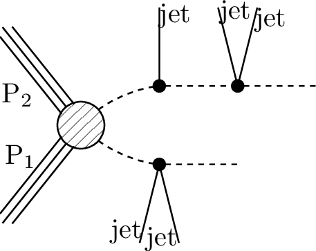
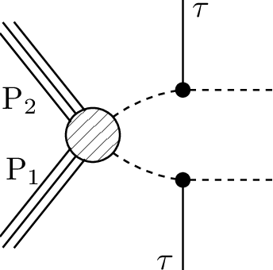

# SMS dictionary
This page intends to collect information about how we map the SModelS description of
events onto the Tx nomenclature. The list has been created from the database version 1.2.3new, considering also superseded results.

There is also a [ListOfAnalyses123new](https://smodels.github.io/docs/ListOfAnalyses123new), a [ListOfAnalyses123newWithSuperseded](https://smodels.github.io/docs/ListOfAnalyses123newWithSuperseded), and [Validation123new](Validation123new).

| **#** | **Tx** | **Topology** | **Graph** | **Appears in** |
| ----- | ------ | ------------ | --------- | -------------- |
| 1 | **T1**  | `[[[q,q]],[[q,q]]]` `(MET,MET);` `[[[q,q]],[[q,q]]]` `(MET,MET)` |  | [ATLAS-SUSY-2016-07](ListOfAnalyses123new#ATLAS-SUSY-2016-07) [CMS-SUS-16-033](ListOfAnalyses123new#CMS-SUS-16-033) [CMS-SUS-19-006](ListOfAnalyses123new#CMS-SUS-19-006) [CMS-SUS-19-006-2](ListOfAnalyses123new#CMS-SUS-19-006-2)|
| 2 | **T1bbbb**  | `[[[b,b]],[[b,b]]]` `(MET,MET)` |  | [CMS-SUS-16-033](ListOfAnalyses123new#CMS-SUS-16-033) [CMS-SUS-19-006](ListOfAnalyses123new#CMS-SUS-19-006) [CMS-SUS-19-006-2](ListOfAnalyses123new#CMS-SUS-19-006-2)|
| 3 | **T1tttt**  | `[[[t,t]],[[t,t]]]` `(MET,MET)` |  | [CMS-SUS-16-009](ListOfAnalyses123new#CMS-SUS-16-009) [CMS-SUS-16-033](ListOfAnalyses123new#CMS-SUS-16-033) [CMS-SUS-19-006](ListOfAnalyses123new#CMS-SUS-19-006) [CMS-SUS-19-006-2](ListOfAnalyses123new#CMS-SUS-19-006-2)|
| 4 | **T1ttttoff**  | `[[[b,b,W,W]],[[b,b,W,W]]]` `(MET,MET);` `[[[b,W,b,W]],[[b,W,b,W]]]` `(MET,MET)` |  | [CMS-SUS-16-009](ListOfAnalyses123new#CMS-SUS-16-009) [CMS-SUS-16-033](ListOfAnalyses123new#CMS-SUS-16-033) [CMS-SUS-19-006](ListOfAnalyses123new#CMS-SUS-19-006) [CMS-SUS-19-006-2](ListOfAnalyses123new#CMS-SUS-19-006-2)|
| 5 | **T2**  | `[[[q]],[[q]]]` `(MET,MET);` `[[[q]],[[q]]]` `(MET,MET)` |  | [ATLAS-SUSY-2016-07](ListOfAnalyses123new#ATLAS-SUSY-2016-07) [CMS-SUS-16-033](ListOfAnalyses123new#CMS-SUS-16-033) [CMS-SUS-19-006](ListOfAnalyses123new#CMS-SUS-19-006) [CMS-SUS-19-006-2](ListOfAnalyses123new#CMS-SUS-19-006-2)|
| 6 | **T2bb**  | `[[[b]],[[b]]]` `(MET,MET)` |  | [ATLAS-SUSY-2016-15](ListOfAnalyses123new#ATLAS-SUSY-2016-15) [ATLAS-SUSY-2016-28](ListOfAnalyses123new#ATLAS-SUSY-2016-28) [CMS-SUS-16-033](ListOfAnalyses123new#CMS-SUS-16-033) [CMS-SUS-19-006](ListOfAnalyses123new#CMS-SUS-19-006) [CMS-SUS-19-006-2](ListOfAnalyses123new#CMS-SUS-19-006-2)|
| 7 | **T2bbffff**  | `[[[b,l,nu]],[[b,q,q]]]+` `[[[b,q,q]],[[b,q,q]]]` `(MET,MET);` `[[[b,q,q]],[[b,q,q]]]` `(MET,MET);` `[[[b,l,nu]],[[b,q,q]]]` `(MET,MET);` `[[[b,l,nu]],[[b,q,q]]]` `(MET,MET)` |  | [ATLAS-SUSY-2016-15](ListOfAnalyses123new#ATLAS-SUSY-2016-15) [ATLAS-SUSY-2016-16](ListOfAnalyses123new#ATLAS-SUSY-2016-16) [CMS-SUS-17-005](ListOfAnalyses123new#CMS-SUS-17-005)|
| 8 | **T2tt**  | `[[[t]],[[t]]]` `(MET,MET)` |  | [ATLAS-SUSY-2016-15](ListOfAnalyses123new#ATLAS-SUSY-2016-15) [ATLAS-SUSY-2016-16](ListOfAnalyses123new#ATLAS-SUSY-2016-16) [CMS-SUS-16-009](ListOfAnalyses123new#CMS-SUS-16-009) [CMS-SUS-16-033](ListOfAnalyses123new#CMS-SUS-16-033) [CMS-SUS-17-010](ListOfAnalyses123new#CMS-SUS-17-010) [CMS-SUS-19-006](ListOfAnalyses123new#CMS-SUS-19-006) [CMS-SUS-19-006-2](ListOfAnalyses123new#CMS-SUS-19-006-2)|
| 9 | **T2ttoff**  | `[[[b,W]],[[b,W]]]` `(MET,MET);` `[[[W,b]],[[W,b]]]` `(MET,MET);` `[[[b,W]],[[b,W]]]` `(MET,MET)` |  | [ATLAS-SUSY-2016-15](ListOfAnalyses123new#ATLAS-SUSY-2016-15) [ATLAS-SUSY-2016-16](ListOfAnalyses123new#ATLAS-SUSY-2016-16) [CMS-SUS-16-009](ListOfAnalyses123new#CMS-SUS-16-009) [CMS-SUS-16-033](ListOfAnalyses123new#CMS-SUS-16-033) [CMS-SUS-17-010](ListOfAnalyses123new#CMS-SUS-17-010) [CMS-SUS-19-006](ListOfAnalyses123new#CMS-SUS-19-006) [CMS-SUS-19-006-2](ListOfAnalyses123new#CMS-SUS-19-006-2)|
| 10 | **T3GQ**  | `[[[q]],[[q],[q]]]` `(MET,MET)` |  | [ATLAS-SUSY-2016-07](ListOfAnalyses123new#ATLAS-SUSY-2016-07) [CMS-SUS-16-033](ListOfAnalyses123new#CMS-SUS-16-033)|
| 11 | **T5GQ**  | `[[[q],[q,q]],[[q,q]]]` `(MET,MET)` |  | [ATLAS-SUSY-2016-07](ListOfAnalyses123new#ATLAS-SUSY-2016-07) [CMS-SUS-16-033](ListOfAnalyses123new#CMS-SUS-16-033)|
| 12 | **T5HH**  | `[[[q,q],[h]],[[q,q],[h]]]` `(MET,MET)` |  | [CMS-SUS-17-006](ListOfAnalyses123new#CMS-SUS-17-006)|
| 13 | **T5HZ**  | `[[[q,q],[h]],[[q,q],[Z]]]+` `[[[q,q],[h]],[[q,q],[h]]]+` `[[[q,q],[Z]],[[q,q],[Z]]]` `(MET,MET)` |  | [CMS-SUS-17-006](ListOfAnalyses123new#CMS-SUS-17-006)|
| 14 | **T5Hg**  | `[[[q,q],[h]],[[q,q],[y]]]+` `[[[q,q],[y]],[[q,q],[y]]]+` `[[[q,q],[h]],[[q,q],[h]]]` `(MET,MET)` |  | [CMS-SUS-18-002](ListOfAnalyses123new#CMS-SUS-18-002)|
| 15 | **T5WW**  | `[[[q,q],[W]],[[q,q],[W]]]` `(MET,MET)` |  | [ATLAS-SUSY-2016-07](ListOfAnalyses123new#ATLAS-SUSY-2016-07)|
| 16 | **T5WWoff**  | `[[[q,q],[q,q]],[[q,q],[q,q]]]` `(MET,MET)` |  | [ATLAS-SUSY-2016-07](ListOfAnalyses123new#ATLAS-SUSY-2016-07)|
| 17 | **T5WZh**  | `[[[q,q],[Z]],[[q,q],[W]]]+` `[[[q,q],[h]],[[q,q],[W]]]+` `[[[q,q],[h]],[[q,q],[h]]]+` `[[[q,q],[h]],[[q,q],[Z]]]` `(MET,MET);` `[[[q,q],[Z]],[[q,q],[W]]]+` `[[[q,q],[h]],[[q,q],[W]]]+` `[[[q,q],[W]],[[q,q],[W]]]+` `[[[q,q],[Z]],[[q,q],[Z]]]+` `[[[q,q],[h]],[[q,q],[h]]]+` `[[[q,q],[h]],[[q,q],[Z]]]` `(MET,MET)` |  | [ATLAS-SUSY-2016-07](ListOfAnalyses123new#ATLAS-SUSY-2016-07)|
| 18 | **T5ZZ**  | `[[[q,q],[Z]],[[q,q],[Z]]]` `(MET,MET)` |  | [ATLAS-SUSY-2016-07](ListOfAnalyses123new#ATLAS-SUSY-2016-07)|
| 19 | **T5Zg**  | `[[[q,q],[Z]],[[q,q],[y]]]+` `[[[q,q],[y]],[[q,q],[y]]]+` `[[[q,q],[Z]],[[q,q],[Z]]]` `(MET,MET)` |  | [ATLAS-SUSY-2016-27](ListOfAnalyses123new#ATLAS-SUSY-2016-27)|
| 20 | **T5bbbbZg**  | `[[[b,b],[Z]],[[b,b],[y]]]+` `[[[b,b],[y]],[[b,b],[y]]]+` `[[[b,b],[Z]],[[b,b],[Z]]]` `(MET,MET)` |  | [CMS-SUS-18-002](ListOfAnalyses123new#CMS-SUS-18-002)|
| 21 | **T5gg**  | `[[[q,q],[y]],[[q,q],[y]]]` `(MET,MET)` |  | [ATLAS-SUSY-2016-27](ListOfAnalyses123new#ATLAS-SUSY-2016-27)|
| 22 | **T5tctc**  | `[[[t],[c]],[[t],[c]]]` `(MET,MET)` |  | [CMS-SUS-16-009](ListOfAnalyses123new#CMS-SUS-16-009)|
| 23 | **T5ttttZg**  | `[[[t,t],[Z]],[[t,t],[y]]]+` `[[[t,t],[y]],[[t,t],[y]]]+` `[[[t,t],[Z]],[[t,t],[Z]]]` `(MET,MET)` |  | [CMS-SUS-18-002](ListOfAnalyses123new#CMS-SUS-18-002)|
| 24 | **T6WW**  | `[[[q],[W]],[[q],[W]]]` `(MET,MET);` `[[[q],[W]],[[q],[W]]]` `(MET,MET)` |  | [ATLAS-SUSY-2016-07](ListOfAnalyses123new#ATLAS-SUSY-2016-07)|
| 25 | **T6WWoff**  | `[[[q],[q,q]],[[q],[q,q]]]` `(MET,MET)` |  | [ATLAS-SUSY-2016-07](ListOfAnalyses123new#ATLAS-SUSY-2016-07)|
| 26 | **T6WZh**  | `[[[q],[Z]],[[q],[W]]]+` `[[[q],[h]],[[q],[W]]]+` `[[[q],[W]],[[q],[W]]]+` `[[[q],[Z]],[[q],[Z]]]+` `[[[q],[h]],[[q],[h]]]+` `[[[q],[Z]],[[q],[h]]]` `(MET,MET);` `[[[q],[Z]],[[q],[W]]]+` `[[[q],[h]],[[q],[W]]]+` `[[[q],[Z]],[[q],[Z]]]+` `[[[q],[h]],[[q],[h]]]+` `[[[q],[Z]],[[q],[h]]]` `(MET,MET)` |  | [ATLAS-SUSY-2016-07](ListOfAnalyses123new#ATLAS-SUSY-2016-07)|
| 27 | **T6bbHH**  | `[[[b],[h]],[[b],[h]]]` `(MET,MET)` |  | [ATLAS-SUSY-2018-31](ListOfAnalyses123new#ATLAS-SUSY-2018-31)|
| 28 | **T6bbWW**  | `[[[b],[W]],[[b],[W]]]` `(MET,MET)` |  | [ATLAS-SUSY-2016-16](ListOfAnalyses123new#ATLAS-SUSY-2016-16) [CMS-SUS-17-010](ListOfAnalyses123new#CMS-SUS-17-010)|
| 29 | **T6bbWWoff**  | `[[[b],[l,nu]],[[b],[q,q]]]+` `[[[b],[q,q]],[[b],[q,q]]]` `(MET,MET)` |  | [CMS-SUS-17-005](ListOfAnalyses123new#CMS-SUS-17-005)|
| 30 | **T6gg**  | `[[[q],[y]],[[q],[y]]]` `(MET,MET)` |  | [ATLAS-SUSY-2016-27](ListOfAnalyses123new#ATLAS-SUSY-2016-27)|
| 31 | **T6ttZg**  | `[[[t],[Z]],[[t],[y]]]+` `[[[t],[y]],[[t],[y]]]+` `[[[t],[Z]],[[t],[Z]]]` `(MET,MET)` |  | [CMS-SUS-18-002](ListOfAnalyses123new#CMS-SUS-18-002)|
| 32 | **TChiChipm- SlepSlep**  | `[[[e+],[e-]],[[l],[nu]]]+` `[[[e-],[e+]],[[l],[nu]]]+` `[[[e+],[e-]],[[nu],[l]]]+` `[[[e-],[e+]],[[nu],[l]]]+` `[[[mu+],[mu-]],[[l],[nu]]]+` `[[[mu-],[mu+]],[[l],[nu]]]+` `[[[mu+],[mu-]],[[nu],[l]]]+` `[[[mu-],[mu+]],[[nu],[l]]]` `(MET,MET)` |  | [ATLAS-SUSY-2016-24](ListOfAnalyses123new#ATLAS-SUSY-2016-24)|
| 33 | **TChiChipm- StauStau**  | `[[[ta+],[ta-]],[[nu],[ta]]]+` `[[[ta-],[ta+]],[[nu],[ta]]]` `(MET,MET)` |  | [CMS-SUS-17-003](ListOfAnalyses123new#CMS-SUS-17-003)|
| 34 | **TChiH**  | `[[[Z]],[[Z]]]+` `[[[h]],[[h]]]+` `[[[h]],[[Z]]]` `(MET,MET)` |  | [ATLAS-SUSY-2017-02](ListOfAnalyses123new#ATLAS-SUSY-2017-02)|
| 35 | **TChiWH**  | `[[[W]],[[h]]]` `(MET,MET)` |  | [ATLAS-SUSY-2017-01](ListOfAnalyses123new#ATLAS-SUSY-2017-01) [ATLAS-SUSY-2019-08](ListOfAnalyses123new#ATLAS-SUSY-2019-08) [CMS-SUS-17-004](ListOfAnalyses123new#CMS-SUS-17-004)|
| 36 | **TChiWW**  | `[[[W]],[[W]]]` `(MET,MET)` |  | [ATLAS-SUSY-2018-32](ListOfAnalyses123new#ATLAS-SUSY-2018-32)|
| 37 | **TChiWZ**  | `[[[W]],[[Z]]]` `(MET,MET)` |  | [ATLAS-SUSY-2016-24](ListOfAnalyses123new#ATLAS-SUSY-2016-24) [ATLAS-SUSY-2018-06](ListOfAnalyses123new#ATLAS-SUSY-2018-06) [CMS-SUS-17-004](ListOfAnalyses123new#CMS-SUS-17-004)|
| 38 | **TChiWZoff**  | `[[[mu+,mu-]],[[l,nu]]]+` `[[[e+,e-]],[[l,nu]]]` `(MET,MET)` |  | [ATLAS-SUSY-2018-06](ListOfAnalyses123new#ATLAS-SUSY-2018-06) [CMS-SUS-17-004](ListOfAnalyses123new#CMS-SUS-17-004)|
| 39 | **TChiWZ- offqq**  | `[[[q,q]],[[mu+,mu-]]]+` `[[[q,q]],[[e+,e-]]]` `(MET,MET)` |  | [ATLAS-SUSY-2018-16](ListOfAnalyses123new#ATLAS-SUSY-2018-16)|
| 40 | **TChipChim- SlepSlep**  | `[[[nu],[mu+]],[[nu],[mu-]]]+` `[[[nu],[e+]],[[nu],[e-]]]` `(MET,MET);` `[[[nu],[mu+]],[[nu],[mu-]]]+` `[[[nu],[e+]],[[nu],[e-]]]` `(MET,MET)` |  | [ATLAS-SUSY-2016-24](ListOfAnalyses123new#ATLAS-SUSY-2016-24)|
| 41 | **TChipChim- SlepSlepAll**  | `[[[nu],[L+]],[[nu],[L-]]]` `(MET,MET)` |  | [ATLAS-SUSY-2018-32](ListOfAnalyses123new#ATLAS-SUSY-2018-32)|
| 42 | **TChipChim- SlepSnu**  | `[[[L-],[nu]],[[nu],[L+]]]+` `[[[L+],[nu]],[[nu],[L-]]]+` `[[[L+],[nu]],[[L-],[nu]]]+` `[[[nu],[L+]],[[nu],[L-]]]` `(MET,MET)` |  | [CMS-SUS-17-010](ListOfAnalyses123new#CMS-SUS-17-010)|
| 43 | **TChipChim- StauSnu**  | `[[[nu],[ta+]],[[nu],[ta-]]]+` `[[[ta+],[nu]],[[ta-],[nu]]]` `(MET,MET)` |  | [CMS-SUS-17-003](ListOfAnalyses123new#CMS-SUS-17-003)|
| 44 | **TChipChi- mgg**  | `[[[W],[y]],[[Z],[y]]]+` `[[[W],[y]],[[W],[y]]]+` `[[[W],[y]],[[h],[y]]]` `(MET,MET)` |  | [ATLAS-SUSY-2016-27](ListOfAnalyses123new#ATLAS-SUSY-2016-27)|
| 45 | **TGQ**  | `[[[q]],[[q,q]]]` `(MET,MET)` |  | [ATLAS-SUSY-2016-07](ListOfAnalyses123new#ATLAS-SUSY-2016-07) [CMS-SUS-16-033](ListOfAnalyses123new#CMS-SUS-16-033)|
| 46 | **TSelSel**  | `[[[e+]],[[e-]]]` `(MET,MET)` |  | [CMS-SUS-17-009](ListOfAnalyses123new#CMS-SUS-17-009)|
| 47 | **TSlepSlep**  | `[[[e+]],[[e-]]]+` `[[[mu+]],[[mu-]]]` `(MET,MET);` `[[[e+]],[[e-]]]+` `[[[mu+]],[[mu-]]]` `(MET,MET);` `[[[mu+]],[[mu-]]]+` `[[[e+]],[[e-]]]` `(MET,MET)` |  | [ATLAS-SUSY-2016-24](ListOfAnalyses123new#ATLAS-SUSY-2016-24) [ATLAS-SUSY-2018-16](ListOfAnalyses123new#ATLAS-SUSY-2018-16) [CMS-SUS-17-009](ListOfAnalyses123new#CMS-SUS-17-009)|
| 48 | **TSlepSle- pAll**  | `[[[l]],[[l]]]` `(MET,MET)` |  | [ATLAS-SUSY-2018-32](ListOfAnalyses123new#ATLAS-SUSY-2018-32)|
| 49 | **TSmuSmu**  | `[[[mu+]],[[mu-]]]` `(MET,MET)` |  | [CMS-SUS-17-009](ListOfAnalyses123new#CMS-SUS-17-009)|
| 50 | **TStauStau**  | `[[[ta]],[[ta]]]` `(MET,MET)` |  | [ATLAS-SUSY-2018-04](ListOfAnalyses123new#ATLAS-SUSY-2018-04)|
