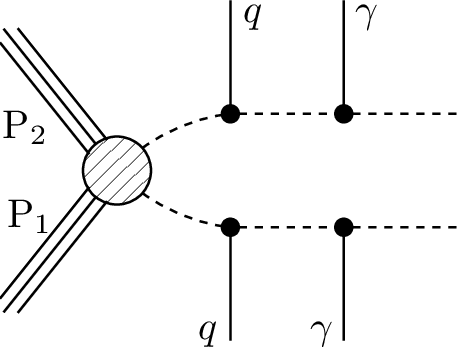
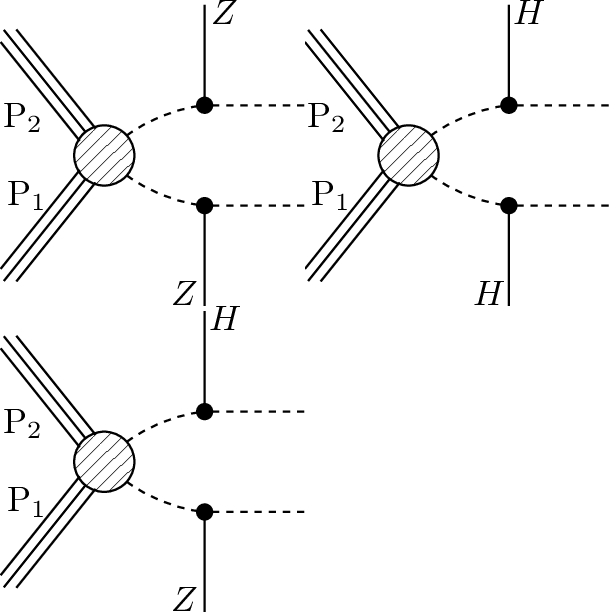

# SMS dictionary
This page intends to collect information about how we map the SModelS description of
events onto the Tx nomenclature. The list has been created from the database version 1.2.3phil, considering also superseded results.

There is also a [ListOfAnalyses123phil](https://smodels.github.io/docs/ListOfAnalyses123phil), a [ListOfAnalyses123philWithSuperseded](https://smodels.github.io/docs/ListOfAnalyses123philWithSuperseded), and [Validation123phil](Validation123phil).

| **#** | **Tx** | **Topology** | **Graph** | **Appears in** |
| ----- | ------ | ------------ | --------- | -------------- |
| 1 | **T1**  | `[[[q,q]],[[q,q]]]` `(MET,MET)` |  | [ATLAS-SUSY-2016-07](ListOfAnalyses123phil#ATLAS-SUSY-2016-07)|
| 2 | **T2**  | `[[[q]],[[q]]]` `(MET,MET)` |  | [ATLAS-SUSY-2016-07](ListOfAnalyses123phil#ATLAS-SUSY-2016-07)|
| 3 | **T2bbffff**  | `[[[b,l,nu]],[[b,q,q]]]` `(MET,MET);` `[[[b,q,q]],[[b,q,q]]]` `(MET,MET);` `[[[b,l,nu]],[[b,q,q]]]` `(MET,MET)` |  | [ATLAS-SUSY-2016-15](ListOfAnalyses123phil#ATLAS-SUSY-2016-15) [ATLAS-SUSY-2016-16](ListOfAnalyses123phil#ATLAS-SUSY-2016-16)|
| 4 | **T2tt**  | `[[[t]],[[t]]]` `(MET,MET)` |  | [ATLAS-SUSY-2016-15](ListOfAnalyses123phil#ATLAS-SUSY-2016-15) [ATLAS-SUSY-2016-16](ListOfAnalyses123phil#ATLAS-SUSY-2016-16)|
| 5 | **T2ttoff**  | `[[[b,W]],[[b,W]]]` `(MET,MET)` |  | [ATLAS-SUSY-2016-15](ListOfAnalyses123phil#ATLAS-SUSY-2016-15) [ATLAS-SUSY-2016-16](ListOfAnalyses123phil#ATLAS-SUSY-2016-16)|
| 6 | **T5Gamma**  | `[[[q,q],[y]],[[q,q],[y]]]` `(MET,MET)` |  | [ATLAS-SUSY-2016-27](ListOfAnalyses123phil#ATLAS-SUSY-2016-27)|
| 7 | **T5WW**  | `[[[q,q],[W]],[[q,q],[W]]]` `(MET,MET)` |  | [ATLAS-SUSY-2016-07](ListOfAnalyses123phil#ATLAS-SUSY-2016-07)|
| 8 | **T5WWoff**  | `[[[q,q],[q,q]],[[q,q],[q,q]]]` `(MET,MET)` |  | [ATLAS-SUSY-2016-07](ListOfAnalyses123phil#ATLAS-SUSY-2016-07)|
| 9 | **T5WZh**  | `[[[q,q],[Z]],[[q,q],[W]]]+` `[[[q,q],[h]],[[q,q],[W]]]+` `[[[q,q],[h]],[[q,q],[h]]]+` `[[[q,q],[h]],[[q,q],[Z]]]` `(MET,MET)` |  | [ATLAS-SUSY-2016-07](ListOfAnalyses123phil#ATLAS-SUSY-2016-07)|
| 10 | **T5ZGamma**  | `[[[q,q],[Z]],[[q,q],[y]]]+` `[[[q,q],[y]],[[q,q],[y]]]+` `[[[q,q],[Z]],[[q,q],[Z]]]` `(MET,MET);` `[[[q,q],[Z]],[[q,q],[y]]]` `(MET,MET)` |  | [ATLAS-SUSY-2016-27](ListOfAnalyses123phil#ATLAS-SUSY-2016-27)|
| 11 | **T5ZZ**  | `[[[q,q],[Z]],[[q,q],[Z]]]` `(MET,MET)` |  | [ATLAS-SUSY-2016-07](ListOfAnalyses123phil#ATLAS-SUSY-2016-07)|
| 12 | **T6Gamma**  | `[[[q],[y]],[[q],[y]]]` `(MET,MET)` |  | [ATLAS-SUSY-2016-27](ListOfAnalyses123phil#ATLAS-SUSY-2016-27)|
| 13 | **T6WWleft**  | `[[[q],[W]],[[q],[W]]]` `(MET,MET)` |  | [ATLAS-SUSY-2016-07](ListOfAnalyses123phil#ATLAS-SUSY-2016-07)|
| 14 | **T6WWoffl- eft**  | `[[[q],[q,q]],[[q],[q,q]]]` `(MET,MET)` |  | [ATLAS-SUSY-2016-07](ListOfAnalyses123phil#ATLAS-SUSY-2016-07)|
| 15 | **T6WZh**  | `[[[q],[Z]],[[q],[W]]]+` `[[[q],[h]],[[q],[W]]]+` `[[[q],[Z]],[[q],[Z]]]+` `[[[q],[h]],[[q],[h]]]+` `[[[q],[Z]],[[q],[h]]]` `(MET,MET)` |  | [ATLAS-SUSY-2016-07](ListOfAnalyses123phil#ATLAS-SUSY-2016-07)|
| 16 | **T6bbWW**  | `[[[b],[W]],[[b],[W]]]` `(MET,MET)` |  | [ATLAS-SUSY-2016-16](ListOfAnalyses123phil#ATLAS-SUSY-2016-16)|
| 17 | **TChiChipm- SlepL**  | `[[[L+],[L-]],[[L],[nu]]]+` `[[[L+],[L-]],[[nu],[L]]]+` `[[[L-],[L+]],[[L],[nu]]]+` `[[[L-],[L+]],[[nu],[L]]]` `(MET,MET)` |  | [ATLAS-SUSY-2016-24](ListOfAnalyses123phil#ATLAS-SUSY-2016-24)|
| 18 | **TChiH**  | `[[[Z]],[[Z]]]+` `[[[h]],[[h]]]` `(MET,MET)` |  | [ATLAS-SUSY-2017-02](ListOfAnalyses123phil#ATLAS-SUSY-2017-02)|
| 19 | **TChiWH**  | `[[[W]],[[h]]]` `(MET,MET)` |  | [ATLAS-SUSY-2017-01](ListOfAnalyses123phil#ATLAS-SUSY-2017-01) [ATLAS-SUSY-2019-08](ListOfAnalyses123phil#ATLAS-SUSY-2019-08)|
| 20 | **TChiWW**  | `[[[W]],[[W]]]` `(MET,MET)` |  | [ATLAS-SUSY-2018-32](ListOfAnalyses123phil#ATLAS-SUSY-2018-32)|
| 21 | **TChiWZ**  | `[[[W]],[[Z]]]` `(MET,MET)` |  | [ATLAS-SUSY-2016-24](ListOfAnalyses123phil#ATLAS-SUSY-2016-24)|
| 22 | **TChipChi- mGamma**  | `[[[W],[y]],[[Z],[y]]]+` `[[[W],[y]],[[W],[y]]]+` `[[[W],[y]],[[h],[y]]]` `(MET,MET)` |  | [ATLAS-SUSY-2016-27](ListOfAnalyses123phil#ATLAS-SUSY-2016-27)|
| 23 | **TChipChim- SlepSlepAll**  | `[[[nu],[L+]],[[nu],[L-]]]` `(MET,MET)` |  | [ATLAS-SUSY-2016-24](ListOfAnalyses123phil#ATLAS-SUSY-2016-24) [ATLAS-SUSY-2018-32](ListOfAnalyses123phil#ATLAS-SUSY-2018-32)|
| 24 | **TGQ**  | `[[[q]],[[q,q]]]` `(MET,MET)` |  | [ATLAS-SUSY-2016-07](ListOfAnalyses123phil#ATLAS-SUSY-2016-07)|
| 25 | **TSlepSle- pAll**  | `[[[l]],[[l]]]` `(MET,MET)` |  | [ATLAS-SUSY-2016-24](ListOfAnalyses123phil#ATLAS-SUSY-2016-24) [ATLAS-SUSY-2018-32](ListOfAnalyses123phil#ATLAS-SUSY-2018-32)|
