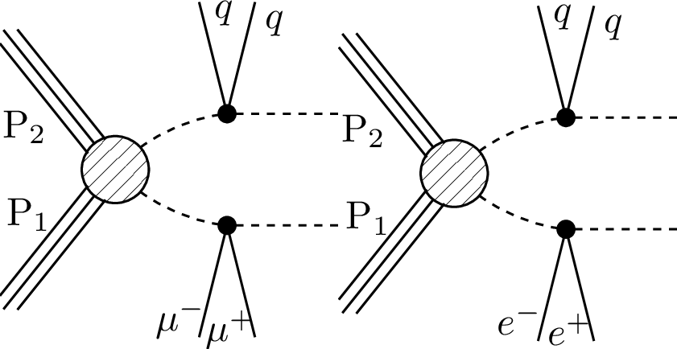

# SMS dictionary
This page intends to collect information about how we map the SModelS description of
events onto the Tx nomenclature. The list has been created from the database version 1.2.3rola, considering also superseded results.

There is also a [ListOfAnalyses123rola](https://smodels.github.io/docs/ListOfAnalyses123rola), a [ListOfAnalyses123rolaWithSuperseded](https://smodels.github.io/docs/ListOfAnalyses123rolaWithSuperseded), and [Validation123rola](Validation123rola).

| **#** | **Tx** | **Topology** | **Graph** | **Appears in** |
| ----- | ------ | ------------ | --------- | -------------- |
| 1 | **TChiWZ**  | `[[[W]],[[Z]]]` `(MET,MET)` |  | [ATLAS-SUSY-2018-06](ListOfAnalyses123rola#ATLAS-SUSY-2018-06)|
| 2 | **TChiWZ- offqq**  | `[[[q,q]],[[mu+,mu-]]]+` `[[[q,q]],[[e+,e-]]]` `(MET,MET)` |  | [ATLAS-SUSY-2018-16](ListOfAnalyses123rola#ATLAS-SUSY-2018-16)|
| 3 | **TSlepSlep**  | `[[[mu+]],[[mu-]]]+` `[[[e+]],[[e-]]]` `(MET,MET)` |  | [ATLAS-SUSY-2018-16](ListOfAnalyses123rola#ATLAS-SUSY-2018-16)|
