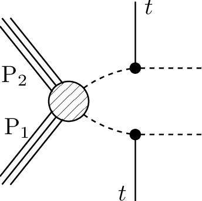
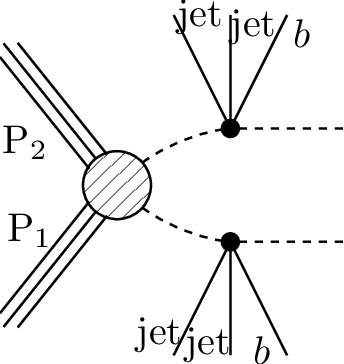
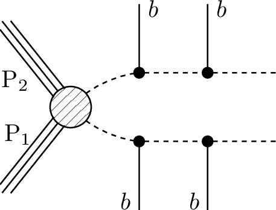
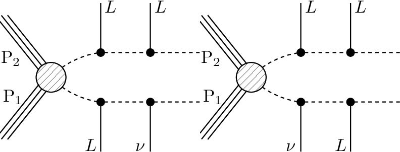
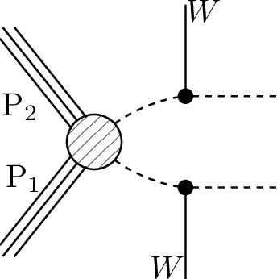
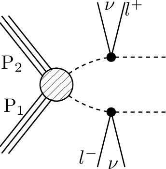
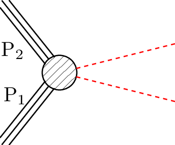
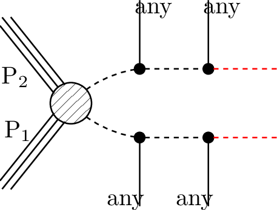
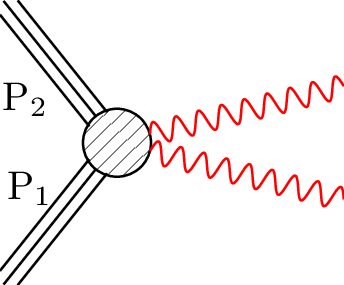

# SMS dictionary
This page intends to collect information about how we map the SModelS description of
events onto the Tx nomenclature. The list has been created from the database version 2.0.0rc6, considering also superseded results.

There is also a [ListOfAnalyses200rc6](https://smodels.github.io/docs/ListOfAnalyses200rc6), a [ListOfAnalyses200rc6WithSuperseded](https://smodels.github.io/docs/ListOfAnalyses200rc6WithSuperseded), and [Validation200rc6](Validation200rc6).

| **#** | **Tx** | **Topology** | **Graph** | **Appears in** |
| ----- | ------ | ------------ | --------- | -------------- |
| 1 | **T1**  | `[[[q,q]],[[q,q]]]` `(MET,MET)` |  | [many (14)](ListOfAnalyses200rc6)|
| 2 | **T1bbbb**  | `[[[b,b]],[[b,b]]]` `(MET,MET)` |  | [many (17)](ListOfAnalyses200rc6)|
| 3 | **T1btbt**  | `[[[t+,b]],[[t+,b]]]+` `[[[t-,b]],[[t-,b]]]` `(MET,MET);` `[[[t,b]],[[t,b]]]` `(MET,MET);` `[[[b,t]],[[b,t]]]` `(MET,MET)` |  | [ATLAS-CONF-2013-007](ListOfAnalyses200rc6#ATLAS-CONF-2013-007) [ATLAS-CONF-2013-061](ListOfAnalyses200rc6#ATLAS-CONF-2013-061) [ATLAS-SUSY-2013-04](ListOfAnalyses200rc6#ATLAS-SUSY-2013-04) [CMS-SUS-13-012](ListOfAnalyses200rc6#CMS-SUS-13-012)|
| 4 | **T1tttt**  | `[[[t+,t-]],[[t-,t+]]]` `(MET,MET);` `[[[t,t]],[[t,t]]]` `(MET,MET);` `[[[t+,t-]],[[t+,t-]]]` `(MET,MET)` |  | [many (40)](ListOfAnalyses200rc6)|
| 5 | **T1ttttoff**  | `[[[b,W,b,W]],[[b,W,b,W]]]` `(MET,MET);` `[[[b,b,W,W]],[[b,b,W,W]]]` `(MET,MET)` |  | [many (28)](ListOfAnalyses200rc6)|
| 6 | **T2**  | `[[[q]],[[q]]]` `(MET,MET)` |  | [many (10)](ListOfAnalyses200rc6)|
| 7 | **T2bb**  | `[[[b]],[[b]]]` `(MET,MET)` |  | [many (15)](ListOfAnalyses200rc6)|
| 8 | **T2bbWW**  | `[[[b,W+]],[[b,W-]]]` `(MET,MET);` `[[[b,W]],[[b,W]]]` `(MET,MET)` |  | [ATLAS-CONF-2013-048](ListOfAnalyses200rc6WithSuperseded#ATLAS-CONF-2013-048) [ATLAS-SUSY-2013-19](ListOfAnalyses200rc6#ATLAS-SUSY-2013-19) [ATLAS-SUSY-2013-21](ListOfAnalyses200rc6#ATLAS-SUSY-2013-21) [CMS-SUS-14-021](ListOfAnalyses200rc6#CMS-SUS-14-021)|
| 9 | **T2bbWWoff**  | `[[[b,L,nu]],[[b,L,nu]]]+` `[[[b,q,q]],[[b,q,q]]]+` `[[[b,q,q]],[[b,L,nu]]]` `(MET,MET);` `[[[b,l,nu]],[[b,q,q]]]` `(MET,MET)` |  | [CMS-PAS-SUS-16-052](ListOfAnalyses200rc6#CMS-PAS-SUS-16-052) [ATLAS-SUSY-2013-21](ListOfAnalyses200rc6#ATLAS-SUSY-2013-21) [CMS-SUS-14-021](ListOfAnalyses200rc6#CMS-SUS-14-021)|
| 10 | **T2cc**  | `[[[c]],[[c]]]` `(MET,MET);` `[[[q]],[[q]]]` `(MET,MET)` |  | [CMS-SUS-16-032](ListOfAnalyses200rc6#CMS-SUS-16-032) [CMS-SUS-16-036](ListOfAnalyses200rc6#CMS-SUS-16-036) [CMS-SUS-16-049](ListOfAnalyses200rc6#CMS-SUS-16-049) [ATLAS-SUSY-2013-21](ListOfAnalyses200rc6#ATLAS-SUSY-2013-21)|
| 11 | **T2tt**  | `[[[t]],[[t]]]` `(MET,MET);` `[[[t+]],[[t-]]]` `(MET,MET)` |  | [many (29)](ListOfAnalyses200rc6)|
| 12 | **T2ttC**  | `[[[b,q,q]],[[b,q,q]]]` `(MET,MET)` |  | [CMS-SUS-16-049](ListOfAnalyses200rc6#CMS-SUS-16-049)|
| 13 | **T2ttoff**  | `[[[b,W]],[[b,W]]]` `(MET,MET);` `[[[W,b]],[[W,b]]]` `(MET,MET)` |  | [many (18)](ListOfAnalyses200rc6)|
| 14 | **T5**  | `[[[q],[q]],[[q],[q]]]` `(MET,MET)` |  | [ATLAS-SUSY-2013-04](ListOfAnalyses200rc6#ATLAS-SUSY-2013-04) [CMS-SUS-13-012](ListOfAnalyses200rc6#CMS-SUS-13-012)|
| 15 | **T5WW**  | `[[[q,q],[W]],[[q,q],[W]]]` `(MET,MET);` `[[[q,q],[W+]],[[q,q],[W+]]]+` `[[[q,q],[W-]],[[q,q],[W-]]]` `(MET,MET)` |  | [CMS-SUS-16-035](ListOfAnalyses200rc6#CMS-SUS-16-035) [CMS-SUS-16-042](ListOfAnalyses200rc6#CMS-SUS-16-042) [ATLAS-CONF-2013-047](ListOfAnalyses200rc6WithSuperseded#ATLAS-CONF-2013-047) [ATLAS-SUSY-2013-02](ListOfAnalyses200rc6#ATLAS-SUSY-2013-02) [ATLAS-SUSY-2013-04](ListOfAnalyses200rc6#ATLAS-SUSY-2013-04) [CMS-SUS-13-012](ListOfAnalyses200rc6#CMS-SUS-13-012)|
| 16 | **T5WWoff**  | `[[[q,q],[l,nu]],[[q,q],[q,q]]]` `(MET,MET);` `[[[q,q],[q,q]],[[q,q],[q,q]]]` `(MET,MET);` `[[[q,q],[l+,nu]],[[q,q],[l+,nu]]]+` `[[[q,q],[l-,nu]],[[q,q],[l-,nu]]]` `(MET,MET);` `[[[q,q],[q,q]],[[q,q],[q,q]]]` `(MET,MET)` |  | [CMS-SUS-16-035](ListOfAnalyses200rc6#CMS-SUS-16-035) [CMS-SUS-16-042](ListOfAnalyses200rc6#CMS-SUS-16-042) [ATLAS-CONF-2013-047](ListOfAnalyses200rc6WithSuperseded#ATLAS-CONF-2013-047) [ATLAS-SUSY-2013-02](ListOfAnalyses200rc6#ATLAS-SUSY-2013-02) [ATLAS-SUSY-2013-04](ListOfAnalyses200rc6#ATLAS-SUSY-2013-04) [CMS-SUS-13-012](ListOfAnalyses200rc6#CMS-SUS-13-012)|
| 17 | **T5ZZ**  | `[[[q,q],[Z]],[[q,q],[Z]]]` `(MET,MET)` |  | [CMS-SUS-16-034](ListOfAnalyses200rc6#CMS-SUS-16-034) [ATLAS-SUSY-2013-04](ListOfAnalyses200rc6#ATLAS-SUSY-2013-04) [CMS-SUS-13-012](ListOfAnalyses200rc6#CMS-SUS-13-012)|
| 18 | **T5bbbb**  | `[[[b],[b]],[[b],[b]]]` `(MET,MET)` |  | [CMS-SUS-13-012](ListOfAnalyses200rc6#CMS-SUS-13-012)|
| 19 | **T5gg**  | `[[[q,q],[y]],[[q,q],[y]]]` `(MET,MET)` |  | [CMS-SUS-16-046](ListOfAnalyses200rc6#CMS-SUS-16-046) [CMS-SUS-16-047](ListOfAnalyses200rc6#CMS-SUS-16-047)|
| 20 | **T5tctc**  | `[[[t],[q]],[[t],[q]]]` `(MET,MET)` |  | [CMS-SUS-16-035](ListOfAnalyses200rc6#CMS-SUS-16-035) [CMS-SUS-16-050](ListOfAnalyses200rc6#CMS-SUS-16-050) [ATLAS-CONF-2013-047](ListOfAnalyses200rc6WithSuperseded#ATLAS-CONF-2013-047) [ATLAS-SUSY-2013-02](ListOfAnalyses200rc6#ATLAS-SUSY-2013-02)|
| 21 | **T5ttbbWW- off**  | `[[[t,b],[q,q]],[[t,b],[q,q]]]` `(MET,MET)` |  | [CMS-SUS-16-035](ListOfAnalyses200rc6#CMS-SUS-16-035)|
| 22 | **T5ttofftt**  | `[[[b,W],[t]],[[b,W],[t]]]` `(MET,MET)` |  | [CMS-SUS-16-037](ListOfAnalyses200rc6#CMS-SUS-16-037)|
| 23 | **T5tttt**  | `[[[t+],[t-]],[[t-],[t+]]]+` `[[[t-],[t+]],[[t-],[t+]]]+` `[[[t+],[t-]],[[t+],[t-]]]` `(MET,MET);` `[[[t],[t]],[[t],[t]]]` `(MET,MET)` |  | [CMS-SUS-16-035](ListOfAnalyses200rc6#CMS-SUS-16-035) [CMS-SUS-16-037](ListOfAnalyses200rc6#CMS-SUS-16-037) [CMS-SUS-16-050](ListOfAnalyses200rc6#CMS-SUS-16-050) [ATLAS-CONF-2013-007](ListOfAnalyses200rc6#ATLAS-CONF-2013-007) [CMS-SUS-13-007](ListOfAnalyses200rc6#CMS-SUS-13-007) [CMS-SUS-13-012](ListOfAnalyses200rc6#CMS-SUS-13-012)|
| 24 | **T6HHtt**  | `[[[h],[t]],[[h],[t]]]` `(MET,MET)` |  | [CMS-SUS-16-041](ListOfAnalyses200rc6#CMS-SUS-16-041)|
| 25 | **T6WW**  | `[[[q],[W]],[[q],[W]]]` `(MET,MET)` |  | [ATLAS-CONF-2013-089](ListOfAnalyses200rc6#ATLAS-CONF-2013-089) [ATLAS-SUSY-2013-02](ListOfAnalyses200rc6#ATLAS-SUSY-2013-02)|
| 26 | **T6ZZofftt**  | `[[[l+,l-],[t]],[[l+,l-],[t]]]` `(MET,MET)` |  | [CMS-SUS-16-041](ListOfAnalyses200rc6#CMS-SUS-16-041)|
| 27 | **T6ZZtt**  | `[[[Z],[t]],[[Z],[t]]]` `(MET,MET)` |  | [CMS-SUS-16-041](ListOfAnalyses200rc6#CMS-SUS-16-041) [ATLAS-CONF-2013-025](ListOfAnalyses200rc6WithSuperseded#ATLAS-CONF-2013-025) [ATLAS-SUSY-2013-08](ListOfAnalyses200rc6#ATLAS-SUSY-2013-08)|
| 28 | **T6bbHH**  | `[[[b],[h]],[[b],[h]]]` `(MET,MET)` |  | [CMS-SUS-16-045](ListOfAnalyses200rc6#CMS-SUS-16-045)|
| 29 | **T6bbWW**  | `[[[b],[W]],[[b],[W]]]` `(MET,MET);` `[[[b],[W+]],[[b],[W-]]]` `(MET,MET)` |  | [many (11)](ListOfAnalyses200rc6)|
| 30 | **T6bbWWoff**  | `[[[b],[L,nu]],[[b],[q,q]]]` `(MET,MET);` `[[[b],[L,nu]],[[b],[L,nu]]]+` `[[[b],[L,nu]],[[b],[q,q]]]+` `[[[b],[q,q]],[[b],[q,q]]]` `(MET,MET);` `[[[b],[q,q]],[[b],[q,q]]]` `(MET,MET);` `[[[b],[l,nu]],[[b],[q,q]]]` `(MET,MET);` `[[[b],[L-,nu]],[[b],[L+,nu]]]` `(MET,MET);` `[[[b],[mu,nu]],[[b],[q,q]]]+` `[[[b],[e,nu]],[[b],[q,q]]]` `(MET,MET)` |  | [CMS-PAS-SUS-16-052](ListOfAnalyses200rc6#CMS-PAS-SUS-16-052) [CMS-SUS-16-049](ListOfAnalyses200rc6#CMS-SUS-16-049) [ATLAS-CONF-2013-001](ListOfAnalyses200rc6WithSuperseded#ATLAS-CONF-2013-001) [ATLAS-CONF-2013-048](ListOfAnalyses200rc6WithSuperseded#ATLAS-CONF-2013-048) [ATLAS-SUSY-2013-05](ListOfAnalyses200rc6#ATLAS-SUSY-2013-05) [CMS-PAS-SUS-13-023](ListOfAnalyses200rc6#CMS-PAS-SUS-13-023) [CMS-SUS-13-011](ListOfAnalyses200rc6#CMS-SUS-13-011) [CMS-SUS-13-012](ListOfAnalyses200rc6#CMS-SUS-13-012)|
| 31 | **T6gg**  | `[[[q],[y]],[[q],[y]]]` `(MET,MET)` |  | [CMS-SUS-16-046](ListOfAnalyses200rc6#CMS-SUS-16-046) [CMS-SUS-16-047](ListOfAnalyses200rc6#CMS-SUS-16-047)|
| 32 | **T6ttWW**  | `[[[t],[W]],[[t],[W]]]` `(MET,MET);` `[[[t+],[W-]],[[t-],[W+]]]` `(MET,MET)` |  | [CMS-SUS-16-035](ListOfAnalyses200rc6#CMS-SUS-16-035) [CMS-SUS-16-041](ListOfAnalyses200rc6#CMS-SUS-16-041) [ATLAS-CONF-2013-007](ListOfAnalyses200rc6#ATLAS-CONF-2013-007) [CMS-SUS-13-013](ListOfAnalyses200rc6#CMS-SUS-13-013)|
| 33 | **T6ttWWoff**  | `[[[t],[l,nu]],[[t],[l,nu]]]` `(MET,MET);` `[[[t],[L,nu]],[[t],[q,q]]]` `(MET,MET);` `[[[t],[q,q]],[[t],[q,q]]]` `(MET,MET);` `[[[t+],[l-,nu]],[[t-],[q,q]]]+` `[[[t-],[l+,nu]],[[t+],[q,q]]]` `(MET,MET)` |  | [CMS-SUS-16-035](ListOfAnalyses200rc6#CMS-SUS-16-035) [CMS-SUS-16-041](ListOfAnalyses200rc6#CMS-SUS-16-041) [ATLAS-CONF-2013-007](ListOfAnalyses200rc6#ATLAS-CONF-2013-007) [CMS-SUS-13-013](ListOfAnalyses200rc6#CMS-SUS-13-013)|
| 34 | **T6ttoffWW**  | `[[[b,W],[W]],[[b,W],[W]]]` `(MET,MET)` |  | [CMS-SUS-16-035](ListOfAnalyses200rc6#CMS-SUS-16-035) [CMS-SUS-16-041](ListOfAnalyses200rc6#CMS-SUS-16-041)|
| 35 | **TChiChipm- SlepL**  | `[[[L+],[L-]],[[L],[nu]]]+` `[[[L+],[L-]],[[nu],[L]]]+` `[[[L-],[L+]],[[L],[nu]]]+` `[[[L-],[L+]],[[nu],[L]]]` `(MET,MET);` `[[[e+],[e-]],[[L],[nu]]]+` `[[[e+],[e-]],[[nu],[L]]]+` `[[[e-],[e+]],[[L],[nu]]]+` `[[[e-],[e+]],[[nu],[L]]]+` `[[[mu+],[mu-]],[[L],[nu]]]+` `[[[mu+],[mu-]],[[nu],[L]]]+` `[[[mu-],[mu+]],[[L],[nu]]]+` `[[[mu-],[mu+]],[[nu],[L]]]+` `[[[ta+],[ta-]],[[L],[nu]]]+` `[[[ta+],[ta-]],[[nu],[L]]]+` `[[[ta-],[ta+]],[[L],[nu]]]+` `[[[ta-],[ta+]],[[nu],[L]]]` `(MET,MET);` `[[[L],[L]],[[L],[nu]]]+` `[[[L],[L]],[[nu],[L]]]` `(MET,MET)` |  | [CMS-SUS-16-039](ListOfAnalyses200rc6#CMS-SUS-16-039) [ATLAS-CONF-2013-035](ListOfAnalyses200rc6WithSuperseded#ATLAS-CONF-2013-035) [ATLAS-SUSY-2013-12](ListOfAnalyses200rc6#ATLAS-SUSY-2013-12) [CMS-PAS-SUS-12-022](ListOfAnalyses200rc6WithSuperseded#CMS-PAS-SUS-12-022) [CMS-SUS-13-006](ListOfAnalyses200rc6#CMS-SUS-13-006)|
| 36 | **TChiChipm- SlepStau**  | `[[[L],[L]],[[nu],[ta]]]` `(MET,MET)` |  | [CMS-SUS-16-039](ListOfAnalyses200rc6#CMS-SUS-16-039) [CMS-PAS-SUS-12-022](ListOfAnalyses200rc6WithSuperseded#CMS-PAS-SUS-12-022) [CMS-SUS-13-006](ListOfAnalyses200rc6#CMS-SUS-13-006)|
| 37 | **TChiChipm- StauL**  | `[[[nu],[ta]],[[ta+],[ta-]]]+` `[[[ta],[nu]],[[ta+],[ta-]]]+` `[[[nu],[ta]],[[ta-],[ta+]]]+` `[[[ta],[nu]],[[ta-],[ta+]]]` `(MET,MET)` |  | [ATLAS-SUSY-2013-12](ListOfAnalyses200rc6#ATLAS-SUSY-2013-12)|
| 38 | **TChiChipm- StauStau**  | `[[[ta+],[ta-]],[[nu],[ta]]]+` `[[[ta-],[ta+]],[[nu],[ta]]]` `(MET,MET);` `[[[ta],[ta]],[[nu],[ta]]]` `(MET,MET)` |  | [CMS-SUS-16-039](ListOfAnalyses200rc6#CMS-SUS-16-039) [CMS-PAS-SUS-12-022](ListOfAnalyses200rc6WithSuperseded#CMS-PAS-SUS-12-022)|
| 39 | **TChiWH**  | `[[[W]],[[h]]]` `(MET,MET);` `[[[h]],[[W]]]` `(MET,MET)` |  | [CMS-PAS-SUS-17-004](ListOfAnalyses200rc6#CMS-PAS-SUS-17-004) [CMS-SUS-16-039](ListOfAnalyses200rc6#CMS-SUS-16-039) [CMS-SUS-16-043](ListOfAnalyses200rc6#CMS-SUS-16-043) [CMS-SUS-16-045](ListOfAnalyses200rc6#CMS-SUS-16-045) [ATLAS-CONF-2013-093](ListOfAnalyses200rc6WithSuperseded#ATLAS-CONF-2013-093) [ATLAS-SUSY-2013-12](ListOfAnalyses200rc6#ATLAS-SUSY-2013-12) [ATLAS-SUSY-2013-23](ListOfAnalyses200rc6#ATLAS-SUSY-2013-23) [CMS-SUS-13-006](ListOfAnalyses200rc6#CMS-SUS-13-006)|
| 40 | **TChiWW**  | `[[[W+]],[[W-]]]` `(MET,MET);` `[[[W]],[[W]]]` `(MET,MET)` |  | [ATLAS-SUSY-2013-11](ListOfAnalyses200rc6#ATLAS-SUSY-2013-11) [CMS-SUS-13-012](ListOfAnalyses200rc6#CMS-SUS-13-012)|
| 41 | **TChiWWoff**  | `[[[l+,nu]],[[l-,nu]]]` `(MET,MET)` |  | [ATLAS-SUSY-2013-11](ListOfAnalyses200rc6#ATLAS-SUSY-2013-11)|
| 42 | **TChiWZ**  | `[[[W]],[[Z]]]` `(MET,MET)` |  | [CMS-PAS-SUS-17-004](ListOfAnalyses200rc6#CMS-PAS-SUS-17-004) [CMS-SUS-16-034](ListOfAnalyses200rc6#CMS-SUS-16-034) [CMS-SUS-16-039](ListOfAnalyses200rc6#CMS-SUS-16-039) [ATLAS-CONF-2013-035](ListOfAnalyses200rc6WithSuperseded#ATLAS-CONF-2013-035) [ATLAS-SUSY-2013-11](ListOfAnalyses200rc6#ATLAS-SUSY-2013-11) [ATLAS-SUSY-2013-12](ListOfAnalyses200rc6#ATLAS-SUSY-2013-12) [CMS-PAS-SUS-12-022](ListOfAnalyses200rc6WithSuperseded#CMS-PAS-SUS-12-022) [CMS-SUS-13-006](ListOfAnalyses200rc6#CMS-SUS-13-006) [CMS-SUS-13-012](ListOfAnalyses200rc6#CMS-SUS-13-012)|
| 43 | **TChiWZoff**  | `[[[mu+,mu-]],[[l,nu]]]+` `[[[e+,e-]],[[l,nu]]]` `(MET,MET);` `[[[L,nu]],[[e+,e-]]]+` `[[[L,nu]],[[mu+,mu-]]]+` `[[[L,nu]],[[ta+,ta-]]]` `(MET,MET)` |  | [CMS-PAS-SUS-17-004](ListOfAnalyses200rc6#CMS-PAS-SUS-17-004) [CMS-SUS-16-039](ListOfAnalyses200rc6#CMS-SUS-16-039) [ATLAS-CONF-2013-035](ListOfAnalyses200rc6WithSuperseded#ATLAS-CONF-2013-035) [ATLAS-SUSY-2013-12](ListOfAnalyses200rc6#ATLAS-SUSY-2013-12) [CMS-SUS-13-006](ListOfAnalyses200rc6#CMS-SUS-13-006)|
| 44 | **TChiZZ**  | `[[[Z]],[[Z]]]` `(MET,MET)` |  | [CMS-SUS-13-012](ListOfAnalyses200rc6#CMS-SUS-13-012)|
| 45 | **TChipChim- SlepSnu**  | `[[[L-],[nu]],[[nu],[L+]]]+` `[[[L+],[nu]],[[nu],[L-]]]+` `[[[L+],[nu]],[[L-],[nu]]]+` `[[[nu],[L+]],[[nu],[L-]]]` `(MET,MET)` |  | [ATLAS-SUSY-2013-11](ListOfAnalyses200rc6#ATLAS-SUSY-2013-11) [CMS-PAS-SUS-12-022](ListOfAnalyses200rc6WithSuperseded#CMS-PAS-SUS-12-022)|
| 46 | **THSCPM1b**  | `[[],[]]` `(HSCP,HSCP)` |  | [CMS-PAS-EXO-16-036](ListOfAnalyses200rc6#CMS-PAS-EXO-16-036) [CMS-EXO-12-026](ListOfAnalyses200rc6#CMS-EXO-12-026) [CMS-EXO-13-006](ListOfAnalyses200rc6#CMS-EXO-13-006)|
| 47 | **THSCPM2b**  | `[[*],[]]` `(MET,HSCP)` |  | [CMS-PAS-EXO-16-036](ListOfAnalyses200rc6#CMS-PAS-EXO-16-036) [CMS-EXO-13-006](ListOfAnalyses200rc6#CMS-EXO-13-006)|
| 48 | **THSCPM3**  | `[[[*]],[[*]]]` `(HSCP,HSCP)` |  | [CMS-PAS-EXO-16-036](ListOfAnalyses200rc6#CMS-PAS-EXO-16-036) [CMS-EXO-13-006](ListOfAnalyses200rc6#CMS-EXO-13-006)|
| 49 | **THSCPM4**  | `[[*],[[*]]]` `(MET,HSCP)` |  | [CMS-PAS-EXO-16-036](ListOfAnalyses200rc6#CMS-PAS-EXO-16-036) [CMS-EXO-13-006](ListOfAnalyses200rc6#CMS-EXO-13-006)|
| 50 | **THSCPM5**  | `[[[*],[*]],[[*],[*]]]` `(HSCP,HSCP)` |  | [CMS-PAS-EXO-16-036](ListOfAnalyses200rc6#CMS-PAS-EXO-16-036) [CMS-EXO-13-006](ListOfAnalyses200rc6#CMS-EXO-13-006)|
| 51 | **THSCPM6**  | `[[*],[[*],[*]]]` `(MET,HSCP)` |  | [CMS-PAS-EXO-16-036](ListOfAnalyses200rc6#CMS-PAS-EXO-16-036) [CMS-EXO-13-006](ListOfAnalyses200rc6#CMS-EXO-13-006)|
| 52 | **THSCPM7**  | `[[[*]],[[*],[*]]]` `(HSCP,HSCP)` |  | [CMS-PAS-EXO-16-036](ListOfAnalyses200rc6#CMS-PAS-EXO-16-036) [CMS-EXO-13-006](ListOfAnalyses200rc6#CMS-EXO-13-006)|
| 53 | **THSCPM8**  | `[[[*,*]],[[*,*]]]` `(HSCP,HSCP)` |  | [CMS-PAS-EXO-16-036](ListOfAnalyses200rc6#CMS-PAS-EXO-16-036) [CMS-EXO-13-006](ListOfAnalyses200rc6#CMS-EXO-13-006)|
| 54 | **TRHadGM1**  | `[[],[]]` `(RHadronG,RHadronG)` |  | [CMS-PAS-EXO-16-036](ListOfAnalyses200rc6#CMS-PAS-EXO-16-036) [CMS-EXO-12-026](ListOfAnalyses200rc6#CMS-EXO-12-026)|
| 55 | **TRHadQM1**  | `[[],[]]` `(RHadronQ,RHadronQ)` |  | [CMS-PAS-EXO-16-036](ListOfAnalyses200rc6#CMS-PAS-EXO-16-036) [CMS-EXO-12-026](ListOfAnalyses200rc6#CMS-EXO-12-026)|
| 56 | **TScharm**  | `[[[c]],[[c]]]` `(MET,MET)` |  | [ATLAS-SUSY-2014-03](ListOfAnalyses200rc6#ATLAS-SUSY-2014-03)|
| 57 | **TSlepSlep**  | `[[[e+]],[[e-]]]+` `[[[mu+]],[[mu-]]]` `(MET,MET)` |  | [ATLAS-CONF-2013-049](ListOfAnalyses200rc6WithSuperseded#ATLAS-CONF-2013-049) [ATLAS-SUSY-2013-11](ListOfAnalyses200rc6#ATLAS-SUSY-2013-11) [CMS-PAS-SUS-12-022](ListOfAnalyses200rc6WithSuperseded#CMS-PAS-SUS-12-022) [CMS-SUS-13-006](ListOfAnalyses200rc6#CMS-SUS-13-006)|
