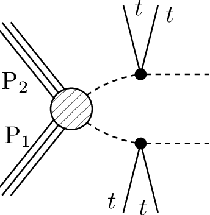

# SMS dictionary
This page intends to collect information about how we map the SModelS description of
events onto the Tx nomenclature. The list has been created from the database version 2.1.0-ww, considering also superseded results.

There is also a [ListOfAnalyses210-ww](https://smodels.github.io/docs/ListOfAnalyses210-ww), a [ListOfAnalyses210-wwWithSuperseded](https://smodels.github.io/docs/ListOfAnalyses210-wwWithSuperseded), and [Validation210-ww](Validation210-ww).

| **#** | **Tx** | **Topology** | **Graph** | **Appears in** |
| ----- | ------ | ------------ | --------- | -------------- |
| 1 | **T1bbbb**  | `[[[b,b]],[[b,b]]]` `(MET,MET)` |  | [CMS-PAS-SUS-14-011](ListOfAnalyses210-wwWithSuperseded#CMS-PAS-SUS-14-011)|
| 2 | **T1btbt**  | `[[[t+,b]],[[t+,b]]]+` `[[[t-,b]],[[t-,b]]]` `(MET,MET)` |  | [ATLAS-CONF-2013-007](ListOfAnalyses210-ww#ATLAS-CONF-2013-007)|
| 3 | **T1tttt**  | `[[[t,t]],[[t,t]]]` `(MET,MET);` `[[[t+,t-]],[[t-,t+]]]` `(MET,MET)` |  | [CMS-SUS-16-050](ListOfAnalyses210-ww#CMS-SUS-16-050) [ATLAS-CONF-2013-007](ListOfAnalyses210-ww#ATLAS-CONF-2013-007) [ATLAS-SUSY-2013-09](ListOfAnalyses210-ww#ATLAS-SUSY-2013-09) [CMS-PAS-SUS-14-011](ListOfAnalyses210-wwWithSuperseded#CMS-PAS-SUS-14-011)|
| 4 | **T1ttttoff**  | `[[[b,W,b,W]],[[b,W,b,W]]]` `(MET,MET)` |  | [CMS-SUS-16-050](ListOfAnalyses210-ww#CMS-SUS-16-050) [CMS-PAS-SUS-14-011](ListOfAnalyses210-wwWithSuperseded#CMS-PAS-SUS-14-011)|
| 5 | **T2bbWWoff**  | `[[[b,l,nu]],[[b,jet,jet]]]` `(MET,MET)` |  | [CMS-PAS-SUS-16-052](ListOfAnalyses210-ww#CMS-PAS-SUS-16-052)|
| 6 | **T2bbffff**  | `[[[b,jet,jet]],[[b,jet,jet]]]` `(MET,MET)` |  | [ATLAS-SUSY-2018-12](ListOfAnalyses210-ww#ATLAS-SUSY-2018-12)|
| 7 | **T2tt**  | `[[[t]],[[t]]]` `(MET,MET)` |  | [ATLAS-SUSY-2018-12](ListOfAnalyses210-ww#ATLAS-SUSY-2018-12) [CMS-SUS-16-050](ListOfAnalyses210-ww#CMS-SUS-16-050) [CMS-PAS-SUS-14-011](ListOfAnalyses210-wwWithSuperseded#CMS-PAS-SUS-14-011)|
| 8 | **T2ttoff**  | `[[[b,W]],[[b,W]]]` `(MET,MET)` |  | [ATLAS-SUSY-2018-12](ListOfAnalyses210-ww#ATLAS-SUSY-2018-12) [CMS-SUS-16-050](ListOfAnalyses210-ww#CMS-SUS-16-050) [CMS-PAS-SUS-14-011](ListOfAnalyses210-wwWithSuperseded#CMS-PAS-SUS-14-011)|
| 9 | **T5WW**  | `[[[jet,jet],[W]],[[jet,jet],[W]]]` `(MET,MET)` |  | [ATLAS-SUSY-2018-10](ListOfAnalyses210-ww#ATLAS-SUSY-2018-10)|
| 10 | **T5tctc**  | `[[[t],[jet]],[[t],[jet]]]` `(MET,MET)` |  | [CMS-SUS-16-050](ListOfAnalyses210-ww#CMS-SUS-16-050)|
| 11 | **T5tttt**  | `[[[t+],[t-]],[[t-],[t+]]]+` `[[[t-],[t+]],[[t-],[t+]]]+` `[[[t+],[t-]],[[t+],[t-]]]` `(MET,MET)` |  | [ATLAS-CONF-2013-007](ListOfAnalyses210-ww#ATLAS-CONF-2013-007)|
| 12 | **T6WW**  | `[[[jet],[W]],[[jet],[W]]]` `(MET,MET)` |  | [ATLAS-SUSY-2018-10](ListOfAnalyses210-ww#ATLAS-SUSY-2018-10)|
| 13 | **T6bbWWoff**  | `[[[b],[l,nu]],[[b],[jet,jet]]]` `(MET,MET)` |  | [CMS-PAS-SUS-16-052](ListOfAnalyses210-ww#CMS-PAS-SUS-16-052)|
| 14 | **T6ttWW**  | `[[[t+],[W-]],[[t-],[W+]]]` `(MET,MET)` |  | [ATLAS-CONF-2013-007](ListOfAnalyses210-ww#ATLAS-CONF-2013-007) [ATLAS-SUSY-2013-09](ListOfAnalyses210-ww#ATLAS-SUSY-2013-09)|
| 15 | **T6ttWWoff**  | `[[[t+],[l-,nu]],[[t-],[jet,jet]]]+` `[[[t-],[l+,nu]],[[t+],[jet,jet]]]` `(MET,MET)` |  | [ATLAS-CONF-2013-007](ListOfAnalyses210-ww#ATLAS-CONF-2013-007) [ATLAS-SUSY-2013-09](ListOfAnalyses210-ww#ATLAS-SUSY-2013-09)|
| 16 | **TChiHH**  | `[[[h]],[[h]]]` `(MET,MET)` |  | [ATLAS-SUSY-2018-23](ListOfAnalyses210-ww#ATLAS-SUSY-2018-23)|
| 17 | **TChiWH**  | `[[[W]],[[h]]]` `(MET,MET)` |  | [ATLAS-SUSY-2018-23](ListOfAnalyses210-ww#ATLAS-SUSY-2018-23)|

This page was created Sun Apr 11 16:41:14 2021
