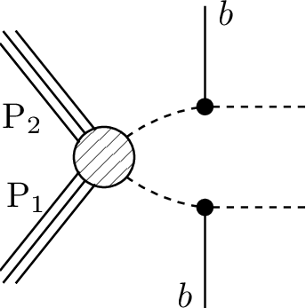

# SMS dictionary
This page intends to collect information about how we map the SModelS description of
events onto the Tx nomenclature. The list has been created from the database version 2.1.0adl, considering also superseded results.

There is also a [ListOfAnalyses210adl](https://smodels.github.io/docs/ListOfAnalyses210adl), a [ListOfAnalyses210adlWithSuperseded](https://smodels.github.io/docs/ListOfAnalyses210adlWithSuperseded), and [Validation210adl](Validation210adl).

| **#** | **Tx** | **Topology** | **Graph** | **Appears in** |
| ----- | ------ | ------------ | --------- | -------------- |
| 1 | **T1**  | `[[[jet,jet]],[[jet,jet]]]` `(MET,MET)` |  | [CMS-SUS-19-005-adl](http://cms-results.web.cern.ch/cms-results/public-results/publications/SUS-19-005/index.html)|
| 2 | **T1bbbb**  | `[[[b,b]],[[b,b]]]` `(MET,MET)` |  | [CMS-SUS-19-005-adl](http://cms-results.web.cern.ch/cms-results/public-results/publications/SUS-19-005/index.html)|
| 3 | **T1tttt**  | `[[[t,t]],[[t,t]]]` `(MET,MET)` |  | [CMS-SUS-16-050](http://cms-results.web.cern.ch/cms-results/public-results/publications/SUS-16-050/index.html) [CMS-SUS-16-050-eff](http://cms-results.web.cern.ch/cms-results/public-results/publications/SUS-16-050/index.html) [CMS-SUS-19-005-adl](http://cms-results.web.cern.ch/cms-results/public-results/publications/SUS-19-005/index.html)|
| 4 | **T1ttttoff**  | `[[[b,W,b,W]],[[b,W,b,W]]]` `(MET,MET)` |  | [CMS-SUS-16-050](http://cms-results.web.cern.ch/cms-results/public-results/publications/SUS-16-050/index.html) [CMS-SUS-16-050-eff](http://cms-results.web.cern.ch/cms-results/public-results/publications/SUS-16-050/index.html) [CMS-SUS-19-005-adl](http://cms-results.web.cern.ch/cms-results/public-results/publications/SUS-19-005/index.html)|
| 5 | **T2**  | `[[[jet]],[[jet]]]` `(MET,MET)` |  | [CMS-SUS-19-005-adl](http://cms-results.web.cern.ch/cms-results/public-results/publications/SUS-19-005/index.html)|
| 6 | **T2bb**  | `[[[b]],[[b]]]` `(MET,MET)` |  | [CMS-SUS-19-005-adl](http://cms-results.web.cern.ch/cms-results/public-results/publications/SUS-19-005/index.html)|
| 7 | **T2bbffff**  | `[[[b,l+,nu]],[[b,l-,nu]]]` `(MET,MET)` |  | [CMS-SUS-18-004](http://cms-results.web.cern.ch/cms-results/public-results/publications/SUS-18-004/index.html)|
| 8 | **T2tt**  | `[[[t]],[[t]]]` `(MET,MET)` |  | [CMS-SUS-16-050](http://cms-results.web.cern.ch/cms-results/public-results/publications/SUS-16-050/index.html) [CMS-SUS-16-050-eff](http://cms-results.web.cern.ch/cms-results/public-results/publications/SUS-16-050/index.html) [CMS-SUS-19-005-adl](http://cms-results.web.cern.ch/cms-results/public-results/publications/SUS-19-005/index.html)|
| 9 | **T2ttoff**  | `[[[b,W]],[[b,W]]]` `(MET,MET);` `[[[b,W+]],[[b,W-]]]` `(MET,MET)` |  | [CMS-SUS-16-050](http://cms-results.web.cern.ch/cms-results/public-results/publications/SUS-16-050/index.html) [CMS-SUS-16-050-eff](http://cms-results.web.cern.ch/cms-results/public-results/publications/SUS-16-050/index.html) [CMS-SUS-19-005-adl](http://cms-results.web.cern.ch/cms-results/public-results/publications/SUS-19-005/index.html)|
| 10 | **T5tctc**  | `[[[t],[jet]],[[t],[jet]]]` `(MET,MET)` |  | [CMS-SUS-16-050](http://cms-results.web.cern.ch/cms-results/public-results/publications/SUS-16-050/index.html) [CMS-SUS-16-050-eff](http://cms-results.web.cern.ch/cms-results/public-results/publications/SUS-16-050/index.html)|
| 11 | **T6bbWWoff**  | `[[[b],[l+,nu]],[[b],[l-,nu]]]` `(MET,MET)` |  | [CMS-SUS-18-004](http://cms-results.web.cern.ch/cms-results/public-results/publications/SUS-18-004/index.html)|
| 12 | **TChiWZoff**  | `[[[mu+,mu-]],[[L,nu]]]+` `[[[e+,e-]],[[L,nu]]]+` `[[[mu+,mu-]],[[jet,jet]]]+` `[[[e+,e-]],[[jet,jet]]]` `(MET,MET)` |  | [CMS-SUS-16-048](http://cms-results.web.cern.ch/cms-results/public-results/publications/SUS-16-048/index.html) [CMS-SUS-18-004](http://cms-results.web.cern.ch/cms-results/public-results/publications/SUS-18-004/index.html)|
| 13 | **THigWZ**  | `[[[W]],[[Z]]]` `(MET,MET)` |  | [CMS-SUS-16-039-scalar](http://cms-results.web.cern.ch/cms-results/public-results/publications/SUS-16-039/index.html)|
| 14 | **THigWZoff**  | `[[[mu+,mu-]],[[l,nu]]]+` `[[[e+,e-]],[[l,nu]]]` `(MET,MET)` |  | [CMS-SUS-16-039-scalar](http://cms-results.web.cern.ch/cms-results/public-results/publications/SUS-16-039/index.html)|
| 15 | **THigZZ**  | `[[[Z]],[[Z]]]` `(MET,MET)` |  | [CMS-SUS-16-039-scalar](http://cms-results.web.cern.ch/cms-results/public-results/publications/SUS-16-039/index.html)|
| 16 | **THigZZoff**  | `[[[l+,l-]],[[l+,l-]]]` `(MET,MET)` |  | [CMS-SUS-16-039-scalar](http://cms-results.web.cern.ch/cms-results/public-results/publications/SUS-16-039/index.html)|

This page was created Thu Feb 24 11:43:18 2022
