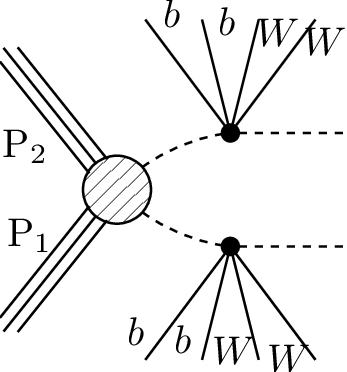
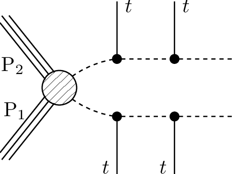
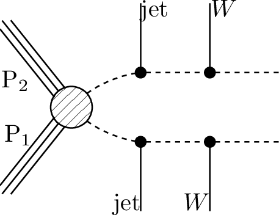
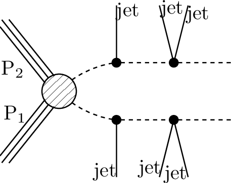

# SMS dictionary
This page intends to collect information about how we map the SModelS description of
events onto the Tx nomenclature. The list has been created from the database version 2.1.0offshellfix, considering also superseded results.

There is also a [ListOfAnalyses210offshellfix](https://smodels.github.io/docs/ListOfAnalyses210offshellfix), a [ListOfAnalyses210offshellfixWithSuperseded](https://smodels.github.io/docs/ListOfAnalyses210offshellfixWithSuperseded), and [Validation210offshellfix](Validation210offshellfix).

| **#** | **Tx** | **Topology** | **Graph** | **Appears in** |
| ----- | ------ | ------------ | --------- | -------------- |
| 1 | **T1**  | `[[[jet,jet]],[[jet,jet]]]` `(MET,MET)` |  | [ATLAS-SUSY-2016-07](ListOfAnalyses210offshellfix#ATLAS-SUSY-2016-07) [CMS-SUS-13-012](ListOfAnalyses210offshellfix#CMS-SUS-13-012)|
| 2 | **T1bbbb**  | `[[[b,b]],[[b,b]]]` `(MET,MET)` |  | [ATLAS-SUSY-2013-04](ListOfAnalyses210offshellfix#ATLAS-SUSY-2013-04) [CMS-SUS-13-012](ListOfAnalyses210offshellfix#CMS-SUS-13-012)|
| 3 | **T1btbt**  | `[[[b,t]],[[b,t]]]` `(MET,MET)` |  | [ATLAS-SUSY-2013-04](ListOfAnalyses210offshellfix#ATLAS-SUSY-2013-04) [CMS-SUS-13-012](ListOfAnalyses210offshellfix#CMS-SUS-13-012)|
| 4 | **T1tttt**  | `[[[t+,t-]],[[t-,t+]]]` `(MET,MET);` `[[[t,t]],[[t,t]]]` `(MET,MET)` |  | [ATLAS-SUSY-2013-04](ListOfAnalyses210offshellfix#ATLAS-SUSY-2013-04) [ATLAS-SUSY-2013-09](ListOfAnalyses210offshellfix#ATLAS-SUSY-2013-09) [CMS-SUS-13-012](ListOfAnalyses210offshellfix#CMS-SUS-13-012)|
| 5 | **T1ttttoff**  | `[[[b,W,b,W]],[[b,W,b,W]]]` `(MET,MET)` |  | [CMS-SUS-13-012](ListOfAnalyses210offshellfix#CMS-SUS-13-012)|
| 6 | **T2**  | `[[[jet]],[[jet]]]` `(MET,MET)` |  | [ATLAS-SUSY-2016-07](ListOfAnalyses210offshellfix#ATLAS-SUSY-2016-07) [CMS-SUS-13-012](ListOfAnalyses210offshellfix#CMS-SUS-13-012)|
| 7 | **T2bb**  | `[[[b]],[[b]]]` `(MET,MET)` |  | [ATLAS-SUSY-2013-21](ListOfAnalyses210offshellfix#ATLAS-SUSY-2013-21) [CMS-SUS-13-012](ListOfAnalyses210offshellfix#CMS-SUS-13-012)|
| 8 | **T2bbWW**  | `[[[b,W]],[[b,W]]]` `(MET,MET)` |  | [ATLAS-SUSY-2013-21](ListOfAnalyses210offshellfix#ATLAS-SUSY-2013-21) [CMS-SUS-14-021](ListOfAnalyses210offshellfix#CMS-SUS-14-021)|
| 9 | **T2bbWWoff**  | `[[[b,mu,nu]],[[b,jet,jet]]]` `(MET,MET);` `[[[b,L,nu]],[[b,L,nu]]]+` `[[[b,jet,jet]],[[b,jet,jet]]]+` `[[[b,jet,jet]],[[b,L,nu]]]` `(MET,MET)` |  | [ATLAS-SUSY-2013-21](ListOfAnalyses210offshellfix#ATLAS-SUSY-2013-21) [CMS-SUS-14-021](ListOfAnalyses210offshellfix#CMS-SUS-14-021)|
| 10 | **T2bbffff**  | `[[[b,jet,jet]],[[b,jet,jet]]]` `(MET,MET)` |  | [ATLAS-SUSY-2018-12](ListOfAnalyses210offshellfix#ATLAS-SUSY-2018-12)|
| 11 | **T2bt**  | `[[[b]],[[t]]]` `(MET,MET)` |  | [CMS-SUS-13-012](ListOfAnalyses210offshellfix#CMS-SUS-13-012)|
| 12 | **T2cc**  | `[[[c]],[[c]]]` `(MET,MET)` |  | [ATLAS-SUSY-2013-21](ListOfAnalyses210offshellfix#ATLAS-SUSY-2013-21)|
| 13 | **T2tt**  | `[[[t]],[[t]]]` `(MET,MET)` |  | [ATLAS-SUSY-2018-12](ListOfAnalyses210offshellfix#ATLAS-SUSY-2018-12) [ATLAS-SUSY-2013-04](ListOfAnalyses210offshellfix#ATLAS-SUSY-2013-04) [ATLAS-SUSY-2013-16](ListOfAnalyses210offshellfix#ATLAS-SUSY-2013-16) [CMS-SUS-13-012](ListOfAnalyses210offshellfix#CMS-SUS-13-012)|
| 14 | **T2ttoff**  | `[[[W,b]],[[W,b]]]` `(MET,MET);` `[[[b,W]],[[b,W]]]` `(MET,MET)` |  | [ATLAS-SUSY-2018-12](ListOfAnalyses210offshellfix#ATLAS-SUSY-2018-12) [ATLAS-SUSY-2013-04](ListOfAnalyses210offshellfix#ATLAS-SUSY-2013-04) [CMS-SUS-13-012](ListOfAnalyses210offshellfix#CMS-SUS-13-012)|
| 15 | **T3GQ**  | `[[[jet]],[[jet],[jet]]]` `(MET,MET)` |  | [ATLAS-SUSY-2016-07](ListOfAnalyses210offshellfix#ATLAS-SUSY-2016-07) [CMS-SUS-13-012](ListOfAnalyses210offshellfix#CMS-SUS-13-012)|
| 16 | **T5**  | `[[[jet],[jet]],[[jet],[jet]]]` `(MET,MET)` |  | [ATLAS-SUSY-2013-04](ListOfAnalyses210offshellfix#ATLAS-SUSY-2013-04) [CMS-SUS-13-012](ListOfAnalyses210offshellfix#CMS-SUS-13-012)|
| 17 | **T5GQ**  | `[[[jet],[jet,jet]],[[jet,jet]]]` `(MET,MET)` |  | [ATLAS-SUSY-2016-07](ListOfAnalyses210offshellfix#ATLAS-SUSY-2016-07)|
| 18 | **T5WW**  | `[[[jet,jet],[W]],[[jet,jet],[W]]]` `(MET,MET)` |  | [ATLAS-SUSY-2016-07](ListOfAnalyses210offshellfix#ATLAS-SUSY-2016-07) [ATLAS-SUSY-2018-10](ListOfAnalyses210offshellfix#ATLAS-SUSY-2018-10) [ATLAS-SUSY-2013-04](ListOfAnalyses210offshellfix#ATLAS-SUSY-2013-04) [ATLAS-SUSY-2013-09](ListOfAnalyses210offshellfix#ATLAS-SUSY-2013-09) [CMS-SUS-13-012](ListOfAnalyses210offshellfix#CMS-SUS-13-012)|
| 19 | **T5WWoff**  | `[[[jet,jet],[jet,jet]],[[jet,jet],[jet,jet]]]` `(MET,MET);` `[[[jet,jet],[l,nu]],[[jet,jet],[jet,jet]]]` `(MET,MET)` |  | [ATLAS-SUSY-2016-07](ListOfAnalyses210offshellfix#ATLAS-SUSY-2016-07) [ATLAS-SUSY-2018-10](ListOfAnalyses210offshellfix#ATLAS-SUSY-2018-10) [ATLAS-SUSY-2013-04](ListOfAnalyses210offshellfix#ATLAS-SUSY-2013-04) [CMS-SUS-13-012](ListOfAnalyses210offshellfix#CMS-SUS-13-012)|
| 20 | **T5ZZ**  | `[[[jet,jet],[Z]],[[jet,jet],[Z]]]` `(MET,MET)` |  | [ATLAS-SUSY-2016-07](ListOfAnalyses210offshellfix#ATLAS-SUSY-2016-07) [ATLAS-SUSY-2013-04](ListOfAnalyses210offshellfix#ATLAS-SUSY-2013-04) [CMS-SUS-13-012](ListOfAnalyses210offshellfix#CMS-SUS-13-012)|
| 21 | **T5bbbb**  | `[[[b],[b]],[[b],[b]]]` `(MET,MET)` |  | [CMS-SUS-13-012](ListOfAnalyses210offshellfix#CMS-SUS-13-012)|
| 22 | **T5tctc**  | `[[[t],[c]],[[t],[c]]]` `(MET,MET)` |  | [ATLAS-SUSY-2013-09](ListOfAnalyses210offshellfix#ATLAS-SUSY-2013-09)|
| 23 | **T5tttt**  | `[[[t],[t]],[[t],[t]]]` `(MET,MET)` |  | [CMS-SUS-13-012](ListOfAnalyses210offshellfix#CMS-SUS-13-012)|
| 24 | **T6WW**  | `[[[jet],[W]],[[jet],[W]]]` `(MET,MET)` |  | [ATLAS-SUSY-2016-07](ListOfAnalyses210offshellfix#ATLAS-SUSY-2016-07) [ATLAS-SUSY-2018-10](ListOfAnalyses210offshellfix#ATLAS-SUSY-2018-10) [CMS-SUS-13-012](ListOfAnalyses210offshellfix#CMS-SUS-13-012)|
| 25 | **T6WWoff**  | `[[[jet],[jet,jet]],[[jet],[jet,jet]]]` `(MET,MET);` `[[[jet],[l,nu]],[[jet],[jet,jet]]]` `(MET,MET)` |  | [ATLAS-SUSY-2016-07](ListOfAnalyses210offshellfix#ATLAS-SUSY-2016-07) [ATLAS-SUSY-2018-10](ListOfAnalyses210offshellfix#ATLAS-SUSY-2018-10)|
| 26 | **T6bbWW**  | `[[[b],[W]],[[b],[W]]]` `(MET,MET)` |  | [ATLAS-SUSY-2013-04](ListOfAnalyses210offshellfix#ATLAS-SUSY-2013-04) [CMS-SUS-13-012](ListOfAnalyses210offshellfix#CMS-SUS-13-012)|
| 27 | **T6bbWWoff**  | `[[[b],[jet,jet]],[[b],[jet,jet]]]` `(MET,MET)` |  | [CMS-SUS-13-012](ListOfAnalyses210offshellfix#CMS-SUS-13-012)|
| 28 | **T6ttWWoff**  | `[[[t+],[l-,nu]],[[t-],[jet,jet]]]+` `[[[t-],[l+,nu]],[[t+],[jet,jet]]]` `(MET,MET)` |  | [ATLAS-SUSY-2013-09](ListOfAnalyses210offshellfix#ATLAS-SUSY-2013-09)|
| 29 | **TChiWW**  | `[[[W+]],[[W-]]]` `(MET,MET);` `[[[W]],[[W]]]` `(MET,MET)` |  | [ATLAS-SUSY-2013-11](ListOfAnalyses210offshellfix#ATLAS-SUSY-2013-11) [CMS-SUS-13-012](ListOfAnalyses210offshellfix#CMS-SUS-13-012)|
| 30 | **TChiWWoff**  | `[[[l+,nu]],[[l-,nu]]]` `(MET,MET)` |  | [ATLAS-SUSY-2013-11](ListOfAnalyses210offshellfix#ATLAS-SUSY-2013-11)|
| 31 | **TChiWZ**  | `[[[W]],[[Z]]]` `(MET,MET)` |  | [ATLAS-SUSY-2018-06](ListOfAnalyses210offshellfix#ATLAS-SUSY-2018-06) [CMS-SUS-13-012](ListOfAnalyses210offshellfix#CMS-SUS-13-012)|
| 32 | **TChiWZoff**  | `[[[mu+,mu-]],[[l,nu]]]+` `[[[e+,e-]],[[l,nu]]]` `(MET,MET)` |  | [ATLAS-SUSY-2018-06](ListOfAnalyses210offshellfix#ATLAS-SUSY-2018-06)|
| 33 | **TChiZZ**  | `[[[Z]],[[Z]]]` `(MET,MET)` |  | [CMS-SUS-13-012](ListOfAnalyses210offshellfix#CMS-SUS-13-012)|
| 34 | **TChipChim- SlepSnu**  | `[[[L-],[nu]],[[nu],[L+]]]+` `[[[L+],[nu]],[[nu],[L-]]]+` `[[[L+],[nu]],[[L-],[nu]]]+` `[[[nu],[L+]],[[nu],[L-]]]` `(MET,MET)` |  | [ATLAS-SUSY-2013-11](ListOfAnalyses210offshellfix#ATLAS-SUSY-2013-11)|
| 35 | **TGQ**  | `[[[jet]],[[jet,jet]]]` `(MET,MET)` |  | [ATLAS-SUSY-2016-07](ListOfAnalyses210offshellfix#ATLAS-SUSY-2016-07)|
| 36 | **TSlepSlep**  | `[[[e+]],[[e-]]]+` `[[[mu+]],[[mu-]]]` `(MET,MET)` |  | [ATLAS-SUSY-2013-11](ListOfAnalyses210offshellfix#ATLAS-SUSY-2013-11)|

This page was created Mon Sep  6 12:38:18 2021
