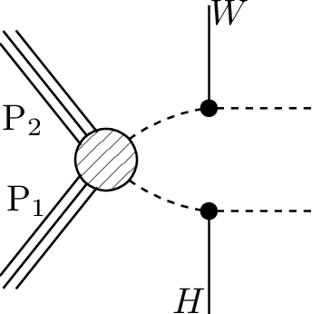
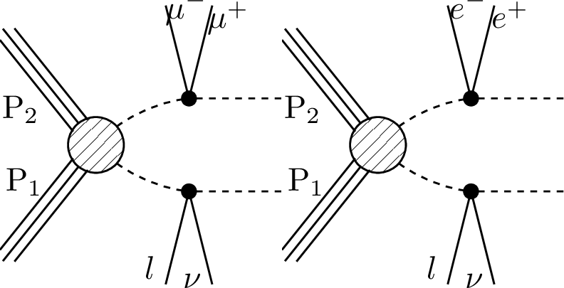

# SMS dictionary
This page intends to collect information about how we map the SModelS description of
events onto the Tx nomenclature. The list has been created from the database version 2.1.1charan, considering also superseded results.

There is also a [ListOfAnalyses211charan](https://smodels.github.io/docs/ListOfAnalyses211charan), a [ListOfAnalyses211charanWithSuperseded](https://smodels.github.io/docs/ListOfAnalyses211charanWithSuperseded), and [Validation211charan](Validation211charan).

| **#** | **Tx** | **Topology** | **Graph** | **Appears in** |
| ----- | ------ | ------------ | --------- | -------------- |
| 1 | **T2bbffff**  | `[[[b,l,nu]],[[b,q,q]]]+` `[[[b,l,nu]],[[b,L,nu]]]` `(MET,MET)` |  | [CMS-SUS-17-005](ListOfAnalyses211charan#CMS-SUS-17-005)|
| 2 | **T2tt**  | `[[[t]],[[t]]]` `(MET,MET)` |  | [CMS-SUS-19-011](ListOfAnalyses211charan#CMS-SUS-19-011)|
| 3 | **T2ttoff**  | `[[[b,W]],[[b,W]]]` `(MET,MET)` |  | [CMS-SUS-19-011](ListOfAnalyses211charan#CMS-SUS-19-011)|
| 4 | **T5HH**  | `[[[jet,jet],[h]],[[jet,jet],[h]]]` `(MET,MET)` |  | [CMS-SUS-17-006](ListOfAnalyses211charan#CMS-SUS-17-006)|
| 5 | **T5HZ**  | `[[[jet,jet],[h]],[[jet,jet],[Z]]]` `(MET,MET)` |  | [CMS-SUS-17-006](ListOfAnalyses211charan#CMS-SUS-17-006)|
| 6 | **T5Hg**  | `[[[jet,jet],[h]],[[jet,jet],[y]]]+` `[[[jet,jet],[y]],[[jet,jet],[y]]]+` `[[[jet,jet],[h]],[[jet,jet],[h]]]` `(MET,MET)` |  | [CMS-SUS-18-002](ListOfAnalyses211charan#CMS-SUS-18-002)|
| 7 | **T5ZZ**  | `[[[jet,jet],[Z]],[[jet,jet],[Z]]]` `(MET,MET)` |  | [CMS-SUS-19-013](ListOfAnalyses211charan#CMS-SUS-19-013) [CMS-SUS-20-001](ListOfAnalyses211charan#CMS-SUS-20-001)|
| 8 | **T5bbbbZg**  | `[[[b,b],[Z]],[[b,b],[y]]]+` `[[[b,b],[y]],[[b,b],[y]]]+` `[[[b,b],[Z]],[[b,b],[Z]]]` `(MET,MET)` |  | [CMS-SUS-18-002](ListOfAnalyses211charan#CMS-SUS-18-002)|
| 9 | **T5ttttZg**  | `[[[t,t],[Z]],[[t,t],[y]]]+` `[[[t,t],[y]],[[t,t],[y]]]+` `[[[t,t],[Z]],[[t,t],[Z]]]` `(MET,MET)` |  | [CMS-SUS-18-002](ListOfAnalyses211charan#CMS-SUS-18-002)|
| 10 | **T6bbWW**  | `[[[b],[W]],[[b],[W]]]` `(MET,MET)` |  | [CMS-SUS-19-011](ListOfAnalyses211charan#CMS-SUS-19-011)|
| 11 | **T6bbWWoff**  | `[[[b],[l,nu]],[[b],[q,q]]]+` `[[[b],[l,nu]],[[b],[L,nu]]]` `(MET,MET)` |  | [CMS-SUS-17-005](ListOfAnalyses211charan#CMS-SUS-17-005)|
| 12 | **T6ttZg**  | `[[[t],[Z]],[[t],[y]]]+` `[[[t],[y]],[[t],[y]]]+` `[[[t],[Z]],[[t],[Z]]]` `(MET,MET)` |  | [CMS-SUS-18-002](ListOfAnalyses211charan#CMS-SUS-18-002)|
| 13 | **TChiChipm- StauStau**  | `[[[ta+],[ta-]],[[nu],[ta]]]+` `[[[ta-],[ta+]],[[nu],[ta]]]` `(MET,MET)` |  | [CMS-SUS-17-003](ListOfAnalyses211charan#CMS-SUS-17-003)|
| 14 | **TChiWH**  | `[[[W]],[[h]]]` `(MET,MET)` |  | [CMS-SUS-17-004](ListOfAnalyses211charan#CMS-SUS-17-004)|
| 15 | **TChiWZ**  | `[[[W]],[[Z]]]` `(MET,MET)` |  | [CMS-SUS-17-004](ListOfAnalyses211charan#CMS-SUS-17-004) [CMS-SUS-20-001](ListOfAnalyses211charan#CMS-SUS-20-001)|
| 16 | **TChiWZoff**  | `[[[mu+,mu-]],[[l,nu]]]+` `[[[e+,e-]],[[l,nu]]]` `(MET,MET)` |  | [CMS-SUS-17-004](ListOfAnalyses211charan#CMS-SUS-17-004)|
| 17 | **TChiZZ**  | `[[[Z]],[[Z]]]` `(MET,MET)` |  | [CMS-SUS-20-001](ListOfAnalyses211charan#CMS-SUS-20-001)|
| 18 | **TSlepSlep**  | `[[[e+]],[[e-]]]+` `[[[mu+]],[[mu-]]]` `(MET,MET)` |  | [CMS-SUS-20-001](ListOfAnalyses211charan#CMS-SUS-20-001)|

This page was created Thu Sep  2 14:23:01 2021
