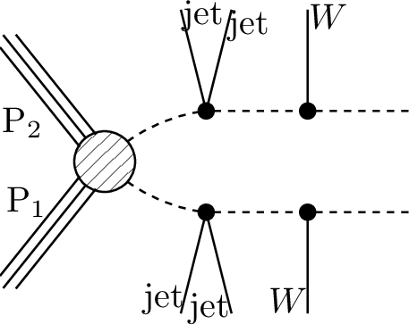
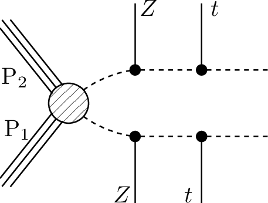

# SMS dictionary
This page intends to collect information about how we map the SModelS description of
events onto the Tx nomenclature. The list has been created from the database version 2.1.2charan, considering also superseded results.

There is also a [ListOfAnalyses212charan](https://smodels.github.io/docs/ListOfAnalyses212charan), a [ListOfAnalyses212charanWithSuperseded](https://smodels.github.io/docs/ListOfAnalyses212charanWithSuperseded), and [Validation212charan](Validation212charan).

| **#** | **Tx** | **Topology** | **Graph** | **Appears in** |
| ----- | ------ | ------------ | --------- | -------------- |
| 1 | **T1tttt**  | `[[[t,t]],[[t,t]]]` `(MET,MET)` |  | [CMS-SUS-19-008](http://cms-results.web.cern.ch/cms-results/public-results/publications/SUS-19-008/index.html)|
| 2 | **T1ttttoff**  | `[[[b,W,b,W]],[[b,W,b,W]]]` `(MET,MET)` |  | [CMS-SUS-19-008](http://cms-results.web.cern.ch/cms-results/public-results/publications/SUS-19-008/index.html)|
| 3 | **T2tt**  | `[[[t]],[[t]]]` `(MET,MET)` |  | [CMS-SUS-19-011](http://cms-results.web.cern.ch/cms-results/public-results/publications/SUS-19-011/index.html)|
| 4 | **T2ttoff**  | `[[[b,W]],[[b,W]]]` `(MET,MET)` |  | [CMS-SUS-19-011](http://cms-results.web.cern.ch/cms-results/public-results/publications/SUS-19-011/index.html)|
| 5 | **T5WW**  | `[[[jet,jet],[W+]],[[jet,jet],[W+]]]+` `[[[jet,jet],[W-]],[[jet,jet],[W-]]]` `(MET,MET)` |  | [CMS-SUS-19-008](http://cms-results.web.cern.ch/cms-results/public-results/publications/SUS-19-008/index.html)|
| 7 | **T5WZ**  | `[[[jet,jet],[W+]],[[jet,jet],[Z]]]+` `[[[jet,jet],[W-]],[[jet,jet],[Z]]]` `(MET,MET)` |  | [CMS-SUS-19-008](http://cms-results.web.cern.ch/cms-results/public-results/publications/SUS-19-008/index.html)|
| 8 | **T5WZoff**  **T5WWoff**  | `[[[jet,jet],[l+,nu]],[[jet,jet],[l+,nu]]]+` `[[[jet,jet],[l-,nu]],[[jet,jet],[l-,nu]]]` `(MET,MET)` |  | [CMS-SUS-19-008](http://cms-results.web.cern.ch/cms-results/public-results/publications/SUS-19-008/index.html)|
| 9 | **T5ZZ**  | `[[[jet,jet],[Z]],[[jet,jet],[Z]]]` `(MET,MET)` |  | [CMS-SUS-19-013](http://cms-results.web.cern.ch/cms-results/public-results/publications/SUS-19-013/index.html) [CMS-SUS-20-001](http://cms-results.web.cern.ch/cms-results/public-results/publications/SUS-20-001/index.html)|
| 10 | **T5tctc**  | `[[[t],[jet]],[[t],[jet]]]` `(MET,MET)` |  | [CMS-SUS-19-008](http://cms-results.web.cern.ch/cms-results/public-results/publications/SUS-19-008/index.html)|
| 11 | **T5ttbbWW**  | `[[[t,b],[jet,jet]],[[t,b],[jet,jet]]]` `(MET,MET)` |  | [CMS-SUS-19-008](http://cms-results.web.cern.ch/cms-results/public-results/publications/SUS-19-008/index.html)|
| 12 | **T5tttt**  | `[[[t],[t]],[[t],[t]]]` `(MET,MET)` |  | [CMS-SUS-19-008](http://cms-results.web.cern.ch/cms-results/public-results/publications/SUS-19-008/index.html)|
| 13 | **T6HHtt**  | `[[[h],[t]],[[h],[t]]]` `(MET,MET)` |  | [CMS-SUS-19-008](http://cms-results.web.cern.ch/cms-results/public-results/publications/SUS-19-008/index.html)|
| 14 | **T6WWtt**  | `[[[t],[W]],[[t],[W]]]` `(MET,MET)` |  | [CMS-SUS-19-008](http://cms-results.web.cern.ch/cms-results/public-results/publications/SUS-19-008/index.html)|
| 15 | **T6WWttoff**  | `[[[t],[jet,jet]],[[t],[jet,jet]]]` `(MET,MET)` |  | [CMS-SUS-19-008](http://cms-results.web.cern.ch/cms-results/public-results/publications/SUS-19-008/index.html)|
| 16 | **T6ZZtt**  | `[[[Z],[t]],[[Z],[t]]]` `(MET,MET)` |  | [CMS-SUS-19-008](http://cms-results.web.cern.ch/cms-results/public-results/publications/SUS-19-008/index.html)|
| 17 | **T6bbWW**  | `[[[b],[W]],[[b],[W]]]` `(MET,MET)` |  | [CMS-SUS-19-011](http://cms-results.web.cern.ch/cms-results/public-results/publications/SUS-19-011/index.html)|
| 18 | **T6ttoffWW**  | `[[[b,W],[W]],[[b,W],[W]]]` `(MET,MET)` |  | [CMS-SUS-19-008](http://cms-results.web.cern.ch/cms-results/public-results/publications/SUS-19-008/index.html)|
| 19 | **TChiWZ**  | `[[[W]],[[Z]]]` `(MET,MET)` |  | [CMS-SUS-20-001](http://cms-results.web.cern.ch/cms-results/public-results/publications/SUS-20-001/index.html)|
| 20 | **TChiZZ**  | `[[[Z]],[[Z]]]` `(MET,MET)` |  | [CMS-SUS-20-001](http://cms-results.web.cern.ch/cms-results/public-results/publications/SUS-20-001/index.html)|
| 21 | **TSlepSlep**  | `[[[e+]],[[e-]]]+` `[[[mu+]],[[mu-]]]` `(MET,MET)` |  | [CMS-SUS-20-001](http://cms-results.web.cern.ch/cms-results/public-results/publications/SUS-20-001/index.html)|

This page was created Sun Dec  5 19:37:50 2021
