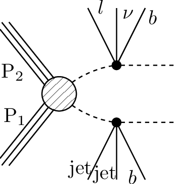
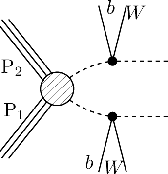

# SMS dictionary
This page intends to collect information about how we map the SModelS description of
events onto the Tx nomenclature. The list has been created from the database version 2.2.0-ww, considering also superseded results.

There is also a [ListOfAnalyses220-ww](https://smodels.github.io/docs/ListOfAnalyses220-ww), a [ListOfAnalyses220-wwWithSuperseded](https://smodels.github.io/docs/ListOfAnalyses220-wwWithSuperseded), and [Validation220-ww](Validation220-ww).

| **#** | **Tx** | **Topology** | **Graph** | **Appears in** |
| ----- | ------ | ------------ | --------- | -------------- |
| 1 | **T1tttt**  | `[[[t,t]],[[t,t]]]` `(MET,MET)` |  | [CMS-SUS-16-050](http://cms-results.web.cern.ch/cms-results/public-results/publications/SUS-16-050/index.html)|
| 2 | **T1ttttoff**  | `[[[b,W,b,W]],[[b,W,b,W]]]` `(MET,MET)` |  | [CMS-SUS-16-050](http://cms-results.web.cern.ch/cms-results/public-results/publications/SUS-16-050/index.html)|
| 3 | **T2bbWWoff**  | `[[[b,l,nu]],[[b,jet,jet]]]` `(MET,MET)` |  | [CMS-PAS-SUS-16-052](http://cms-results.web.cern.ch/cms-results/public-results/preliminary-results/SUS-16-052/index.html)|
| 4 | **T2bbffff**  | `[[[b,l+,nu]],[[b,l-,nu]]]` `(MET,MET)` |  | [ATLAS-SUSY-2018-08](https://atlas.web.cern.ch/Atlas/GROUPS/PHYSICS/PAPERS/SUSY-2018-08/)|
| 5 | **T2tt**  | `[[[t]],[[t]]]` `(MET,MET)` |  | [ATLAS-SUSY-2018-08](https://atlas.web.cern.ch/Atlas/GROUPS/PHYSICS/PAPERS/SUSY-2018-08/) [CMS-SUS-16-050](http://cms-results.web.cern.ch/cms-results/public-results/publications/SUS-16-050/index.html)|
| 6 | **T2ttoff**  | `[[[b,W]],[[b,W]]]` `(MET,MET)` |  | [ATLAS-SUSY-2018-08](https://atlas.web.cern.ch/Atlas/GROUPS/PHYSICS/PAPERS/SUSY-2018-08/) [CMS-SUS-16-050](http://cms-results.web.cern.ch/cms-results/public-results/publications/SUS-16-050/index.html)|
| 7 | **T5tctc**  | `[[[t],[jet]],[[t],[jet]]]` `(MET,MET)` |  | [CMS-SUS-16-050](http://cms-results.web.cern.ch/cms-results/public-results/publications/SUS-16-050/index.html)|
| 8 | **T6bbHH**  | `[[[b],[h]],[[b],[h]]]` `(MET,MET)` |  | [ATLAS-SUSY-2018-40](https://atlas.web.cern.ch/Atlas/GROUPS/PHYSICS/PAPERS/SUSY-2018-40/)|
| 9 | **T6bbWWoff**  | `[[[b],[l,nu]],[[b],[jet,jet]]]` `(MET,MET)` |  | [CMS-PAS-SUS-16-052](http://cms-results.web.cern.ch/cms-results/public-results/preliminary-results/SUS-16-052/index.html)|
| 10 | **TChiWH**  | `[[[W]],[[h]]]` `(MET,MET)` |  | [ATLAS-SUSY-2019-09](https://atlas.web.cern.ch/Atlas/GROUPS/PHYSICS/PAPERS/SUSY-2019-09/)|
| 11 | **TChiWZ**  | `[[[W]],[[Z]]]` `(MET,MET)` |  | [ATLAS-SUSY-2017-03](https://atlas.web.cern.ch/Atlas/GROUPS/PHYSICS/PAPERS/SUSY-2017-03/) [ATLAS-SUSY-2019-09](https://atlas.web.cern.ch/Atlas/GROUPS/PHYSICS/PAPERS/SUSY-2019-09/)|

This page was created Thu Dec  9 19:06:20 2021
