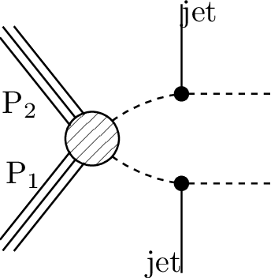
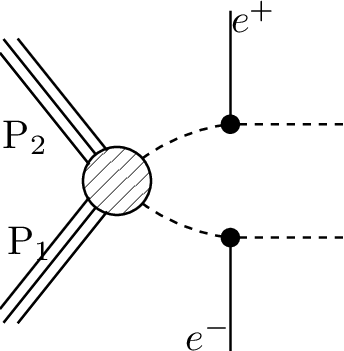
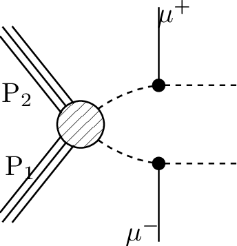

# SMS dictionary
This page intends to collect information about how we map the SModelS description of
events onto the Tx nomenclature. The list has been created from the database version 2.2.0, considering also superseded results.

There is also a [ListOfAnalyses220](https://smodels.github.io/docs/ListOfAnalyses220), a [ListOfAnalyses220WithSuperseded](https://smodels.github.io/docs/ListOfAnalyses220WithSuperseded), and [Validation220](Validation220).

| **#** | **Tx** | **Topology** | **Graph** | **Appears in** |
| ----- | ------ | ------------ | --------- | -------------- |
| 1 | **T1**  | `[[[jet,jet]],[[jet,jet]]]` `(MET,MET);` `[[[jet,jet]],[[jet,jet]]]` `(MET,MET)` |  | [many (25)](ListOfAnalyses220WithSuperseded)|
| 2 | **T1Disp**  | `[[[q,q]],[[q,q]]]` `(MET,MET)` |  | [ATLAS-SUSY-2016-08](https://atlas.web.cern.ch/Atlas/GROUPS/PHYSICS/PAPERS/SUSY-2016-08/)|
| 3 | **T1bbbb**  | `[[[b,b]],[[b,b]]]` `(MET,MET)` |  | [many (28)](ListOfAnalyses220WithSuperseded)|
| 4 | **T1bbbt**  | `[[[b,b]],[[b,t]]]` `(MET,MET)` |  | [ATLAS-CONF-2013-024](https://atlas.web.cern.ch/Atlas/GROUPS/PHYSICS/CONFNOTES/ATLAS-CONF-2013-024/) [ATLAS-CONF-2013-037](https://atlas.web.cern.ch/Atlas/GROUPS/PHYSICS/CONFNOTES/ATLAS-CONF-2013-037/) [ATLAS-CONF-2013-047](https://atlas.web.cern.ch/Atlas/GROUPS/PHYSICS/CONFNOTES/ATLAS-CONF-2013-047/) [ATLAS-CONF-2013-053](https://atlas.web.cern.ch/Atlas/GROUPS/PHYSICS/CONFNOTES/ATLAS-CONF-2013-053/) [ATLAS-CONF-2013-054](https://atlas.web.cern.ch/Atlas/GROUPS/PHYSICS/CONFNOTES/ATLAS-CONF-2013-054/) [ATLAS-CONF-2013-061](https://atlas.web.cern.ch/Atlas/GROUPS/PHYSICS/CONFNOTES/ATLAS-CONF-2013-061/) [ATLAS-CONF-2013-062](https://atlas.web.cern.ch/Atlas/GROUPS/PHYSICS/CONFNOTES/ATLAS-CONF-2013-062/) [ATLAS-CONF-2013-093](https://atlas.web.cern.ch/Atlas/GROUPS/PHYSICS/CONFNOTES/ATLAS-CONF-2013-093/)|
| 5 | **T1bbqq**  | `[[[b,b]],[[jet,jet]]]` `(MET,MET)` |  | [ATLAS-CONF-2013-024](https://atlas.web.cern.ch/Atlas/GROUPS/PHYSICS/CONFNOTES/ATLAS-CONF-2013-024/) [ATLAS-CONF-2013-047](https://atlas.web.cern.ch/Atlas/GROUPS/PHYSICS/CONFNOTES/ATLAS-CONF-2013-047/) [ATLAS-CONF-2013-053](https://atlas.web.cern.ch/Atlas/GROUPS/PHYSICS/CONFNOTES/ATLAS-CONF-2013-053/) [ATLAS-CONF-2013-054](https://atlas.web.cern.ch/Atlas/GROUPS/PHYSICS/CONFNOTES/ATLAS-CONF-2013-054/) [ATLAS-CONF-2013-061](https://atlas.web.cern.ch/Atlas/GROUPS/PHYSICS/CONFNOTES/ATLAS-CONF-2013-061/) [ATLAS-CONF-2013-062](https://atlas.web.cern.ch/Atlas/GROUPS/PHYSICS/CONFNOTES/ATLAS-CONF-2013-062/)|
| 6 | **T1bbtt**  | `[[[b,b]],[[t+,t-]]]` `(MET,MET)` |  | [ATLAS-CONF-2013-024](https://atlas.web.cern.ch/Atlas/GROUPS/PHYSICS/CONFNOTES/ATLAS-CONF-2013-024/) [ATLAS-CONF-2013-037](https://atlas.web.cern.ch/Atlas/GROUPS/PHYSICS/CONFNOTES/ATLAS-CONF-2013-037/) [ATLAS-CONF-2013-047](https://atlas.web.cern.ch/Atlas/GROUPS/PHYSICS/CONFNOTES/ATLAS-CONF-2013-047/) [ATLAS-CONF-2013-048](https://atlas.web.cern.ch/Atlas/GROUPS/PHYSICS/CONFNOTES/ATLAS-CONF-2013-048/) [ATLAS-CONF-2013-053](https://atlas.web.cern.ch/Atlas/GROUPS/PHYSICS/CONFNOTES/ATLAS-CONF-2013-053/) [ATLAS-CONF-2013-054](https://atlas.web.cern.ch/Atlas/GROUPS/PHYSICS/CONFNOTES/ATLAS-CONF-2013-054/) [ATLAS-CONF-2013-061](https://atlas.web.cern.ch/Atlas/GROUPS/PHYSICS/CONFNOTES/ATLAS-CONF-2013-061/) [ATLAS-CONF-2013-062](https://atlas.web.cern.ch/Atlas/GROUPS/PHYSICS/CONFNOTES/ATLAS-CONF-2013-062/)|
| 7 | **T1btbt**  | `[[[t+,b]],[[t+,b]]]+` `[[[t-,b]],[[t-,b]]]` `(MET,MET);` `[[[t,b]],[[t,b]]]` `(MET,MET);` `[[[b,t]],[[b,t]]]` `(MET,MET)` |  | [many (11)](ListOfAnalyses220WithSuperseded)|
| 8 | **T1btqq**  | `[[[b,t]],[[jet,jet]]]` `(MET,MET)` |  | [ATLAS-CONF-2013-024](https://atlas.web.cern.ch/Atlas/GROUPS/PHYSICS/CONFNOTES/ATLAS-CONF-2013-024/) [ATLAS-CONF-2013-037](https://atlas.web.cern.ch/Atlas/GROUPS/PHYSICS/CONFNOTES/ATLAS-CONF-2013-037/) [ATLAS-CONF-2013-047](https://atlas.web.cern.ch/Atlas/GROUPS/PHYSICS/CONFNOTES/ATLAS-CONF-2013-047/) [ATLAS-CONF-2013-053](https://atlas.web.cern.ch/Atlas/GROUPS/PHYSICS/CONFNOTES/ATLAS-CONF-2013-053/) [ATLAS-CONF-2013-054](https://atlas.web.cern.ch/Atlas/GROUPS/PHYSICS/CONFNOTES/ATLAS-CONF-2013-054/) [ATLAS-CONF-2013-061](https://atlas.web.cern.ch/Atlas/GROUPS/PHYSICS/CONFNOTES/ATLAS-CONF-2013-061/) [ATLAS-CONF-2013-062](https://atlas.web.cern.ch/Atlas/GROUPS/PHYSICS/CONFNOTES/ATLAS-CONF-2013-062/)|
| 9 | **T1bttt**  | `[[[b,t]],[[t+,t-]]]` `(MET,MET)` |  | [ATLAS-CONF-2013-024](https://atlas.web.cern.ch/Atlas/GROUPS/PHYSICS/CONFNOTES/ATLAS-CONF-2013-024/) [ATLAS-CONF-2013-037](https://atlas.web.cern.ch/Atlas/GROUPS/PHYSICS/CONFNOTES/ATLAS-CONF-2013-037/) [ATLAS-CONF-2013-047](https://atlas.web.cern.ch/Atlas/GROUPS/PHYSICS/CONFNOTES/ATLAS-CONF-2013-047/) [ATLAS-CONF-2013-048](https://atlas.web.cern.ch/Atlas/GROUPS/PHYSICS/CONFNOTES/ATLAS-CONF-2013-048/) [ATLAS-CONF-2013-054](https://atlas.web.cern.ch/Atlas/GROUPS/PHYSICS/CONFNOTES/ATLAS-CONF-2013-054/) [ATLAS-CONF-2013-061](https://atlas.web.cern.ch/Atlas/GROUPS/PHYSICS/CONFNOTES/ATLAS-CONF-2013-061/) [ATLAS-CONF-2013-062](https://atlas.web.cern.ch/Atlas/GROUPS/PHYSICS/CONFNOTES/ATLAS-CONF-2013-062/)|
| 10 | **T1qqtt**  | `[[[jet,jet]],[[t+,t-]]]` `(MET,MET)` |  | [ATLAS-CONF-2013-024](https://atlas.web.cern.ch/Atlas/GROUPS/PHYSICS/CONFNOTES/ATLAS-CONF-2013-024/) [ATLAS-CONF-2013-037](https://atlas.web.cern.ch/Atlas/GROUPS/PHYSICS/CONFNOTES/ATLAS-CONF-2013-037/) [ATLAS-CONF-2013-047](https://atlas.web.cern.ch/Atlas/GROUPS/PHYSICS/CONFNOTES/ATLAS-CONF-2013-047/) [ATLAS-CONF-2013-048](https://atlas.web.cern.ch/Atlas/GROUPS/PHYSICS/CONFNOTES/ATLAS-CONF-2013-048/) [ATLAS-CONF-2013-054](https://atlas.web.cern.ch/Atlas/GROUPS/PHYSICS/CONFNOTES/ATLAS-CONF-2013-054/) [ATLAS-CONF-2013-061](https://atlas.web.cern.ch/Atlas/GROUPS/PHYSICS/CONFNOTES/ATLAS-CONF-2013-061/) [ATLAS-CONF-2013-062](https://atlas.web.cern.ch/Atlas/GROUPS/PHYSICS/CONFNOTES/ATLAS-CONF-2013-062/)|
| 11 | **T1ttofftt**  | `[[[t,b,W]],[[t,b,W]]]` `(MET,MET)` |  | [ATLAS-SUSY-2016-14](http://atlas.web.cern.ch/Atlas/GROUPS/PHYSICS/PAPERS/SUSY-2016-14/)|
| 12 | **T1tttt**  | `[[[t,t]],[[t,t]]]` `(MET,MET);` `[[[t+,t-]],[[t+,t-]]]` `(MET,MET);` `[[[t+,t-]],[[t-,t+]]]` `(MET,MET)` |  | [many (57)](ListOfAnalyses220WithSuperseded)|
| 13 | **T1ttttoff**  | `[[[b,W,b,W]],[[b,W,b,W]]]` `(MET,MET);` `[[[b,b,W,W]],[[b,b,W,W]]]` `(MET,MET)` |  | [many (37)](ListOfAnalyses220WithSuperseded)|
| 14 | **T2**  **T2Disp**  | `[[[jet]],[[jet]]]` `(MET,MET)` |  | [many (22)](ListOfAnalyses220WithSuperseded)|
| 15 | **T2bb**  | `[[[b]],[[b]]]` `(MET,MET)` |  | [many (25)](ListOfAnalyses220WithSuperseded)|
| 16 | **T2bbWW**  | `[[[b,W+]],[[b,W-]]]` `(MET,MET);` `[[[b,W]],[[b,W]]]` `(MET,MET)` |  | [ATLAS-CONF-2013-048](https://atlas.web.cern.ch/Atlas/GROUPS/PHYSICS/CONFNOTES/ATLAS-CONF-2013-048/) [ATLAS-SUSY-2013-19](https://atlas.web.cern.ch/Atlas/GROUPS/PHYSICS/PAPERS/SUSY-2013-19/) [ATLAS-SUSY-2013-21](https://atlas.web.cern.ch/Atlas/GROUPS/PHYSICS/PAPERS/SUSY-2013-21/) [CMS-SUS-14-021](https://twiki.cern.ch/twiki/bin/view/CMSPublic/PhysicsResultsSUS14021)|
| 17 | **T2bbWWoff**  | `[[[b,l,nu]],[[b,jet,jet]]]` `(MET,MET);` `[[[b,mu,nu]],[[b,jet,jet]]]` `(MET,MET);` `[[[b,l,nu]],[[b,l,nu]]]` `(MET,MET);` `[[[b,L,nu]],[[b,L,nu]]]+` `[[[b,jet,jet]],[[b,jet,jet]]]+` `[[[b,jet,jet]],[[b,L,nu]]]` `(MET,MET)` |  | [ATLAS-SUSY-2016-17](http://atlas.web.cern.ch/Atlas/GROUPS/PHYSICS/PAPERS/SUSY-2016-17/) [CMS-PAS-SUS-16-052](http://cms-results.web.cern.ch/cms-results/public-results/preliminary-results/SUS-16-052/index.html) [ATLAS-SUSY-2013-21](https://atlas.web.cern.ch/Atlas/GROUPS/PHYSICS/PAPERS/SUSY-2013-21/) [CMS-SUS-14-021](https://twiki.cern.ch/twiki/bin/view/CMSPublic/PhysicsResultsSUS14021)|
| 18 | **T2bbffff**  | `[[[b,l,nu]],[[b,jet,jet]]]` `(MET,MET);` `[[[b,l+,nu]],[[b,l-,nu]]]` `(MET,MET);` `[[[b,l,nu]],[[b,jet,jet]]]` `(MET,MET);` `[[[b,l,nu]],[[b,jet,jet]]]` `(MET,MET);` `[[[b,jet,jet]],[[b,jet,jet]]]` `(MET,MET)` |  | [ATLAS-SUSY-2016-15](https://atlas.web.cern.ch/Atlas/GROUPS/PHYSICS/PAPERS/SUSY-2016-15/) [ATLAS-SUSY-2016-16](https://atlas.web.cern.ch/Atlas/GROUPS/PHYSICS/PAPERS/SUSY-2016-16/) [ATLAS-SUSY-2018-08](https://atlas.web.cern.ch/Atlas/GROUPS/PHYSICS/PAPERS/SUSY-2018-08/) [ATLAS-SUSY-2018-12](https://atlas.web.cern.ch/Atlas/GROUPS/PHYSICS/PAPERS/SUSY-2018-12/) [CMS-SUS-17-005](https://cms-results.web.cern.ch/cms-results/public-results/publications/SUS-17-005/) [CMS-SUS-18-004](http://cms-results.web.cern.ch/cms-results/public-results/publications/SUS-18-004/index.html)|
| 19 | **T2bt**  | `[[[b]],[[t]]]` `(MET,MET)` |  | [ATLAS-CONF-2013-024](https://atlas.web.cern.ch/Atlas/GROUPS/PHYSICS/CONFNOTES/ATLAS-CONF-2013-024/) [ATLAS-CONF-2013-037](https://atlas.web.cern.ch/Atlas/GROUPS/PHYSICS/CONFNOTES/ATLAS-CONF-2013-037/) [ATLAS-CONF-2013-047](https://atlas.web.cern.ch/Atlas/GROUPS/PHYSICS/CONFNOTES/ATLAS-CONF-2013-047/) [ATLAS-CONF-2013-053](https://atlas.web.cern.ch/Atlas/GROUPS/PHYSICS/CONFNOTES/ATLAS-CONF-2013-053/) [ATLAS-CONF-2013-054](https://atlas.web.cern.ch/Atlas/GROUPS/PHYSICS/CONFNOTES/ATLAS-CONF-2013-054/) [ATLAS-CONF-2013-061](https://atlas.web.cern.ch/Atlas/GROUPS/PHYSICS/CONFNOTES/ATLAS-CONF-2013-061/) [ATLAS-CONF-2013-062](https://atlas.web.cern.ch/Atlas/GROUPS/PHYSICS/CONFNOTES/ATLAS-CONF-2013-062/) [ATLAS-CONF-2013-093](https://atlas.web.cern.ch/Atlas/GROUPS/PHYSICS/CONFNOTES/ATLAS-CONF-2013-093/) [CMS-SUS-13-012](https://twiki.cern.ch/twiki/bin/view/CMSPublic/PhysicsResultsSUS13012)|
| 20 | **T2cc**  | `[[[jet]],[[jet]]]` `(MET,MET);` `[[[c]],[[c]]]` `(MET,MET)` |  | [ATLAS-SUSY-2016-26](https://atlas.web.cern.ch/Atlas/GROUPS/PHYSICS/PAPERS/SUSY-2016-26/) [CMS-SUS-16-032](http://cms-results.web.cern.ch/cms-results/public-results/publications/SUS-16-032/index.html) [CMS-SUS-16-036](http://cms-results.web.cern.ch/cms-results/public-results/publications/SUS-16-036/index.html) [CMS-SUS-16-049](http://cms-results.web.cern.ch/cms-results/public-results/publications/SUS-16-049/index.html) [ATLAS-SUSY-2013-21](https://atlas.web.cern.ch/Atlas/GROUPS/PHYSICS/PAPERS/SUSY-2013-21/)|
| 21 | **T2tt**  | `[[[t+]],[[t-]]]` `(MET,MET);` `[[[t]],[[t]]]` `(MET,MET)` |  | [many (57)](ListOfAnalyses220WithSuperseded)|
| 22 | **T2ttC**  | `[[[b,jet,jet]],[[b,jet,jet]]]` `(MET,MET)` |  | [CMS-SUS-16-049](http://cms-results.web.cern.ch/cms-results/public-results/publications/SUS-16-049/index.html)|
| 23 | **T2ttoff**  | `[[[b,W]],[[b,W]]]` `(MET,MET);` `[[[W,b]],[[W,b]]]` `(MET,MET);` `[[[b,W+]],[[b,W-]]]` `(MET,MET);` `[[[b,W]],[[b,W]]]` `(MET,MET)` |  | [many (35)](ListOfAnalyses220WithSuperseded)|
| 24 | **T3GQ**  | `[[[jet]],[[jet],[jet]]]` `(MET,MET)` |  | [ATLAS-SUSY-2016-07](https://atlas.web.cern.ch/Atlas/GROUPS/PHYSICS/PAPERS/SUSY-2016-07/) [CMS-SUS-16-033](http://cms-results.web.cern.ch/cms-results/public-results/publications/SUS-16-033/index.html) [CMS-SUS-19-006](http://cms-results.web.cern.ch/cms-results/public-results/publications/SUS-19-006/index.html) [ATLAS-SUSY-2013-02](https://atlas.web.cern.ch/Atlas/GROUPS/PHYSICS/PAPERS/SUSY-2013-02/) [CMS-SUS-13-012](https://twiki.cern.ch/twiki/bin/view/CMSPublic/PhysicsResultsSUS13012)|
| 25 | **T4bnutau- bnutau**  | `[[[b,nu],[ta]],[[b,nu],[ta]]]` `(MET,MET)` |  | [ATLAS-SUSY-2016-19](https://atlas.web.cern.ch/Atlas/GROUPS/PHYSICS/PAPERS/SUSY-2016-19/)|
| 26 | **T5**  | `[[[jet],[jet]],[[jet],[jet]]]` `(MET,MET)` |  | [ATLAS-SUSY-2013-02](https://atlas.web.cern.ch/Atlas/GROUPS/PHYSICS/PAPERS/SUSY-2013-02/) [ATLAS-SUSY-2013-04](https://atlas.web.cern.ch/Atlas/GROUPS/PHYSICS/PAPERS/SUSY-2013-04/) [CMS-SUS-13-012](https://twiki.cern.ch/twiki/bin/view/CMSPublic/PhysicsResultsSUS13012)|
| 27 | **T5GQ**  | `[[[jet],[jet,jet]],[[jet,jet]]]` `(MET,MET)` |  | [ATLAS-SUSY-2016-07](https://atlas.web.cern.ch/Atlas/GROUPS/PHYSICS/PAPERS/SUSY-2016-07/) [CMS-SUS-16-033](http://cms-results.web.cern.ch/cms-results/public-results/publications/SUS-16-033/index.html) [CMS-SUS-19-006](http://cms-results.web.cern.ch/cms-results/public-results/publications/SUS-19-006/index.html)|
| 28 | **T5HH**  | `[[[jet,jet],[h]],[[jet,jet],[h]]]` `(MET,MET)` |  | [CMS-SUS-17-006](https://cms-results.web.cern.ch/cms-results/public-results/publications/SUS-17-006/)|
| 29 | **T5HZ**  | `[[[jet,jet],[h]],[[jet,jet],[Z]]]+` `[[[jet,jet],[h]],[[jet,jet],[h]]]+` `[[[jet,jet],[Z]],[[jet,jet],[Z]]]` `(MET,MET)` |  | [CMS-SUS-17-006](https://cms-results.web.cern.ch/cms-results/public-results/publications/SUS-17-006/)|
| 30 | **T5Hg**  | `[[[jet,jet],[h]],[[jet,jet],[y]]]+` `[[[jet,jet],[y]],[[jet,jet],[y]]]+` `[[[jet,jet],[h]],[[jet,jet],[h]]]` `(MET,MET)` |  | [CMS-SUS-18-002](https://cms-results.web.cern.ch/cms-results/public-results/publications/SUS-18-002/)|
| 31 | **T5WW**  | `[[[jet,jet],[W+]],[[jet,jet],[W+]]]+` `[[[jet,jet],[W-]],[[jet,jet],[W-]]]` `(MET,MET);` `[[[jet,jet],[W]],[[jet,jet],[W]]]` `(MET,MET);` `[[[jet,jet],[W]],[[jet,jet],[W]]]` `(MET,MET)` |  | [many (16)](ListOfAnalyses220WithSuperseded)|
| 32 | **T5WWoff**  | `[[[jet,jet],[l,nu]],[[jet,jet],[jet,jet]]]` `(MET,MET);` `[[[jet,jet],[jet,jet]],[[jet,jet],[jet,jet]]]` `(MET,MET);` `[[[jet,jet],[jet,jet]],[[jet,jet],[jet,jet]]]` `(MET,MET);` `[[[jet,jet],[l,nu]],[[jet,jet],[l,nu]]]` `(MET,MET);` `[[[jet,jet],[l+,nu]],[[jet,jet],[l+,nu]]]+` `[[[jet,jet],[l-,nu]],[[jet,jet],[l-,nu]]]` `(MET,MET)` |  | [many (12)](ListOfAnalyses220WithSuperseded)|
| 33 | **T5WZ**  | `[[[jet,jet],[W+]],[[jet,jet],[Z]]]+` `[[[jet,jet],[W-]],[[jet,jet],[Z]]]` `(MET,MET)` |  | [CMS-SUS-19-008](http://cms-results.web.cern.ch/cms-results/public-results/publications/SUS-19-008/index.html)|
| 34 | **T5WZh**  | `[[[jet,jet],[Z]],[[jet,jet],[W]]]+` `[[[jet,jet],[h]],[[jet,jet],[W]]]+` `[[[jet,jet],[W]],[[jet,jet],[W]]]+` `[[[jet,jet],[Z]],[[jet,jet],[Z]]]+` `[[[jet,jet],[h]],[[jet,jet],[h]]]+` `[[[jet,jet],[h]],[[jet,jet],[Z]]]` `(MET,MET)` |  | [ATLAS-SUSY-2016-07](https://atlas.web.cern.ch/Atlas/GROUPS/PHYSICS/PAPERS/SUSY-2016-07/)|
| 35 | **T5ZZ**  | `[[[jet,jet],[Z]],[[jet,jet],[Z]]]` `(MET,MET)` |  | [ATLAS-SUSY-2016-07](https://atlas.web.cern.ch/Atlas/GROUPS/PHYSICS/PAPERS/SUSY-2016-07/) [ATLAS-SUSY-2016-33](https://atlas.web.cern.ch/Atlas/GROUPS/PHYSICS/PAPERS/SUSY-2016-33/) [CMS-SUS-16-034](http://cms-results.web.cern.ch/cms-results/public-results/publications/SUS-16-034/index.html) [CMS-SUS-19-013](http://cms-results.web.cern.ch/cms-results/public-results/publications/SUS-19-013/index.html) [CMS-SUS-20-001](http://cms-results.web.cern.ch/cms-results/public-results/publications/SUS-20-001/index.html) [ATLAS-SUSY-2013-04](https://atlas.web.cern.ch/Atlas/GROUPS/PHYSICS/PAPERS/SUSY-2013-04/) [CMS-SUS-13-012](https://twiki.cern.ch/twiki/bin/view/CMSPublic/PhysicsResultsSUS13012)|
| 36 | **T5Zg**  | `[[[jet,jet],[Z]],[[jet,jet],[y]]]+` `[[[jet,jet],[y]],[[jet,jet],[y]]]+` `[[[jet,jet],[Z]],[[jet,jet],[Z]]]` `(MET,MET)` |  | [ATLAS-SUSY-2016-27](https://atlas.web.cern.ch/Atlas/GROUPS/PHYSICS/PAPERS/SUSY-2016-27/)|
| 37 | **T5bbbb**  | `[[[b],[b]],[[b],[b]]]` `(MET,MET)` |  | [ATLAS-CONF-2013-024](https://atlas.web.cern.ch/Atlas/GROUPS/PHYSICS/CONFNOTES/ATLAS-CONF-2013-024/) [ATLAS-CONF-2013-037](https://atlas.web.cern.ch/Atlas/GROUPS/PHYSICS/CONFNOTES/ATLAS-CONF-2013-037/) [ATLAS-CONF-2013-047](https://atlas.web.cern.ch/Atlas/GROUPS/PHYSICS/CONFNOTES/ATLAS-CONF-2013-047/) [ATLAS-CONF-2013-053](https://atlas.web.cern.ch/Atlas/GROUPS/PHYSICS/CONFNOTES/ATLAS-CONF-2013-053/) [ATLAS-CONF-2013-054](https://atlas.web.cern.ch/Atlas/GROUPS/PHYSICS/CONFNOTES/ATLAS-CONF-2013-054/) [ATLAS-CONF-2013-061](https://atlas.web.cern.ch/Atlas/GROUPS/PHYSICS/CONFNOTES/ATLAS-CONF-2013-061/) [ATLAS-CONF-2013-062](https://atlas.web.cern.ch/Atlas/GROUPS/PHYSICS/CONFNOTES/ATLAS-CONF-2013-062/) [CMS-SUS-13-012](https://twiki.cern.ch/twiki/bin/view/CMSPublic/PhysicsResultsSUS13012)|
| 38 | **T5bbbbZg**  | `[[[b,b],[Z]],[[b,b],[y]]]+` `[[[b,b],[y]],[[b,b],[y]]]+` `[[[b,b],[Z]],[[b,b],[Z]]]` `(MET,MET)` |  | [CMS-SUS-18-002](https://cms-results.web.cern.ch/cms-results/public-results/publications/SUS-18-002/)|
| 39 | **T5bbbt**  | `[[[b],[b]],[[b],[t]]]` `(MET,MET)` |  | [ATLAS-CONF-2013-024](https://atlas.web.cern.ch/Atlas/GROUPS/PHYSICS/CONFNOTES/ATLAS-CONF-2013-024/) [ATLAS-CONF-2013-037](https://atlas.web.cern.ch/Atlas/GROUPS/PHYSICS/CONFNOTES/ATLAS-CONF-2013-037/) [ATLAS-CONF-2013-047](https://atlas.web.cern.ch/Atlas/GROUPS/PHYSICS/CONFNOTES/ATLAS-CONF-2013-047/) [ATLAS-CONF-2013-053](https://atlas.web.cern.ch/Atlas/GROUPS/PHYSICS/CONFNOTES/ATLAS-CONF-2013-053/) [ATLAS-CONF-2013-054](https://atlas.web.cern.ch/Atlas/GROUPS/PHYSICS/CONFNOTES/ATLAS-CONF-2013-054/) [ATLAS-CONF-2013-061](https://atlas.web.cern.ch/Atlas/GROUPS/PHYSICS/CONFNOTES/ATLAS-CONF-2013-061/) [ATLAS-CONF-2013-062](https://atlas.web.cern.ch/Atlas/GROUPS/PHYSICS/CONFNOTES/ATLAS-CONF-2013-062/) [ATLAS-CONF-2013-093](https://atlas.web.cern.ch/Atlas/GROUPS/PHYSICS/CONFNOTES/ATLAS-CONF-2013-093/)|
| 40 | **T5btbt**  | `[[[b],[t]],[[b],[t]]]` `(MET,MET)` |  | [ATLAS-CONF-2013-024](https://atlas.web.cern.ch/Atlas/GROUPS/PHYSICS/CONFNOTES/ATLAS-CONF-2013-024/) [ATLAS-CONF-2013-037](https://atlas.web.cern.ch/Atlas/GROUPS/PHYSICS/CONFNOTES/ATLAS-CONF-2013-037/) [ATLAS-CONF-2013-047](https://atlas.web.cern.ch/Atlas/GROUPS/PHYSICS/CONFNOTES/ATLAS-CONF-2013-047/) [ATLAS-CONF-2013-048](https://atlas.web.cern.ch/Atlas/GROUPS/PHYSICS/CONFNOTES/ATLAS-CONF-2013-048/) [ATLAS-CONF-2013-053](https://atlas.web.cern.ch/Atlas/GROUPS/PHYSICS/CONFNOTES/ATLAS-CONF-2013-053/) [ATLAS-CONF-2013-054](https://atlas.web.cern.ch/Atlas/GROUPS/PHYSICS/CONFNOTES/ATLAS-CONF-2013-054/) [ATLAS-CONF-2013-061](https://atlas.web.cern.ch/Atlas/GROUPS/PHYSICS/CONFNOTES/ATLAS-CONF-2013-061/) [ATLAS-CONF-2013-062](https://atlas.web.cern.ch/Atlas/GROUPS/PHYSICS/CONFNOTES/ATLAS-CONF-2013-062/) [ATLAS-CONF-2013-093](https://atlas.web.cern.ch/Atlas/GROUPS/PHYSICS/CONFNOTES/ATLAS-CONF-2013-093/)|
| 41 | **T5gg**  | `[[[jet,jet],[y]],[[jet,jet],[y]]]` `(MET,MET)` |  | [ATLAS-SUSY-2016-27](https://atlas.web.cern.ch/Atlas/GROUPS/PHYSICS/PAPERS/SUSY-2016-27/) [CMS-SUS-16-046](http://cms-results.web.cern.ch/cms-results/public-results/publications/SUS-16-046/index.html) [CMS-SUS-16-047](http://cms-results.web.cern.ch/cms-results/public-results/publications/SUS-16-047/index.html)|
| 42 | **T5tbtb**  | `[[[t],[b]],[[t],[b]]]` `(MET,MET)` |  | [ATLAS-CONF-2013-024](https://atlas.web.cern.ch/Atlas/GROUPS/PHYSICS/CONFNOTES/ATLAS-CONF-2013-024/) [ATLAS-CONF-2013-037](https://atlas.web.cern.ch/Atlas/GROUPS/PHYSICS/CONFNOTES/ATLAS-CONF-2013-037/) [ATLAS-CONF-2013-047](https://atlas.web.cern.ch/Atlas/GROUPS/PHYSICS/CONFNOTES/ATLAS-CONF-2013-047/) [ATLAS-CONF-2013-048](https://atlas.web.cern.ch/Atlas/GROUPS/PHYSICS/CONFNOTES/ATLAS-CONF-2013-048/) [ATLAS-CONF-2013-053](https://atlas.web.cern.ch/Atlas/GROUPS/PHYSICS/CONFNOTES/ATLAS-CONF-2013-053/) [ATLAS-CONF-2013-054](https://atlas.web.cern.ch/Atlas/GROUPS/PHYSICS/CONFNOTES/ATLAS-CONF-2013-054/) [ATLAS-CONF-2013-061](https://atlas.web.cern.ch/Atlas/GROUPS/PHYSICS/CONFNOTES/ATLAS-CONF-2013-061/) [ATLAS-CONF-2013-062](https://atlas.web.cern.ch/Atlas/GROUPS/PHYSICS/CONFNOTES/ATLAS-CONF-2013-062/) [ATLAS-CONF-2013-093](https://atlas.web.cern.ch/Atlas/GROUPS/PHYSICS/CONFNOTES/ATLAS-CONF-2013-093/)|
| 43 | **T5tbtt**  | `[[[t],[b]],[[t+],[t-]]]+` `[[[t],[b]],[[t-],[t+]]]` `(MET,MET)` |  | [ATLAS-CONF-2013-024](https://atlas.web.cern.ch/Atlas/GROUPS/PHYSICS/CONFNOTES/ATLAS-CONF-2013-024/) [ATLAS-CONF-2013-037](https://atlas.web.cern.ch/Atlas/GROUPS/PHYSICS/CONFNOTES/ATLAS-CONF-2013-037/) [ATLAS-CONF-2013-047](https://atlas.web.cern.ch/Atlas/GROUPS/PHYSICS/CONFNOTES/ATLAS-CONF-2013-047/) [ATLAS-CONF-2013-048](https://atlas.web.cern.ch/Atlas/GROUPS/PHYSICS/CONFNOTES/ATLAS-CONF-2013-048/) [ATLAS-CONF-2013-053](https://atlas.web.cern.ch/Atlas/GROUPS/PHYSICS/CONFNOTES/ATLAS-CONF-2013-053/) [ATLAS-CONF-2013-054](https://atlas.web.cern.ch/Atlas/GROUPS/PHYSICS/CONFNOTES/ATLAS-CONF-2013-054/) [ATLAS-CONF-2013-061](https://atlas.web.cern.ch/Atlas/GROUPS/PHYSICS/CONFNOTES/ATLAS-CONF-2013-061/) [ATLAS-CONF-2013-062](https://atlas.web.cern.ch/Atlas/GROUPS/PHYSICS/CONFNOTES/ATLAS-CONF-2013-062/)|
| 44 | **T5tctc**  | `[[[t],[c]],[[t],[c]]]` `(MET,MET);` `[[[t],[jet]],[[t],[jet]]]` `(MET,MET)` |  | [many (10)](ListOfAnalyses220WithSuperseded)|
| 45 | **T5ttbbWW- off**  | `[[[t,b],[jet,jet]],[[t,b],[jet,jet]]]` `(MET,MET)` |  | [CMS-SUS-16-035](http://cms-results.web.cern.ch/cms-results/public-results/publications/SUS-16-035/index.html)|
| 46 | **T5ttofftt**  | `[[[b,W],[t]],[[b,W],[t]]]` `(MET,MET)` |  | [CMS-SUS-16-037](http://cms-results.web.cern.ch/cms-results/public-results/publications/SUS-16-037/index.html)|
| 47 | **T5tttt**  | `[[[t+],[t-]],[[t+],[t-]]]+` `[[[t-],[t+]],[[t-],[t+]]]` `(MET,MET);` `[[[t],[t]],[[t],[t]]]` `(MET,MET);` `[[[t+],[t-]],[[t-],[t+]]]+` `[[[t-],[t+]],[[t-],[t+]]]+` `[[[t+],[t-]],[[t+],[t-]]]` `(MET,MET)` |  | [many (15)](ListOfAnalyses220WithSuperseded)|
| 48 | **T5ttttZg**  | `[[[t,t],[Z]],[[t,t],[y]]]+` `[[[t,t],[y]],[[t,t],[y]]]+` `[[[t,t],[Z]],[[t,t],[Z]]]` `(MET,MET)` |  | [CMS-SUS-18-002](https://cms-results.web.cern.ch/cms-results/public-results/publications/SUS-18-002/)|
| 49 | **T6HHtt**  | `[[[h],[t]],[[h],[t]]]` `(MET,MET)` |  | [CMS-SUS-16-041](http://cms-results.web.cern.ch/cms-results/public-results/publications/SUS-16-041/index.html)|
| 50 | **T6WW**  | `[[[jet],[W]],[[jet],[W]]]` `(MET,MET);` `[[[jet],[W]],[[jet],[W]]]` `(MET,MET)` |  | [ATLAS-SUSY-2016-07](https://atlas.web.cern.ch/Atlas/GROUPS/PHYSICS/PAPERS/SUSY-2016-07/) [ATLAS-SUSY-2018-10](https://atlas.web.cern.ch/Atlas/GROUPS/PHYSICS/PAPERS/SUSY-2018-10/) [ATLAS-SUSY-2018-22](https://atlas.web.cern.ch/Atlas/GROUPS/PHYSICS/PAPERS/SUSY-2018-22/) [ATLAS-CONF-2013-089](https://atlas.web.cern.ch/Atlas/GROUPS/PHYSICS/CONFNOTES/ATLAS-CONF-2013-089/; https://cds.cern.ch/record/1595272) [ATLAS-SUSY-2013-02](https://atlas.web.cern.ch/Atlas/GROUPS/PHYSICS/PAPERS/SUSY-2013-02/) [ATLAS-SUSY-2013-20](https://atlas.web.cern.ch/Atlas/GROUPS/PHYSICS/PAPERS/SUSY-2013-20/) [CMS-SUS-13-012](https://twiki.cern.ch/twiki/bin/view/CMSPublic/PhysicsResultsSUS13012)|
| 51 | **T6WWoff**  | `[[[jet],[jet,jet]],[[jet],[jet,jet]]]` `(MET,MET);` `[[[jet],[jet,jet]],[[jet],[jet,jet]]]` `(MET,MET);` `[[[jet],[l,nu]],[[jet],[jet,jet]]]` `(MET,MET);` `[[[jet],[l,nu]],[[jet],[jet,jet]]]` `(MET,MET);` `[[[jet],[l,nu]],[[jet],[l,nu]]]` `(MET,MET)` |  | [ATLAS-SUSY-2016-07](https://atlas.web.cern.ch/Atlas/GROUPS/PHYSICS/PAPERS/SUSY-2016-07/) [ATLAS-SUSY-2018-10](https://atlas.web.cern.ch/Atlas/GROUPS/PHYSICS/PAPERS/SUSY-2018-10/) [ATLAS-SUSY-2018-22](https://atlas.web.cern.ch/Atlas/GROUPS/PHYSICS/PAPERS/SUSY-2018-22/) [ATLAS-SUSY-2013-20](https://atlas.web.cern.ch/Atlas/GROUPS/PHYSICS/PAPERS/SUSY-2013-20/)|
| 52 | **T6WZh**  | `[[[jet],[Z]],[[jet],[W]]]+` `[[[jet],[h]],[[jet],[W]]]+` `[[[jet],[W]],[[jet],[W]]]+` `[[[jet],[Z]],[[jet],[Z]]]+` `[[[jet],[h]],[[jet],[h]]]+` `[[[jet],[Z]],[[jet],[h]]]` `(MET,MET)` |  | [ATLAS-SUSY-2016-07](https://atlas.web.cern.ch/Atlas/GROUPS/PHYSICS/PAPERS/SUSY-2016-07/)|
| 53 | **T6ZZ**  | `[[[jet],[Z]],[[jet],[Z]]]` `(MET,MET)` |  | [ATLAS-SUSY-2016-33](https://atlas.web.cern.ch/Atlas/GROUPS/PHYSICS/PAPERS/SUSY-2016-33/)|
| 54 | **T6ZZofftt**  | `[[[l+,l-],[t]],[[l+,l-],[t]]]` `(MET,MET)` |  | [CMS-SUS-16-041](http://cms-results.web.cern.ch/cms-results/public-results/publications/SUS-16-041/index.html)|
| 55 | **T6ZZtt**  | `[[[Z],[t]],[[Z],[t]]]` `(MET,MET)` |  | [CMS-SUS-16-041](http://cms-results.web.cern.ch/cms-results/public-results/publications/SUS-16-041/index.html) [ATLAS-CONF-2013-025](https://atlas.web.cern.ch/Atlas/GROUPS/PHYSICS/CONFNOTES/ATLAS-CONF-2013-025/) [ATLAS-SUSY-2013-08](https://atlas.web.cern.ch/Atlas/GROUPS/PHYSICS/PAPERS/SUSY-2013-08/)|
| 56 | **T6bbHH**  | `[[[b],[h]],[[b],[h]]]` `(MET,MET)` |  | [ATLAS-SUSY-2018-31](https://atlas.web.cern.ch/Atlas/GROUPS/PHYSICS/PAPERS/SUSY-2018-31/) [ATLAS-SUSY-2018-40](https://atlas.web.cern.ch/Atlas/GROUPS/PHYSICS/PAPERS/SUSY-2018-40/) [CMS-SUS-16-045](http://cms-results.web.cern.ch/cms-results/public-results/publications/SUS-16-045/index.html) [CMS-SUS-18-007](http://cms-results.web.cern.ch/cms-results/public-results/publications/SUS-18-007/index.html)|
| 57 | **T6bbWW**  | `[[[b],[W+]],[[b],[W-]]]` `(MET,MET);` `[[[b],[W]],[[b],[W]]]` `(MET,MET)` |  | [many (18)](ListOfAnalyses220WithSuperseded)|
| 58 | **T6bbWWoff**  | `[[[b],[mu,nu]],[[b],[jet,jet]]]+` `[[[b],[e,nu]],[[b],[jet,jet]]]` `(MET,MET);` `[[[b],[jet,jet]],[[b],[jet,jet]]]` `(MET,MET);` `[[[b],[L,nu]],[[b],[L,nu]]]+` `[[[b],[L,nu]],[[b],[jet,jet]]]+` `[[[b],[jet,jet]],[[b],[jet,jet]]]` `(MET,MET);` `[[[b],[L-,nu]],[[b],[L+,nu]]]` `(MET,MET);` `[[[b],[l,nu]],[[b],[jet,jet]]]` `(MET,MET);` `[[[b],[l+,nu]],[[b],[l-,nu]]]` `(MET,MET);` `[[[b],[L,nu]],[[b],[jet,jet]]]` `(MET,MET)` |  | [many (11)](ListOfAnalyses220WithSuperseded)|
| 59 | **T6gg**  | `[[[jet],[y]],[[jet],[y]]]` `(MET,MET)` |  | [ATLAS-SUSY-2016-27](https://atlas.web.cern.ch/Atlas/GROUPS/PHYSICS/PAPERS/SUSY-2016-27/) [CMS-SUS-16-046](http://cms-results.web.cern.ch/cms-results/public-results/publications/SUS-16-046/index.html) [CMS-SUS-16-047](http://cms-results.web.cern.ch/cms-results/public-results/publications/SUS-16-047/index.html)|
| 60 | **T6ttWW**  | `[[[t+],[W-]],[[t-],[W+]]]` `(MET,MET);` `[[[t],[W]],[[t],[W]]]` `(MET,MET)` |  | [ATLAS-SUSY-2016-14](http://atlas.web.cern.ch/Atlas/GROUPS/PHYSICS/PAPERS/SUSY-2016-14/) [CMS-SUS-16-035](http://cms-results.web.cern.ch/cms-results/public-results/publications/SUS-16-035/index.html) [CMS-SUS-16-041](http://cms-results.web.cern.ch/cms-results/public-results/publications/SUS-16-041/index.html) [ATLAS-CONF-2013-007](https://atlas.web.cern.ch/Atlas/GROUPS/PHYSICS/CONFNOTES/ATLAS-CONF-2013-007/) [CMS-SUS-13-013](https://twiki.cern.ch/twiki/bin/view/CMSPublic/PhysicsResultsSUS13013)|
| 61 | **T6ttWWoff**  | `[[[t],[jet,jet]],[[t],[jet,jet]]]` `(MET,MET);` `[[[t],[L,nu]],[[t],[jet,jet]]]` `(MET,MET);` `[[[t+],[l-,nu]],[[t-],[jet,jet]]]+` `[[[t-],[l+,nu]],[[t+],[jet,jet]]]` `(MET,MET);` `[[[t],[l,nu]],[[t],[l,nu]]]` `(MET,MET)` |  | [CMS-SUS-16-035](http://cms-results.web.cern.ch/cms-results/public-results/publications/SUS-16-035/index.html) [CMS-SUS-16-041](http://cms-results.web.cern.ch/cms-results/public-results/publications/SUS-16-041/index.html) [ATLAS-CONF-2013-007](https://atlas.web.cern.ch/Atlas/GROUPS/PHYSICS/CONFNOTES/ATLAS-CONF-2013-007/) [CMS-SUS-13-013](https://twiki.cern.ch/twiki/bin/view/CMSPublic/PhysicsResultsSUS13013)|
| 62 | **T6ttZg**  | `[[[t],[Z]],[[t],[y]]]+` `[[[t],[y]],[[t],[y]]]+` `[[[t],[Z]],[[t],[Z]]]` `(MET,MET)` |  | [CMS-SUS-18-002](https://cms-results.web.cern.ch/cms-results/public-results/publications/SUS-18-002/)|
| 63 | **T6ttoffWW**  | `[[[b,W],[W]],[[b,W],[W]]]` `(MET,MET)` |  | [CMS-SUS-16-035](http://cms-results.web.cern.ch/cms-results/public-results/publications/SUS-16-035/index.html) [CMS-SUS-16-041](http://cms-results.web.cern.ch/cms-results/public-results/publications/SUS-16-041/index.html)|
| 64 | **TChiChipm- SlepL**  | `[[[L+],[L-]],[[L],[nu]]]+` `[[[L+],[L-]],[[nu],[L]]]+` `[[[L-],[L+]],[[L],[nu]]]+` `[[[L-],[L+]],[[nu],[L]]]` `(MET,MET);` `[[[e+],[e-]],[[L],[nu]]]+` `[[[e+],[e-]],[[nu],[L]]]+` `[[[e-],[e+]],[[L],[nu]]]+` `[[[e-],[e+]],[[nu],[L]]]+` `[[[mu+],[mu-]],[[L],[nu]]]+` `[[[mu+],[mu-]],[[nu],[L]]]+` `[[[mu-],[mu+]],[[L],[nu]]]+` `[[[mu-],[mu+]],[[nu],[L]]]+` `[[[ta+],[ta-]],[[L],[nu]]]+` `[[[ta+],[ta-]],[[nu],[L]]]+` `[[[ta-],[ta+]],[[L],[nu]]]+` `[[[ta-],[ta+]],[[nu],[L]]]` `(MET,MET);` `[[[L],[L]],[[L],[nu]]]+` `[[[L],[L]],[[nu],[L]]]` `(MET,MET)` |  | [CMS-SUS-16-039](http://cms-results.web.cern.ch/cms-results/public-results/publications/SUS-16-039/index.html) [ATLAS-CONF-2013-035](https://atlas.web.cern.ch/Atlas/GROUPS/PHYSICS/CONFNOTES/ATLAS-CONF-2013-035/) [ATLAS-SUSY-2013-12](https://atlas.web.cern.ch/Atlas/GROUPS/PHYSICS/PAPERS/SUSY-2013-12/) [CMS-PAS-SUS-12-022](https://twiki.cern.ch/twiki/bin/view/CMSPublic/PhysicsResultsSUS12022) [CMS-SUS-13-006](https://twiki.cern.ch/twiki/bin/view/CMSPublic/PhysicsResultsSUS13006)|
| 65 | **TChiChipm- SlepSlep**  | `[[[e+],[e-]],[[l],[nu]]]+` `[[[e-],[e+]],[[l],[nu]]]+` `[[[e+],[e-]],[[nu],[l]]]+` `[[[e-],[e+]],[[nu],[l]]]+` `[[[mu+],[mu-]],[[l],[nu]]]+` `[[[mu-],[mu+]],[[l],[nu]]]+` `[[[mu+],[mu-]],[[nu],[l]]]+` `[[[mu-],[mu+]],[[nu],[l]]]` `(MET,MET)` |  | [ATLAS-SUSY-2016-24](https://atlas.web.cern.ch/Atlas/GROUPS/PHYSICS/PAPERS/SUSY-2016-24/)|
| 66 | **TChiChipm- SlepStau**  | `[[[L],[L]],[[nu],[ta]]]` `(MET,MET)` |  | [CMS-SUS-16-039](http://cms-results.web.cern.ch/cms-results/public-results/publications/SUS-16-039/index.html) [CMS-PAS-SUS-12-022](https://twiki.cern.ch/twiki/bin/view/CMSPublic/PhysicsResultsSUS12022) [CMS-SUS-13-006](https://twiki.cern.ch/twiki/bin/view/CMSPublic/PhysicsResultsSUS13006)|
| 67 | **TChiChipm- StauL**  | `[[[nu],[ta]],[[ta+],[ta-]]]+` `[[[ta],[nu]],[[ta+],[ta-]]]+` `[[[nu],[ta]],[[ta-],[ta+]]]+` `[[[ta],[nu]],[[ta-],[ta+]]]` `(MET,MET)` |  | [ATLAS-SUSY-2013-12](https://atlas.web.cern.ch/Atlas/GROUPS/PHYSICS/PAPERS/SUSY-2013-12/)|
| 68 | **TChiChipm- StauStau**  | `[[[ta],[ta]],[[nu],[ta]]]` `(MET,MET);` `[[[ta+],[ta-]],[[nu],[ta]]]+` `[[[ta-],[ta+]],[[nu],[ta]]]` `(MET,MET)` |  | [CMS-SUS-16-039](http://cms-results.web.cern.ch/cms-results/public-results/publications/SUS-16-039/index.html) [CMS-SUS-17-003](https://cms-results.web.cern.ch/cms-results/public-results/publications/SUS-17-003/) [CMS-PAS-SUS-12-022](https://twiki.cern.ch/twiki/bin/view/CMSPublic/PhysicsResultsSUS12022)|
| 69 | **TChiH**  | `[[[Z]],[[Z]]]+` `[[[h]],[[h]]]+` `[[[h]],[[Z]]]` `(MET,MET)` |  | [ATLAS-SUSY-2017-02](https://atlas.web.cern.ch/Atlas/GROUPS/PHYSICS/PAPERS/SUSY-2017-02/)|
| 70 | **TChiHH**  | `[[[h]],[[h]]]` `(MET,MET)` |  | [ATLAS-SUSY-2018-23](https://atlas.web.cern.ch/Atlas/GROUPS/PHYSICS/PAPERS/SUSY-2018-23/) [ATLAS-SUSY-2018-41](https://atlas.web.cern.ch/Atlas/GROUPS/PHYSICS/PAPERS/SUSY-2018-41/) [CMS-SUS-18-007](http://cms-results.web.cern.ch/cms-results/public-results/publications/SUS-18-007/index.html)|
| 71 | **TChiWH**  | `[[[h]],[[W]]]` `(MET,MET);` `[[[W]],[[h]]]` `(MET,MET)` |  | [many (17)](ListOfAnalyses220WithSuperseded)|
| 72 | **TChiWW**  | `[[[W+]],[[W-]]]` `(MET,MET);` `[[[W]],[[W]]]` `(MET,MET)` |  | [ATLAS-SUSY-2018-32](https://atlas.web.cern.ch/Atlas/GROUPS/PHYSICS/PAPERS/SUSY-2018-32/) [ATLAS-SUSY-2018-41](https://atlas.web.cern.ch/Atlas/GROUPS/PHYSICS/PAPERS/SUSY-2018-41/) [ATLAS-SUSY-2013-11](https://atlas.web.cern.ch/Atlas/GROUPS/PHYSICS/PAPERS/SUSY-2013-11/) [CMS-SUS-13-012](https://twiki.cern.ch/twiki/bin/view/CMSPublic/PhysicsResultsSUS13012)|
| 73 | **TChiWWoff**  | `[[[l+,nu]],[[l-,nu]]]` `(MET,MET)` |  | [ATLAS-SUSY-2013-11](https://atlas.web.cern.ch/Atlas/GROUPS/PHYSICS/PAPERS/SUSY-2013-11/)|
| 74 | **TChiWZ**  | `[[[W]],[[Z]]]` `(MET,MET)` |  | [many (23)](ListOfAnalyses220WithSuperseded)|
| 75 | **TChiWZoff**  | `[[[mu+,mu-]],[[l,nu]]]+` `[[[e+,e-]],[[l,nu]]]` `(MET,MET);` `[[[L,nu]],[[e+,e-]]]+` `[[[L,nu]],[[mu+,mu-]]]+` `[[[L,nu]],[[ta+,ta-]]]` `(MET,MET);` `[[[mu+,mu-]],[[L,nu]]]+` `[[[e+,e-]],[[L,nu]]]+` `[[[mu+,mu-]],[[jet,jet]]]+` `[[[e+,e-]],[[jet,jet]]]` `(MET,MET)` |  | [many (14)](ListOfAnalyses220WithSuperseded)|
| 76 | **TChiZH**  | `[[[Z]],[[h]]]` `(MET,MET)` |  | [ATLAS-SUSY-2018-41](https://atlas.web.cern.ch/Atlas/GROUPS/PHYSICS/PAPERS/SUSY-2018-41/)|
| 77 | **TChiZZ**  | `[[[Z]],[[Z]]]` `(MET,MET)` |  | [ATLAS-SUSY-2018-41](https://atlas.web.cern.ch/Atlas/GROUPS/PHYSICS/PAPERS/SUSY-2018-41/) [CMS-SUS-20-001](http://cms-results.web.cern.ch/cms-results/public-results/publications/SUS-20-001/index.html) [CMS-SUS-13-012](https://twiki.cern.ch/twiki/bin/view/CMSPublic/PhysicsResultsSUS13012)|
| 78 | **TChipChim- SlepSlep**  | `[[[mu+],[nu]],[[mu-],[nu]]]+` `[[[nu],[mu+]],[[nu],[mu-]]]+` `[[[mu+],[nu]],[[nu],[mu-]]]+` `[[[e+],[nu]],[[e-],[nu]]]+` `[[[nu],[e+]],[[nu],[e-]]]+` `[[[e+],[nu]],[[nu],[e-]]]+` `[[[nu],[mu+]],[[nu],[e-]]]+` `[[[nu],[mu+]],[[e-],[nu]]]+` `[[[mu+],[nu]],[[e-],[nu]]]+` `[[[mu+],[nu]],[[nu],[e-]]]+` `[[[nu],[mu-]],[[nu],[e+]]]+` `[[[nu],[mu-]],[[e+],[nu]]]+` `[[[mu-],[nu]],[[e+],[nu]]]+` `[[[mu-],[nu]],[[nu],[e+]]]` `(MET,MET)` |  | [ATLAS-SUSY-2016-24](https://atlas.web.cern.ch/Atlas/GROUPS/PHYSICS/PAPERS/SUSY-2016-24/) [ATLAS-SUSY-2018-32](https://atlas.web.cern.ch/Atlas/GROUPS/PHYSICS/PAPERS/SUSY-2018-32/)|
| 79 | **TChipChim- SlepSnu**  | `[[[L-],[nu]],[[nu],[L+]]]+` `[[[L+],[nu]],[[nu],[L-]]]+` `[[[L+],[nu]],[[L-],[nu]]]+` `[[[nu],[L+]],[[nu],[L-]]]` `(MET,MET)` |  | [CMS-SUS-17-010](http://cms-results.web.cern.ch/cms-results/public-results/publications/SUS-17-010) [ATLAS-SUSY-2013-11](https://atlas.web.cern.ch/Atlas/GROUPS/PHYSICS/PAPERS/SUSY-2013-11/) [CMS-PAS-SUS-12-022](https://twiki.cern.ch/twiki/bin/view/CMSPublic/PhysicsResultsSUS12022)|
| 80 | **TChipChim- StauSnu**  | `[[[nu],[ta+]],[[ta-],[nu]]]+` `[[[nu],[ta-]],[[ta+],[nu]]]+` `[[[nu],[ta+]],[[nu],[ta-]]]+` `[[[ta+],[nu]],[[ta-],[nu]]]` `(MET,MET)` |  | [CMS-SUS-17-003](https://cms-results.web.cern.ch/cms-results/public-results/publications/SUS-17-003/)|
| 81 | **TChipChi- mgg**  | `[[[W],[y]],[[Z],[y]]]+` `[[[W],[y]],[[W],[y]]]+` `[[[W],[y]],[[h],[y]]]` `(MET,MET)` |  | [ATLAS-SUSY-2016-27](https://atlas.web.cern.ch/Atlas/GROUPS/PHYSICS/PAPERS/SUSY-2016-27/)|
| 82 | **TDTM1F**  **TDTM1S**  | `[[*],[*]]` `(MET,MET)` |  | [ATLAS-SUSY-2016-06](https://atlas.web.cern.ch/Atlas/GROUPS/PHYSICS/PAPERS/SUSY-2016-06/) [CMS-EXO-19-010](http://cms-results.web.cern.ch/cms-results/public-results/publications/EXO-19-010/)|
| 83 | **TDTM2F**  **TDTM2S**  | `[[*],[]]` `(MET,MET)` |  | [ATLAS-SUSY-2016-06](https://atlas.web.cern.ch/Atlas/GROUPS/PHYSICS/PAPERS/SUSY-2016-06/) [CMS-EXO-19-010](http://cms-results.web.cern.ch/cms-results/public-results/publications/EXO-19-010/)|
| 84 | **TGQ**  | `[[[jet]],[[jet,jet]]]` `(MET,MET)` |  | [ATLAS-SUSY-2016-07](https://atlas.web.cern.ch/Atlas/GROUPS/PHYSICS/PAPERS/SUSY-2016-07/) [CMS-SUS-16-033](http://cms-results.web.cern.ch/cms-results/public-results/publications/SUS-16-033/index.html) [CMS-SUS-19-006](http://cms-results.web.cern.ch/cms-results/public-results/publications/SUS-19-006/index.html) [ATLAS-CONF-2013-047](https://atlas.web.cern.ch/Atlas/GROUPS/PHYSICS/CONFNOTES/ATLAS-CONF-2013-047/) [ATLAS-CONF-2013-054](https://atlas.web.cern.ch/Atlas/GROUPS/PHYSICS/CONFNOTES/ATLAS-CONF-2013-054/)|
| 85 | **TGQbbq**  | `[[[b,b]],[[jet]]]` `(MET,MET)` |  | [ATLAS-CONF-2013-024](https://atlas.web.cern.ch/Atlas/GROUPS/PHYSICS/CONFNOTES/ATLAS-CONF-2013-024/) [ATLAS-CONF-2013-047](https://atlas.web.cern.ch/Atlas/GROUPS/PHYSICS/CONFNOTES/ATLAS-CONF-2013-047/) [ATLAS-CONF-2013-053](https://atlas.web.cern.ch/Atlas/GROUPS/PHYSICS/CONFNOTES/ATLAS-CONF-2013-053/) [ATLAS-CONF-2013-054](https://atlas.web.cern.ch/Atlas/GROUPS/PHYSICS/CONFNOTES/ATLAS-CONF-2013-054/) [ATLAS-CONF-2013-061](https://atlas.web.cern.ch/Atlas/GROUPS/PHYSICS/CONFNOTES/ATLAS-CONF-2013-061/) [ATLAS-CONF-2013-062](https://atlas.web.cern.ch/Atlas/GROUPS/PHYSICS/CONFNOTES/ATLAS-CONF-2013-062/)|
| 86 | **TGQbtq**  | `[[[b,t]],[[jet]]]` `(MET,MET)` |  | [ATLAS-CONF-2013-024](https://atlas.web.cern.ch/Atlas/GROUPS/PHYSICS/CONFNOTES/ATLAS-CONF-2013-024/) [ATLAS-CONF-2013-037](https://atlas.web.cern.ch/Atlas/GROUPS/PHYSICS/CONFNOTES/ATLAS-CONF-2013-037/) [ATLAS-CONF-2013-047](https://atlas.web.cern.ch/Atlas/GROUPS/PHYSICS/CONFNOTES/ATLAS-CONF-2013-047/) [ATLAS-CONF-2013-053](https://atlas.web.cern.ch/Atlas/GROUPS/PHYSICS/CONFNOTES/ATLAS-CONF-2013-053/) [ATLAS-CONF-2013-054](https://atlas.web.cern.ch/Atlas/GROUPS/PHYSICS/CONFNOTES/ATLAS-CONF-2013-054/) [ATLAS-CONF-2013-061](https://atlas.web.cern.ch/Atlas/GROUPS/PHYSICS/CONFNOTES/ATLAS-CONF-2013-061/) [ATLAS-CONF-2013-062](https://atlas.web.cern.ch/Atlas/GROUPS/PHYSICS/CONFNOTES/ATLAS-CONF-2013-062/)|
| 87 | **TGQqtt**  | `[[[jet]],[[t+,t-]]]` `(MET,MET)` |  | [ATLAS-CONF-2013-024](https://atlas.web.cern.ch/Atlas/GROUPS/PHYSICS/CONFNOTES/ATLAS-CONF-2013-024/) [ATLAS-CONF-2013-037](https://atlas.web.cern.ch/Atlas/GROUPS/PHYSICS/CONFNOTES/ATLAS-CONF-2013-037/) [ATLAS-CONF-2013-047](https://atlas.web.cern.ch/Atlas/GROUPS/PHYSICS/CONFNOTES/ATLAS-CONF-2013-047/) [ATLAS-CONF-2013-048](https://atlas.web.cern.ch/Atlas/GROUPS/PHYSICS/CONFNOTES/ATLAS-CONF-2013-048/) [ATLAS-CONF-2013-053](https://atlas.web.cern.ch/Atlas/GROUPS/PHYSICS/CONFNOTES/ATLAS-CONF-2013-053/) [ATLAS-CONF-2013-054](https://atlas.web.cern.ch/Atlas/GROUPS/PHYSICS/CONFNOTES/ATLAS-CONF-2013-054/) [ATLAS-CONF-2013-061](https://atlas.web.cern.ch/Atlas/GROUPS/PHYSICS/CONFNOTES/ATLAS-CONF-2013-061/) [ATLAS-CONF-2013-062](https://atlas.web.cern.ch/Atlas/GROUPS/PHYSICS/CONFNOTES/ATLAS-CONF-2013-062/)|
| 88 | **THSCPM10**  | `[[],[[*]]]` `(HSCP,HSCP)` |  | [ATLAS-SUSY-2016-32](http://atlas.web.cern.ch/Atlas/GROUPS/PHYSICS/PAPERS/SUSY-2016-32/index.html)|
| 89 | **THSCPM11**  | `[[],[[*,*]]]` `(HSCP,HSCP)` |  | [ATLAS-SUSY-2016-32](http://atlas.web.cern.ch/Atlas/GROUPS/PHYSICS/PAPERS/SUSY-2016-32/index.html)|
| 90 | **THSCPM1b**  | `[[],[]]` `(HSCP,HSCP)` |  | [ATLAS-SUSY-2016-32](http://atlas.web.cern.ch/Atlas/GROUPS/PHYSICS/PAPERS/SUSY-2016-32/index.html) [CMS-PAS-EXO-16-036](http://cms-results.web.cern.ch/cms-results/public-results/preliminary-results/EXO-16-036/index.html) [CMS-EXO-12-026](http://cms-results.web.cern.ch/cms-results/public-results/publications/EXO-12-026/index.html) [CMS-EXO-13-006](http://cms-results.web.cern.ch/cms-results/public-results/publications/EXO-13-006/index.html)|
| 91 | **THSCPM2b**  | `[[*],[]]` `(MET,HSCP)` |  | [ATLAS-SUSY-2016-32](http://atlas.web.cern.ch/Atlas/GROUPS/PHYSICS/PAPERS/SUSY-2016-32/index.html) [CMS-EXO-13-006](http://cms-results.web.cern.ch/cms-results/public-results/publications/EXO-13-006/index.html)|
| 92 | **THSCPM3**  | `[[[*]],[[*]]]` `(HSCP,HSCP)` |  | [ATLAS-SUSY-2016-32](http://atlas.web.cern.ch/Atlas/GROUPS/PHYSICS/PAPERS/SUSY-2016-32/index.html) [CMS-EXO-13-006](http://cms-results.web.cern.ch/cms-results/public-results/publications/EXO-13-006/index.html)|
| 93 | **THSCPM4**  | `[[*],[[*]]]` `(MET,HSCP)` |  | [ATLAS-SUSY-2016-32](http://atlas.web.cern.ch/Atlas/GROUPS/PHYSICS/PAPERS/SUSY-2016-32/index.html) [CMS-EXO-13-006](http://cms-results.web.cern.ch/cms-results/public-results/publications/EXO-13-006/index.html)|
| 94 | **THSCPM5**  | `[[[*],[*]],[[*],[*]]]` `(HSCP,HSCP)` |  | [ATLAS-SUSY-2016-32](http://atlas.web.cern.ch/Atlas/GROUPS/PHYSICS/PAPERS/SUSY-2016-32/index.html) [CMS-EXO-13-006](http://cms-results.web.cern.ch/cms-results/public-results/publications/EXO-13-006/index.html)|
| 95 | **THSCPM6**  | `[[*],[[*],[*]]]` `(MET,HSCP)` |  | [ATLAS-SUSY-2016-32](http://atlas.web.cern.ch/Atlas/GROUPS/PHYSICS/PAPERS/SUSY-2016-32/index.html) [CMS-EXO-13-006](http://cms-results.web.cern.ch/cms-results/public-results/publications/EXO-13-006/index.html)|
| 96 | **THSCPM7**  | `[[[*],[*]],[[*]]]` `(HSCP,HSCP)` |  | [ATLAS-SUSY-2016-32](http://atlas.web.cern.ch/Atlas/GROUPS/PHYSICS/PAPERS/SUSY-2016-32/index.html) [CMS-EXO-13-006](http://cms-results.web.cern.ch/cms-results/public-results/publications/EXO-13-006/index.html)|
| 97 | **THSCPM8**  | `[[[*,*]],[[*,*]]]` `(HSCP,HSCP)` |  | [ATLAS-SUSY-2016-32](http://atlas.web.cern.ch/Atlas/GROUPS/PHYSICS/PAPERS/SUSY-2016-32/index.html) [CMS-EXO-13-006](http://cms-results.web.cern.ch/cms-results/public-results/publications/EXO-13-006/index.html)|
| 98 | **THSCPM9**  | `[[*],[[*,*]]]` `(MET,HSCP)` |  | [ATLAS-SUSY-2016-32](http://atlas.web.cern.ch/Atlas/GROUPS/PHYSICS/PAPERS/SUSY-2016-32/index.html) [CMS-EXO-13-006](http://cms-results.web.cern.ch/cms-results/public-results/publications/EXO-13-006/index.html)|
| 99 | **TRHadDM1**  | `[[],[]]` `(RHadronD,RHadronD)` |  | [ATLAS-SUSY-2016-32](http://atlas.web.cern.ch/Atlas/GROUPS/PHYSICS/PAPERS/SUSY-2016-32/index.html)|
| 100 | **TRHadGM1**  | `[[],[]]` `(RHadronG,RHadronG)` |  | [ATLAS-SUSY-2016-32](http://atlas.web.cern.ch/Atlas/GROUPS/PHYSICS/PAPERS/SUSY-2016-32/index.html) [CMS-PAS-EXO-16-036](http://cms-results.web.cern.ch/cms-results/public-results/preliminary-results/EXO-16-036/index.html) [CMS-EXO-12-026](http://cms-results.web.cern.ch/cms-results/public-results/publications/EXO-12-026/index.html)|
| 101 | **TRHadQM1**  | `[[],[]]` `(RHadronQ,RHadronQ)` |  | [CMS-PAS-EXO-16-036](http://cms-results.web.cern.ch/cms-results/public-results/preliminary-results/EXO-16-036/index.html)|
| 102 | **TRHadUM1**  | `[[],[]]` `(RHadronU,RHadronU)` |  | [ATLAS-SUSY-2016-32](http://atlas.web.cern.ch/Atlas/GROUPS/PHYSICS/PAPERS/SUSY-2016-32/index.html) [CMS-EXO-12-026](http://cms-results.web.cern.ch/cms-results/public-results/publications/EXO-12-026/index.html)|
| 103 | **TScharm**  | `[[[c]],[[c]]]` `(MET,MET)` |  | [ATLAS-SUSY-2014-03](https://atlas.web.cern.ch/Atlas/GROUPS/PHYSICS/PAPERS/SUSY-2014-03/)|
| 104 | **TSelSel**  **TSelSelD- isp**  | `[[[e+]],[[e-]]]` `(MET,MET)` |  | [ATLAS-SUSY-2016-24](https://atlas.web.cern.ch/Atlas/GROUPS/PHYSICS/PAPERS/SUSY-2016-24/) [ATLAS-SUSY-2018-14](https://atlas.web.cern.ch/Atlas/GROUPS/PHYSICS/PAPERS/SUSY-2018-14/) [CMS-SUS-17-009](https://cms-results.web.cern.ch/cms-results/public-results/publications/SUS-17-009/)|
| 105 | **TSlepSlep**  | `[[[e+]],[[e-]]]+` `[[[mu+]],[[mu-]]]` `(MET,MET);` `[[[e+]],[[e-]]]+` `[[[mu+]],[[mu-]]]` `(MET,MET)` |  | [ATLAS-SUSY-2016-24](https://atlas.web.cern.ch/Atlas/GROUPS/PHYSICS/PAPERS/SUSY-2016-24/) [ATLAS-SUSY-2018-32](https://atlas.web.cern.ch/Atlas/GROUPS/PHYSICS/PAPERS/SUSY-2018-32/) [CMS-SUS-17-009](https://cms-results.web.cern.ch/cms-results/public-results/publications/SUS-17-009/) [CMS-SUS-20-001](http://cms-results.web.cern.ch/cms-results/public-results/publications/SUS-20-001/index.html) [ATLAS-CONF-2013-049](https://atlas.web.cern.ch/Atlas/GROUPS/PHYSICS/CONFNOTES/ATLAS-CONF-2013-049/) [ATLAS-SUSY-2013-11](https://atlas.web.cern.ch/Atlas/GROUPS/PHYSICS/PAPERS/SUSY-2013-11/) [CMS-PAS-SUS-12-022](https://twiki.cern.ch/twiki/bin/view/CMSPublic/PhysicsResultsSUS12022) [CMS-SUS-13-006](https://twiki.cern.ch/twiki/bin/view/CMSPublic/PhysicsResultsSUS13006)|
| 106 | **TSmuSmu**  **TSmuSmuD- isp**  | `[[[mu+]],[[mu-]]]` `(MET,MET)` |  | [ATLAS-SUSY-2016-24](https://atlas.web.cern.ch/Atlas/GROUPS/PHYSICS/PAPERS/SUSY-2016-24/) [ATLAS-SUSY-2018-14](https://atlas.web.cern.ch/Atlas/GROUPS/PHYSICS/PAPERS/SUSY-2018-14/) [CMS-SUS-17-009](https://cms-results.web.cern.ch/cms-results/public-results/publications/SUS-17-009/)|
| 107 | **TStauStau**  **TStauSta- uDisp**  | `[[[ta+]],[[ta-]]]` `(MET,MET)` |  | [ATLAS-SUSY-2018-04](https://atlas.web.cern.ch/Atlas/GROUPS/PHYSICS/PAPERS/SUSY-2018-04/) [ATLAS-SUSY-2018-14](https://atlas.web.cern.ch/Atlas/GROUPS/PHYSICS/PAPERS/SUSY-2018-14/)|

This page was created Tue Mar 29 19:06:52 2022
