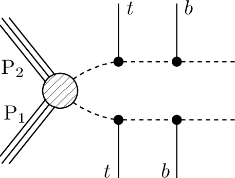
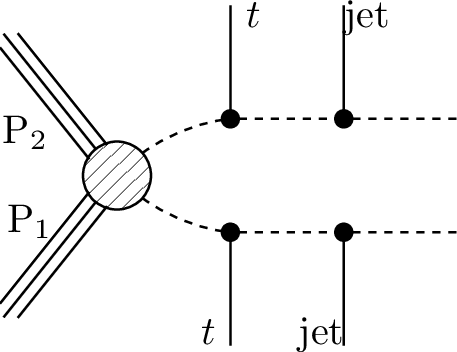
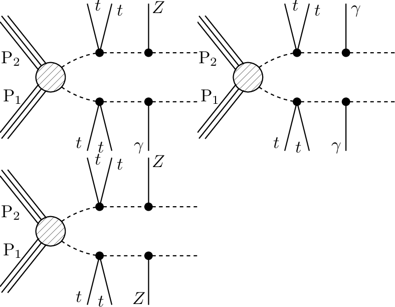
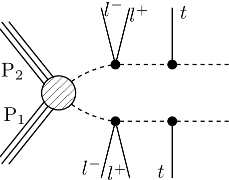
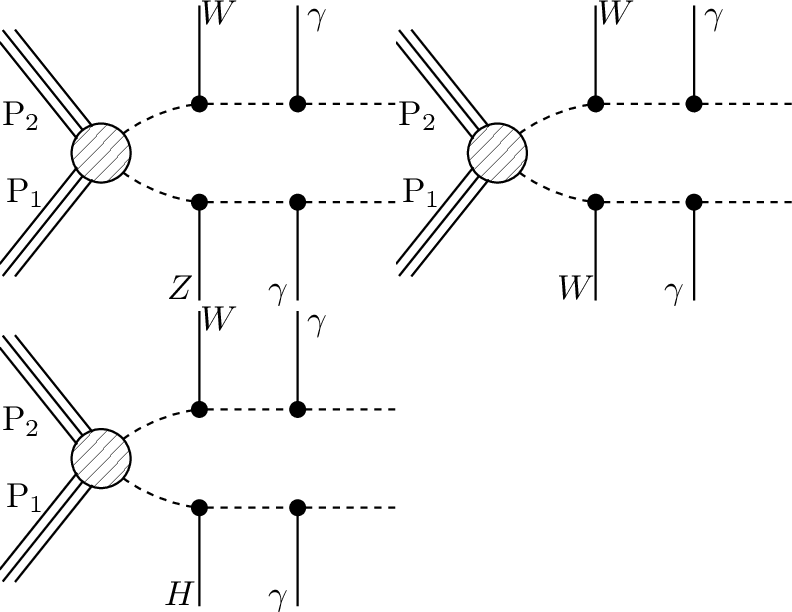
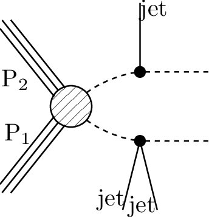

# SMS dictionary
This page intends to collect information about how we map the SModelS description of
events onto the Tx nomenclature. The list has been created from the database version 3.0.0-beta, considering also superseded results.

There is also a [ListOfAnalyses300-beta](https://smodels.github.io/docs/ListOfAnalyses300-beta), a [ListOfAnalyses300-betaWithSuperseded](https://smodels.github.io/docs/ListOfAnalyses300-betaWithSuperseded), and [Validation300-beta](Validation300-beta).

| **#** | **Tx** | **Topology** | **Graph** | **Appears in** |
| ----- | ------ | ------------ | --------- | -------------- |
| 1 | **T1**  | `)` |  | [many (25)](ListOfAnalyses300-betaWithSuperseded)|
| 2 | **T1Disp**  | `)` |  | [ATLAS-SUSY-2016-08](https://atlas.web.cern.ch/Atlas/GROUPS/PHYSICS/PAPERS/SUSY-2016-08/)|
| 3 | **T1bbbb**  | `)` |  | [many (28)](ListOfAnalyses300-betaWithSuperseded)|
| 4 | **T1bbbt**  | `)` |  | [ATLAS-CONF-2013-024](https://atlas.web.cern.ch/Atlas/GROUPS/PHYSICS/CONFNOTES/ATLAS-CONF-2013-024/) [ATLAS-CONF-2013-037](https://atlas.web.cern.ch/Atlas/GROUPS/PHYSICS/CONFNOTES/ATLAS-CONF-2013-037/) [ATLAS-CONF-2013-047](https://atlas.web.cern.ch/Atlas/GROUPS/PHYSICS/CONFNOTES/ATLAS-CONF-2013-047/) [ATLAS-CONF-2013-053](https://atlas.web.cern.ch/Atlas/GROUPS/PHYSICS/CONFNOTES/ATLAS-CONF-2013-053/) [ATLAS-CONF-2013-054](https://atlas.web.cern.ch/Atlas/GROUPS/PHYSICS/CONFNOTES/ATLAS-CONF-2013-054/) [ATLAS-CONF-2013-061](https://atlas.web.cern.ch/Atlas/GROUPS/PHYSICS/CONFNOTES/ATLAS-CONF-2013-061/) [ATLAS-CONF-2013-062](https://atlas.web.cern.ch/Atlas/GROUPS/PHYSICS/CONFNOTES/ATLAS-CONF-2013-062/) [ATLAS-CONF-2013-093](https://atlas.web.cern.ch/Atlas/GROUPS/PHYSICS/CONFNOTES/ATLAS-CONF-2013-093/)|
| 5 | **T1bbqq**  | `)` |  | [ATLAS-CONF-2013-024](https://atlas.web.cern.ch/Atlas/GROUPS/PHYSICS/CONFNOTES/ATLAS-CONF-2013-024/) [ATLAS-CONF-2013-047](https://atlas.web.cern.ch/Atlas/GROUPS/PHYSICS/CONFNOTES/ATLAS-CONF-2013-047/) [ATLAS-CONF-2013-053](https://atlas.web.cern.ch/Atlas/GROUPS/PHYSICS/CONFNOTES/ATLAS-CONF-2013-053/) [ATLAS-CONF-2013-054](https://atlas.web.cern.ch/Atlas/GROUPS/PHYSICS/CONFNOTES/ATLAS-CONF-2013-054/) [ATLAS-CONF-2013-061](https://atlas.web.cern.ch/Atlas/GROUPS/PHYSICS/CONFNOTES/ATLAS-CONF-2013-061/) [ATLAS-CONF-2013-062](https://atlas.web.cern.ch/Atlas/GROUPS/PHYSICS/CONFNOTES/ATLAS-CONF-2013-062/)|
| 6 | **T1bbtt**  | `)` |  | [ATLAS-CONF-2013-024](https://atlas.web.cern.ch/Atlas/GROUPS/PHYSICS/CONFNOTES/ATLAS-CONF-2013-024/) [ATLAS-CONF-2013-037](https://atlas.web.cern.ch/Atlas/GROUPS/PHYSICS/CONFNOTES/ATLAS-CONF-2013-037/) [ATLAS-CONF-2013-047](https://atlas.web.cern.ch/Atlas/GROUPS/PHYSICS/CONFNOTES/ATLAS-CONF-2013-047/) [ATLAS-CONF-2013-048](https://atlas.web.cern.ch/Atlas/GROUPS/PHYSICS/CONFNOTES/ATLAS-CONF-2013-048/) [ATLAS-CONF-2013-053](https://atlas.web.cern.ch/Atlas/GROUPS/PHYSICS/CONFNOTES/ATLAS-CONF-2013-053/) [ATLAS-CONF-2013-054](https://atlas.web.cern.ch/Atlas/GROUPS/PHYSICS/CONFNOTES/ATLAS-CONF-2013-054/) [ATLAS-CONF-2013-061](https://atlas.web.cern.ch/Atlas/GROUPS/PHYSICS/CONFNOTES/ATLAS-CONF-2013-061/) [ATLAS-CONF-2013-062](https://atlas.web.cern.ch/Atlas/GROUPS/PHYSICS/CONFNOTES/ATLAS-CONF-2013-062/)|
| 7 | **T1btbt**  | `)` |  | [many (11)](ListOfAnalyses300-betaWithSuperseded)|
| 8 | **T1btqq**  | `)` |  | [ATLAS-CONF-2013-024](https://atlas.web.cern.ch/Atlas/GROUPS/PHYSICS/CONFNOTES/ATLAS-CONF-2013-024/) [ATLAS-CONF-2013-037](https://atlas.web.cern.ch/Atlas/GROUPS/PHYSICS/CONFNOTES/ATLAS-CONF-2013-037/) [ATLAS-CONF-2013-047](https://atlas.web.cern.ch/Atlas/GROUPS/PHYSICS/CONFNOTES/ATLAS-CONF-2013-047/) [ATLAS-CONF-2013-053](https://atlas.web.cern.ch/Atlas/GROUPS/PHYSICS/CONFNOTES/ATLAS-CONF-2013-053/) [ATLAS-CONF-2013-054](https://atlas.web.cern.ch/Atlas/GROUPS/PHYSICS/CONFNOTES/ATLAS-CONF-2013-054/) [ATLAS-CONF-2013-061](https://atlas.web.cern.ch/Atlas/GROUPS/PHYSICS/CONFNOTES/ATLAS-CONF-2013-061/) [ATLAS-CONF-2013-062](https://atlas.web.cern.ch/Atlas/GROUPS/PHYSICS/CONFNOTES/ATLAS-CONF-2013-062/)|
| 9 | **T1bttt**  | `)` |  | [ATLAS-CONF-2013-024](https://atlas.web.cern.ch/Atlas/GROUPS/PHYSICS/CONFNOTES/ATLAS-CONF-2013-024/) [ATLAS-CONF-2013-037](https://atlas.web.cern.ch/Atlas/GROUPS/PHYSICS/CONFNOTES/ATLAS-CONF-2013-037/) [ATLAS-CONF-2013-047](https://atlas.web.cern.ch/Atlas/GROUPS/PHYSICS/CONFNOTES/ATLAS-CONF-2013-047/) [ATLAS-CONF-2013-048](https://atlas.web.cern.ch/Atlas/GROUPS/PHYSICS/CONFNOTES/ATLAS-CONF-2013-048/) [ATLAS-CONF-2013-054](https://atlas.web.cern.ch/Atlas/GROUPS/PHYSICS/CONFNOTES/ATLAS-CONF-2013-054/) [ATLAS-CONF-2013-061](https://atlas.web.cern.ch/Atlas/GROUPS/PHYSICS/CONFNOTES/ATLAS-CONF-2013-061/) [ATLAS-CONF-2013-062](https://atlas.web.cern.ch/Atlas/GROUPS/PHYSICS/CONFNOTES/ATLAS-CONF-2013-062/)|
| 10 | **T1qqtt**  | `)` |  | [ATLAS-CONF-2013-024](https://atlas.web.cern.ch/Atlas/GROUPS/PHYSICS/CONFNOTES/ATLAS-CONF-2013-024/) [ATLAS-CONF-2013-037](https://atlas.web.cern.ch/Atlas/GROUPS/PHYSICS/CONFNOTES/ATLAS-CONF-2013-037/) [ATLAS-CONF-2013-047](https://atlas.web.cern.ch/Atlas/GROUPS/PHYSICS/CONFNOTES/ATLAS-CONF-2013-047/) [ATLAS-CONF-2013-048](https://atlas.web.cern.ch/Atlas/GROUPS/PHYSICS/CONFNOTES/ATLAS-CONF-2013-048/) [ATLAS-CONF-2013-054](https://atlas.web.cern.ch/Atlas/GROUPS/PHYSICS/CONFNOTES/ATLAS-CONF-2013-054/) [ATLAS-CONF-2013-061](https://atlas.web.cern.ch/Atlas/GROUPS/PHYSICS/CONFNOTES/ATLAS-CONF-2013-061/) [ATLAS-CONF-2013-062](https://atlas.web.cern.ch/Atlas/GROUPS/PHYSICS/CONFNOTES/ATLAS-CONF-2013-062/)|
| 11 | **T1ttofftt**  | `)` |  | [ATLAS-SUSY-2016-14](http://atlas.web.cern.ch/Atlas/GROUPS/PHYSICS/PAPERS/SUSY-2016-14/)|
| 12 | **T1tttt**  | `)` |  | [many (57)](ListOfAnalyses300-betaWithSuperseded)|
| 13 | **T1ttttoff**  | `)` |  | [many (37)](ListOfAnalyses300-betaWithSuperseded)|
| 14 | **T2Disp**  **T2**  | `)` |  | [many (22)](ListOfAnalyses300-betaWithSuperseded)|
| 15 | **T2bb**  | `)` |  | [many (25)](ListOfAnalyses300-betaWithSuperseded)|
| 16 | **T2bbWWoff**  | `)` |  | [ATLAS-SUSY-2016-17](http://atlas.web.cern.ch/Atlas/GROUPS/PHYSICS/PAPERS/SUSY-2016-17/) [CMS-PAS-SUS-16-052](http://cms-results.web.cern.ch/cms-results/public-results/preliminary-results/SUS-16-052/index.html) [ATLAS-SUSY-2013-21](https://atlas.web.cern.ch/Atlas/GROUPS/PHYSICS/PAPERS/SUSY-2013-21/) [CMS-SUS-14-021](https://twiki.cern.ch/twiki/bin/view/CMSPublic/PhysicsResultsSUS14021)|
| 17 | **T2bbffff**  | `)` |  | [ATLAS-SUSY-2016-15](https://atlas.web.cern.ch/Atlas/GROUPS/PHYSICS/PAPERS/SUSY-2016-15/) [ATLAS-SUSY-2016-16](https://atlas.web.cern.ch/Atlas/GROUPS/PHYSICS/PAPERS/SUSY-2016-16/) [ATLAS-SUSY-2018-08](https://atlas.web.cern.ch/Atlas/GROUPS/PHYSICS/PAPERS/SUSY-2018-08/) [ATLAS-SUSY-2018-12](https://atlas.web.cern.ch/Atlas/GROUPS/PHYSICS/PAPERS/SUSY-2018-12/) [CMS-SUS-17-005](https://cms-results.web.cern.ch/cms-results/public-results/publications/SUS-17-005/) [CMS-SUS-18-004](http://cms-results.web.cern.ch/cms-results/public-results/publications/SUS-18-004/index.html)|
| 18 | **T2bt**  | `)` |  | [ATLAS-CONF-2013-024](https://atlas.web.cern.ch/Atlas/GROUPS/PHYSICS/CONFNOTES/ATLAS-CONF-2013-024/) [ATLAS-CONF-2013-037](https://atlas.web.cern.ch/Atlas/GROUPS/PHYSICS/CONFNOTES/ATLAS-CONF-2013-037/) [ATLAS-CONF-2013-047](https://atlas.web.cern.ch/Atlas/GROUPS/PHYSICS/CONFNOTES/ATLAS-CONF-2013-047/) [ATLAS-CONF-2013-053](https://atlas.web.cern.ch/Atlas/GROUPS/PHYSICS/CONFNOTES/ATLAS-CONF-2013-053/) [ATLAS-CONF-2013-054](https://atlas.web.cern.ch/Atlas/GROUPS/PHYSICS/CONFNOTES/ATLAS-CONF-2013-054/) [ATLAS-CONF-2013-061](https://atlas.web.cern.ch/Atlas/GROUPS/PHYSICS/CONFNOTES/ATLAS-CONF-2013-061/) [ATLAS-CONF-2013-062](https://atlas.web.cern.ch/Atlas/GROUPS/PHYSICS/CONFNOTES/ATLAS-CONF-2013-062/) [ATLAS-CONF-2013-093](https://atlas.web.cern.ch/Atlas/GROUPS/PHYSICS/CONFNOTES/ATLAS-CONF-2013-093/) [CMS-SUS-13-012](https://twiki.cern.ch/twiki/bin/view/CMSPublic/PhysicsResultsSUS13012)|
| 19 | **T2cc**  | `)` |  | [ATLAS-SUSY-2016-26](https://atlas.web.cern.ch/Atlas/GROUPS/PHYSICS/PAPERS/SUSY-2016-26/) [CMS-SUS-16-032](http://cms-results.web.cern.ch/cms-results/public-results/publications/SUS-16-032/index.html) [CMS-SUS-16-036](http://cms-results.web.cern.ch/cms-results/public-results/publications/SUS-16-036/index.html) [CMS-SUS-16-049](http://cms-results.web.cern.ch/cms-results/public-results/publications/SUS-16-049/index.html) [ATLAS-SUSY-2013-21](https://atlas.web.cern.ch/Atlas/GROUPS/PHYSICS/PAPERS/SUSY-2013-21/)|
| 20 | **T2tt**  | `)` |  | [many (57)](ListOfAnalyses300-betaWithSuperseded)|
| 21 | **T2ttC**  | `)` |  | [CMS-SUS-16-049](http://cms-results.web.cern.ch/cms-results/public-results/publications/SUS-16-049/index.html)|
| 22 | **T2ttoff**  **T2bbWW**  | `)` |  | [many (40)](ListOfAnalyses300-betaWithSuperseded)|
| 23 | **T3GQ**  | `)` |  | [ATLAS-SUSY-2016-07](https://atlas.web.cern.ch/Atlas/GROUPS/PHYSICS/PAPERS/SUSY-2016-07/) [CMS-SUS-16-033](http://cms-results.web.cern.ch/cms-results/public-results/publications/SUS-16-033/index.html) [CMS-SUS-19-006](http://cms-results.web.cern.ch/cms-results/public-results/publications/SUS-19-006/index.html) [ATLAS-SUSY-2013-02](https://atlas.web.cern.ch/Atlas/GROUPS/PHYSICS/PAPERS/SUSY-2013-02/) [CMS-SUS-13-012](https://twiki.cern.ch/twiki/bin/view/CMSPublic/PhysicsResultsSUS13012)|
| 24 | **T4bnutau- bnutau**  | `)` |  | [ATLAS-SUSY-2016-19](https://atlas.web.cern.ch/Atlas/GROUPS/PHYSICS/PAPERS/SUSY-2016-19/)|
| 25 | **T5**  | `)` |  | [ATLAS-SUSY-2013-02](https://atlas.web.cern.ch/Atlas/GROUPS/PHYSICS/PAPERS/SUSY-2013-02/) [ATLAS-SUSY-2013-04](https://atlas.web.cern.ch/Atlas/GROUPS/PHYSICS/PAPERS/SUSY-2013-04/) [CMS-SUS-13-012](https://twiki.cern.ch/twiki/bin/view/CMSPublic/PhysicsResultsSUS13012)|
| 26 | **T5GQ**  | `)` |  | [ATLAS-SUSY-2016-07](https://atlas.web.cern.ch/Atlas/GROUPS/PHYSICS/PAPERS/SUSY-2016-07/) [CMS-SUS-16-033](http://cms-results.web.cern.ch/cms-results/public-results/publications/SUS-16-033/index.html) [CMS-SUS-19-006](http://cms-results.web.cern.ch/cms-results/public-results/publications/SUS-19-006/index.html)|
| 27 | **T5HH**  | `)` |  | [CMS-SUS-17-006](https://cms-results.web.cern.ch/cms-results/public-results/publications/SUS-17-006/) [CMS-SUS-20-004](http://cms-results.web.cern.ch/cms-results/public-results/publications/SUS-20-004/)|
| 28 | **T5HZ**  | `)` |  | [CMS-SUS-17-006](https://cms-results.web.cern.ch/cms-results/public-results/publications/SUS-17-006/)|
| 29 | **T5Hg**  | `)` |  | [CMS-SUS-18-002](https://cms-results.web.cern.ch/cms-results/public-results/publications/SUS-18-002/)|
| 30 | **T5WW**  | `)` |  | [many (16)](ListOfAnalyses300-betaWithSuperseded)|
| 31 | **T5WWoff**  | `)` |  | [many (12)](ListOfAnalyses300-betaWithSuperseded)|
| 32 | **T5WZ**  | `)` |  | [CMS-SUS-19-008](http://cms-results.web.cern.ch/cms-results/public-results/publications/SUS-19-008/index.html)|
| 33 | **T5WZh**  | `)` |  | [ATLAS-SUSY-2016-07](https://atlas.web.cern.ch/Atlas/GROUPS/PHYSICS/PAPERS/SUSY-2016-07/)|
| 34 | **T5ZZ**  | `)` |  | [ATLAS-SUSY-2016-07](https://atlas.web.cern.ch/Atlas/GROUPS/PHYSICS/PAPERS/SUSY-2016-07/) [ATLAS-SUSY-2016-33](https://atlas.web.cern.ch/Atlas/GROUPS/PHYSICS/PAPERS/SUSY-2016-33/) [ATLAS-SUSY-2018-05](https://atlas.web.cern.ch/Atlas/GROUPS/PHYSICS/PAPERS/SUSY-2018-05/) [CMS-SUS-16-034](http://cms-results.web.cern.ch/cms-results/public-results/publications/SUS-16-034/index.html) [CMS-SUS-19-013](http://cms-results.web.cern.ch/cms-results/public-results/publications/SUS-19-013/index.html) [CMS-SUS-20-001](http://cms-results.web.cern.ch/cms-results/public-results/publications/SUS-20-001/index.html) [ATLAS-SUSY-2013-04](https://atlas.web.cern.ch/Atlas/GROUPS/PHYSICS/PAPERS/SUSY-2013-04/) [CMS-SUS-13-012](https://twiki.cern.ch/twiki/bin/view/CMSPublic/PhysicsResultsSUS13012)|
| 35 | **T5Zg**  | `)` |  | [ATLAS-SUSY-2016-27](https://atlas.web.cern.ch/Atlas/GROUPS/PHYSICS/PAPERS/SUSY-2016-27/)|
| 36 | **T5bbbb**  | `)` |  | [ATLAS-CONF-2013-024](https://atlas.web.cern.ch/Atlas/GROUPS/PHYSICS/CONFNOTES/ATLAS-CONF-2013-024/) [ATLAS-CONF-2013-037](https://atlas.web.cern.ch/Atlas/GROUPS/PHYSICS/CONFNOTES/ATLAS-CONF-2013-037/) [ATLAS-CONF-2013-047](https://atlas.web.cern.ch/Atlas/GROUPS/PHYSICS/CONFNOTES/ATLAS-CONF-2013-047/) [ATLAS-CONF-2013-053](https://atlas.web.cern.ch/Atlas/GROUPS/PHYSICS/CONFNOTES/ATLAS-CONF-2013-053/) [ATLAS-CONF-2013-054](https://atlas.web.cern.ch/Atlas/GROUPS/PHYSICS/CONFNOTES/ATLAS-CONF-2013-054/) [ATLAS-CONF-2013-061](https://atlas.web.cern.ch/Atlas/GROUPS/PHYSICS/CONFNOTES/ATLAS-CONF-2013-061/) [ATLAS-CONF-2013-062](https://atlas.web.cern.ch/Atlas/GROUPS/PHYSICS/CONFNOTES/ATLAS-CONF-2013-062/) [CMS-SUS-13-012](https://twiki.cern.ch/twiki/bin/view/CMSPublic/PhysicsResultsSUS13012)|
| 37 | **T5bbbbZg**  | `)` |  | [CMS-SUS-18-002](https://cms-results.web.cern.ch/cms-results/public-results/publications/SUS-18-002/)|
| 38 | **T5bbbt**  | `)` |  | [ATLAS-CONF-2013-024](https://atlas.web.cern.ch/Atlas/GROUPS/PHYSICS/CONFNOTES/ATLAS-CONF-2013-024/) [ATLAS-CONF-2013-037](https://atlas.web.cern.ch/Atlas/GROUPS/PHYSICS/CONFNOTES/ATLAS-CONF-2013-037/) [ATLAS-CONF-2013-047](https://atlas.web.cern.ch/Atlas/GROUPS/PHYSICS/CONFNOTES/ATLAS-CONF-2013-047/) [ATLAS-CONF-2013-053](https://atlas.web.cern.ch/Atlas/GROUPS/PHYSICS/CONFNOTES/ATLAS-CONF-2013-053/) [ATLAS-CONF-2013-054](https://atlas.web.cern.ch/Atlas/GROUPS/PHYSICS/CONFNOTES/ATLAS-CONF-2013-054/) [ATLAS-CONF-2013-061](https://atlas.web.cern.ch/Atlas/GROUPS/PHYSICS/CONFNOTES/ATLAS-CONF-2013-061/) [ATLAS-CONF-2013-062](https://atlas.web.cern.ch/Atlas/GROUPS/PHYSICS/CONFNOTES/ATLAS-CONF-2013-062/) [ATLAS-CONF-2013-093](https://atlas.web.cern.ch/Atlas/GROUPS/PHYSICS/CONFNOTES/ATLAS-CONF-2013-093/)|
| 39 | **T5btbt**  | `)` |  | [ATLAS-CONF-2013-024](https://atlas.web.cern.ch/Atlas/GROUPS/PHYSICS/CONFNOTES/ATLAS-CONF-2013-024/) [ATLAS-CONF-2013-037](https://atlas.web.cern.ch/Atlas/GROUPS/PHYSICS/CONFNOTES/ATLAS-CONF-2013-037/) [ATLAS-CONF-2013-047](https://atlas.web.cern.ch/Atlas/GROUPS/PHYSICS/CONFNOTES/ATLAS-CONF-2013-047/) [ATLAS-CONF-2013-048](https://atlas.web.cern.ch/Atlas/GROUPS/PHYSICS/CONFNOTES/ATLAS-CONF-2013-048/) [ATLAS-CONF-2013-053](https://atlas.web.cern.ch/Atlas/GROUPS/PHYSICS/CONFNOTES/ATLAS-CONF-2013-053/) [ATLAS-CONF-2013-054](https://atlas.web.cern.ch/Atlas/GROUPS/PHYSICS/CONFNOTES/ATLAS-CONF-2013-054/) [ATLAS-CONF-2013-061](https://atlas.web.cern.ch/Atlas/GROUPS/PHYSICS/CONFNOTES/ATLAS-CONF-2013-061/) [ATLAS-CONF-2013-062](https://atlas.web.cern.ch/Atlas/GROUPS/PHYSICS/CONFNOTES/ATLAS-CONF-2013-062/) [ATLAS-CONF-2013-093](https://atlas.web.cern.ch/Atlas/GROUPS/PHYSICS/CONFNOTES/ATLAS-CONF-2013-093/)|
| 40 | **T5gg**  | `)` |  | [ATLAS-SUSY-2016-27](https://atlas.web.cern.ch/Atlas/GROUPS/PHYSICS/PAPERS/SUSY-2016-27/) [CMS-SUS-16-046](http://cms-results.web.cern.ch/cms-results/public-results/publications/SUS-16-046/index.html) [CMS-SUS-16-047](http://cms-results.web.cern.ch/cms-results/public-results/publications/SUS-16-047/index.html)|
| 41 | **T5tbtb**  | `)` |  | [ATLAS-CONF-2013-024](https://atlas.web.cern.ch/Atlas/GROUPS/PHYSICS/CONFNOTES/ATLAS-CONF-2013-024/) [ATLAS-CONF-2013-037](https://atlas.web.cern.ch/Atlas/GROUPS/PHYSICS/CONFNOTES/ATLAS-CONF-2013-037/) [ATLAS-CONF-2013-047](https://atlas.web.cern.ch/Atlas/GROUPS/PHYSICS/CONFNOTES/ATLAS-CONF-2013-047/) [ATLAS-CONF-2013-048](https://atlas.web.cern.ch/Atlas/GROUPS/PHYSICS/CONFNOTES/ATLAS-CONF-2013-048/) [ATLAS-CONF-2013-053](https://atlas.web.cern.ch/Atlas/GROUPS/PHYSICS/CONFNOTES/ATLAS-CONF-2013-053/) [ATLAS-CONF-2013-054](https://atlas.web.cern.ch/Atlas/GROUPS/PHYSICS/CONFNOTES/ATLAS-CONF-2013-054/) [ATLAS-CONF-2013-061](https://atlas.web.cern.ch/Atlas/GROUPS/PHYSICS/CONFNOTES/ATLAS-CONF-2013-061/) [ATLAS-CONF-2013-062](https://atlas.web.cern.ch/Atlas/GROUPS/PHYSICS/CONFNOTES/ATLAS-CONF-2013-062/) [ATLAS-CONF-2013-093](https://atlas.web.cern.ch/Atlas/GROUPS/PHYSICS/CONFNOTES/ATLAS-CONF-2013-093/)|
| 42 | **T5tbtt**  | `)` |  | [ATLAS-CONF-2013-024](https://atlas.web.cern.ch/Atlas/GROUPS/PHYSICS/CONFNOTES/ATLAS-CONF-2013-024/) [ATLAS-CONF-2013-037](https://atlas.web.cern.ch/Atlas/GROUPS/PHYSICS/CONFNOTES/ATLAS-CONF-2013-037/) [ATLAS-CONF-2013-047](https://atlas.web.cern.ch/Atlas/GROUPS/PHYSICS/CONFNOTES/ATLAS-CONF-2013-047/) [ATLAS-CONF-2013-048](https://atlas.web.cern.ch/Atlas/GROUPS/PHYSICS/CONFNOTES/ATLAS-CONF-2013-048/) [ATLAS-CONF-2013-053](https://atlas.web.cern.ch/Atlas/GROUPS/PHYSICS/CONFNOTES/ATLAS-CONF-2013-053/) [ATLAS-CONF-2013-054](https://atlas.web.cern.ch/Atlas/GROUPS/PHYSICS/CONFNOTES/ATLAS-CONF-2013-054/) [ATLAS-CONF-2013-061](https://atlas.web.cern.ch/Atlas/GROUPS/PHYSICS/CONFNOTES/ATLAS-CONF-2013-061/) [ATLAS-CONF-2013-062](https://atlas.web.cern.ch/Atlas/GROUPS/PHYSICS/CONFNOTES/ATLAS-CONF-2013-062/)|
| 43 | **T5tctc**  | `)` |  | [many (10)](ListOfAnalyses300-betaWithSuperseded)|
| 44 | **T5ttbbWW- off**  | `)` |  | [CMS-SUS-16-035](http://cms-results.web.cern.ch/cms-results/public-results/publications/SUS-16-035/index.html)|
| 45 | **T5ttofftt**  | `)` |  | [CMS-SUS-16-037](http://cms-results.web.cern.ch/cms-results/public-results/publications/SUS-16-037/index.html)|
| 46 | **T5tttt**  | `)` |  | [many (15)](ListOfAnalyses300-betaWithSuperseded)|
| 47 | **T5ttttZg**  | `)` |  | [CMS-SUS-18-002](https://cms-results.web.cern.ch/cms-results/public-results/publications/SUS-18-002/)|
| 48 | **T6HHtt**  | `)` |  | [CMS-SUS-16-041](http://cms-results.web.cern.ch/cms-results/public-results/publications/SUS-16-041/index.html)|
| 49 | **T6WW**  | `)` |  | [ATLAS-SUSY-2016-07](https://atlas.web.cern.ch/Atlas/GROUPS/PHYSICS/PAPERS/SUSY-2016-07/) [ATLAS-SUSY-2018-10](https://atlas.web.cern.ch/Atlas/GROUPS/PHYSICS/PAPERS/SUSY-2018-10/) [ATLAS-SUSY-2018-22](https://atlas.web.cern.ch/Atlas/GROUPS/PHYSICS/PAPERS/SUSY-2018-22/) [ATLAS-CONF-2013-089](https://atlas.web.cern.ch/Atlas/GROUPS/PHYSICS/CONFNOTES/ATLAS-CONF-2013-089/; https://cds.cern.ch/record/1595272) [ATLAS-SUSY-2013-02](https://atlas.web.cern.ch/Atlas/GROUPS/PHYSICS/PAPERS/SUSY-2013-02/) [ATLAS-SUSY-2013-20](https://atlas.web.cern.ch/Atlas/GROUPS/PHYSICS/PAPERS/SUSY-2013-20/) [CMS-SUS-13-012](https://twiki.cern.ch/twiki/bin/view/CMSPublic/PhysicsResultsSUS13012)|
| 50 | **T6WWoff**  | `)` |  | [ATLAS-SUSY-2016-07](https://atlas.web.cern.ch/Atlas/GROUPS/PHYSICS/PAPERS/SUSY-2016-07/) [ATLAS-SUSY-2018-10](https://atlas.web.cern.ch/Atlas/GROUPS/PHYSICS/PAPERS/SUSY-2018-10/) [ATLAS-SUSY-2018-22](https://atlas.web.cern.ch/Atlas/GROUPS/PHYSICS/PAPERS/SUSY-2018-22/) [ATLAS-SUSY-2013-20](https://atlas.web.cern.ch/Atlas/GROUPS/PHYSICS/PAPERS/SUSY-2013-20/)|
| 51 | **T6WZh**  | `)` |  | [ATLAS-SUSY-2016-07](https://atlas.web.cern.ch/Atlas/GROUPS/PHYSICS/PAPERS/SUSY-2016-07/)|
| 52 | **T6ZZ**  | `)` |  | [ATLAS-SUSY-2016-33](https://atlas.web.cern.ch/Atlas/GROUPS/PHYSICS/PAPERS/SUSY-2016-33/) [ATLAS-SUSY-2018-05](https://atlas.web.cern.ch/Atlas/GROUPS/PHYSICS/PAPERS/SUSY-2018-05/)|
| 53 | **T6ZZofftt**  | `)` |  | [CMS-SUS-16-041](http://cms-results.web.cern.ch/cms-results/public-results/publications/SUS-16-041/index.html)|
| 54 | **T6ZZtt**  | `)` |  | [CMS-SUS-16-041](http://cms-results.web.cern.ch/cms-results/public-results/publications/SUS-16-041/index.html) [ATLAS-CONF-2013-025](https://atlas.web.cern.ch/Atlas/GROUPS/PHYSICS/CONFNOTES/ATLAS-CONF-2013-025/) [ATLAS-SUSY-2013-08](https://atlas.web.cern.ch/Atlas/GROUPS/PHYSICS/PAPERS/SUSY-2013-08/)|
| 55 | **T6bbHH**  | `)` |  | [ATLAS-SUSY-2018-31](https://atlas.web.cern.ch/Atlas/GROUPS/PHYSICS/PAPERS/SUSY-2018-31/) [ATLAS-SUSY-2018-40](https://atlas.web.cern.ch/Atlas/GROUPS/PHYSICS/PAPERS/SUSY-2018-40/) [CMS-SUS-16-045](http://cms-results.web.cern.ch/cms-results/public-results/publications/SUS-16-045/index.html) [CMS-SUS-18-007](http://cms-results.web.cern.ch/cms-results/public-results/publications/SUS-18-007/index.html)|
| 56 | **T6bbWW**  | `)` |  | [many (18)](ListOfAnalyses300-betaWithSuperseded)|
| 57 | **T6bbWWoff**  | `)` |  | [many (11)](ListOfAnalyses300-betaWithSuperseded)|
| 58 | **T6gg**  | `)` |  | [ATLAS-SUSY-2016-27](https://atlas.web.cern.ch/Atlas/GROUPS/PHYSICS/PAPERS/SUSY-2016-27/) [CMS-SUS-16-046](http://cms-results.web.cern.ch/cms-results/public-results/publications/SUS-16-046/index.html) [CMS-SUS-16-047](http://cms-results.web.cern.ch/cms-results/public-results/publications/SUS-16-047/index.html)|
| 59 | **T6ttWW**  | `)` |  | [ATLAS-SUSY-2016-14](http://atlas.web.cern.ch/Atlas/GROUPS/PHYSICS/PAPERS/SUSY-2016-14/) [CMS-SUS-16-035](http://cms-results.web.cern.ch/cms-results/public-results/publications/SUS-16-035/index.html) [CMS-SUS-16-041](http://cms-results.web.cern.ch/cms-results/public-results/publications/SUS-16-041/index.html) [ATLAS-CONF-2013-007](https://atlas.web.cern.ch/Atlas/GROUPS/PHYSICS/CONFNOTES/ATLAS-CONF-2013-007/) [CMS-SUS-13-013](https://twiki.cern.ch/twiki/bin/view/CMSPublic/PhysicsResultsSUS13013)|
| 60 | **T6ttWWoff**  | `)` |  | [CMS-SUS-16-035](http://cms-results.web.cern.ch/cms-results/public-results/publications/SUS-16-035/index.html) [CMS-SUS-16-041](http://cms-results.web.cern.ch/cms-results/public-results/publications/SUS-16-041/index.html) [ATLAS-CONF-2013-007](https://atlas.web.cern.ch/Atlas/GROUPS/PHYSICS/CONFNOTES/ATLAS-CONF-2013-007/) [CMS-SUS-13-013](https://twiki.cern.ch/twiki/bin/view/CMSPublic/PhysicsResultsSUS13013)|
| 61 | **T6ttZg**  | `)` |  | [CMS-SUS-18-002](https://cms-results.web.cern.ch/cms-results/public-results/publications/SUS-18-002/)|
| 62 | **T6ttoffWW**  | `)` |  | [CMS-SUS-16-035](http://cms-results.web.cern.ch/cms-results/public-results/publications/SUS-16-035/index.html) [CMS-SUS-16-041](http://cms-results.web.cern.ch/cms-results/public-results/publications/SUS-16-041/index.html)|
| 63 | **TChiChipm- SlepL**  | `)` |  | [CMS-SUS-16-039](http://cms-results.web.cern.ch/cms-results/public-results/publications/SUS-16-039/index.html) [ATLAS-CONF-2013-035](https://atlas.web.cern.ch/Atlas/GROUPS/PHYSICS/CONFNOTES/ATLAS-CONF-2013-035/) [ATLAS-SUSY-2013-12](https://atlas.web.cern.ch/Atlas/GROUPS/PHYSICS/PAPERS/SUSY-2013-12/) [CMS-PAS-SUS-12-022](https://twiki.cern.ch/twiki/bin/view/CMSPublic/PhysicsResultsSUS12022) [CMS-SUS-13-006](https://twiki.cern.ch/twiki/bin/view/CMSPublic/PhysicsResultsSUS13006)|
| 64 | **TChiChipm- SlepSlep**  | `)` |  | [ATLAS-SUSY-2016-24](https://atlas.web.cern.ch/Atlas/GROUPS/PHYSICS/PAPERS/SUSY-2016-24/)|
| 65 | **TChiChipm- SlepStau**  | `)` |  | [CMS-SUS-16-039](http://cms-results.web.cern.ch/cms-results/public-results/publications/SUS-16-039/index.html) [CMS-PAS-SUS-12-022](https://twiki.cern.ch/twiki/bin/view/CMSPublic/PhysicsResultsSUS12022) [CMS-SUS-13-006](https://twiki.cern.ch/twiki/bin/view/CMSPublic/PhysicsResultsSUS13006)|
| 66 | **TChiChipm- StauL**  | `)` |  | [ATLAS-SUSY-2013-12](https://atlas.web.cern.ch/Atlas/GROUPS/PHYSICS/PAPERS/SUSY-2013-12/)|
| 67 | **TChiChipm- StauStau**  | `)` |  | [CMS-SUS-16-039](http://cms-results.web.cern.ch/cms-results/public-results/publications/SUS-16-039/index.html) [CMS-SUS-17-003](https://cms-results.web.cern.ch/cms-results/public-results/publications/SUS-17-003/) [CMS-PAS-SUS-12-022](https://twiki.cern.ch/twiki/bin/view/CMSPublic/PhysicsResultsSUS12022)|
| 68 | **TChiH**  | `)` |  | [ATLAS-SUSY-2017-02](https://atlas.web.cern.ch/Atlas/GROUPS/PHYSICS/PAPERS/SUSY-2017-02/)|
| 69 | **TChiHH**  | `)` |  | [ATLAS-SUSY-2018-23](https://atlas.web.cern.ch/Atlas/GROUPS/PHYSICS/PAPERS/SUSY-2018-23/) [ATLAS-SUSY-2018-41](https://atlas.web.cern.ch/Atlas/GROUPS/PHYSICS/PAPERS/SUSY-2018-41/) [CMS-SUS-18-007](http://cms-results.web.cern.ch/cms-results/public-results/publications/SUS-18-007/index.html) [CMS-SUS-20-004](http://cms-results.web.cern.ch/cms-results/public-results/publications/SUS-20-004/)|
| 70 | **TChiWH**  | `)` |  | [many (18)](ListOfAnalyses300-betaWithSuperseded)|
| 71 | **TChiWW**  | `)` |  | [ATLAS-SUSY-2018-32](https://atlas.web.cern.ch/Atlas/GROUPS/PHYSICS/PAPERS/SUSY-2018-32/) [ATLAS-SUSY-2018-41](https://atlas.web.cern.ch/Atlas/GROUPS/PHYSICS/PAPERS/SUSY-2018-41/) [ATLAS-SUSY-2019-02](https://atlas.web.cern.ch/Atlas/GROUPS/PHYSICS/PAPERS/SUSY-2019-02/) [CMS-SUS-21-002](http://cms-results.web.cern.ch/cms-results/public-results/publications/SUS-21-002/) [ATLAS-SUSY-2013-11](https://atlas.web.cern.ch/Atlas/GROUPS/PHYSICS/PAPERS/SUSY-2013-11/) [CMS-SUS-13-012](https://twiki.cern.ch/twiki/bin/view/CMSPublic/PhysicsResultsSUS13012)|
| 72 | **TChiWWoff**  | `)` |  | [ATLAS-SUSY-2013-11](https://atlas.web.cern.ch/Atlas/GROUPS/PHYSICS/PAPERS/SUSY-2013-11/)|
| 73 | **TChiWZ**  | `)` |  | [many (25)](ListOfAnalyses300-betaWithSuperseded)|
| 74 | **TChiWZoff**  | `)` |  | [many (15)](ListOfAnalyses300-betaWithSuperseded)|
| 75 | **TChiZH**  | `)` |  | [ATLAS-SUSY-2018-41](https://atlas.web.cern.ch/Atlas/GROUPS/PHYSICS/PAPERS/SUSY-2018-41/)|
| 76 | **TChiZZ**  | `)` |  | [ATLAS-SUSY-2018-41](https://atlas.web.cern.ch/Atlas/GROUPS/PHYSICS/PAPERS/SUSY-2018-41/) [CMS-SUS-20-001](http://cms-results.web.cern.ch/cms-results/public-results/publications/SUS-20-001/index.html) [CMS-SUS-13-012](https://twiki.cern.ch/twiki/bin/view/CMSPublic/PhysicsResultsSUS13012)|
| 77 | **TChipChim- SlepSlep**  | `)` |  | [ATLAS-SUSY-2016-24](https://atlas.web.cern.ch/Atlas/GROUPS/PHYSICS/PAPERS/SUSY-2016-24/) [ATLAS-SUSY-2018-32](https://atlas.web.cern.ch/Atlas/GROUPS/PHYSICS/PAPERS/SUSY-2018-32/)|
| 78 | **TChipChim- SlepSnu**  | `)` |  | [CMS-SUS-17-010](http://cms-results.web.cern.ch/cms-results/public-results/publications/SUS-17-010) [ATLAS-SUSY-2013-11](https://atlas.web.cern.ch/Atlas/GROUPS/PHYSICS/PAPERS/SUSY-2013-11/) [CMS-PAS-SUS-12-022](https://twiki.cern.ch/twiki/bin/view/CMSPublic/PhysicsResultsSUS12022)|
| 79 | **TChipChim- StauSnu**  | `)` |  | [CMS-SUS-17-003](https://cms-results.web.cern.ch/cms-results/public-results/publications/SUS-17-003/)|
| 80 | **TChipChi- mgg**  | `)` |  | [ATLAS-SUSY-2016-27](https://atlas.web.cern.ch/Atlas/GROUPS/PHYSICS/PAPERS/SUSY-2016-27/)|
| 81 | **TDTM1F**  | `)` |  | [ATLAS-SUSY-2016-06](https://atlas.web.cern.ch/Atlas/GROUPS/PHYSICS/PAPERS/SUSY-2016-06/) [CMS-EXO-19-010](http://cms-results.web.cern.ch/cms-results/public-results/publications/EXO-19-010/)|
| 82 | **TDTM1S**  | `)` |  | [ATLAS-SUSY-2016-06](https://atlas.web.cern.ch/Atlas/GROUPS/PHYSICS/PAPERS/SUSY-2016-06/)|
| 83 | **TDTM2F**  | `)` |  | [ATLAS-SUSY-2016-06](https://atlas.web.cern.ch/Atlas/GROUPS/PHYSICS/PAPERS/SUSY-2016-06/) [CMS-EXO-19-010](http://cms-results.web.cern.ch/cms-results/public-results/publications/EXO-19-010/)|
| 84 | **TDTM2S**  | `)` |  | [ATLAS-SUSY-2016-06](https://atlas.web.cern.ch/Atlas/GROUPS/PHYSICS/PAPERS/SUSY-2016-06/)|
| 85 | **TGQ**  | `)` |  | [ATLAS-SUSY-2016-07](https://atlas.web.cern.ch/Atlas/GROUPS/PHYSICS/PAPERS/SUSY-2016-07/) [CMS-SUS-16-033](http://cms-results.web.cern.ch/cms-results/public-results/publications/SUS-16-033/index.html) [CMS-SUS-19-006](http://cms-results.web.cern.ch/cms-results/public-results/publications/SUS-19-006/index.html) [ATLAS-CONF-2013-047](https://atlas.web.cern.ch/Atlas/GROUPS/PHYSICS/CONFNOTES/ATLAS-CONF-2013-047/) [ATLAS-CONF-2013-054](https://atlas.web.cern.ch/Atlas/GROUPS/PHYSICS/CONFNOTES/ATLAS-CONF-2013-054/)|
| 86 | **TGQbbq**  | `)` |  | [ATLAS-CONF-2013-024](https://atlas.web.cern.ch/Atlas/GROUPS/PHYSICS/CONFNOTES/ATLAS-CONF-2013-024/) [ATLAS-CONF-2013-047](https://atlas.web.cern.ch/Atlas/GROUPS/PHYSICS/CONFNOTES/ATLAS-CONF-2013-047/) [ATLAS-CONF-2013-053](https://atlas.web.cern.ch/Atlas/GROUPS/PHYSICS/CONFNOTES/ATLAS-CONF-2013-053/) [ATLAS-CONF-2013-054](https://atlas.web.cern.ch/Atlas/GROUPS/PHYSICS/CONFNOTES/ATLAS-CONF-2013-054/) [ATLAS-CONF-2013-061](https://atlas.web.cern.ch/Atlas/GROUPS/PHYSICS/CONFNOTES/ATLAS-CONF-2013-061/) [ATLAS-CONF-2013-062](https://atlas.web.cern.ch/Atlas/GROUPS/PHYSICS/CONFNOTES/ATLAS-CONF-2013-062/)|
| 87 | **TGQbtq**  | `)` |  | [ATLAS-CONF-2013-024](https://atlas.web.cern.ch/Atlas/GROUPS/PHYSICS/CONFNOTES/ATLAS-CONF-2013-024/) [ATLAS-CONF-2013-037](https://atlas.web.cern.ch/Atlas/GROUPS/PHYSICS/CONFNOTES/ATLAS-CONF-2013-037/) [ATLAS-CONF-2013-047](https://atlas.web.cern.ch/Atlas/GROUPS/PHYSICS/CONFNOTES/ATLAS-CONF-2013-047/) [ATLAS-CONF-2013-053](https://atlas.web.cern.ch/Atlas/GROUPS/PHYSICS/CONFNOTES/ATLAS-CONF-2013-053/) [ATLAS-CONF-2013-054](https://atlas.web.cern.ch/Atlas/GROUPS/PHYSICS/CONFNOTES/ATLAS-CONF-2013-054/) [ATLAS-CONF-2013-061](https://atlas.web.cern.ch/Atlas/GROUPS/PHYSICS/CONFNOTES/ATLAS-CONF-2013-061/) [ATLAS-CONF-2013-062](https://atlas.web.cern.ch/Atlas/GROUPS/PHYSICS/CONFNOTES/ATLAS-CONF-2013-062/)|
| 88 | **TGQqtt**  | `)` |  | [ATLAS-CONF-2013-024](https://atlas.web.cern.ch/Atlas/GROUPS/PHYSICS/CONFNOTES/ATLAS-CONF-2013-024/) [ATLAS-CONF-2013-037](https://atlas.web.cern.ch/Atlas/GROUPS/PHYSICS/CONFNOTES/ATLAS-CONF-2013-037/) [ATLAS-CONF-2013-047](https://atlas.web.cern.ch/Atlas/GROUPS/PHYSICS/CONFNOTES/ATLAS-CONF-2013-047/) [ATLAS-CONF-2013-048](https://atlas.web.cern.ch/Atlas/GROUPS/PHYSICS/CONFNOTES/ATLAS-CONF-2013-048/) [ATLAS-CONF-2013-053](https://atlas.web.cern.ch/Atlas/GROUPS/PHYSICS/CONFNOTES/ATLAS-CONF-2013-053/) [ATLAS-CONF-2013-054](https://atlas.web.cern.ch/Atlas/GROUPS/PHYSICS/CONFNOTES/ATLAS-CONF-2013-054/) [ATLAS-CONF-2013-061](https://atlas.web.cern.ch/Atlas/GROUPS/PHYSICS/CONFNOTES/ATLAS-CONF-2013-061/) [ATLAS-CONF-2013-062](https://atlas.web.cern.ch/Atlas/GROUPS/PHYSICS/CONFNOTES/ATLAS-CONF-2013-062/)|
| 89 | **THSCPM10**  | `)` |  | [ATLAS-SUSY-2016-32](http://atlas.web.cern.ch/Atlas/GROUPS/PHYSICS/PAPERS/SUSY-2016-32/index.html)|
| 90 | **THSCPM11**  | `)` |  | [ATLAS-SUSY-2016-32](http://atlas.web.cern.ch/Atlas/GROUPS/PHYSICS/PAPERS/SUSY-2016-32/index.html)|
| 91 | **THSCPM1b**  | `)` |  | [ATLAS-SUSY-2016-32](http://atlas.web.cern.ch/Atlas/GROUPS/PHYSICS/PAPERS/SUSY-2016-32/index.html) [CMS-PAS-EXO-16-036](http://cms-results.web.cern.ch/cms-results/public-results/preliminary-results/EXO-16-036/index.html) [CMS-EXO-12-026](http://cms-results.web.cern.ch/cms-results/public-results/publications/EXO-12-026/index.html) [CMS-EXO-13-006](http://cms-results.web.cern.ch/cms-results/public-results/publications/EXO-13-006/index.html)|
| 92 | **THSCPM2b**  | `)` |  | [ATLAS-SUSY-2016-32](http://atlas.web.cern.ch/Atlas/GROUPS/PHYSICS/PAPERS/SUSY-2016-32/index.html) [CMS-EXO-13-006](http://cms-results.web.cern.ch/cms-results/public-results/publications/EXO-13-006/index.html)|
| 93 | **THSCPM3**  | `)` |  | [ATLAS-SUSY-2016-32](http://atlas.web.cern.ch/Atlas/GROUPS/PHYSICS/PAPERS/SUSY-2016-32/index.html) [CMS-EXO-13-006](http://cms-results.web.cern.ch/cms-results/public-results/publications/EXO-13-006/index.html)|
| 94 | **THSCPM4**  | `)` |  | [ATLAS-SUSY-2016-32](http://atlas.web.cern.ch/Atlas/GROUPS/PHYSICS/PAPERS/SUSY-2016-32/index.html) [CMS-EXO-13-006](http://cms-results.web.cern.ch/cms-results/public-results/publications/EXO-13-006/index.html)|
| 95 | **THSCPM5**  | `)` |  | [ATLAS-SUSY-2016-32](http://atlas.web.cern.ch/Atlas/GROUPS/PHYSICS/PAPERS/SUSY-2016-32/index.html) [CMS-EXO-13-006](http://cms-results.web.cern.ch/cms-results/public-results/publications/EXO-13-006/index.html)|
| 96 | **THSCPM6**  | `)` |  | [ATLAS-SUSY-2016-32](http://atlas.web.cern.ch/Atlas/GROUPS/PHYSICS/PAPERS/SUSY-2016-32/index.html) [CMS-EXO-13-006](http://cms-results.web.cern.ch/cms-results/public-results/publications/EXO-13-006/index.html)|
| 97 | **THSCPM7**  | `)` |  | [ATLAS-SUSY-2016-32](http://atlas.web.cern.ch/Atlas/GROUPS/PHYSICS/PAPERS/SUSY-2016-32/index.html) [CMS-EXO-13-006](http://cms-results.web.cern.ch/cms-results/public-results/publications/EXO-13-006/index.html)|
| 98 | **THSCPM8**  | `)` |  | [ATLAS-SUSY-2016-32](http://atlas.web.cern.ch/Atlas/GROUPS/PHYSICS/PAPERS/SUSY-2016-32/index.html) [CMS-EXO-13-006](http://cms-results.web.cern.ch/cms-results/public-results/publications/EXO-13-006/index.html)|
| 99 | **THSCPM9**  | `)` |  | [ATLAS-SUSY-2016-32](http://atlas.web.cern.ch/Atlas/GROUPS/PHYSICS/PAPERS/SUSY-2016-32/index.html) [CMS-EXO-13-006](http://cms-results.web.cern.ch/cms-results/public-results/publications/EXO-13-006/index.html)|
| 100 | **TRHadDM1**  | `)` |  | [ATLAS-SUSY-2016-32](http://atlas.web.cern.ch/Atlas/GROUPS/PHYSICS/PAPERS/SUSY-2016-32/index.html)|
| 101 | **TRHadGM1**  | `)` |  | [ATLAS-SUSY-2016-32](http://atlas.web.cern.ch/Atlas/GROUPS/PHYSICS/PAPERS/SUSY-2016-32/index.html) [CMS-PAS-EXO-16-036](http://cms-results.web.cern.ch/cms-results/public-results/preliminary-results/EXO-16-036/index.html) [CMS-EXO-12-026](http://cms-results.web.cern.ch/cms-results/public-results/publications/EXO-12-026/index.html)|
| 102 | **TRHadQM1**  | `)` |  | [CMS-PAS-EXO-16-036](http://cms-results.web.cern.ch/cms-results/public-results/preliminary-results/EXO-16-036/index.html)|
| 103 | **TRHadUM1**  | `)` |  | [ATLAS-SUSY-2016-32](http://atlas.web.cern.ch/Atlas/GROUPS/PHYSICS/PAPERS/SUSY-2016-32/index.html) [CMS-EXO-12-026](http://cms-results.web.cern.ch/cms-results/public-results/publications/EXO-12-026/index.html)|
| 104 | **TScharm**  | `)` |  | [ATLAS-SUSY-2014-03](https://atlas.web.cern.ch/Atlas/GROUPS/PHYSICS/PAPERS/SUSY-2014-03/)|
| 105 | **TSelSelD- isp**  **TSelSel**  | `)` |  | [ATLAS-SUSY-2016-24](https://atlas.web.cern.ch/Atlas/GROUPS/PHYSICS/PAPERS/SUSY-2016-24/) [ATLAS-SUSY-2018-14](https://atlas.web.cern.ch/Atlas/GROUPS/PHYSICS/PAPERS/SUSY-2018-14/) [CMS-SUS-17-009](https://cms-results.web.cern.ch/cms-results/public-results/publications/SUS-17-009/)|
| 106 | **TSlepSlep**  | `)` |  | [many (10)](ListOfAnalyses300-betaWithSuperseded)|
| 107 | **TSmuSmuD- isp**  **TSmuSmu**  | `)` |  | [ATLAS-SUSY-2016-24](https://atlas.web.cern.ch/Atlas/GROUPS/PHYSICS/PAPERS/SUSY-2016-24/) [ATLAS-SUSY-2018-14](https://atlas.web.cern.ch/Atlas/GROUPS/PHYSICS/PAPERS/SUSY-2018-14/) [CMS-SUS-17-009](https://cms-results.web.cern.ch/cms-results/public-results/publications/SUS-17-009/)|
| 108 | **TStauStau**  **TStauSta- uDisp**  | `)` |  | [ATLAS-SUSY-2018-04](https://atlas.web.cern.ch/Atlas/GROUPS/PHYSICS/PAPERS/SUSY-2018-04/) [ATLAS-SUSY-2018-14](https://atlas.web.cern.ch/Atlas/GROUPS/PHYSICS/PAPERS/SUSY-2018-14/)|

This page was created Tue Jul 18 14:58:58 2023
