# SMS dictionary
This page intends to collect information about how we map the SModelS description of
events onto the Tx nomenclature. The list has been created from the database version 3.2.0, considering also superseded results.

There is also a [ListOfAnalyses320](https://smodels.github.io/docs/ListOfAnalyses320), a [ListOfAnalyses320WithSuperseded](https://smodels.github.io/docs/ListOfAnalyses320WithSuperseded), and [Validation320](Validation320).

| **#** | **Tx** | **Process** | **SMS Graph** | **Appears in** |
| ----- | ------ | ----------- | ------------- | -------------- |
| 1 | **T1**  | `(PV > anyBSM(1),anyBSM(2)),`  &rarr;`(anyBSM(1) > MET,jet,jet),`  &rarr;`(anyBSM(2) > MET,jet,jet)` |   | [many (293)](ListOfAnalyses320WithSuperseded) |
| 2 | **T1Disp**  | `(PV > anyBSM(1),anyBSM(2)),`  &rarr;`(anyBSM(1) > MET,q,q),`  &rarr;`(anyBSM(2) > MET,q,q)` |   | [many (293)](ListOfAnalyses320WithSuperseded) |
| 3 | **T1bbbb**  | `(PV > anyBSM(1),anyBSM(2)),`  &rarr;`(anyBSM(1) > MET,b,b),`  &rarr;`(anyBSM(2) > MET,b,b)` |   | [many (293)](ListOfAnalyses320WithSuperseded) |
| 4 | **T1bbbt**  | `(PV > anyBSM(1),anyBSM(2)),`  &rarr;`(anyBSM(1) > MET,b,b),`  &rarr;`(anyBSM(2) > MET,b,t)` |   | [many (293)](ListOfAnalyses320WithSuperseded) |
| 5 | **T1bbqq**  | `(PV > anyBSM(1),anyBSM(2)),`  &rarr;`(anyBSM(1) > MET,b,b),`  &rarr;`(anyBSM(2) > MET,jet,jet)` |   | [many (293)](ListOfAnalyses320WithSuperseded) |
| 6 | **T1bbtt**  | `(PV > anyBSM(1),anyBSM(2)),`  &rarr;`(anyBSM(1) > MET,b,b),`  &rarr;`(anyBSM(2) > MET,t+,t-)` | 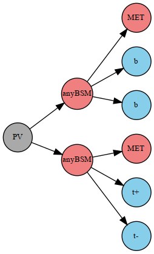  | [many (293)](ListOfAnalyses320WithSuperseded) |
| 7 | **T1btbt**  | `(PV > anyBSM(1),anyBSM(2)),`  &rarr;`(anyBSM(1) > MET,b,t),`  &rarr;`(anyBSM(2) > MET,b,t)` |   | [many (293)](ListOfAnalyses320WithSuperseded) |
| 8 | **T1btqq**  | `(PV > anyBSM(1),anyBSM(2)),`  &rarr;`(anyBSM(1) > MET,b,t),`  &rarr;`(anyBSM(2) > MET,jet,jet)` | 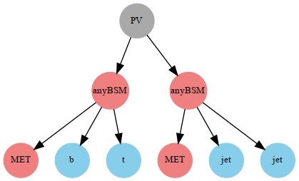  | [many (293)](ListOfAnalyses320WithSuperseded) |
| 9 | **T1bttt**  | `(PV > anyBSM(1),anyBSM(2)),`  &rarr;`(anyBSM(1) > MET,b,t),`  &rarr;`(anyBSM(2) > MET,t+,t-)` |   | [many (293)](ListOfAnalyses320WithSuperseded) |
| 10 | **T1qqtt**  | `(PV > anyBSM(1),anyBSM(2)),`  &rarr;`(anyBSM(1) > MET,jet,jet),`  &rarr;`(anyBSM(2) > MET,t+,t-)` |   | [many (293)](ListOfAnalyses320WithSuperseded) |
| 11 | **T1ttofftt**  | `(PV > anyBSM(1),anyBSM(2)),`  &rarr;`(anyBSM(1) > MET,W,b,t),`  &rarr;`(anyBSM(2) > MET,W,b,t)` | 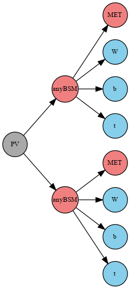  | [many (293)](ListOfAnalyses320WithSuperseded) |
| 12 | **T1tttt**  | `(PV > anyBSM(1),anyBSM(2)),`  &rarr;`(anyBSM(1) > MET,t,t),`  &rarr;`(anyBSM(2) > MET,t,t)` | 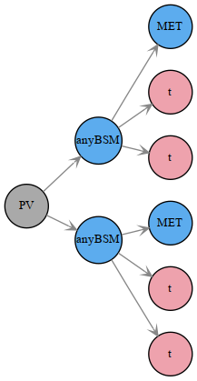  | [many (293)](ListOfAnalyses320WithSuperseded) |
| 13 | **T1ttttoff**  | `(PV > anyBSM(1),anyBSM(2)),`  &rarr;`(anyBSM(1) > MET,W,W,b,b),`  &rarr;`(anyBSM(2) > MET,W,W,b,b)` | 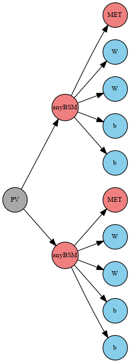  | [many (293)](ListOfAnalyses320WithSuperseded) |
| 14 | **T2Disp**  **T2**  | `(PV > anyBSM(1),anyBSM(2)),`  &rarr;`(anyBSM(1) > MET,jet),`  &rarr;`(anyBSM(2) > MET,jet)` |   | [many (293)](ListOfAnalyses320WithSuperseded) |
| 15 | **T2bb**  | `(PV > anyBSM(1),anyBSM(2)),`  &rarr;`(anyBSM(1) > MET,b),`  &rarr;`(anyBSM(2) > MET,b)` | 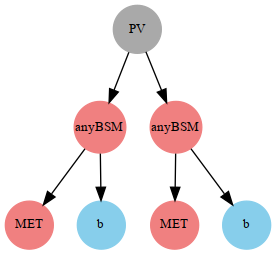  | [many (293)](ListOfAnalyses320WithSuperseded) |
| 16 | **T2bbWWoff**  | `(PV > anyBSM(1),anyBSM(2)),`  &rarr;`(anyBSM(1) > MET,b,l,nu),`  &rarr;`(anyBSM(2) > MET,b,jet,jet)` | 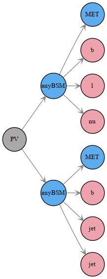  | [many (293)](ListOfAnalyses320WithSuperseded) |
| 17 | **T2bbffff**  | `(PV > anyBSM(1),anyBSM(2)),`  &rarr;`(anyBSM(1) > MET,b,l+,nu),`  &rarr;`(anyBSM(2) > MET,b,l-,nu)` |   | [many (293)](ListOfAnalyses320WithSuperseded) |
| 18 | **T2bt**  | `(PV > anyBSM(1),anyBSM(2)),`  &rarr;`(anyBSM(1) > MET,b),`  &rarr;`(anyBSM(2) > MET,t)` |   | [many (293)](ListOfAnalyses320WithSuperseded) |
| 19 | **T2tt**  | `(PV > anyBSM(1),anyBSM(2)),`  &rarr;`(anyBSM(1) > MET,t),`  &rarr;`(anyBSM(2) > MET,t)` |   | [many (293)](ListOfAnalyses320WithSuperseded) |
| 20 | **T2ttC**  | `(PV > anyBSM(1),anyBSM(2)),`  &rarr;`(anyBSM(1) > MET,b,jet,jet),`  &rarr;`(anyBSM(2) > MET,b,jet,jet)` | 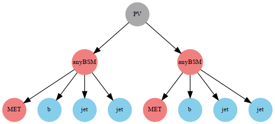  | [many (293)](ListOfAnalyses320WithSuperseded) |
| 21 | **T2ttoff**  **T2bbWW**  | `(PV > anyBSM(1),anyBSM(2)),`  &rarr;`(anyBSM(1) > MET,W,b),`  &rarr;`(anyBSM(2) > MET,W,b)` |   | [many (293)](ListOfAnalyses320WithSuperseded) |
| 22 | **T3GQ**  | `(PV > anyBSM(1),anyBSM(2)),`  &rarr;`(anyBSM(1) > MET,jet),`  &rarr;`(anyBSM(2) > anyBSM(5),jet),`  &rarr;`(anyBSM(5) > MET,jet)` | 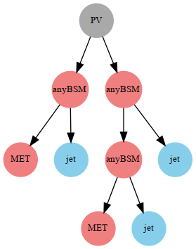  | [many (293)](ListOfAnalyses320WithSuperseded) |
| 23 | **T4bnutau- bnutau**  | `(PV > anyBSM(1),anyBSM(2)),`  &rarr;`(anyBSM(1) > anyBSM(3),b,nu),`  &rarr;`(anyBSM(2) > anyBSM(8),b,nu),`  &rarr;`(anyBSM(3) > MET,ta),`  &rarr;`(anyBSM(8) > MET,ta)` | 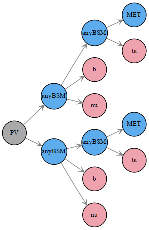  | [many (293)](ListOfAnalyses320WithSuperseded) |
| 24 | **T5**  | `(PV > anyBSM(1),anyBSM(2)),`  &rarr;`(anyBSM(1) > anyBSM(3),jet),`  &rarr;`(anyBSM(2) > anyBSM(7),jet),`  &rarr;`(anyBSM(3) > MET,jet),`  &rarr;`(anyBSM(7) > MET,jet)` |   | [many (293)](ListOfAnalyses320WithSuperseded) |
| 25 | **T5GQ**  | `(PV > anyBSM(1),anyBSM(2)),`  &rarr;`(anyBSM(1) > anyBSM(3),jet),`  &rarr;`(anyBSM(2) > MET,jet,jet),`  &rarr;`(anyBSM(3) > MET,jet,jet)` | 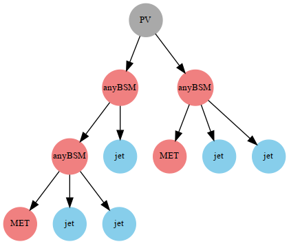  | [many (293)](ListOfAnalyses320WithSuperseded) |
| 26 | **T5HH**  | `(PV > anyBSM(1),anyBSM(2)),`  &rarr;`(anyBSM(1) > anyBSM(3),jet,jet),`  &rarr;`(anyBSM(2) > anyBSM(8),jet,jet),`  &rarr;`(anyBSM(3) > MET,higgs),`  &rarr;`(anyBSM(8) > MET,higgs)` |   | [many (293)](ListOfAnalyses320WithSuperseded) |
| 27 | **T5HZ**  | `(PV > anyBSM(1),anyBSM(2)),`  &rarr;`(anyBSM(1) > anyBSM(3),jet,jet),`  &rarr;`(anyBSM(2) > anyBSM(8),jet,jet),`  &rarr;`(anyBSM(3) > MET,higgs),`  &rarr;`(anyBSM(8) > MET,Z)`  `(PV > anyBSM(1),anyBSM(2)),`  &rarr;`(anyBSM(1) > anyBSM(3),jet,jet),`  &rarr;`(anyBSM(2) > anyBSM(8),jet,jet),`  &rarr;`(anyBSM(3) > MET,higgs),`  &rarr;`(anyBSM(8) > MET,higgs)`  `(PV > anyBSM(1),anyBSM(2)),`  &rarr;`(anyBSM(1) > anyBSM(3),jet,jet),`  &rarr;`(anyBSM(2) > anyBSM(8),jet,jet),`  &rarr;`(anyBSM(3) > MET,Z),`  &rarr;`(anyBSM(8) > MET,Z)` |     | [many (293)](ListOfAnalyses320WithSuperseded) |
| 28 | **T5Hg**  | `(PV > anyBSM(1),anyBSM(2)),`  &rarr;`(anyBSM(1) > anyBSM(3),jet,jet),`  &rarr;`(anyBSM(2) > anyBSM(8),jet,jet),`  &rarr;`(anyBSM(3) > MET,higgs),`  &rarr;`(anyBSM(8) > MET,photon)`  `(PV > anyBSM(1),anyBSM(2)),`  &rarr;`(anyBSM(1) > anyBSM(3),jet,jet),`  &rarr;`(anyBSM(2) > anyBSM(8),jet,jet),`  &rarr;`(anyBSM(3) > MET,photon),`  &rarr;`(anyBSM(8) > MET,photon)`  `(PV > anyBSM(1),anyBSM(2)),`  &rarr;`(anyBSM(1) > anyBSM(3),jet,jet),`  &rarr;`(anyBSM(2) > anyBSM(8),jet,jet),`  &rarr;`(anyBSM(3) > MET,higgs),`  &rarr;`(anyBSM(8) > MET,higgs)` |  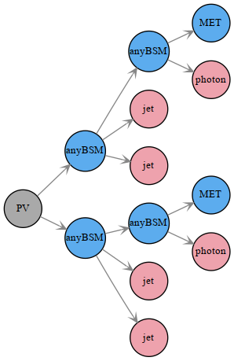   | [many (293)](ListOfAnalyses320WithSuperseded) |
| 29 | **T5WW**  | `(PV > anyBSM(1),anyBSM(2)),`  &rarr;`(anyBSM(1) > anyBSM(3),q,q),`  &rarr;`(anyBSM(2) > anyBSM(8),q,q),`  &rarr;`(anyBSM(3) > MET,W),`  &rarr;`(anyBSM(8) > MET,W)` |   | [many (293)](ListOfAnalyses320WithSuperseded) |
| 30 | **T5WWoff**  | `(PV > anyBSM(1),anyBSM(2)),`  &rarr;`(anyBSM(1) > anyBSM(3),jet,jet),`  &rarr;`(anyBSM(2) > anyBSM(9),jet,jet),`  &rarr;`(anyBSM(3) > MET,l,nu),`  &rarr;`(anyBSM(9) > MET,jet,jet)` | 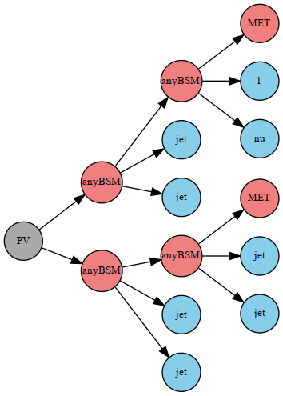  | [many (293)](ListOfAnalyses320WithSuperseded) |
| 31 | **T5WZ**  | `(PV > anyBSM(1),anyBSM(2)),`  &rarr;`(anyBSM(1) > anyBSM(3),jet,jet),`  &rarr;`(anyBSM(2) > anyBSM(8),jet,jet),`  &rarr;`(anyBSM(3) > MET,W+),`  &rarr;`(anyBSM(8) > MET,Z)`  `(PV > anyBSM(1),anyBSM(2)),`  &rarr;`(anyBSM(1) > anyBSM(3),jet,jet),`  &rarr;`(anyBSM(2) > anyBSM(8),jet,jet),`  &rarr;`(anyBSM(3) > MET,W-),`  &rarr;`(anyBSM(8) > MET,Z)` |    | [many (293)](ListOfAnalyses320WithSuperseded) |
| 32 | **T5WZh**  | `(PV > anyBSM(1),anyBSM(2)),`  &rarr;`(anyBSM(1) > anyBSM(3),jet,jet),`  &rarr;`(anyBSM(2) > anyBSM(8),jet,jet),`  &rarr;`(anyBSM(3) > MET,Z),`  &rarr;`(anyBSM(8) > MET,W)`  `(PV > anyBSM(1),anyBSM(2)),`  &rarr;`(anyBSM(1) > anyBSM(3),jet,jet),`  &rarr;`(anyBSM(2) > anyBSM(8),jet,jet),`  &rarr;`(anyBSM(3) > MET,higgs),`  &rarr;`(anyBSM(8) > MET,W)`  `(PV > anyBSM(1),anyBSM(2)),`  &rarr;`(anyBSM(1) > anyBSM(3),jet,jet),`  &rarr;`(anyBSM(2) > anyBSM(8),jet,jet),`  &rarr;`(anyBSM(3) > MET,W),`  &rarr;`(anyBSM(8) > MET,W)`  `(PV > anyBSM(1),anyBSM(2)),`  &rarr;`(anyBSM(1) > anyBSM(3),jet,jet),`  &rarr;`(anyBSM(2) > anyBSM(8),jet,jet),`  &rarr;`(anyBSM(3) > MET,Z),`  &rarr;`(anyBSM(8) > MET,Z)`  `(PV > anyBSM(1),anyBSM(2)),`  &rarr;`(anyBSM(1) > anyBSM(3),jet,jet),`  &rarr;`(anyBSM(2) > anyBSM(8),jet,jet),`  &rarr;`(anyBSM(3) > MET,higgs),`  &rarr;`(anyBSM(8) > MET,higgs)`  `(PV > anyBSM(1),anyBSM(2)),`  &rarr;`(anyBSM(1) > anyBSM(3),jet,jet),`  &rarr;`(anyBSM(2) > anyBSM(8),jet,jet),`  &rarr;`(anyBSM(3) > MET,higgs),`  &rarr;`(anyBSM(8) > MET,Z)` |      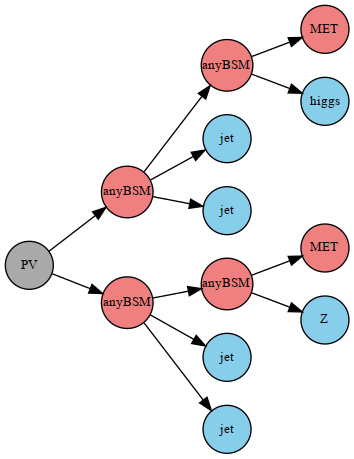  | [many (293)](ListOfAnalyses320WithSuperseded) |
| 33 | **T5ZZ**  | `(PV > anyBSM(1),anyBSM(2)),`  &rarr;`(anyBSM(1) > anyBSM(3),jet,jet),`  &rarr;`(anyBSM(2) > anyBSM(8),jet,jet),`  &rarr;`(anyBSM(3) > MET,Z),`  &rarr;`(anyBSM(8) > MET,Z)` |   | [many (293)](ListOfAnalyses320WithSuperseded) |
| 34 | **T5Zg**  | `(PV > anyBSM(1),anyBSM(2)),`  &rarr;`(anyBSM(1) > anyBSM(3),jet,jet),`  &rarr;`(anyBSM(2) > anyBSM(8),jet,jet),`  &rarr;`(anyBSM(3) > MET,Z),`  &rarr;`(anyBSM(8) > MET,photon)`  `(PV > anyBSM(1),anyBSM(2)),`  &rarr;`(anyBSM(1) > anyBSM(3),jet,jet),`  &rarr;`(anyBSM(2) > anyBSM(8),jet,jet),`  &rarr;`(anyBSM(3) > MET,photon),`  &rarr;`(anyBSM(8) > MET,photon)`  `(PV > anyBSM(1),anyBSM(2)),`  &rarr;`(anyBSM(1) > anyBSM(3),jet,jet),`  &rarr;`(anyBSM(2) > anyBSM(8),jet,jet),`  &rarr;`(anyBSM(3) > MET,Z),`  &rarr;`(anyBSM(8) > MET,Z)` |     | [many (293)](ListOfAnalyses320WithSuperseded) |
| 35 | **T5bbbb**  | `(PV > anyBSM(1),anyBSM(2)),`  &rarr;`(anyBSM(1) > anyBSM(3),b),`  &rarr;`(anyBSM(2) > anyBSM(7),b),`  &rarr;`(anyBSM(3) > MET,b),`  &rarr;`(anyBSM(7) > MET,b)` |   | [many (293)](ListOfAnalyses320WithSuperseded) |
| 36 | **T5bbbbZg**  | `(PV > anyBSM(1),anyBSM(2)),`  &rarr;`(anyBSM(1) > anyBSM(3),b,b),`  &rarr;`(anyBSM(2) > anyBSM(8),b,b),`  &rarr;`(anyBSM(3) > MET,Z),`  &rarr;`(anyBSM(8) > MET,photon)`  `(PV > anyBSM(1),anyBSM(2)),`  &rarr;`(anyBSM(1) > anyBSM(3),b,b),`  &rarr;`(anyBSM(2) > anyBSM(8),b,b),`  &rarr;`(anyBSM(3) > MET,photon),`  &rarr;`(anyBSM(8) > MET,photon)`  `(PV > anyBSM(1),anyBSM(2)),`  &rarr;`(anyBSM(1) > anyBSM(3),b,b),`  &rarr;`(anyBSM(2) > anyBSM(8),b,b),`  &rarr;`(anyBSM(3) > MET,Z),`  &rarr;`(anyBSM(8) > MET,Z)` |     | [many (293)](ListOfAnalyses320WithSuperseded) |
| 37 | **T5bbbt**  | `(PV > anyBSM(1),anyBSM(2)),`  &rarr;`(anyBSM(1) > anyBSM(3),b),`  &rarr;`(anyBSM(2) > anyBSM(7),b),`  &rarr;`(anyBSM(3) > MET,b),`  &rarr;`(anyBSM(7) > MET,t)` |   | [many (293)](ListOfAnalyses320WithSuperseded) |
| 38 | **T5btbt**  | `(PV > anyBSM(1),anyBSM(2)),`  &rarr;`(anyBSM(1) > anyBSM(3),b),`  &rarr;`(anyBSM(2) > anyBSM(7),b),`  &rarr;`(anyBSM(3) > MET,t),`  &rarr;`(anyBSM(7) > MET,t)` |   | [many (293)](ListOfAnalyses320WithSuperseded) |
| 39 | **T5gg**  | `(PV > anyBSM(1),anyBSM(2)),`  &rarr;`(anyBSM(1) > anyBSM(3),jet,jet),`  &rarr;`(anyBSM(2) > anyBSM(8),jet,jet),`  &rarr;`(anyBSM(3) > MET,photon),`  &rarr;`(anyBSM(8) > MET,photon)` |   | [many (293)](ListOfAnalyses320WithSuperseded) |
| 40 | **T5tbtb**  | `(PV > anyBSM(1),anyBSM(2)),`  &rarr;`(anyBSM(1) > anyBSM(3),t),`  &rarr;`(anyBSM(2) > anyBSM(7),t),`  &rarr;`(anyBSM(3) > MET,b),`  &rarr;`(anyBSM(7) > MET,b)` | 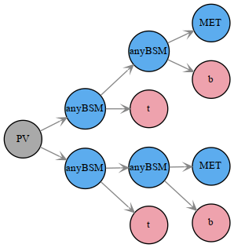  | [many (293)](ListOfAnalyses320WithSuperseded) |
| 41 | **T5tbtt**  | `(PV > anyBSM(1),anyBSM(2)),`  &rarr;`(anyBSM(1) > anyBSM(3),t),`  &rarr;`(anyBSM(2) > anyBSM(7),t+),`  &rarr;`(anyBSM(3) > MET,b),`  &rarr;`(anyBSM(7) > MET,t-)`  `(PV > anyBSM(1),anyBSM(2)),`  &rarr;`(anyBSM(1) > anyBSM(3),t),`  &rarr;`(anyBSM(2) > anyBSM(7),t-),`  &rarr;`(anyBSM(3) > MET,b),`  &rarr;`(anyBSM(7) > MET,t+)` |    | [many (293)](ListOfAnalyses320WithSuperseded) |
| 42 | **T5tctc**  | `(PV > anyBSM(1),anyBSM(2)),`  &rarr;`(anyBSM(1) > anyBSM(3),t),`  &rarr;`(anyBSM(2) > anyBSM(7),t),`  &rarr;`(anyBSM(3) > MET,jet),`  &rarr;`(anyBSM(7) > MET,jet)` |   | [many (293)](ListOfAnalyses320WithSuperseded) |
| 43 | **T5ttbbWW- off**  | `(PV > anyBSM(1),anyBSM(2)),`  &rarr;`(anyBSM(1) > anyBSM(3),b,t),`  &rarr;`(anyBSM(2) > anyBSM(9),b,t),`  &rarr;`(anyBSM(3) > MET,jet,jet),`  &rarr;`(anyBSM(9) > MET,jet,jet)` | 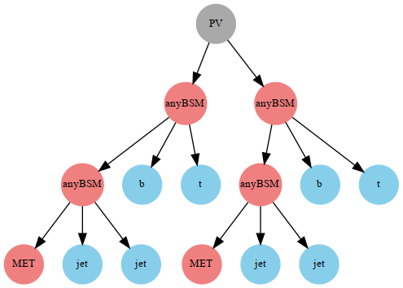  | [many (293)](ListOfAnalyses320WithSuperseded) |
| 44 | **T5ttofftt**  | `(PV > anyBSM(1),anyBSM(2)),`  &rarr;`(anyBSM(1) > anyBSM(3),W,b),`  &rarr;`(anyBSM(2) > anyBSM(8),W,b),`  &rarr;`(anyBSM(3) > MET,t),`  &rarr;`(anyBSM(8) > MET,t)` |   | [many (293)](ListOfAnalyses320WithSuperseded) |
| 45 | **T5tttt**  | `(PV > anyBSM(1),anyBSM(2)),`  &rarr;`(anyBSM(1) > anyBSM(3),t),`  &rarr;`(anyBSM(2) > anyBSM(7),t),`  &rarr;`(anyBSM(3) > MET,t),`  &rarr;`(anyBSM(7) > MET,t)` |   | [many (293)](ListOfAnalyses320WithSuperseded) |
| 46 | **T5ttttZg**  | `(PV > anyBSM(1),anyBSM(2)),`  &rarr;`(anyBSM(1) > anyBSM(3),t,t),`  &rarr;`(anyBSM(2) > anyBSM(8),t,t),`  &rarr;`(anyBSM(3) > MET,Z),`  &rarr;`(anyBSM(8) > MET,photon)`  `(PV > anyBSM(1),anyBSM(2)),`  &rarr;`(anyBSM(1) > anyBSM(3),t,t),`  &rarr;`(anyBSM(2) > anyBSM(8),t,t),`  &rarr;`(anyBSM(3) > MET,photon),`  &rarr;`(anyBSM(8) > MET,photon)`  `(PV > anyBSM(1),anyBSM(2)),`  &rarr;`(anyBSM(1) > anyBSM(3),t,t),`  &rarr;`(anyBSM(2) > anyBSM(8),t,t),`  &rarr;`(anyBSM(3) > MET,Z),`  &rarr;`(anyBSM(8) > MET,Z)` |     | [many (293)](ListOfAnalyses320WithSuperseded) |
| 47 | **T6HHtt**  | `(PV > anyBSM(1),anyBSM(2)),`  &rarr;`(anyBSM(1) > anyBSM(3),higgs),`  &rarr;`(anyBSM(2) > anyBSM(7),higgs),`  &rarr;`(anyBSM(3) > MET,t),`  &rarr;`(anyBSM(7) > MET,t)` |   | [many (293)](ListOfAnalyses320WithSuperseded) |
| 48 | **T6WW**  | `(PV > anyBSM(1),anyBSM(2)),`  &rarr;`(anyBSM(1) > anyBSM(3),jet),`  &rarr;`(anyBSM(2) > anyBSM(7),jet),`  &rarr;`(anyBSM(3) > MET,W),`  &rarr;`(anyBSM(7) > MET,W)` |   | [many (293)](ListOfAnalyses320WithSuperseded) |
| 49 | **T6WWoff**  | `(PV > anyBSM(1),anyBSM(2)),`  &rarr;`(anyBSM(1) > anyBSM(3),jet),`  &rarr;`(anyBSM(2) > anyBSM(8),jet),`  &rarr;`(anyBSM(3) > MET,l,nu),`  &rarr;`(anyBSM(8) > MET,jet,jet)` | 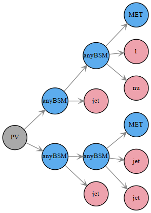  | [many (293)](ListOfAnalyses320WithSuperseded) |
| 50 | **T6WZh**  | `(PV > anyBSM(1),anyBSM(2)),`  &rarr;`(anyBSM(1) > anyBSM(3),jet),`  &rarr;`(anyBSM(2) > anyBSM(7),jet),`  &rarr;`(anyBSM(3) > MET,Z),`  &rarr;`(anyBSM(7) > MET,W)`  `(PV > anyBSM(1),anyBSM(2)),`  &rarr;`(anyBSM(1) > anyBSM(3),jet),`  &rarr;`(anyBSM(2) > anyBSM(7),jet),`  &rarr;`(anyBSM(3) > MET,higgs),`  &rarr;`(anyBSM(7) > MET,W)`  `(PV > anyBSM(1),anyBSM(2)),`  &rarr;`(anyBSM(1) > anyBSM(3),jet),`  &rarr;`(anyBSM(2) > anyBSM(7),jet),`  &rarr;`(anyBSM(3) > MET,W),`  &rarr;`(anyBSM(7) > MET,W)`  `(PV > anyBSM(1),anyBSM(2)),`  &rarr;`(anyBSM(1) > anyBSM(3),jet),`  &rarr;`(anyBSM(2) > anyBSM(7),jet),`  &rarr;`(anyBSM(3) > MET,Z),`  &rarr;`(anyBSM(7) > MET,Z)`  `(PV > anyBSM(1),anyBSM(2)),`  &rarr;`(anyBSM(1) > anyBSM(3),jet),`  &rarr;`(anyBSM(2) > anyBSM(7),jet),`  &rarr;`(anyBSM(3) > MET,higgs),`  &rarr;`(anyBSM(7) > MET,higgs)`  `(PV > anyBSM(1),anyBSM(2)),`  &rarr;`(anyBSM(1) > anyBSM(3),jet),`  &rarr;`(anyBSM(2) > anyBSM(7),jet),`  &rarr;`(anyBSM(3) > MET,Z),`  &rarr;`(anyBSM(7) > MET,higgs)` |      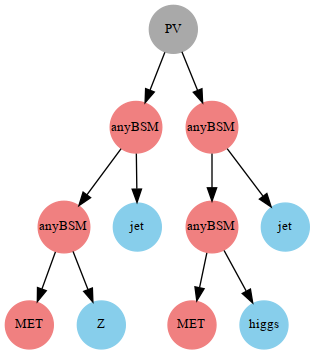  | [many (293)](ListOfAnalyses320WithSuperseded) |
| 51 | **T6ZZ**  | `(PV > anyBSM(1),anyBSM(2)),`  &rarr;`(anyBSM(1) > anyBSM(3),jet),`  &rarr;`(anyBSM(2) > anyBSM(7),jet),`  &rarr;`(anyBSM(3) > MET,Z),`  &rarr;`(anyBSM(7) > MET,Z)` |   | [many (293)](ListOfAnalyses320WithSuperseded) |
| 52 | **T6ZZofftt**  | `(PV > anyBSM(1),anyBSM(2)),`  &rarr;`(anyBSM(1) > anyBSM(3),l+,l-),`  &rarr;`(anyBSM(2) > anyBSM(8),l+,l-),`  &rarr;`(anyBSM(3) > MET,t),`  &rarr;`(anyBSM(8) > MET,t)` |   | [many (293)](ListOfAnalyses320WithSuperseded) |
| 53 | **T6ZZtt**  | `(PV > anyBSM(1),anyBSM(2)),`  &rarr;`(anyBSM(1) > anyBSM(3),Z),`  &rarr;`(anyBSM(2) > anyBSM(7),Z),`  &rarr;`(anyBSM(3) > MET,t),`  &rarr;`(anyBSM(7) > MET,t)` |   | [many (293)](ListOfAnalyses320WithSuperseded) |
| 54 | **T6bbHH**  | `(PV > anyBSM(1),anyBSM(2)),`  &rarr;`(anyBSM(1) > anyBSM(3),b),`  &rarr;`(anyBSM(2) > anyBSM(7),b),`  &rarr;`(anyBSM(3) > MET,higgs),`  &rarr;`(anyBSM(7) > MET,higgs)` |   | [many (293)](ListOfAnalyses320WithSuperseded) |
| 55 | **T6bbWW**  | `(PV > anyBSM(1),anyBSM(2)),`  &rarr;`(anyBSM(1) > anyBSM(3),b),`  &rarr;`(anyBSM(2) > anyBSM(7),b),`  &rarr;`(anyBSM(3) > MET,W),`  &rarr;`(anyBSM(7) > MET,W)` |   | [many (293)](ListOfAnalyses320WithSuperseded) |
| 56 | **T6bbWWoff**  | `(PV > anyBSM(1),anyBSM(2)),`  &rarr;`(anyBSM(1) > anyBSM(3),b),`  &rarr;`(anyBSM(2) > anyBSM(8),b),`  &rarr;`(anyBSM(3) > MET,jet,jet),`  &rarr;`(anyBSM(8) > MET,jet,jet)` | 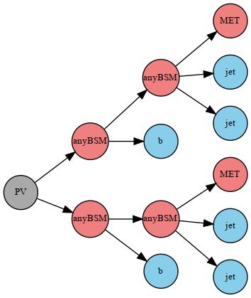  | [many (293)](ListOfAnalyses320WithSuperseded) |
| 57 | **T6gg**  | `(PV > anyBSM(1),anyBSM(2)),`  &rarr;`(anyBSM(1) > anyBSM(3),jet),`  &rarr;`(anyBSM(2) > anyBSM(7),jet),`  &rarr;`(anyBSM(3) > MET,photon),`  &rarr;`(anyBSM(7) > MET,photon)` |   | [many (293)](ListOfAnalyses320WithSuperseded) |
| 58 | **T6ttWW**  | `(PV > anyBSM(1),anyBSM(2)),`  &rarr;`(anyBSM(1) > anyBSM(3),t),`  &rarr;`(anyBSM(2) > anyBSM(7),t),`  &rarr;`(anyBSM(3) > MET,W),`  &rarr;`(anyBSM(7) > MET,W)` |   | [many (293)](ListOfAnalyses320WithSuperseded) |
| 59 | **T6ttWWoff**  | `(PV > anyBSM(1),anyBSM(2)),`  &rarr;`(anyBSM(1) > anyBSM(3),t),`  &rarr;`(anyBSM(2) > anyBSM(8),t),`  &rarr;`(anyBSM(3) > MET,l,nu),`  &rarr;`(anyBSM(8) > MET,l,nu)` | 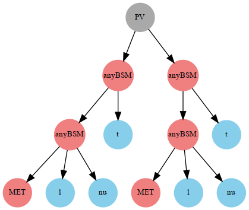  | [many (293)](ListOfAnalyses320WithSuperseded) |
| 60 | **T6ttZg**  | `(PV > anyBSM(1),anyBSM(2)),`  &rarr;`(anyBSM(1) > anyBSM(3),t),`  &rarr;`(anyBSM(2) > anyBSM(7),t),`  &rarr;`(anyBSM(3) > MET,Z),`  &rarr;`(anyBSM(7) > MET,photon)`  `(PV > anyBSM(1),anyBSM(2)),`  &rarr;`(anyBSM(1) > anyBSM(3),t),`  &rarr;`(anyBSM(2) > anyBSM(7),t),`  &rarr;`(anyBSM(3) > MET,photon),`  &rarr;`(anyBSM(7) > MET,photon)`  `(PV > anyBSM(1),anyBSM(2)),`  &rarr;`(anyBSM(1) > anyBSM(3),t),`  &rarr;`(anyBSM(2) > anyBSM(7),t),`  &rarr;`(anyBSM(3) > MET,Z),`  &rarr;`(anyBSM(7) > MET,Z)` |     | [many (293)](ListOfAnalyses320WithSuperseded) |
| 61 | **T6ttoffWW**  | `(PV > anyBSM(1),anyBSM(2)),`  &rarr;`(anyBSM(1) > anyBSM(3),W,b),`  &rarr;`(anyBSM(2) > anyBSM(8),W,b),`  &rarr;`(anyBSM(3) > MET,W),`  &rarr;`(anyBSM(8) > MET,W)` | 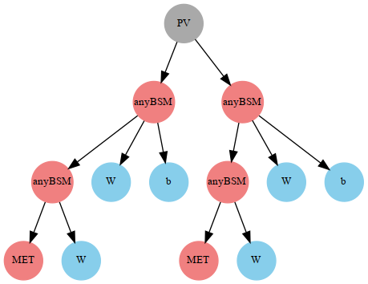  | [many (293)](ListOfAnalyses320WithSuperseded) |
| 62 | **TChiChipm- SlepL**  | `(PV > anyBSM(1),anyBSM(2)),`  &rarr;`(anyBSM(1) > anyBSM(3),e+),`  &rarr;`(anyBSM(2) > anyBSM(7),L),`  &rarr;`(anyBSM(3) > MET,e-),`  &rarr;`(anyBSM(7) > MET,nu)`  `(PV > anyBSM(1),anyBSM(2)),`  &rarr;`(anyBSM(1) > anyBSM(3),e+),`  &rarr;`(anyBSM(2) > anyBSM(7),nu),`  &rarr;`(anyBSM(3) > MET,e-),`  &rarr;`(anyBSM(7) > MET,L)`  `(PV > anyBSM(1),anyBSM(2)),`  &rarr;`(anyBSM(1) > anyBSM(3),e-),`  &rarr;`(anyBSM(2) > anyBSM(7),L),`  &rarr;`(anyBSM(3) > MET,e+),`  &rarr;`(anyBSM(7) > MET,nu)`  `(PV > anyBSM(1),anyBSM(2)),`  &rarr;`(anyBSM(1) > anyBSM(3),e-),`  &rarr;`(anyBSM(2) > anyBSM(7),nu),`  &rarr;`(anyBSM(3) > MET,e+),`  &rarr;`(anyBSM(7) > MET,L)`  `(PV > anyBSM(1),anyBSM(2)),`  &rarr;`(anyBSM(1) > anyBSM(3),mu+),`  &rarr;`(anyBSM(2) > anyBSM(7),L),`  &rarr;`(anyBSM(3) > MET,mu-),`  &rarr;`(anyBSM(7) > MET,nu)`  `(PV > anyBSM(1),anyBSM(2)),`  &rarr;`(anyBSM(1) > anyBSM(3),mu+),`  &rarr;`(anyBSM(2) > anyBSM(7),nu),`  &rarr;`(anyBSM(3) > MET,mu-),`  &rarr;`(anyBSM(7) > MET,L)`  `(PV > anyBSM(1),anyBSM(2)),`  &rarr;`(anyBSM(1) > anyBSM(3),mu-),`  &rarr;`(anyBSM(2) > anyBSM(7),L),`  &rarr;`(anyBSM(3) > MET,mu+),`  &rarr;`(anyBSM(7) > MET,nu)`  `(PV > anyBSM(1),anyBSM(2)),`  &rarr;`(anyBSM(1) > anyBSM(3),mu-),`  &rarr;`(anyBSM(2) > anyBSM(7),nu),`  &rarr;`(anyBSM(3) > MET,mu+),`  &rarr;`(anyBSM(7) > MET,L)`  `(PV > anyBSM(1),anyBSM(2)),`  &rarr;`(anyBSM(1) > anyBSM(3),ta+),`  &rarr;`(anyBSM(2) > anyBSM(7),L),`  &rarr;`(anyBSM(3) > MET,ta-),`  &rarr;`(anyBSM(7) > MET,nu)`  `(PV > anyBSM(1),anyBSM(2)),`  &rarr;`(anyBSM(1) > anyBSM(3),ta+),`  &rarr;`(anyBSM(2) > anyBSM(7),nu),`  &rarr;`(anyBSM(3) > MET,ta-),`  &rarr;`(anyBSM(7) > MET,L)`  `(PV > anyBSM(1),anyBSM(2)),`  &rarr;`(anyBSM(1) > anyBSM(3),ta-),`  &rarr;`(anyBSM(2) > anyBSM(7),L),`  &rarr;`(anyBSM(3) > MET,ta+),`  &rarr;`(anyBSM(7) > MET,nu)`  `(PV > anyBSM(1),anyBSM(2)),`  &rarr;`(anyBSM(1) > anyBSM(3),ta-),`  &rarr;`(anyBSM(2) > anyBSM(7),nu),`  &rarr;`(anyBSM(3) > MET,ta+),`  &rarr;`(anyBSM(7) > MET,L)` |              | [many (293)](ListOfAnalyses320WithSuperseded) |
| 63 | **TChiChipm- SlepSlep**  | `(PV > anyBSM(1),anyBSM(2)),`  &rarr;`(anyBSM(1) > anyBSM(3),e+),`  &rarr;`(anyBSM(2) > anyBSM(7),l),`  &rarr;`(anyBSM(3) > MET,e-),`  &rarr;`(anyBSM(7) > MET,nu)`  `(PV > anyBSM(1),anyBSM(2)),`  &rarr;`(anyBSM(1) > anyBSM(3),e-),`  &rarr;`(anyBSM(2) > anyBSM(7),l),`  &rarr;`(anyBSM(3) > MET,e+),`  &rarr;`(anyBSM(7) > MET,nu)`  `(PV > anyBSM(1),anyBSM(2)),`  &rarr;`(anyBSM(1) > anyBSM(3),e+),`  &rarr;`(anyBSM(2) > anyBSM(7),nu),`  &rarr;`(anyBSM(3) > MET,e-),`  &rarr;`(anyBSM(7) > MET,l)`  `(PV > anyBSM(1),anyBSM(2)),`  &rarr;`(anyBSM(1) > anyBSM(3),e-),`  &rarr;`(anyBSM(2) > anyBSM(7),nu),`  &rarr;`(anyBSM(3) > MET,e+),`  &rarr;`(anyBSM(7) > MET,l)`  `(PV > anyBSM(1),anyBSM(2)),`  &rarr;`(anyBSM(1) > anyBSM(3),mu+),`  &rarr;`(anyBSM(2) > anyBSM(7),l),`  &rarr;`(anyBSM(3) > MET,mu-),`  &rarr;`(anyBSM(7) > MET,nu)`  `(PV > anyBSM(1),anyBSM(2)),`  &rarr;`(anyBSM(1) > anyBSM(3),mu-),`  &rarr;`(anyBSM(2) > anyBSM(7),l),`  &rarr;`(anyBSM(3) > MET,mu+),`  &rarr;`(anyBSM(7) > MET,nu)`  `(PV > anyBSM(1),anyBSM(2)),`  &rarr;`(anyBSM(1) > anyBSM(3),mu+),`  &rarr;`(anyBSM(2) > anyBSM(7),nu),`  &rarr;`(anyBSM(3) > MET,mu-),`  &rarr;`(anyBSM(7) > MET,l)`  `(PV > anyBSM(1),anyBSM(2)),`  &rarr;`(anyBSM(1) > anyBSM(3),mu-),`  &rarr;`(anyBSM(2) > anyBSM(7),nu),`  &rarr;`(anyBSM(3) > MET,mu+),`  &rarr;`(anyBSM(7) > MET,l)` |          | [many (293)](ListOfAnalyses320WithSuperseded) |
| 64 | **TChiChipm- SlepStau**  | `(PV > anyBSM(1),anyBSM(2)),`  &rarr;`(anyBSM(1) > anyBSM(3),L),`  &rarr;`(anyBSM(2) > anyBSM(7),nu),`  &rarr;`(anyBSM(3) > MET,L),`  &rarr;`(anyBSM(7) > MET,ta)` |   | [many (293)](ListOfAnalyses320WithSuperseded) |
| 65 | **TChiChipm- StauL**  | `(PV > anyBSM(1),anyBSM(2)),`  &rarr;`(anyBSM(1) > anyBSM(3),nu),`  &rarr;`(anyBSM(2) > anyBSM(7),ta+),`  &rarr;`(anyBSM(3) > MET,ta),`  &rarr;`(anyBSM(7) > MET,ta-)`  `(PV > anyBSM(1),anyBSM(2)),`  &rarr;`(anyBSM(1) > anyBSM(3),ta),`  &rarr;`(anyBSM(2) > anyBSM(7),ta+),`  &rarr;`(anyBSM(3) > MET,nu),`  &rarr;`(anyBSM(7) > MET,ta-)`  `(PV > anyBSM(1),anyBSM(2)),`  &rarr;`(anyBSM(1) > anyBSM(3),nu),`  &rarr;`(anyBSM(2) > anyBSM(7),ta-),`  &rarr;`(anyBSM(3) > MET,ta),`  &rarr;`(anyBSM(7) > MET,ta+)`  `(PV > anyBSM(1),anyBSM(2)),`  &rarr;`(anyBSM(1) > anyBSM(3),ta),`  &rarr;`(anyBSM(2) > anyBSM(7),ta-),`  &rarr;`(anyBSM(3) > MET,nu),`  &rarr;`(anyBSM(7) > MET,ta+)` |      | [many (293)](ListOfAnalyses320WithSuperseded) |
| 66 | **TChiChipm- StauStau**  | `(PV > anyBSM(1),anyBSM(2)),`  &rarr;`(anyBSM(1) > anyBSM(3),ta+),`  &rarr;`(anyBSM(2) > anyBSM(7),nu),`  &rarr;`(anyBSM(3) > MET,ta-),`  &rarr;`(anyBSM(7) > MET,ta)`  `(PV > anyBSM(1),anyBSM(2)),`  &rarr;`(anyBSM(1) > anyBSM(3),ta-),`  &rarr;`(anyBSM(2) > anyBSM(7),nu),`  &rarr;`(anyBSM(3) > MET,ta+),`  &rarr;`(anyBSM(7) > MET,ta)` |    | [many (293)](ListOfAnalyses320WithSuperseded) |
| 67 | **TChiH**  | `(PV > anyBSM(1),anyBSM(2)),`  &rarr;`(anyBSM(1) > MET,Z),`  &rarr;`(anyBSM(2) > MET,Z)`  `(PV > anyBSM(1),anyBSM(2)),`  &rarr;`(anyBSM(1) > MET,higgs),`  &rarr;`(anyBSM(2) > MET,higgs)`  `(PV > anyBSM(1),anyBSM(2)),`  &rarr;`(anyBSM(1) > MET,higgs),`  &rarr;`(anyBSM(2) > MET,Z)` |   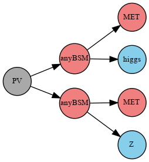  | [many (293)](ListOfAnalyses320WithSuperseded) |
| 68 | **TChiHH**  | `(PV > anyBSM(1),anyBSM(2)),`  &rarr;`(anyBSM(1) > MET,higgs),`  &rarr;`(anyBSM(2) > MET,higgs)` |   | [many (293)](ListOfAnalyses320WithSuperseded) |
| 69 | **TChiISR**  | `(PV > MET,MET)` | 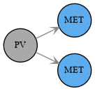  | [many (293)](ListOfAnalyses320WithSuperseded) |
| 70 | **TChiQ**  | `(PV > anyBSM(1),MET),`  &rarr;`(anyBSM(1) > MET,jet)` | 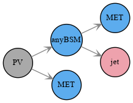  | [many (293)](ListOfAnalyses320WithSuperseded) |
| 71 | **TChiWH**  | `(PV > anyBSM(1),anyBSM(2)),`  &rarr;`(anyBSM(1) > MET,W),`  &rarr;`(anyBSM(2) > MET,higgs)` | 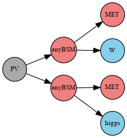  | [many (293)](ListOfAnalyses320WithSuperseded) |
| 72 | **TChiWH4q**  | `(PV > anyBSM(1),anyBSM(2)),`  &rarr;`(anyBSM(1) > anyBSM(3),W),`  &rarr;`(anyBSM(2) > anyBSM(8),higgs),`  &rarr;`(anyBSM(3) > MET,q,q),`  &rarr;`(anyBSM(8) > MET,q,q)` |   | [many (293)](ListOfAnalyses320WithSuperseded) |
| 73 | **TChiWHqq**  | `(PV > anyBSM(1),anyBSM(2)),`  &rarr;`(anyBSM(1) > MET,W),`  &rarr;`(anyBSM(2) > anyBSM(5),higgs),`  &rarr;`(anyBSM(5) > MET,q,q)` | 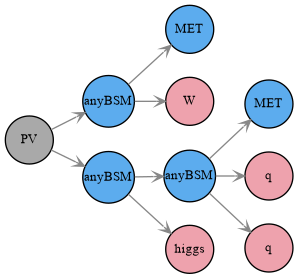  | [many (293)](ListOfAnalyses320WithSuperseded) |
| 74 | **TChiWISR- ll**  | `(PV > anyBSM(1),MET),`  &rarr;`(anyBSM(1) > MET,l,nu)` | 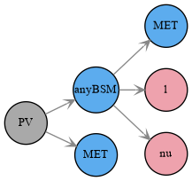  | [many (293)](ListOfAnalyses320WithSuperseded) |
| 75 | **TChiWW**  | `(PV > anyBSM(1),anyBSM(2)),`  &rarr;`(anyBSM(1) > MET,W+),`  &rarr;`(anyBSM(2) > MET,W-)` |   | [many (293)](ListOfAnalyses320WithSuperseded) |
| 76 | **TChiWWIS- Rqq**  | `(PV > anyBSM(1),anyBSM(3)),`  &rarr;`(anyBSM(1) > MET,q,q),`  &rarr;`(anyBSM(3) > MET,q,q)` |   | [many (293)](ListOfAnalyses320WithSuperseded) |
| 77 | **TChiWWoff**  | `(PV > anyBSM(1),anyBSM(2)),`  &rarr;`(anyBSM(1) > MET,l+,nu),`  &rarr;`(anyBSM(2) > MET,l-,nu)` |   | [many (293)](ListOfAnalyses320WithSuperseded) |
| 78 | **TChiWZ**  | `(PV > anyBSM(1),anyBSM(2)),`  &rarr;`(anyBSM(1) > MET,W),`  &rarr;`(anyBSM(2) > MET,Z)` |   | [many (293)](ListOfAnalyses320WithSuperseded) |
| 79 | **TChiWZoff**  | `(PV > anyBSM(1),anyBSM(2)),`  &rarr;`(anyBSM(1) > MET,mu+,mu-),`  &rarr;`(anyBSM(2) > MET,l,nu)`  `(PV > anyBSM(1),anyBSM(2)),`  &rarr;`(anyBSM(1) > MET,e+,e-),`  &rarr;`(anyBSM(2) > MET,l,nu)`  `(PV > anyBSM(1),anyBSM(2)),`  &rarr;`(anyBSM(1) > MET,mu+,mu-),`  &rarr;`(anyBSM(2) > MET,jet,jet)`  `(PV > anyBSM(1),anyBSM(2)),`  &rarr;`(anyBSM(1) > MET,e+,e-),`  &rarr;`(anyBSM(2) > MET,jet,jet)` |      | [many (293)](ListOfAnalyses320WithSuperseded) |
| 80 | **TChiWqqH**  | `(PV > anyBSM(1),anyBSM(2)),`  &rarr;`(anyBSM(1) > anyBSM(3),W),`  &rarr;`(anyBSM(2) > MET,higgs),`  &rarr;`(anyBSM(3) > MET,q,q)` | 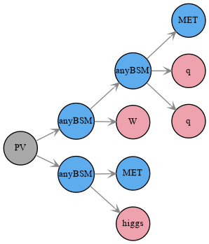  | [many (293)](ListOfAnalyses320WithSuperseded) |
| 81 | **TChiZH**  | `(PV > anyBSM(1),anyBSM(2)),`  &rarr;`(anyBSM(1) > MET,Z),`  &rarr;`(anyBSM(2) > MET,higgs)` | 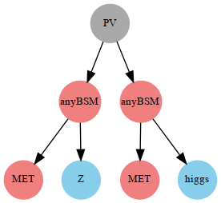  | [many (293)](ListOfAnalyses320WithSuperseded) |
| 82 | **TChiZISR- ll**  | `(PV > anyBSM(1),MET),`  &rarr;`(anyBSM(1) > MET,l+,l-)` | 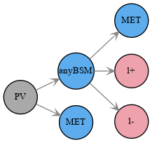  | [many (293)](ListOfAnalyses320WithSuperseded) |
| 83 | **TChiZISR- qq**  | `(PV > anyBSM(1),MET),`  &rarr;`(anyBSM(1) > MET,q,q)` |   | [many (293)](ListOfAnalyses320WithSuperseded) |
| 84 | **TChiZZ**  | `(PV > anyBSM(1),anyBSM(2)),`  &rarr;`(anyBSM(1) > MET,Z),`  &rarr;`(anyBSM(2) > MET,Z)` |   | [many (293)](ListOfAnalyses320WithSuperseded) |
| 85 | **TChiZoff**  | `(PV > anyBSM(1),MET),`  &rarr;`(anyBSM(1) > MET,e+,e-)`  `(PV > anyBSM(1),MET),`  &rarr;`(anyBSM(1) > MET,mu+,mu-)` |    | [many (293)](ListOfAnalyses320WithSuperseded) |
| 86 | **TChipChim- SlepSlep**  | `(PV > anyBSM(1),anyBSM(2)),`  &rarr;`(anyBSM(1) > anyBSM(3),mu+),`  &rarr;`(anyBSM(2) > anyBSM(7),mu-),`  &rarr;`(anyBSM(3) > MET,nu),`  &rarr;`(anyBSM(7) > MET,nu)`  `(PV > anyBSM(1),anyBSM(2)),`  &rarr;`(anyBSM(1) > anyBSM(3),nu),`  &rarr;`(anyBSM(2) > anyBSM(7),nu),`  &rarr;`(anyBSM(3) > MET,mu+),`  &rarr;`(anyBSM(7) > MET,mu-)`  `(PV > anyBSM(1),anyBSM(2)),`  &rarr;`(anyBSM(1) > anyBSM(3),mu+),`  &rarr;`(anyBSM(2) > anyBSM(7),nu),`  &rarr;`(anyBSM(3) > MET,nu),`  &rarr;`(anyBSM(7) > MET,mu-)`  `(PV > anyBSM(1),anyBSM(2)),`  &rarr;`(anyBSM(1) > anyBSM(3),e+),`  &rarr;`(anyBSM(2) > anyBSM(7),e-),`  &rarr;`(anyBSM(3) > MET,nu),`  &rarr;`(anyBSM(7) > MET,nu)`  `(PV > anyBSM(1),anyBSM(2)),`  &rarr;`(anyBSM(1) > anyBSM(3),nu),`  &rarr;`(anyBSM(2) > anyBSM(7),nu),`  &rarr;`(anyBSM(3) > MET,e+),`  &rarr;`(anyBSM(7) > MET,e-)`  `(PV > anyBSM(1),anyBSM(2)),`  &rarr;`(anyBSM(1) > anyBSM(3),e+),`  &rarr;`(anyBSM(2) > anyBSM(7),nu),`  &rarr;`(anyBSM(3) > MET,nu),`  &rarr;`(anyBSM(7) > MET,e-)`  `(PV > anyBSM(1),anyBSM(2)),`  &rarr;`(anyBSM(1) > anyBSM(3),nu),`  &rarr;`(anyBSM(2) > anyBSM(7),nu),`  &rarr;`(anyBSM(3) > MET,mu+),`  &rarr;`(anyBSM(7) > MET,e-)`  `(PV > anyBSM(1),anyBSM(2)),`  &rarr;`(anyBSM(1) > anyBSM(3),nu),`  &rarr;`(anyBSM(2) > anyBSM(7),e-),`  &rarr;`(anyBSM(3) > MET,mu+),`  &rarr;`(anyBSM(7) > MET,nu)`  `(PV > anyBSM(1),anyBSM(2)),`  &rarr;`(anyBSM(1) > anyBSM(3),mu+),`  &rarr;`(anyBSM(2) > anyBSM(7),e-),`  &rarr;`(anyBSM(3) > MET,nu),`  &rarr;`(anyBSM(7) > MET,nu)`  `(PV > anyBSM(1),anyBSM(2)),`  &rarr;`(anyBSM(1) > anyBSM(3),mu+),`  &rarr;`(anyBSM(2) > anyBSM(7),nu),`  &rarr;`(anyBSM(3) > MET,nu),`  &rarr;`(anyBSM(7) > MET,e-)`  `(PV > anyBSM(1),anyBSM(2)),`  &rarr;`(anyBSM(1) > anyBSM(3),nu),`  &rarr;`(anyBSM(2) > anyBSM(7),nu),`  &rarr;`(anyBSM(3) > MET,mu-),`  &rarr;`(anyBSM(7) > MET,e+)`  `(PV > anyBSM(1),anyBSM(2)),`  &rarr;`(anyBSM(1) > anyBSM(3),nu),`  &rarr;`(anyBSM(2) > anyBSM(7),e+),`  &rarr;`(anyBSM(3) > MET,mu-),`  &rarr;`(anyBSM(7) > MET,nu)`  `(PV > anyBSM(1),anyBSM(2)),`  &rarr;`(anyBSM(1) > anyBSM(3),mu-),`  &rarr;`(anyBSM(2) > anyBSM(7),e+),`  &rarr;`(anyBSM(3) > MET,nu),`  &rarr;`(anyBSM(7) > MET,nu)`  `(PV > anyBSM(1),anyBSM(2)),`  &rarr;`(anyBSM(1) > anyBSM(3),mu-),`  &rarr;`(anyBSM(2) > anyBSM(7),nu),`  &rarr;`(anyBSM(3) > MET,nu),`  &rarr;`(anyBSM(7) > MET,e+)` |        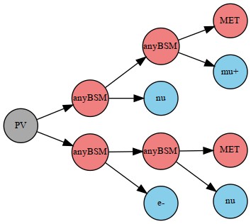        | [many (293)](ListOfAnalyses320WithSuperseded) |
| 87 | **TChipChim- SlepSnu**  | `(PV > anyBSM(1),anyBSM(2)),`  &rarr;`(anyBSM(1) > anyBSM(3),L-),`  &rarr;`(anyBSM(2) > anyBSM(7),nu),`  &rarr;`(anyBSM(3) > MET,nu),`  &rarr;`(anyBSM(7) > MET,L+)`  `(PV > anyBSM(1),anyBSM(2)),`  &rarr;`(anyBSM(1) > anyBSM(3),L+),`  &rarr;`(anyBSM(2) > anyBSM(7),nu),`  &rarr;`(anyBSM(3) > MET,nu),`  &rarr;`(anyBSM(7) > MET,L-)`  `(PV > anyBSM(1),anyBSM(2)),`  &rarr;`(anyBSM(1) > anyBSM(3),L+),`  &rarr;`(anyBSM(2) > anyBSM(7),L-),`  &rarr;`(anyBSM(3) > MET,nu),`  &rarr;`(anyBSM(7) > MET,nu)`  `(PV > anyBSM(1),anyBSM(2)),`  &rarr;`(anyBSM(1) > anyBSM(3),nu),`  &rarr;`(anyBSM(2) > anyBSM(7),nu),`  &rarr;`(anyBSM(3) > MET,L+),`  &rarr;`(anyBSM(7) > MET,L-)` |      | [many (293)](ListOfAnalyses320WithSuperseded) |
| 88 | **TChipChim- StauSnu**  | `(PV > anyBSM(1),anyBSM(2)),`  &rarr;`(anyBSM(1) > anyBSM(3),nu),`  &rarr;`(anyBSM(2) > anyBSM(7),ta-),`  &rarr;`(anyBSM(3) > MET,ta+),`  &rarr;`(anyBSM(7) > MET,nu)`  `(PV > anyBSM(1),anyBSM(2)),`  &rarr;`(anyBSM(1) > anyBSM(3),nu),`  &rarr;`(anyBSM(2) > anyBSM(7),ta+),`  &rarr;`(anyBSM(3) > MET,ta-),`  &rarr;`(anyBSM(7) > MET,nu)`  `(PV > anyBSM(1),anyBSM(2)),`  &rarr;`(anyBSM(1) > anyBSM(3),nu),`  &rarr;`(anyBSM(2) > anyBSM(7),nu),`  &rarr;`(anyBSM(3) > MET,ta+),`  &rarr;`(anyBSM(7) > MET,ta-)`  `(PV > anyBSM(1),anyBSM(2)),`  &rarr;`(anyBSM(1) > anyBSM(3),ta+),`  &rarr;`(anyBSM(2) > anyBSM(7),ta-),`  &rarr;`(anyBSM(3) > MET,nu),`  &rarr;`(anyBSM(7) > MET,nu)` |      | [many (293)](ListOfAnalyses320WithSuperseded) |
| 89 | **TChipChi- mgg**  | `(PV > anyBSM(1),anyBSM(2)),`  &rarr;`(anyBSM(1) > anyBSM(3),W),`  &rarr;`(anyBSM(2) > anyBSM(7),Z),`  &rarr;`(anyBSM(3) > MET,photon),`  &rarr;`(anyBSM(7) > MET,photon)`  `(PV > anyBSM(1),anyBSM(2)),`  &rarr;`(anyBSM(1) > anyBSM(3),W),`  &rarr;`(anyBSM(2) > anyBSM(7),W),`  &rarr;`(anyBSM(3) > MET,photon),`  &rarr;`(anyBSM(7) > MET,photon)`  `(PV > anyBSM(1),anyBSM(2)),`  &rarr;`(anyBSM(1) > anyBSM(3),W),`  &rarr;`(anyBSM(2) > anyBSM(7),higgs),`  &rarr;`(anyBSM(3) > MET,photon),`  &rarr;`(anyBSM(7) > MET,photon)` |     | [many (293)](ListOfAnalyses320WithSuperseded) |
| 90 | **TDTM1F**  | `(PV > C1(1),C1(2)),`  &rarr;`(C1(1) > MET,*anySM),`  &rarr;`(C1(2) > MET,*anySM)` | 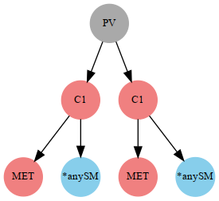  | [many (293)](ListOfAnalyses320WithSuperseded) |
| 91 | **TDTM1S**  | `(PV > Hpm(1),Hpm(2)),`  &rarr;`(Hpm(1) > MET,*anySM),`  &rarr;`(Hpm(2) > MET,*anySM)` | 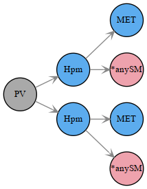  | [many (293)](ListOfAnalyses320WithSuperseded) |
| 92 | **TDTM2F**  | `(PV > C1(1),MET),`  &rarr;`(C1(1) > MET,*anySM)` | 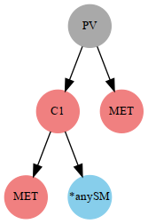  | [many (293)](ListOfAnalyses320WithSuperseded) |
| 93 | **TDTM2S**  | `(PV > Hpm(1),MET),`  &rarr;`(Hpm(1) > MET,*anySM)` | 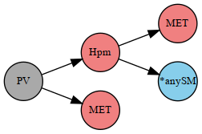  | [many (293)](ListOfAnalyses320WithSuperseded) |
| 94 | **TGQ**  | `(PV > anyBSM(1),anyBSM(2)),`  &rarr;`(anyBSM(1) > MET,jet),`  &rarr;`(anyBSM(2) > MET,jet,jet)` | 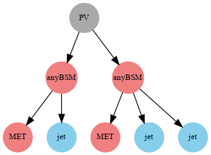  | [many (293)](ListOfAnalyses320WithSuperseded) |
| 95 | **TGQbbq**  | `(PV > anyBSM(1),anyBSM(2)),`  &rarr;`(anyBSM(1) > MET,b,b),`  &rarr;`(anyBSM(2) > MET,jet)` | 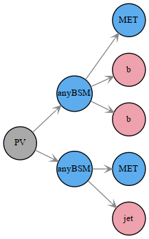  | [many (293)](ListOfAnalyses320WithSuperseded) |
| 96 | **TGQbtq**  | `(PV > anyBSM(1),anyBSM(2)),`  &rarr;`(anyBSM(1) > MET,b,t),`  &rarr;`(anyBSM(2) > MET,jet)` | 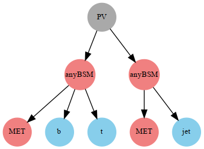  | [many (293)](ListOfAnalyses320WithSuperseded) |
| 97 | **TGQqtt**  | `(PV > anyBSM(1),anyBSM(2)),`  &rarr;`(anyBSM(1) > MET,jet),`  &rarr;`(anyBSM(2) > MET,t+,t-)` | 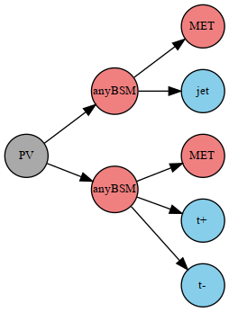  | [many (293)](ListOfAnalyses320WithSuperseded) |
| 98 | **THSCPM1**  **THSCPM1b**  | `(PV > HSCP,HSCP)` | 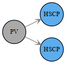  | [many (293)](ListOfAnalyses320WithSuperseded) |
| 99 | **THSCPM10**  | `(PV > HSCP,anyBSM(2)),`  &rarr;`(anyBSM(2) > HSCP,anySM)` | 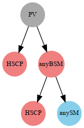  | [many (293)](ListOfAnalyses320WithSuperseded) |
| 100 | **THSCPM11**  | `(PV > HSCP,anyBSM(2)),`  &rarr;`(anyBSM(2) > HSCP,anySM,anySM)` | 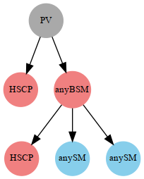  | [many (293)](ListOfAnalyses320WithSuperseded) |
| 101 | **THSCPM2**  | `(PV > HSCP,MET)` | 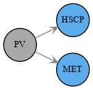  | [many (293)](ListOfAnalyses320WithSuperseded) |
| 102 | **THSCPM2b**  | `(PV > Inclusive(1),HSCP),`  &rarr;`(Inclusive(1) > MET,*anySM)` | 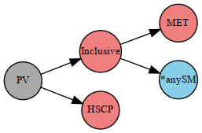  | [many (293)](ListOfAnalyses320WithSuperseded) |
| 103 | **THSCPM3**  | `(PV > anyBSM(1),anyBSM(2)),`  &rarr;`(anyBSM(1) > HSCP,anySM),`  &rarr;`(anyBSM(2) > HSCP,anySM)` |   | [many (293)](ListOfAnalyses320WithSuperseded) |
| 104 | **THSCPM4**  | `(PV > Inclusive(1),anyBSM(2)),`  &rarr;`(Inclusive(1) > MET,*anySM),`  &rarr;`(anyBSM(2) > HSCP,anySM)` | 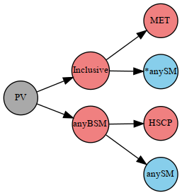  | [many (293)](ListOfAnalyses320WithSuperseded) |
| 105 | **THSCPM5**  | `(PV > anyBSM(1),anyBSM(2)),`  &rarr;`(anyBSM(1) > anyBSM(3),anySM),`  &rarr;`(anyBSM(2) > anyBSM(7),anySM),`  &rarr;`(anyBSM(3) > HSCP,anySM),`  &rarr;`(anyBSM(7) > HSCP,anySM)` |   | [many (293)](ListOfAnalyses320WithSuperseded) |
| 106 | **THSCPM6**  | `(PV > Inclusive(1),anyBSM(2)),`  &rarr;`(Inclusive(1) > MET,*anySM),`  &rarr;`(anyBSM(2) > anyBSM(5),anySM),`  &rarr;`(anyBSM(5) > HSCP,anySM)` | 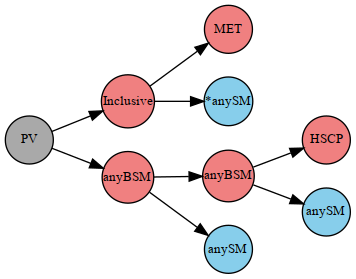  | [many (293)](ListOfAnalyses320WithSuperseded) |
| 107 | **THSCPM7**  | `(PV > anyBSM(1),anyBSM(2)),`  &rarr;`(anyBSM(1) > anyBSM(3),anySM),`  &rarr;`(anyBSM(2) > HSCP,anySM),`  &rarr;`(anyBSM(3) > HSCP,anySM)` | 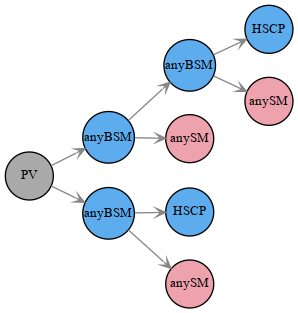  | [many (293)](ListOfAnalyses320WithSuperseded) |
| 108 | **THSCPM8**  | `(PV > anyBSM(1),anyBSM(2)),`  &rarr;`(anyBSM(1) > HSCP,anySM,anySM),`  &rarr;`(anyBSM(2) > HSCP,anySM,anySM)` | 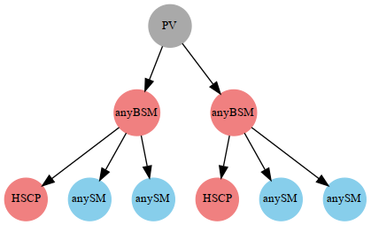  | [many (293)](ListOfAnalyses320WithSuperseded) |
| 109 | **THSCPM9**  | `(PV > Inclusive(1),anyBSM(2)),`  &rarr;`(Inclusive(1) > MET,*anySM),`  &rarr;`(anyBSM(2) > HSCP,anySM,anySM)` | 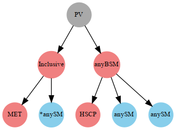  | [many (293)](ListOfAnalyses320WithSuperseded) |
| 110 | **TRHadDM1**  | `(PV > RHadronD,RHadronD)` | 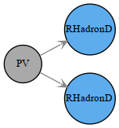  | [many (293)](ListOfAnalyses320WithSuperseded) |
| 111 | **TRHadGM1**  | `(PV > RHadronG,RHadronG)` |   | [many (293)](ListOfAnalyses320WithSuperseded) |
| 112 | **TRHadQM1**  | `(PV > RHadronQ,RHadronQ)` |   | [many (293)](ListOfAnalyses320WithSuperseded) |
| 113 | **TRHadUM1**  | `(PV > RHadronU,RHadronU)` |   | [many (293)](ListOfAnalyses320WithSuperseded) |
| 114 | **TRPV1jjj**  | `(PV > anyBSM(1),anyBSM(2)),`  &rarr;`(anyBSM(1) > anyBSM(3),jet,jet),`  &rarr;`(anyBSM(2) > anyBSM(4),jet,jet),`  &rarr;`(anyBSM(3) > jet,jet,jet),`  &rarr;`(anyBSM(4) > jet,jet,jet)` |   | [many (293)](ListOfAnalyses320WithSuperseded) |
| 115 | **TRPV1jmu**  | `(PV > anyBSM(1),anyBSM(2)),`  &rarr;`(anyBSM(1) > jet,mu+),`  &rarr;`(anyBSM(2) > jet,mu-)` |   | [many (293)](ListOfAnalyses320WithSuperseded) |
| 116 | **TRPV2fjj**  | `(PV > anyBSM(1),anyBSM(3)),`  &rarr;`(anyBSM(1) > anyBSM(2),jet,jet),`  &rarr;`(anyBSM(3) > anyBSM(4),jet,jet),`  &rarr;`(anyBSM(2) > jet,jet,l),`  &rarr;`(anyBSM(4) > jet,jet,l)`  `(PV > anyBSM(1),anyBSM(3)),`  &rarr;`(anyBSM(1) > anyBSM(2),jet,jet),`  &rarr;`(anyBSM(3) > anyBSM(4),jet,jet),`  &rarr;`(anyBSM(2) > jet,jet,l),`  &rarr;`(anyBSM(4) > jet,jet,nu)`  `(PV > anyBSM(1),anyBSM(3)),`  &rarr;`(anyBSM(1) > anyBSM(2),jet,jet),`  &rarr;`(anyBSM(3) > anyBSM(4),jet,jet),`  &rarr;`(anyBSM(2) > jet,jet,nu),`  &rarr;`(anyBSM(4) > jet,jet,nu)` |     | [many (293)](ListOfAnalyses320WithSuperseded) |
| 117 | **TRPV5tjb**  | `(PV > anyBSM(1),anyBSM(3)),`  &rarr;`(anyBSM(1) > anyBSM(2),t),`  &rarr;`(anyBSM(3) > anyBSM(4),t),`  &rarr;`(anyBSM(2) > jet,b),`  &rarr;`(anyBSM(4) > jet,b)` |   | [many (293)](ListOfAnalyses320WithSuperseded) |
| 118 | **TRPVChij- jj**  | `(PV > anyBSM(1),anyBSM(2)),`  &rarr;`(anyBSM(1) > jet,jet,jet),`  &rarr;`(anyBSM(2) > jet,jet,jet)` |   | [many (293)](ListOfAnalyses320WithSuperseded) |
| 119 | **TRPVttbj**  | `(PV > anyBSM(1),anyBSM(3)),`  &rarr;`(anyBSM(1) > anyBSM(2),t),`  &rarr;`(anyBSM(3) > anyBSM(4),t),`  &rarr;`(anyBSM(2) > t,b,jet),`  &rarr;`(anyBSM(4) > t,b,jet)` |   | [many (293)](ListOfAnalyses320WithSuperseded) |
| 120 | **TRPVtttbj**  | `(PV > anyBSM(1),anyBSM(3)),`  &rarr;`(anyBSM(1) > anyBSM(2),t,t),`  &rarr;`(anyBSM(3) > anyBSM(4),t,t),`  &rarr;`(anyBSM(2) > t,b,jet),`  &rarr;`(anyBSM(4) > t,b,jet)` |   | [many (293)](ListOfAnalyses320WithSuperseded) |
| 121 | **TRS1**  | `(PV > H0(1)),`  &rarr;`(H0(1) > MET,MET)` |   | [many (293)](ListOfAnalyses320WithSuperseded) |
| 122 | **TRV1**  | `(PV > Zprime(1)),`  &rarr;`(Zprime(1) > MET,MET)` |   | [many (293)](ListOfAnalyses320WithSuperseded) |
| 123 | **TRV1bb**  | `(PV > Zprime(1)),`  &rarr;`(Zprime(1) > b,b)` |   | [many (293)](ListOfAnalyses320WithSuperseded) |
| 124 | **TRV1ee**  | `(PV > Zprime(1)),`  &rarr;`(Zprime(1) > e+,e-)` |   | [many (293)](ListOfAnalyses320WithSuperseded) |
| 125 | **TRV1jj**  | `(PV > Zprime(1)),`  &rarr;`(Zprime(1) > jetb,jetb)` |   | [many (293)](ListOfAnalyses320WithSuperseded) |
| 126 | **TRV1ll**  | `(PV > Zprime(1)),`  &rarr;`(Zprime(1) > e+,e-)`  `(PV > Zprime(1)),`  &rarr;`(Zprime(1) > mu+,mu-)` |    | [many (293)](ListOfAnalyses320WithSuperseded) |
| 127 | **TRV1mumu**  | `(PV > Zprime(1)),`  &rarr;`(Zprime(1) > mu-,mu+)` |   | [many (293)](ListOfAnalyses320WithSuperseded) |
| 128 | **TRV1nunu**  | `(PV > Zprime(1)),`  &rarr;`(Zprime(1) > nu,nu)` |   | [many (293)](ListOfAnalyses320WithSuperseded) |
| 129 | **TRV1qq**  | `(PV > Zprime(1)),`  &rarr;`(Zprime(1) > jet,jet)` |   | [many (293)](ListOfAnalyses320WithSuperseded) |
| 130 | **TRV1tt**  | `(PV > Zprime(1)),`  &rarr;`(Zprime(1) > t,t)` |   | [many (293)](ListOfAnalyses320WithSuperseded) |
| 131 | **TScharm**  **T2cc**  | `(PV > anyBSM(1),anyBSM(2)),`  &rarr;`(anyBSM(1) > MET,c),`  &rarr;`(anyBSM(2) > MET,c)` |   | [many (293)](ListOfAnalyses320WithSuperseded) |
| 132 | **TSelSel**  **TSelSelD- isp**  | `(PV > anyBSM(1),anyBSM(2)),`  &rarr;`(anyBSM(1) > MET,e+),`  &rarr;`(anyBSM(2) > MET,e-)` |   | [many (293)](ListOfAnalyses320WithSuperseded) |
| 133 | **TSlepSlep**  | `(PV > anyBSM(1),anyBSM(2)),`  &rarr;`(anyBSM(1) > MET,l+),`  &rarr;`(anyBSM(2) > MET,l-)` |   | [many (293)](ListOfAnalyses320WithSuperseded) |
| 134 | **TSmuSmuD- isp**  **TSmuSmu**  | `(PV > anyBSM(1),anyBSM(2)),`  &rarr;`(anyBSM(1) > MET,mu+),`  &rarr;`(anyBSM(2) > MET,mu-)` |   | [many (293)](ListOfAnalyses320WithSuperseded) |
| 135 | **TStauSta- uDisp**  **TStauStau**  | `(PV > anyBSM(1),anyBSM(2)),`  &rarr;`(anyBSM(1) > MET,ta+),`  &rarr;`(anyBSM(2) > MET,ta-)` |   | [many (293)](ListOfAnalyses320WithSuperseded) |

This page was created Fri Aug  7 09:31:24 2026
