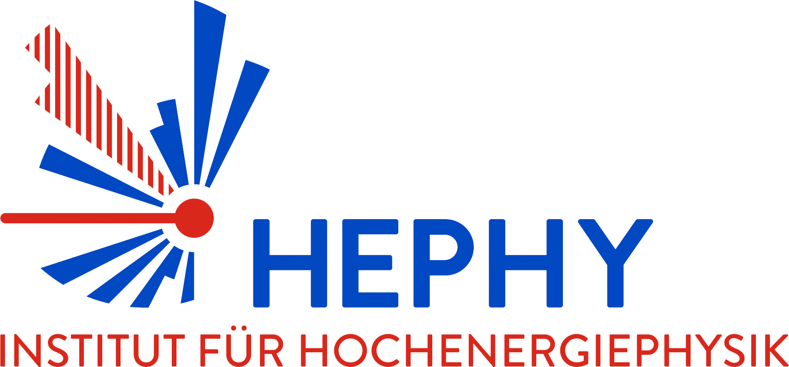
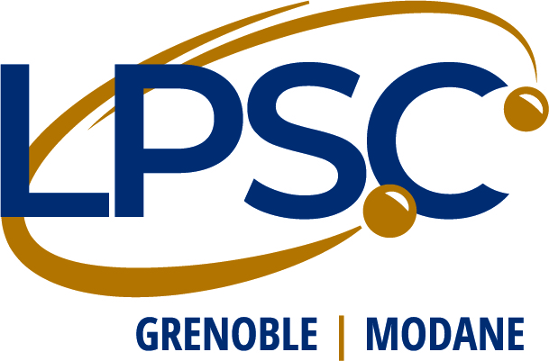
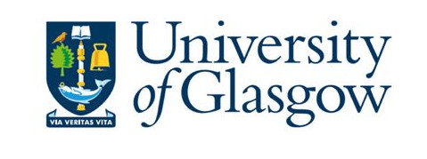

# A tool for interpreting simplified-model results from the LHC
Mohammad Mahdi Altakach, Sabine Kraml, Andre Lessa, Sahana Narasimha, Timoth&eacute;e Pascal, Camila Ramos, Humberto Reyes-Gonz&aacute;lez, Th&eacute;o Reymermier, Yoxara Villamizar, Wolfgang Waltenberger

 Previously involved in SModelS: Ga&#235;l Alguero, Federico Ambrogi, Jan Heisig, Charanjit K. Khosa, Juhi Dutta, Suchita Kulkarni, Ursula Laa, Veronika Magerl, Wolfgang Magerl, Philipp Neuhuber, Doris Proschofsky, Jory Sonneveld, Michael Traub, Matthias Wolf, Alicia Wongel 

------------------------------------------------------------------------

<!--  -->

------------------------------------------------------------------------
### 30 May 2025: [SModelS version 3.1.0](https://github.com/SModelS/smodels/releases) available ([what's new](https://smodels.readthedocs.io/en/latest/ReleaseUpdate.html))

  * Introduced minmassgapISR parameter for controlling the mass compression for ISR topologies
  * Small fixes in analyses combinations, better handling exceptions in likelihood computations
  * Slightly different way of finding upper limits, UL computations may vary slightly numerically
  * Bumped up pythia8 from 8308 to 8315
  * Database extension: ATLAS-EXOT-2018-06 (EM), additional topologies for CMS-EXO-20-004 (EM)
  * We thank L&eacute;o Constantin for help with a bug fix concerning failed likelihood computations

###  20 Aug 2024: [SModelS version 3.0.0](https://github.com/SModelS/smodels/releases/tag/3.0.0) available ([what's new](https://smodels.readthedocs.io/en/3.0.0/ReleaseUpdate.html))

* Paper for version 3.0: [arXiv:2409.12942](https://arxiv.org/abs/2409.12942)
* New graph-based topology description now allows SModelS to handle arbitrary simplified model topologies, without the need of an imposed Z2 symmetry.
* Important [database update](https://github.com/SModelS/smodels-database-release/releases) with several non-Z2 signatures (resonances, monojet, RPV)

------------------------------------------------------------------------

* A detailed documentation is available in the [online manual](https://smodels.readthedocs.io/en/latest/)
* For instructions on how to install SModelS, check the [installation section in the manual](https://smodels.readthedocs.io/en/latest/Installation.html).
* This [tutorial](https://github.com/SModelS/tutorials) is available from the latest [Reinterpetation workshop](https://indico.cern.ch/event/982553/).
* You may also want to check the [release notes](https://smodels.readthedocs.io/en/latest/ReleaseUpdate.html), the [database releases](https://github.com/SModelS/smodels-database-release/releases)
and [known issues](https://github.com/SModelS/smodels/blob/main/KnownIssues)
* Here are the [list of analyses](docs/ListOfAnalyses) in the latest database version, the respective [validation plots](docs/Validation) and an [SMS dictionary](https://smodels.github.io/docs/SmsDictionary) explaining the Tx names used by SModelS.
* A discussion of re-interpretation methods and tools, and recommendations about the presentation of results can be found in this [report](https://arxiv.org/abs/2003.07868) by the [LHC Reinterpretation Forum](https://twiki.cern.ch/twiki/bin/view/LHCPhysics/InterpretingLHCresults), [arXiv:2003.07868](https://arxiv.org/abs/2003.07868).
* SModelS support for [pyhf](https://github.com/scikit-hep/pyhf) likelihoods is described in [arXiv:2009.01809](https://arxiv.org/abs/2009.01809) and the main novelties of SModelS v2 in [arXiv:2112.00769](https://arxiv.org/abs/2112.00769).
* An update of the micrOMEGAs interface for SModelS v2.2 is available on [Zenodo](https://zenodo.org/record/6402610#.YkYsMGDRZmA)

### Mailing lists:

* For questions and comments, send an e-mail to: <smodels-users@lists.oeaw.ac.at>.
* To receive updates and announcements, subscribe to [smodels-info](https://lists.oeaw.ac.at/mailman/listinfo/smodels-info).

------------------------------------------------------------------------

## If you use SModelS, please cite the following papers:

* *SModelS v3: going beyond Z2 topologies*, Mohammad Mahdi Altakach, Sabine Kraml, Andre Lessa, Sahana Narasimha, Timothée Pascal, Camila Ramos, Yoxara Villamizar, Wolfgang Waltenberger, [arXiv:2409.12942](https://arxiv.org/abs/2409.12942) [JHEP 11 (2024) 074](https://doi.org/10.1007/JHEP11(2024)074)
* *SModelS v2.3: enabling global likelihood analyses*, Mohammad Mahdi Altakach, Sabine Kraml, Andre Lessa, Sahana Narasimha, Timothée Pascal, Wolfgang Waltenberger, [arXiv:2306.17676](https://arxiv.org/abs/2306.17676), [SciPost Phys. 16 (2024) 101](https://doi.org/10.21468/SciPostPhys.16.4.101)
* *Constraining new physics with SModelS version 2*, Gael Alguero, Jan Heisig, Charanjit Khosa, Sabine Kraml, Suchita Kulkarni, Andre Lessa, Humberto Reyes-Gonzalez, Wolfgang Waltenberger, Alicia Wongel, [arXiv:2112.00769](https://arxiv.org/abs/2112.00769), [JHEP 08 (2022) 068](https://doi.org/10.1007/JHEP08(2022)068)
* *A SModelS interface for pyhf likelihoods*, Gael Alguero, Sabine Kraml, Wolfgang Waltenberger, [arXiv:2009.01809](https://arxiv.org/abs/2009.01809), [CPC March 2021, 107909](https://doi.org/10.1016/j.cpc.2021.107909)
* *SModelS database update v1.2.3*, Charanjit K. Khosa, Sabine Kraml, Andre Lessa, Philipp Neuhuber, Wolfgang Waltenberger, [arXiv:2005.00555](https://arxiv.org/abs/2005.00555), [LHEP 158 2020](https://doi.org/10.31526/lhep.2020.158)
* *SModelS v1.2: long-lived particles, combination of signal regions, and other novelties*, Federico Ambrogi et al., [arXiv:1811.10624](https://arxiv.org/abs/1811.10624), [CPC 251, June 2020, 106848](https://doi.org/10.1016/j.cpc.2019.07.013)
* *Constraining new physics with searches for long-lived
particles: Implementation into SModelS*, Jan Heisig, Sabine Kraml, Andre Lessa, [arXiv:1808.05229](https://arxiv.org/abs/1808.05229), [Phys.Lett. B788 (2019) 87-95](https://doi.org/10.1016/j.physletb.2018.10.049).
* *SModelS extension with the CMS supersymmetry search results from Run 2*, Juhi Dutta, Sabine Kraml, Andre Lessa, Wolfgang Waltenberger, [arXiv:1803.02204](http://arxiv.org/abs/1803.02204), [LHEP 1 (2018) no.1,5-12](http://journals.andromedapublisher.com/index.php/LHEP/article/view/28)
* *SModelS v1.1 user manual: improving simplified model constraints with efficiency maps*, Federico Ambrogi, Sabine Kraml, Suchita Kulkarni, Ursula Laa, Andre Lessa, Veronika Magerl, Jory Sonneveld, Michael Traub, Wolfgang Waltenberger [arXiv:1701.06586](http://arxiv.org/abs/1701.06586), [CPC 227 (2018) 72-98](https://www.sciencedirect.com/science/article/pii/S0010465518300353?via%3Dihub)
 * *SModelS: a tool for interpreting simplified-model results from the LHC and its application to supersymmetry*, Sabine Kraml, Suchita Kulkarni, Ursula Laa, Andre Lessa,  Wolfgang Magerl, Doris Proschofsky, Wolfgang Waltenberger, [arXiv:1312.4175](http://arxiv.org/abs/arXiv:1312.4175), [EPJC (2014) 74:2868](http://link.springer.com/article/10.1140/epjc/s10052-014-2868-5)

Moreover

* If you use the *cross section calculator* please cite *Pythia and NLLfast*
* If you use the Fastlim results in the database, please cite *Fastlim 1.0* [arXiv:1402.40492v1](http://arxiv.org/abs/1402.40492), [EPJC74 (2014) 11](https://link.springer.com/article/10.1140%2Fepjc%2Fs10052-014-3163-1).

For convenience a [references.bib](https://github.com/SModelS/smodels/blob/main/references.bib) file containing all relevant references is provided with the [code](https://github.com/SModelS/smodels/).
Likewise, a [database.bib](https://github.com/SModelS/smodels-database-release/blob/main/database.bib) file with references to all the ATLAS and CMS analyses used is provided in the [text database](https://github.com/SModelS/smodels-database-release/).
------------------------------------------------------------------------

## Working principle

SModelS is an automatic, public tool for interpreting simplified-model results
from the LHC. It is based on a general procedure to decompose Beyond the
Standard Model (BSM) collider signatures into Simplified Model Spectrum (SMS)
topologies. Our method provides a way to cast BSM predictions for the LHC in
a model independent framework, which can be directly confronted with the
relevant experimental constraints. The main SModelS ingredients are

  * the decomposition of the BSM spectrum into SMS topologies
  * a database of experimental SMS results
  * matching between the decomposition and results database, including the tools to perform various kinds of statistical inference

as illustrated in the scheme below.

 

## Code and Database updates
* For code and database releases, see [Download](docs/CodeReleases)

## Experimental results in the database
* Here is the [list of analyses contained in the latest database version](docs/ListOfAnalyses)
* Same as above but [including superseded analyses](docs/ListOfAnalysesWithSuperseded)
* Pretty [validation plots](docs/Validation) for all analyses
* We also provide an [SMS dictionary](https://smodels.github.io/docs/SmsDictionary) explaining the Tx names used by SModelS

## Publications and Talks
See the [publications and talks](docs/SModelSTalks) page

  

 &nbsp; &nbsp;
 &nbsp; &nbsp;
  
 &nbsp;
<!--  &nbsp; -->
<!--  -->
<!--  -->
