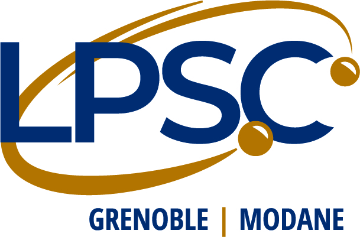

# A tool for interpreting simplified-model results from the LHC
Leo Constantin, Sabine Kraml, Andre Lessa, Arpita Mondal, Timoth&eacute;e Pascal, Wolfgang Waltenberger

 Previously involved in SModelS: Ga&#235;l Alguero, Mohammad Mahdi Altakach, Federico Ambrogi, Jan Heisig, Charanjit K. Khosa, Juhi Dutta, Suchita Kulkarni, Ursula Laa, Veronika Magerl, Wolfgang Magerl, Sahana Narasimha, Philipp Neuhuber, Doris Proschofsky, Camila Ramos, Humberto Reyes-Gonz&aacute;lez, Th&eacute;o Reymermier, Jory Sonneveld, Michael Traub, Yoxara Villamizar, Matthias Wolf, Alicia Wongel 

------------------------------------------------------------------------

<!--  -->

------------------------------------------------------------------------
### 10 Aug 2026: [SModelS version 3.2.0](https://github.com/SModelS/smodels/releases) available ([what's new](https://smodels.readthedocs.io/en/latest/ReleaseUpdate.html))

* **First support for NN surrogate statistical models (ONNX format)**
* Modified the syntax for statistical models in the database: in the globalInfo.txt files, the fields datasetOrder, covariance, jsonFiles and jsonFiles\_FullLikelihood have been replaced by regionMappings, regionSets and statModels. Note that this **breaks backwards compatibility**
* Small fixes in likelihood calculations and pyhf interface
* Moved all interfaces from .likelihoods to .nlls
* Updated lheReader to properly deal with MG5 LHE files (fixes github issue [#53](https://github.com/SModelS/smodels/issues/53), see also discussion [#54](https://github.com/SModelS/smodels/issues/54))
* Fixed pythia8 paths in automatic downloader
* Introduced a printer registry for out-of-repo printers
* Database extension (stat models): added ONNX models to ATLAS-SUSY-2018-04, ATLAS-SUSY-2018-16, ATLAS-SUSY-2018-32, ATLAS-SUSY-2019-08, ATLAS-SUSY-2019-09 -- thanks to Humberto Reyes-Gonzalez, Joaquin Iturriza Ramirez and Rafal Maselek for their help
* Database extension (new results): added ATLAS-SUSY-2018-09 (EM), ATLAS-SUSY-2019-02 (TSlepSlep, UL) ATLAS-SUSY-2019-04 (EM), ATLAS-SUSY-2020-27 (UL+EM), CMS-SUS-18-004 (EM), CMS-EXO-19-019 (UL), CMS-SUS-21-008 (UL), CMS-SUS-23-003 (UL) -- thanks to Lucas Heck and Axel Schwingrouber-Mazet for valuable contributions
* Database now pickles with protocol 5 instead of protocol 4

------------------------------------------------------------------------

## Documentation and further info

* A detailed documentation is available in the [online manual](https://smodels.readthedocs.io/en/latest/)
* For instructions on how to install SModelS, check the [installation section in the manual](https://smodels.readthedocs.io/en/latest/Installation.html).
* Here are the [list of analyses](docs/ListOfAnalyses) in the latest database version, the respective [validation plots](docs/Validation) and an [SMS dictionary](https://smodels.github.io/docs/SmsDictionary) explaining the Tx names used by SModelS.
* You may also want to check the [release notes](https://smodels.readthedocs.io/en/latest/ReleaseUpdate.html), the [database releases](https://github.com/SModelS/smodels-database-release/releases)
and [known issues](https://github.com/SModelS/smodels/blob/main/KnownIssues)
* A discussion of re-interpretation methods and tools, and recommendations about the presentation of results can be found in this [report](https://arxiv.org/abs/2003.07868) by the [LHC Reinterpretation Forum](https://twiki.cern.ch/twiki/bin/view/LHCPhysics/InterpretingLHCresults), [arXiv:2003.07868](https://arxiv.org/abs/2003.07868).
* A list of [publications referring to SModelS](https://inspirehep.net/literature?sort=mostrecent&size=25&page=1&q=refersto%3Arecid%3A1269436) from Inspire.
* SModelS is interfaced to [micrOMEGAs](https://micromegasdm.github.io) (see section 15.2 of the [micrOMEGAs manual](https://micromegasdm.github.io/v7.1/manual_7.1.pdf)) and to [NMSSMTools](https://www.lupm.in2p3.fr/users/nmssm/package.html). Note that the micrOMEGAs interface comes with its own cross section computation via Calchep.

### Issues

* For questions and comments, see the github issue tracker at <https://github.com/SModelS/smodels/issues>.

------------------------------------------------------------------------

### If you use SModelS, please cite the following papers:

* *SModelS v3: going beyond Z2 topologies*, Mohammad M. Altakach, Sabine Kraml, Andre Lessa, Sahana Narasimha, Timothée Pascal, Camila Ramos, Yoxara Villamizar, Wolfgang Waltenberger, [arXiv:2409.12942](https://arxiv.org/abs/2409.12942) [JHEP 11 (2024) 074](https://doi.org/10.1007/JHEP11(2024)074)
* *SModelS v2.3: enabling global likelihood analyses*, Mohammad M. Altakach, Sabine Kraml, Andre Lessa, Sahana Narasimha, Timothée Pascal, Wolfgang Waltenberger, [arXiv:2306.17676](https://arxiv.org/abs/2306.17676), [SciPost Phys. 16 (2024) 101](https://doi.org/10.21468/SciPostPhys.16.4.101)
* *Constraining new physics with SModelS version 2*, Gael Alguero, Jan Heisig, Charanjit Khosa, Sabine Kraml, Suchita Kulkarni, Andre Lessa, Humberto Reyes-Gonzalez, Wolfgang Waltenberger, Alicia Wongel, [arXiv:2112.00769](https://arxiv.org/abs/2112.00769), [JHEP 08 (2022) 068](https://doi.org/10.1007/JHEP08(2022)068)
* *A SModelS interface for pyhf likelihoods*, Gael Alguero, Sabine Kraml, Wolfgang Waltenberger, [arXiv:2009.01809](https://arxiv.org/abs/2009.01809), [CPC March 2021, 107909](https://doi.org/10.1016/j.cpc.2021.107909)
* *SModelS v1.2: long-lived particles, combination of signal regions, and other novelties*, Federico Ambrogi et al., [arXiv:1811.10624](https://arxiv.org/abs/1811.10624), [CPC 251, June 2020, 106848](https://doi.org/10.1016/j.cpc.2019.07.013)
* *SModelS v1.1 user manual: improving simplified model constraints with efficiency maps*, Federico Ambrogi, Sabine Kraml, Suchita Kulkarni, Ursula Laa, Andre Lessa, Veronika Magerl, Jory Sonneveld, Michael Traub, Wolfgang Waltenberger [arXiv:1701.06586](http://arxiv.org/abs/1701.06586), [CPC 227 (2018) 72-98](https://www.sciencedirect.com/science/article/pii/S0010465518300353?via%3Dihub)
 * *SModelS: a tool for interpreting simplified-model results from the LHC and its application to supersymmetry*, Sabine Kraml, Suchita Kulkarni, Ursula Laa, Andre Lessa,  Wolfgang Magerl, Doris Proschofsky, Wolfgang Waltenberger, [arXiv:1312.4175](http://arxiv.org/abs/arXiv:1312.4175), [EPJC (2014) 74:2868](http://link.springer.com/article/10.1140/epjc/s10052-014-2868-5)

Moreover

* If you use the *cross section calculator* please cite [Pythia](https://pythia.org), [NLLfast](https://www.uni-muenster.de/Physik.TP/~akule_01/nnllfast/doku.php?id=nllfast), and [Resummino](https://resummino.hepforge.org/)
* If you use the Fastlim results in the database, please cite *Fastlim 1.0* [arXiv:1402.40492v1](http://arxiv.org/abs/1402.40492), [EPJC74 (2014) 11](https://link.springer.com/article/10.1140%2Fepjc%2Fs10052-014-3163-1).

For convenience a [references.bib](https://github.com/SModelS/smodels/blob/main/references.bib) file containing all relevant references is provided with the [code](https://github.com/SModelS/smodels/).
Likewise, a [database.bib](https://github.com/SModelS/smodels-database-release/blob/main/database.bib) file with references to all the ATLAS and CMS analyses used is provided in the [text database](https://github.com/SModelS/smodels-database-release/).

------------------------------------------------------------------------

## Working principle

SModelS is an automatic, public tool for interpreting simplified-model results
from the LHC. It is based on a general procedure to decompose Beyond the
Standard Model (BSM) collider signatures into Simplified Model Spectrum (SMS)
topologies. Our method provides a way to cast BSM predictions for the LHC in
a model independent framework, which can be directly confronted with the
relevant experimental constraints. The main SModelS ingredients are

  * the decomposition of the BSM spectrum into SMS topologies
  * a database of experimental SMS results
  * matching between the decomposition and results database, including the tools to perform various kinds of statistical inference

as illustrated in the scheme below.

### Release history
* For code and database releases, see [download](docs/CodeReleases)

  

 &nbsp; &nbsp;
 &nbsp; &nbsp;
  
<!--  &nbsp; -->
<!--  &nbsp; &nbsp; -->
<!--  &nbsp; -->
<!--  -->
<!--  -->
