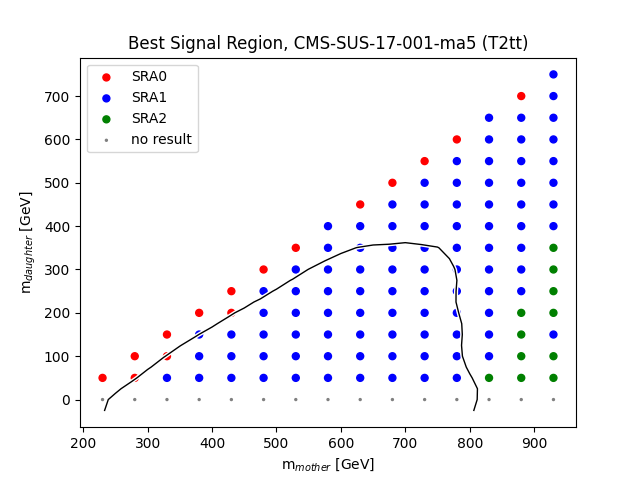
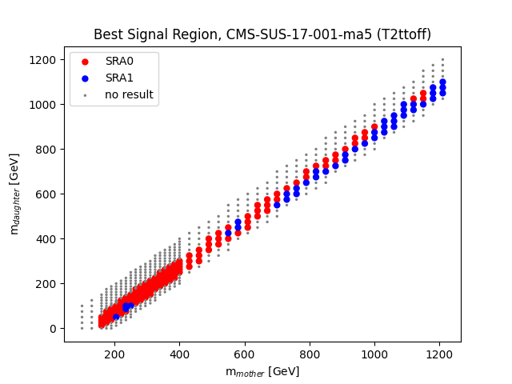
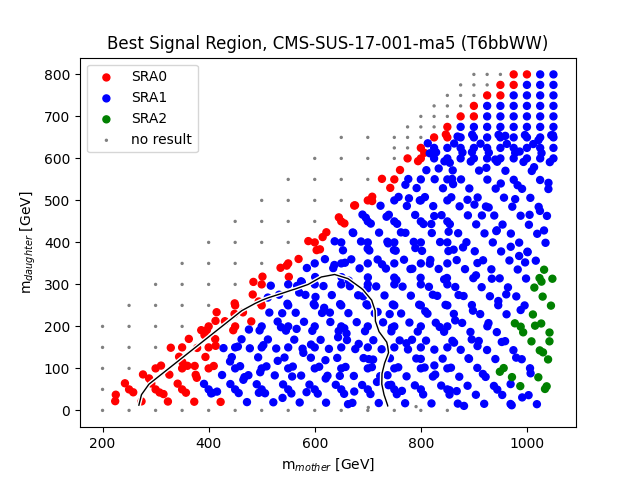

# plots of best expected signal regions
as of Mon Mar  7 10:30:14 2022
checkout also the [ratio plots](README.md)

## Topology: T2tt

| andre | suchi |
|  |  |

## Topology: T2ttoff

| andre | suchi |
|  |

## Topology: T6bbWW

| andre | suchi |
|  |
