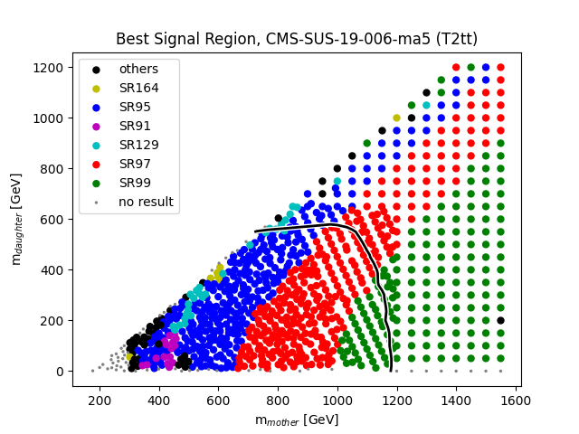
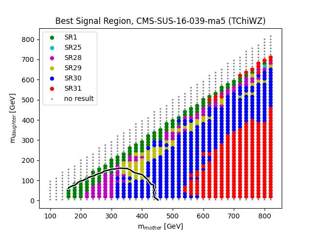
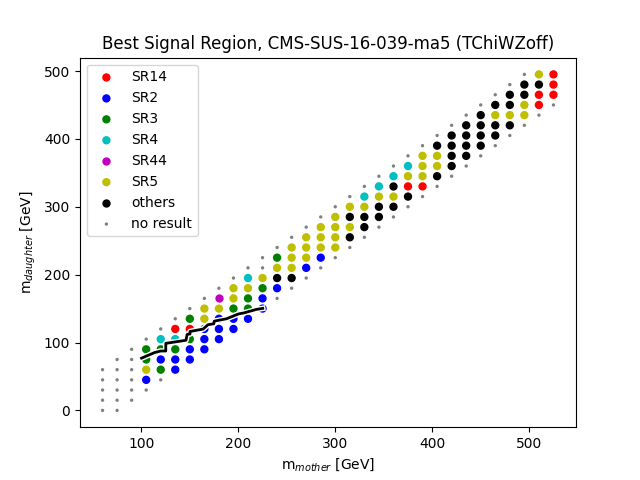
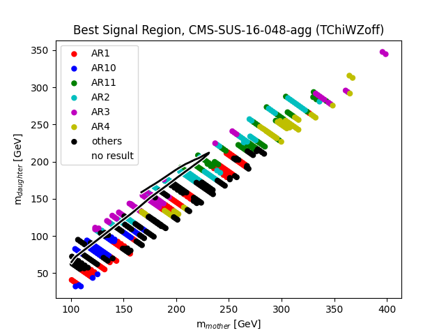
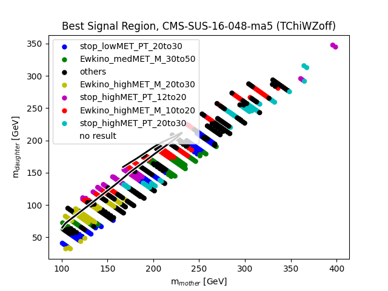
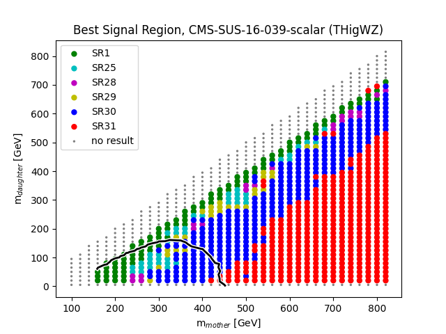

# plots of best expected signal regions
as of Thu Feb 10 16:59:23 2022
checkout also the [ratio plots](README.md)

## Topology: T2tt

| andre | suchi |
|  |

## Topology: TChiWZ

| andre | suchi |
|  |  |  |  |

## Topology: TChiWZoff

| andre | suchi |
|  |  |  |

## Topology: THigWZ

| andre | suchi |
|  |
