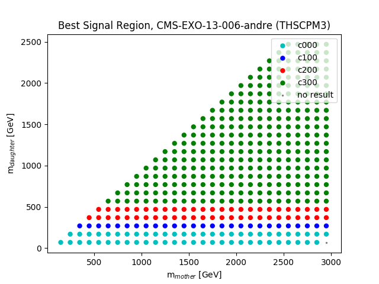
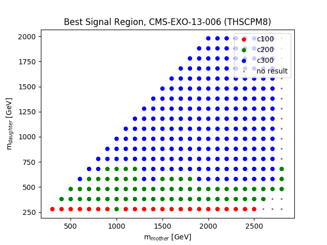
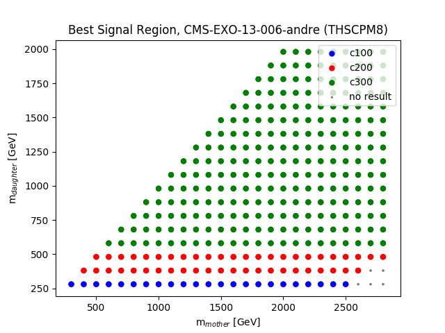
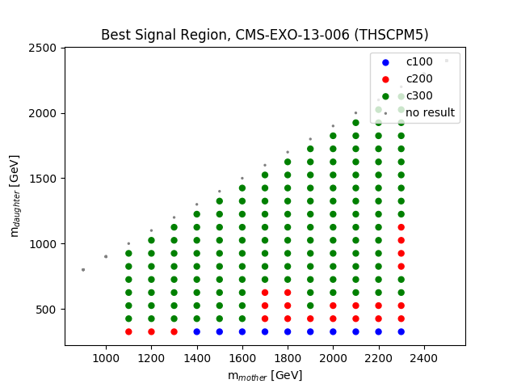
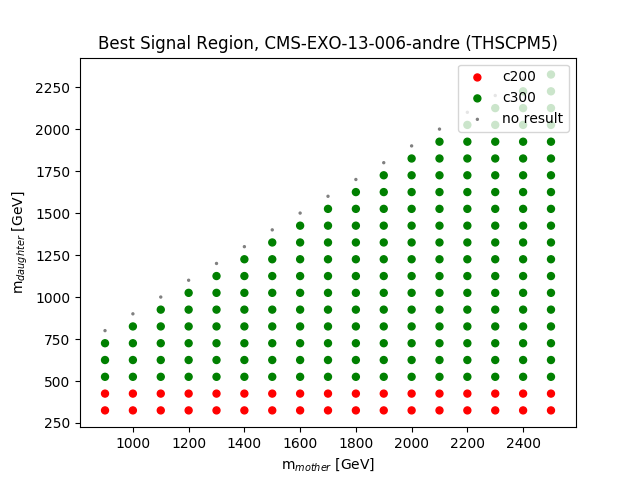

# plots of best expected signal regions
as of Mon Nov 18 22:05:33 2019

## Topology: THSCPM3
<table><tr>
<td>
<td>
</tr></table>

## Topology: THSCPM8
<table><tr>
<td>
<td>
</tr></table>

## Topology: THSCPM5
<table><tr>
<td>
<td>
</tr></table>
