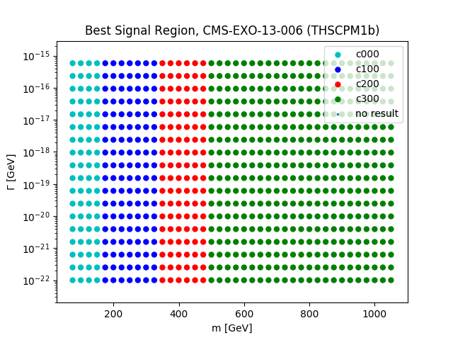
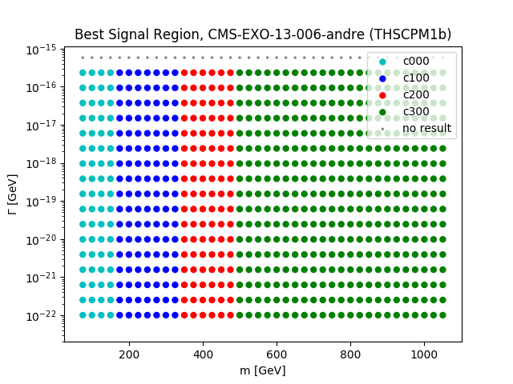
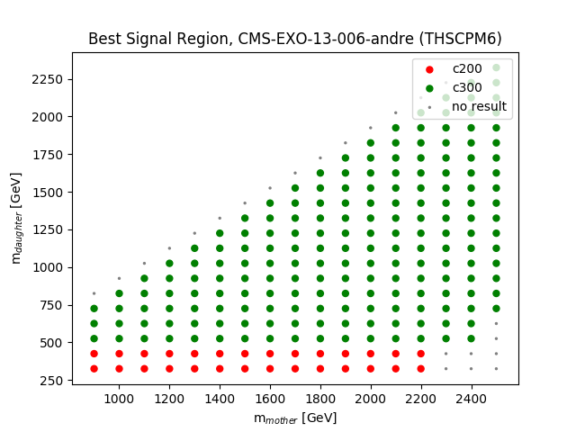
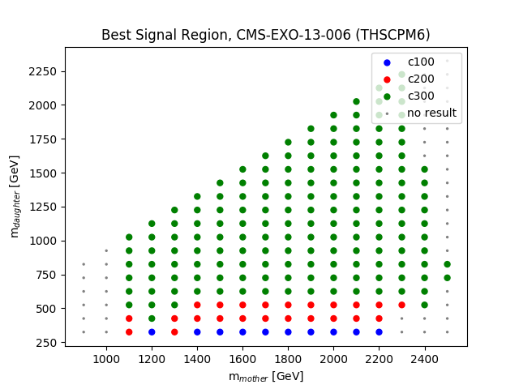

# plots of best expected signal regions
as of Wed Nov 20 16:47:28 2019

## Topology: THSCPM1b

| andre | suchi |
|  |  |

## Topology: THSCPM3

| andre | suchi |
|  |  |

## Topology: THSCPM5

| andre | suchi |
|  |  |

## Topology: THSCPM6

| andre | suchi |
|  |  |

## Topology: THSCPM8

| andre | suchi |
|  |  |
