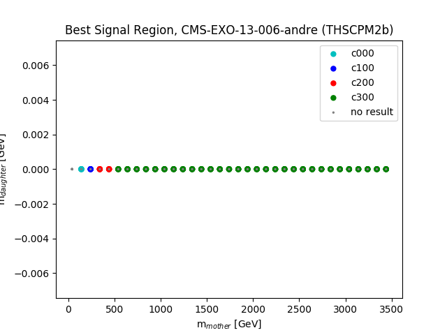
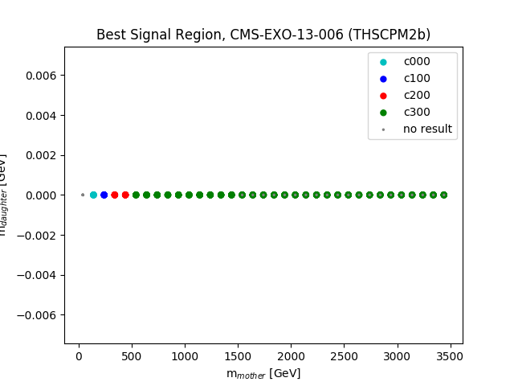
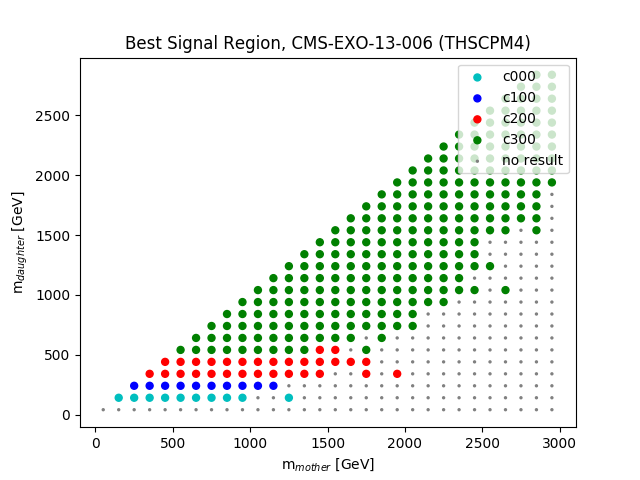

# plots of best expected signal regions
as of Fri Nov 22 13:27:52 2019
checkout also the [README.md](ratio plots)

## Topology: THSCPM1b

| andre | suchi |
|  |  |

## Topology: THSCPM2b

| andre | suchi |
|  |  |

## Topology: THSCPM3

| andre | suchi |
|  |  |

## Topology: THSCPM4

| andre | suchi |
|  |  |

## Topology: THSCPM5

| andre | suchi |
|  |  |

## Topology: THSCPM6

| andre | suchi |
|  |  |

## Topology: THSCPM8

| andre | suchi |
|  |  |
